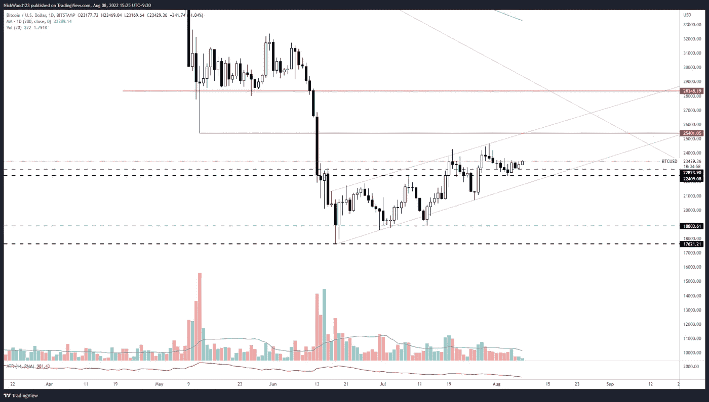
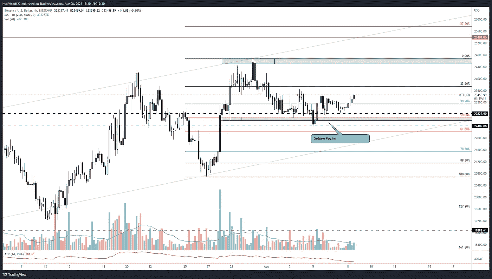
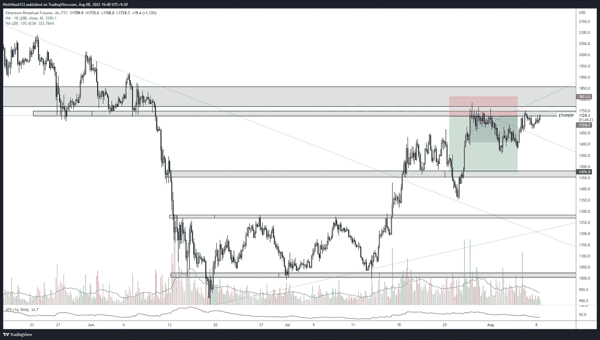

# 比特币周报——价格在区间高位保持支撑。

> 原文：<https://medium.com/coinmonks/bitcoin-weekly-report-price-holds-support-on-the-range-high-32f86ed74bc6?source=collection_archive---------43----------------------->

## 未来几周的价格目标。

# 比特币报告(2022 年 8 月 8 日)

上周，我担心上一次抵制中的拒绝信。价格确实从这一点回落，但迄今为止只是短暂的。我们已经守住了区间的**顶部，将**阻力视为支撑**，有可能形成一个更高的低点。在本周的报告中，我们将看看我们预计价格将在哪里形成新高，以及一些条目可能会是什么样子。**

# BTC 日报

BTC/USD Daily

【https://www.tradingview.com/x/llT1sKHN/ 

在**日线**上，我们可以看到价格看起来在上升通道中运行。在过去的 50 多天里，价格缓慢向上攀升，形成更高的低点和更高的高点。对我来说，22000 点非常重要，因为我觉得这可能是最后一个低点。下一个低点或支撑位在**21000 点左右**。但我认为重要的是看到价格从这个区域继续，而不是回到这个区间。回到这个区间会让我担心，因为这将开始表明价格已经跌出这个上升通道，并将失去这个区间顶部的支撑位。这也可能意味着价格开始形成更低的低点和更低的高点。

# 4 小时时间范围

BTC/USD 4HR

[https://www.tradingview.com/x/6xzvqOKc/](https://www.tradingview.com/x/6xzvqOKc/)

我不经常在我的交易中提到斐波纳契，但我认为这里值得一提。我喜欢把 50 fib 回撤和 61.8 回撤之间的区域称为“黄金口袋”这往往是一个很好的回撤，形成一个更高的低点，并创造下一个更高的高点。**过去的 3 次波动已经回撤至 61.8 区域附近**(在某些情况下稍微低一点)，然后再次移动至至少先前的高点。因此，有理由认为这种模式可能会继续下去。

我们可以通过两个灰色区域看到，我们在这里有一个非常好的支持区域，位于范围高支持区域内。(记住阻力破了就变成支撑！)

对于 BTC 来说，24000 点仍然是一个很难突破的水平，上图中的区域在技术上可以扩大到 21 日，这意味着它可以被视为 T2 的一个大阻力区。我认为如果我们本周回到这个水平，打破这些高点真的很重要。这将确认更高的低点和更高的高点，并给我们所需的信心来看向 **25k 水平，然后是** **28k 水平。**

# 瑞士法郎/美元

ETHUSD 4hr

[https://www.tradingview.com/x/51eBMq2c/](https://www.tradingview.com/x/51eBMq2c/)

ETH 继续形成更高的低点和更高的高点，当价格开始形成更高的低点时，我们在阻力区的做空略有盈利。我们真的希望 ETH 能够突破这个阻力，并形成一个突破，然后使用阻力作为支撑再次测试。如果价格能够在相当长的时间内保持这一区域，这将是一个很好的看涨形态。

当交易这些设置时，重要的是要考虑**每日和每周的**时间框架。这并不是说你必须根据这些时间框架来进行交易，避免分析瘫痪也很重要，但缩小范围，更好地了解总体趋势和价格走势总是一个好主意。问自己一些问题，比如“每日收盘是什么样子的，蜡烛线是什么意思，有没有我可以预期价格会做出反应的明确区域，如果价格来到这些区域，我的计划是什么？”

当价格到达关键区域或市场波动时，这类问题可以避免情绪化决策。记住，如果你能在每个人都恐慌的时候保持冷静，你就已经远远领先于普通散户了。

因此

一如既往地规划你的交易，耐心和过程胜于结果。

如果你想和我联系，请跟着我

推特:@NickWoodFX

电子邮件:nw.forex@outlook.com

缺口

这不是财务建议。本文包含的信息是一般性的，没有考虑到您的个人情况。你应该考虑这些信息是否适合你的需要，如果合适的话，向理财顾问寻求专业建议。你并且只有你对你的交易和投资决定负责。我不是专业人士。我对你可能遭受的任何损失或损害不承担任何责任。

> 加入 Coinmonks [电报频道](https://t.me/coincodecap)和 [Youtube 频道](https://www.youtube.com/c/coinmonks/videos)了解加密交易和投资

# 另外，阅读

*   [BlockFi vs 摄氏](/coinmonks/blockfi-vs-celsius-vs-hodlnaut-8a1cc8c26630) | [Hodlnaut 点评](/coinmonks/hodlnaut-review-best-way-to-hodl-is-to-earn-interest-on-your-bitcoin-6658a8c19edf) | [KuCoin 点评](https://coincodecap.com/kucoin-review)
*   [Bitsgap 审查](/coinmonks/bitsgap-review-a-crypto-trading-bot-that-makes-easy-money-a5d88a336df2) | [Quadency 审查](/coinmonks/quadency-review-a-crypto-trading-automation-platform-3068eaa374e1) | [Bitbns 审查](/coinmonks/bitbns-review-38256a07e161)
*   [密码本交易平台](/coinmonks/top-10-crypto-copy-trading-platforms-for-beginners-d0c37c7d698c) | [Coinmama 审核](/coinmonks/coinmama-review-ace5641bde6e)
*   [印度的加密交易所](/coinmonks/bitcoin-exchange-in-india-7f1fe79715c9) | [比特币储蓄账户](/coinmonks/bitcoin-savings-account-e65b13f92451)
*   [OKEx vs KuCoin](https://coincodecap.com/okex-kucoin) | [摄氏替代品](https://coincodecap.com/celsius-alternatives) | [如何购买 VeChain](https://coincodecap.com/buy-vechain)