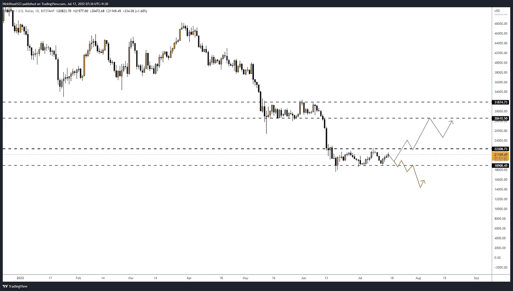
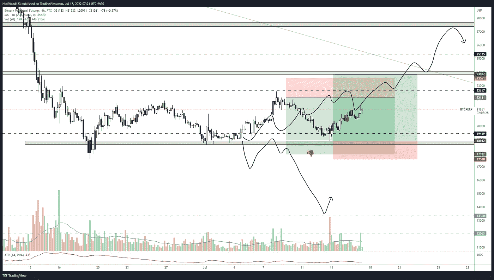
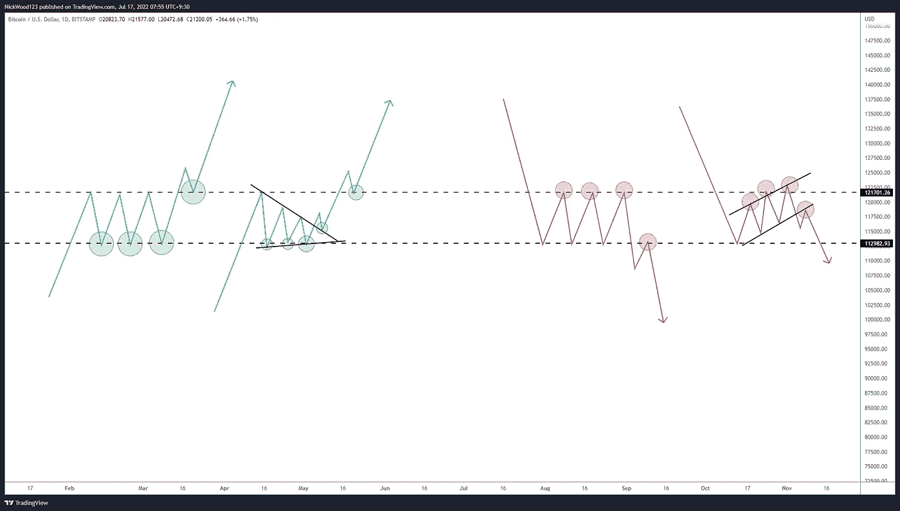

# 比特币周报——在区间低点成功反弹。从这里去哪里？

> 原文：<https://medium.com/coinmonks/bitcoin-weekly-report-successful-bounce-at-range-low-where-to-from-here-18ef21b4fff3?source=collection_archive---------26----------------------->

## 我们的下一个购买或销售机会在哪里，我们如何识别它们？

# 比特币报告(2022 年 7 月 18 日)

上周我们提到，随着价格升至区间内的阻力区，它可能会回落至区间低点，或形成一些更高的低点，试图向上突破。悲观的情况是，价格将无法保持在低位，并在跌至 13，000 美元之前跌破该区间。前者已经开始发挥作用，我们再次以最短暂的接触反弹支持，然后再次走向区间的阻力。我在范围的顶部有一个短订单，但错过了底部的长订单，因为它是一个**4 小时锤蜡烛**，没有其他拒绝。

# BTC 日报

BTC Potential Scenarios

【https://www.tradingview.com/x/zkCR0nEg/ 

上周我们谈到了这些确切的情况，目前我们正处于一个临界点，如果 **BTC** 不能继续保持这个范围并形成更高的低点和更高的高点，我越来越觉得它将向下突破到 **18，000** 水平，然后开始向 **14，000** 水平移动。我想提醒大家注意五月**和**期间的上一个系列。虽然它不像现在的价格那样干净，但我们可以看到，在最终向下突破之前，一个范围形成了大约一个月。这就是为什么我会在每次拒绝区间高点时，或者在区间高点附近形成一个更低的高点时保持谨慎。这可能是下一次向下移动到之前提到的 **14，000** 区域的开始。

然而，本周并不全是负面消息。事实是，我们仍然守住了那个支撑位，并在 **18，900** 水平短暂触及。如果价格继续上涨，特别是在 22000 点以上，我们真的有可能达到 28500 点(T21)，我预计在 25000 点(T23)水平会有一些反应，但下一个主要问题区域将是 28000 点(T24)。

# 4 小时时间范围

BTCUSD 4hr

[https://www.tradingview.com/x/5e3o35NY/](https://www.tradingview.com/x/5e3o35NY/)

我特意在图表上留下我所有的线条和立场想法来代表一些事情。首先，你会注意到它们处于**范围的极限**。这是我学到的重要一课，它需要**耐心**。你看，我可能会生气，因为我错过了底部多头仓位的机会，但从长远来看，在区间中间买入是灾难的处方。当我们遇到看涨或看跌模式时，最好是**在该模式的底部**买入，对于看跌模式**在该模式的顶部**卖出。这给了我们最好的风险回报比，并允许我们把止损点放在有意义的地方。

画出的线也显示了我的**预测**在**7 月**开始时的情况。这只是给你一个想法，在所有情况下都有多个计划会让交易变得更轻松。在执行交易之前就计划好交易，并按照计划去做，因为我们知道在情绪激动的时候，我们不会想清楚。

Example of Buying and Selling opportunities

[https://www.tradingview.com/x/0VuWjG3i/](https://www.tradingview.com/x/0VuWjG3i/)

上图显示了**看涨买入**情况与一些**看跌卖出**机会。我充分意识到事情从来没有这么简单明了。直觉必须发挥作用，但作为概念，它们往往是正确的想法。每一个**绿色**圆圈代表一个体面的**购买**的机会，每一个**红色**圆圈代表一个**出售**的机会，一些比另一些更好，它只是关于你想要多少确认。越多的确认越有可能朝着你的方向发展，但是如果交易过早，也可能意味着你会错过交易。复试是我的谋生之道，但有时复试永远不会发生，或者即使发生了，也只是很短的一段时间。你必须准备好一个清晰的计划，你想看到什么进入。

所有这些机会的总体概念是，如果趋势是有利的，我们在弱回调时买入，我们在最有回报的机会而不是最有风险的机会卖出或买入。我们经常会在下一次趋势移动之前看到市场的盘整，所以在这个 BTC 区间的顶部卖出是有意义的。价格很有可能突破止损点，到达 30，000 点，但我们感兴趣的是做出合理的交易决策，在下跌趋势中在区间顶部卖出，在上涨趋势中在区间底部买入。有道理。

当然，我也期待在**下跌趋势**中的区间底部**买入 BTC** ，这取决于你决定你希望你的交易决策包含多大的风险。我的决定中唯一的不同将是，在当前的市场形势下，我将采取更加谨慎的买入方式，*(我可能会在阻力附近的小利润中结束我的买入交易。与卖空交易相比，我会让交易持续尽可能长的时间。*

总之，我们正在**等待**看看当我们到达**区间高点**和**区间低点**时会发生什么，我们不会在中间买入，我们正在等待确认。你不会错失良机，正如我在上面向你展示的那样，向下有很多做空的机会，向上有很多做多的机会。耐心点。

我希望你从今天的报告中学到了一些东西。请订阅，如果你想每周更新密码市场。

> 交易新手？尝试[加密交易机器人](/coinmonks/crypto-trading-bot-c2ffce8acb2a)或[复制交易](/coinmonks/top-10-crypto-copy-trading-platforms-for-beginners-d0c37c7d698c)

如果你想和我联系，请跟着我

推特:@NickWoodFX

电子邮件:nw.forex@outlook.com

缺口

*这不是理财建议。本文包含的信息是一般性的，没有考虑到您的个人情况。你应该考虑这些信息是否适合你的需要，如果合适的话，向理财顾问寻求专业建议。你并且只有你对你的交易和投资决定负责。我不是专业人士。我对你可能遭受的任何损失或损害不承担任何责任。*

> 加入 Coinmonks [电报频道](https://t.me/coincodecap)和 [Youtube 频道](https://www.youtube.com/c/coinmonks/videos)了解加密交易和投资

# 另外，阅读

*   [如何获得自己的。XYZ 领域？](https://coincodecap.com/xyz-domain)
*   [最佳加密交换平台](https://coincodecap.com/best-crypto-swap-platforms) | [最佳加密交易所](https://coincodecap.com/crypto-exchange)
*   [购买比特币印度](/coinmonks/buy-bitcoin-in-india-feb50ddfef94) | [Pionex 审查](/coinmonks/pionex-review-exchange-with-crypto-trading-bot-1e459d0191ea) | [加密交易机器人](/coinmonks/crypto-trading-bot-c2ffce8acb2a)
*   [印度的加密交易所](/coinmonks/bitcoin-exchange-in-india-7f1fe79715c9) | [比特币储蓄账户](/coinmonks/bitcoin-savings-account-e65b13f92451)
*   [Cloudbet 赌场评论](https://coincodecap.com/cloudbet-casino-review) | [点火赌场评论](https://coincodecap.com/ignition-casino-review)
*   [币安收费](/coinmonks/binance-fees-8588ec17965) | [僵尸加密审查](/coinmonks/botcrypto-review-2021-build-your-own-trading-bot-coincodecap-6b8332d736c7) | [热点审查](/coinmonks/hotbit-review-cd5bec41dafb)
*   [my constant Review](https://coincodecap.com/myconstant-review)|[8 款最佳摇摆交易机器人](https://coincodecap.com/best-swing-trading-bots)