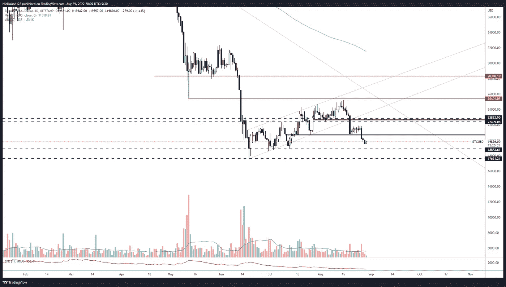
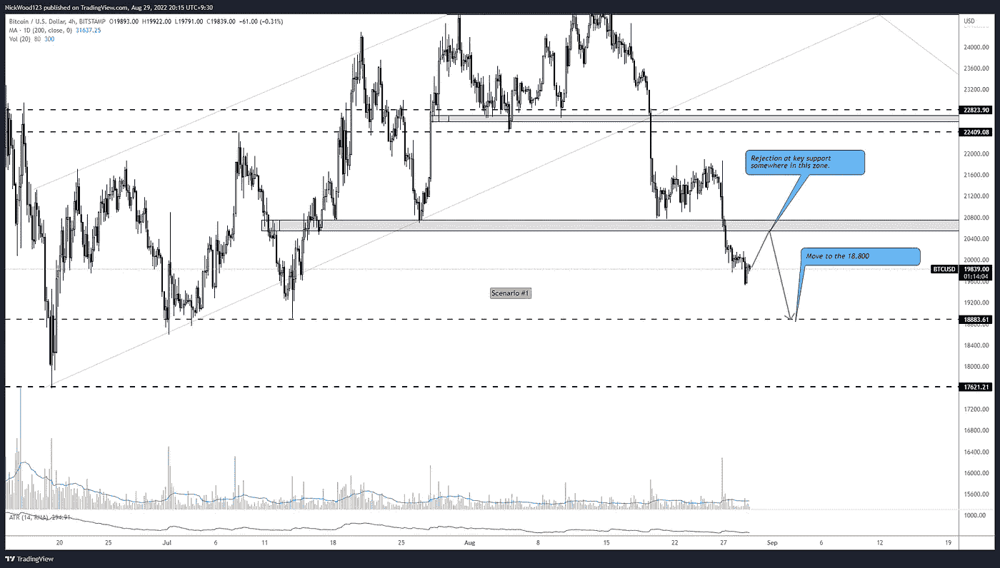
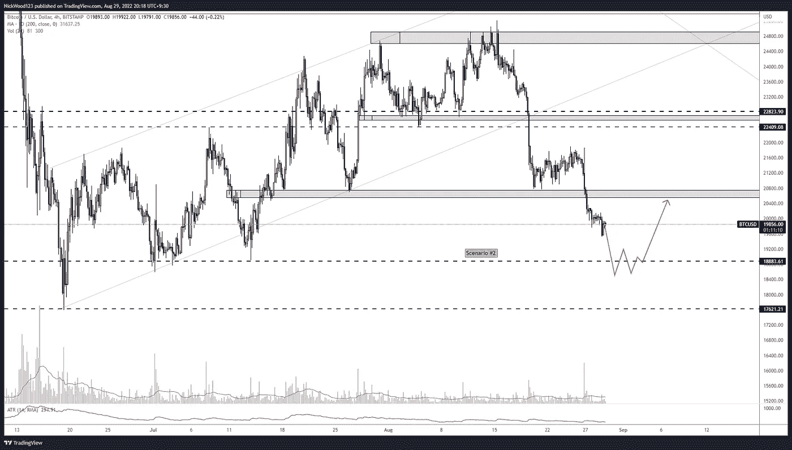
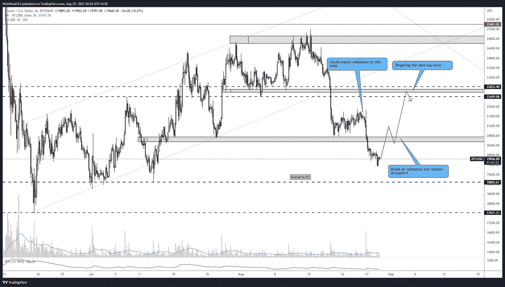
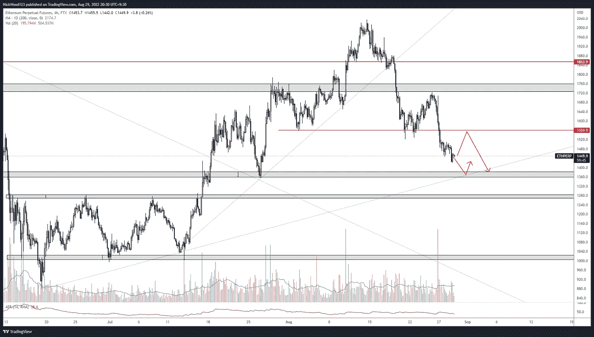

# 比特币周报——随着空头控制局面，支撑继续下跌。

> 原文：<https://medium.com/coinmonks/bitcoin-weekly-report-supports-continue-to-fall-as-bears-take-control-5b1ff4214440?source=collection_archive---------36----------------------->

## BTC 会在哪里走出低谷？

# 比特币报告(2022 年 8 月 29 日)

**比特币**上周短暂地保持在**20800**的关键水平，然后形成某种**熊市**并继续向下跌破下一个关键水平。一如既往，当我们打破这些支持，我们期待看到他们要么**重新测试**或**声称**。

# BTC 日报

BTCUSD Daily

[https://www.tradingview.com/x/1LrtIsal/](https://www.tradingview.com/x/1LrtIsal/)

价格倾向于向关键水平移动，所以我们对未来几天和几周可能看到的情况有多种选择。日关键支撑位为**18800**和**17600**。收复 **20，000** 水平将是短期看涨，我们可能会看到向 **22，400** 水平的移动。然而，在 **20，000** 水平作为阻力的拒绝将表明向下移动到前面提到的 **18，000** 区域。

就目前情况来看，我没有理由做多 BTC。目前，我们还没有到一个重要的支撑，如果我们有耐心，我们可能会得到更多关于 BTC 走向的信息。

# 4 小时时间范围

在这一节中，我将简单介绍一些我可以预见和计划的清晰场景。

Scenario #1

[https://www.tradingview.com/x/jN5WqqKi/](https://www.tradingview.com/x/jN5WqqKi/)

**情景 1** 在我看来是最有可能的，我认为未来几天有可能出现一次救济性上涨，在那里触及 **20，000** 水平导致拒绝，并向下填补缺口至 **18，800** 水平。

Scenario #2

[https://www.tradingview.com/x/zUVGZa9z/](https://www.tradingview.com/x/zUVGZa9z/)

情景 2 将是一个更大格局的一部分，在这个格局中，我们可能会看到在较大的日线和周线支撑位出现一些买入压力。如果价格下跌，我预计会持续一段时间。这可能会带来一个良好的长期买入机会。

Scenario #3

[https://www.tradingview.com/x/uLONZMIo/](https://www.tradingview.com/x/uLONZMIo/)

情景 3 需要一些好消息和重大的势头转变。在将阻力转化为支撑之前，需要打破阻力，因为我们得到了对支撑的重新测试，价格保持在 **20，400** 的水平，然后我们可以开始看向 **21，600** 水平的多头，最终看向 **22，400** 。

# 瑞士法郎/美元

ETHUSD 4HR

[https://www.tradingview.com/x/9QpEdLMn/](https://www.tradingview.com/x/v92KnJEO/)

**ETH** 与 **BTC** 的情况类似，它在一个我看不到太多支持的领域行动，这意味着它将被吸引到关键级别之一。 **1559** 处的阻力或 **1380** 处的支撑。在那之前，我不会被交易，我会等待这样的情况发生。

**水平**水平**水平**和**对角线趋势水平**的**汇合**可能会呈现一个体面的**买入机会**，这取决于市场的其余部分。

这就是我在本周报告中给你们的全部内容。耐心等待市场到达你的关键水平，执行你的计划。

一如既往地规划你的交易，耐心和过程胜于结果。

如果你想和我联系，请跟着我

推特:@NickWoodFX

电子邮件:nw.forex@outlook.com

缺口

这不是财务建议。本文包含的信息是一般性的，没有考虑到您的个人情况。你应该考虑这些信息是否适合你的需要，如果合适的话，向理财顾问寻求专业建议。你并且只有你对你的交易和投资决定负责。我不是专业人士。我对你可能遭受的任何损失或损害不承担任何责任。

> 交易新手？尝试[加密交易机器人](/coinmonks/crypto-trading-bot-c2ffce8acb2a)或[复制交易](/coinmonks/top-10-crypto-copy-trading-platforms-for-beginners-d0c37c7d698c)