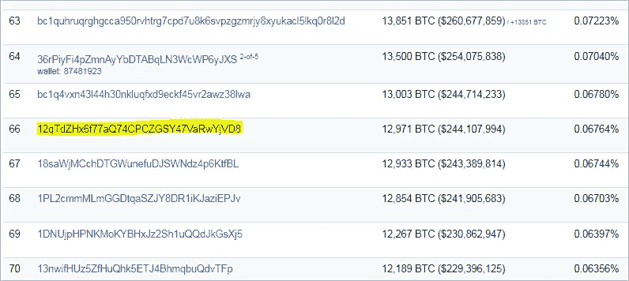
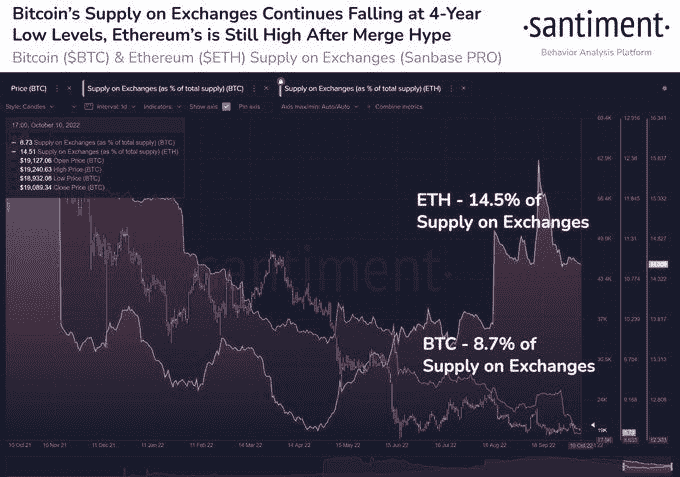

# 比特币巨鲸在 BTC 突然转移超过 2.45 亿美元

> 原文：<https://medium.com/coinmonks/bitcoin-whale-abruptly-moves-over-245-000-000-in-btc-8413741ecb92?source=collection_archive---------22----------------------->

在动荡的加密市场陷入低迷之际，一只鲸鱼正在转移价值数千万美元的比特币(BTC)。

根据鲸鱼观察家 Whale Alert 的说法，比特币的大持有者从一个未知的钱包向另一个未知的钱包转移了价值略高于 2.48 亿美元的 12，970 BTC。

来自分散网络资源管理公司 Blockchain.com 的数据显示，交易成本约为 22 美元。在撰写本文时，比特币的交易价格为 18747 美元。

根据区块链数据聚合平台 BitInfoCharts 的数据，大规模加密传输的接收地址现在是第 66 个最富裕的比特币地址，占 BTC 总供应量的 0.068%。

在 BTC 大规模转移之前，区块链数据平台 Glassnode 最近透露，过去几周，鲸鱼从加密交易所提取的比特币数量激增。根据 Glassnode 的数据，本月记录了自 6 月以来最大的网鲸从加密交易所提款。

比特币大规模转移的同时，加密分析公司 Santiment 透露，由于旗舰数字资产从交易所流出，加密交易所目前持有的比特币水平已达到 48 个月来的低点。根据加密分析平台的数据，相比之下，交易所的以太坊供应量略有上升。

*“比特币在 10 月份看到越来越多的硬币离开交易所，与 2018 年 11 月的水平持平。*

*与此同时，在合并前大量涌入交易所后，以太坊的供应量略有上升。”*

> 交易新手？试试[密码交易机器人](/coinmonks/crypto-trading-bot-c2ffce8acb2a)或[复制交易](/coinmonks/top-10-crypto-copy-trading-platforms-for-beginners-d0c37c7d698c)