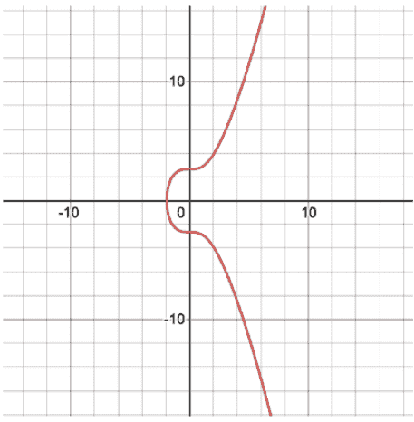
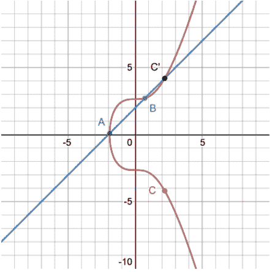
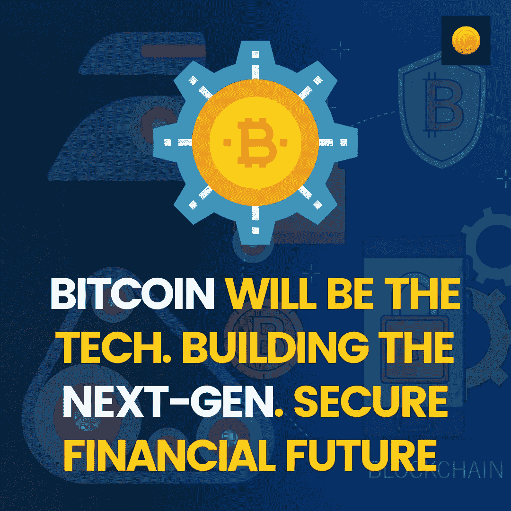

# 比特币将是构建下一代安全金融未来的技术

> 原文：<https://medium.com/coinmonks/bitcoin-will-be-the-technology-building-the-next-gen-secure-financial-future-93774ed954d?source=collection_archive---------29----------------------->

比特币的机制在很大程度上依赖于椭圆曲线数字签名算法，该算法确保在所有方程的末尾，副产品或判别式不会在末尾归零。这是保护比特币网络的基本结构，防止网络上发生任何黑客攻击。也许，这就是为什么前谷歌首席执行官、亿万富翁企业家埃里克·施密特说“比特币是一项了不起的加密成就。”在本文中，我们将看看为什么比特币的安全性在这个时代如此重要！

# 什么是比特币加密货币？

比特币是一种点对点的数字货币，受密码算法保护。利用底层的区块链技术，比特币提供了一种在全球范围内转移支付的无缝方式。

# 为什么比特币是数字未来的最佳货币/记录保存形式？

你可能听说过暗网这个词！那是黑客居住的地方，这个网络的大小比真实的网络大 5000 多倍。在撰写本文时，全球网络犯罪造成的经济损失高达 210 亿美元，是 2015 年的 57 倍。考虑到这种威胁，比特币无疑确立了自己作为保护未来的革命性技术的地位。

# [比特币](https://www.coindhan.com/trading/btcinr)如何抵御这种奇？

在我们进入“如何做”之前，我们需要先了解“是什么”!或者，简而言之，比特币区块链的背后是什么让它成为每个人都想拥抱的下一场货币或金融革命。从价值的角度来看，毫无疑问，共识和执行机制肯定会赢得所有的印象分，因为比特币因其有限的数量或供应冲击而具有抗通胀性。同样，它是最安全的货币形式，因为主要受分散而不集中的矿工影响的无信任和无国籍的经营。因此，即使是国家也出于自己的原因想要禁止比特币，而不是一语双关！

但是,[比特币](https://blog.coindhan.com/2022/07/31/bitcoin-bull-run-getting-interesting-as-btc-price-hits-6-week-high/)最显著的特点是公钥加密，这使得它既透明又安全。通过使用椭圆曲线加密技术，比特币产生了许多变数，这使得它很难猜测。同样的原因是有限域上椭圆曲线的定义。也就是说，追溯和验证是否满足某些条件变得更加容易。(x + 7- y )(mod 17) = 0。这是支持这种说法的一个例子。在有限域上，曲线将被定义在一个正方形上，其长度表示 p-1 界面。有了这种技术，计算有限域和找出奇数就更容易了。最重要的是，在有限域上，两条相交的线不相切，这证明了黑客攻击或漏洞的可能性。

比特币区块链的 Merkle 树也是由这种两点相交于第三点的技术支持的。因此，黑客很难通过调整其中一个状态来改变整个状态。即使黑客想调整区块链的状态，他/她也必须通过所有先前的节点，更改所有相关的内容。而且，即使他们这样做了，结果也永远不会是 0，因为在所有情况下，A + B = C 使比特币区块链成为下一代金融创新，可能彻底改变我们对金融的看法。

> 加入 Coinmonks [电报频道](https://t.me/coincodecap)和 [Youtube 频道](https://www.youtube.com/c/coinmonks/videos)了解加密交易和投资

# 另外，阅读

*   [用于 Huobi 的加密交易信号](https://coincodecap.com/huobi-crypto-trading-signals) | [HitBTC 审查](/coinmonks/hitbtc-review-c5143c5d53c2)
*   [TraderWagon 回顾](https://coincodecap.com/traderwagon-review) | [北海巨妖 vs 双子星 vs BitYard](https://coincodecap.com/kraken-vs-gemini-vs-bityard)
*   [如何在 FTX 交易所交易期货](https://coincodecap.com/ftx-futures-trading)
*   [OKEx vs KuCoin](https://coincodecap.com/okex-kucoin) | [摄氏替代品](https://coincodecap.com/celsius-alternatives) | [如何购买 VeChain](https://coincodecap.com/buy-vechain)
*   [ProfitFarmers 回顾](https://coincodecap.com/profitfarmers-review) | [如何使用 Cornix 交易机器人](https://coincodecap.com/cornix-trading-bot)