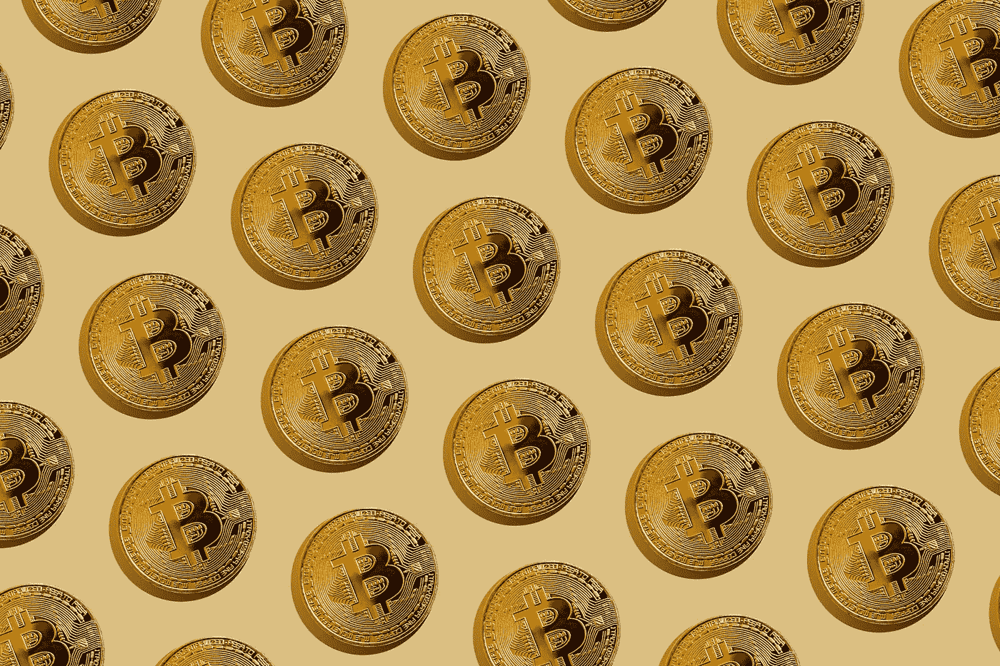

# 比特币制造者不是加密兄弟

> 原文：<https://medium.com/coinmonks/bitcoiners-are-not-crypto-bros-64cea8f0f87f?source=collection_archive---------41----------------------->

在密码世界里，有三种人:比特币制造者、多币者和无币者。但是如果你是一个没有创造的人，你可能会说前两个是同样的人:他们只是密码兄弟！这是对这个领域最大的误解，因为比特币制造者和非比特币制造者的共同点比你想象的要多。

每十个指出 crypto 是一个充满骗局或高科技庞氏骗局的赌场的无币者中，就有一个比特币创造者在说同样的话。唯一的区别，至少在很大程度上，是比特币创造者还指出，传统金融世界也没有什么不同。

Photo by [Jeremy Bezanger](https://unsplash.com/@unarchive?utm_source=unsplash&utm_medium=referral&utm_content=creditCopyText) on [Unsplash](https://unsplash.com/s/photos/bitcoin?utm_source=unsplash&utm_medium=referral&utm_content=creditCopyText)

啊，是的，即将成为经典的“一切都是庞氏迷因”就是我所说的。看，货币是一种社会技术，它的价值来源于所有参与者的集体错觉。换句话说，钱是一种迷因，而“最难”的钱是那些参与者认为他们的错觉永远不会被打破的钱。

因此，对于这个领域的新手来说，我们要问的第一个问题是，哪种加密货币具有最强的迷因或错觉？在这方面，比特币社区的狂热无可匹敌。下一个问题是，为什么？在这方面，比特币创造者谈论的知识严谨性和论述的数量没有竞争。

所有这些都是为了说，我并不打算改变任何人:如果你想进入加密领域，首先从了解比特币货币崇拜开始。你不一定要同意它，但是完全拒绝它将是一个代价高昂的错误。它还会让你脚踏实地，因为这个空间的其余部分也是金钱崇拜——但传统金融也是如此(如果这对你来说是新闻的话)。

无论如何，我只是想让事情尽可能真实——像往常一样。如果你想要一个严肃的教育或关于加密空间的讨论，我正在创建一个社区，让人们一起发现比特币。我很期待看到这个社区会有什么样的氛围，以及你们每个人想从这个社区中得到什么。通过此邀请随时给我发送消息或加入:[https://discord.gg/FTdWmsCKSq](https://discord.gg/FTdWmsCKSq)。我想听听你的故事，你对加密空间的看法，你对下一轮牛市的计划，我们将讨论这个社区的愿景和计划。

一如既往，一个喜欢或分享将非常感谢！感谢阅读

*作者拉斐尔·米拉富恩特*

原帖:[https://www . Facebook . com/Rafael . mirafuente/posts/pfbid 0 V8 grcdwvywibu 7 ut dr 7 wllkernb 7 qhervmieph 5 HW 4 dopfufqqfa q 7 m3 sy 1 q 5j 2p 9 l](https://www.facebook.com/rafael.mirafuente/posts/pfbid0v8grcdWVywibU7Utdr7WLLKErNB7QhErVMiEPH5Hw4DopFUqQFaQ7m3Sy1Q5J2P9l)