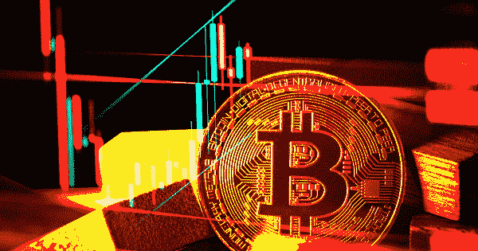

# 比特币生产成本下降 50%可能会进一步损害其价格

> 原文：<https://medium.com/coinmonks/bitcoins-50-decline-in-production-cost-could-further-harm-its-price-aeb5f7c74ee0?source=collection_archive---------50----------------------->

美国跨国投资银行 JP 摩根大通公司的策略师最近透露，比特币的生产成本在过去一个月下降了近 50%。

# BTC 生产成本骤降至 1.3 万美元

根据 Nikolaos Panigirtzoglou 领导的银行策略师周三发表的一份报告，比特币的生产成本目前为 13，000 美元，低于 2022 年 6 月初的 24，000 美元。该报告指出，大幅下跌可能会损害数字资产的价格。

策略师进一步指出，根据剑桥比特币电力消耗指数的数据，生产成本估计值的下降几乎完全是由于用电量的减少。

这家银行业巨头辩称，此举是矿商通过部署效率更高的采矿设备来保持盈利能力的努力，而不是效率较低的矿商的大规模流失。然而，此举可能会对比特币价格的任何上涨构成重大障碍。

> *“虽然这显然有助于矿商的盈利能力，并可能减轻矿商出售比特币股份以提高流动性或去杠杆化的压力，但生产成本的下降可能会被视为对比特币价格前景的负面影响。一些市场参与者认为生产成本是熊市中比特币价格区间的下限，”策略师写道。*

自 2021 年 11 月达到约 69，000 美元的历史高点(ATH)以来，比特币和整个加密行业面临着许多困境，迎来了新的熊市周期。

> 交易新手？试试[密码交易机器人](/coinmonks/crypto-trading-bot-c2ffce8acb2a)或者[复制交易](/coinmonks/top-10-crypto-copy-trading-platforms-for-beginners-d0c37c7d698c)

其中一些负面事件包括 Terra/LUNA 倒闭等高调事件的后果、三箭资本(3AC)破产，以及关于美联储加息以抗击通胀的消息。

目前，今年以来比特币的价格已经下跌了 70%左右。在过去的一个月里，领先的加密资产的交易价格一直在 20，000 美元左右。

随着波动性加剧，BTC 矿商在 2022 年第二季度继续疯狂抛售。最近的研究显示，随着垃圾场的恶化，矿工上个月卖出了 100%的 5 月产量。

点击关注我们的更多故事[。](http://t.me/etellworld)

> 加入 Coinmonks [电报频道](https://t.me/coincodecap)和 [Youtube 频道](https://www.youtube.com/c/coinmonks/videos)了解加密交易和投资

# 另外，阅读

*   [CoinFLEX 评论](https://coincodecap.com/coinflex-review) | [AEX 交易所评论](https://coincodecap.com/aex-exchange-review) | [UPbit 评论](https://coincodecap.com/upbit-review)
*   [AscendEx 保证金交易](https://coincodecap.com/ascendex-margin-trading) | [Bitfinex 赌注](https://coincodecap.com/bitfinex-staking) | [bitFlyer 评论](https://coincodecap.com/bitflyer-review)
*   [Bitget 回顾](https://coincodecap.com/bitget-review)|[Gemini vs block fi](https://coincodecap.com/gemini-vs-blockfi)cmd |[OKEx 期货交易](https://coincodecap.com/okex-futures-trading)
*   [AscendEx Staking](https://coincodecap.com/ascendex-staking)|[Bot Ocean Review](https://coincodecap.com/bot-ocean-review)|[最佳比特币钱包](https://coincodecap.com/bitcoin-wallets-india)
*   [霍比评论](https://coincodecap.com/huobi-review) | [OKEx 保证金交易](https://coincodecap.com/okex-margin-trading) | [期货交易](https://coincodecap.com/futures-trading)