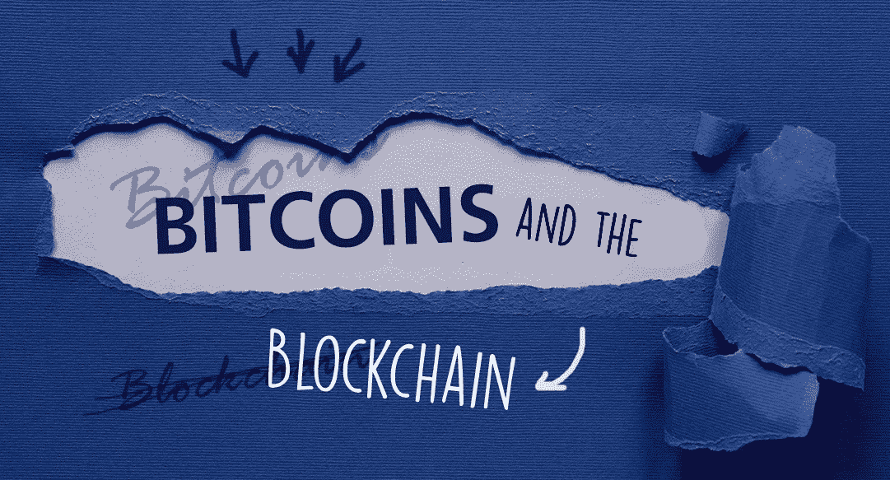
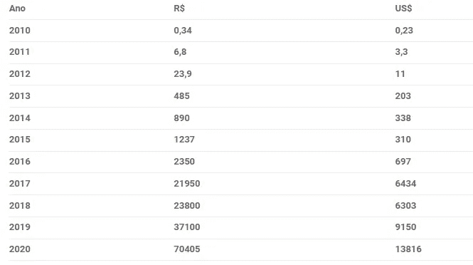

# 比特币和区块链:承诺改变我们所知世界的货币和技术

> 原文：<https://medium.com/coinmonks/bitcoins-and-the-blockchain-currency-and-technology-that-promise-to-change-the-world-as-we-know-it-3f9918eb9aad?source=collection_archive---------60----------------------->

比特币是什么？什么是值得的？它们是如何工作的？区块链科技怎么样？它来的目的是什么，未来有什么可能性？了解加密货币和新技术如何改变我们所知的世界，并促进一些过程。

比特币是 2009 年出现的虚拟货币，可以用传统货币买卖。但与他们不同的是，比特币没有像政府那样的实体来监管其运营，事实上，它是通过一个由互联计算机组成的开放网络来验证和保护交易的。

比特币要存在，就必须出现一种叫做区块链的技术。它是加密货币交易的安全、不可变、透明和分散的媒介。

# 了解区块链是如何工作的

该工具能够将比特币等货币从一端交易和转移到另一端。它记录了交易的硬币数量，以及谁发送了硬币，谁收到了硬币，以及交易是何时进行的。

所有这些数据都存储在块中，用时间和日期戳标记每个块。在每个时间段，都会形成一个新的事务块，该事务块与前一个事务块相链接。

这种街区制使它得名。为了验证在区块链进行的交易，需要几台计算机的验证和批准。

矿工做这项工作，他们赚取比特币作为交换。比特币可以通过这种方式获得，也可以由人们在全球交易所购买。

# 比特币

比特币是一种虚拟货币，随着时间的推移，它的价值增加了，但仍然没有得到足够的使用，因为许多人不明白它是如何工作的。除此之外，还有其他货币，如 Primecoin、Dogecoin 和 Litecoin。但毫无疑问，比特币是最受欢迎的。

尽管这些硬币是虚拟的，但它们具有真实的价值，其中很大一部分是作为对验证交易的用户的一种奖励而产生的，验证交易非常耗时，需要强大的处理能力。这个过程叫做采矿。

# 数据挖掘

挖掘是通过对比特币交易的验证来完成的，为此，有必要让一定比例的计算机进行这种验证，以使交易得到验证。

这一过程形成一个区块，一旦完成，就会获得一定数量的硬币，即比特币。矿工们因这项工作获得硬币，目前其市场价值为 48，504 美元。

在这个过程中存在激烈的竞争，因为大量的计算机可以同时在单个街区工作，而一个矿工独自获得整个奖励的机会非常小，这取决于大量的计算能力。

但毫无疑问，如果他们中的任何一个赢得了所有的奖励，他们将会有很多钱。

有一种叫做“挖掘池”的东西，在葡萄牙语中称为“挖掘池”，这是一种提高一个群体或一群人共享计算资源的机会的方法。

在这个过程中，产生的硬币在成员之间分享，他们通常最终赚得比他们贡献的多。为了进行这种挖掘工作，需要大量的计算能力，人们使用一些替代方法来增加它，即:

*   **专用硬件—** 有些人使用他们的专用硬件来进行采矿，这一过程非常昂贵，需要消耗大量的光，而且并不总是值得获得的价值。
*   **ASIC—**专为采矿设计的小型硬件处理器的名称。与专用硬件不同，它们耗电更少，性能更好，成本更低。
*   **云计算—**云的工作原理是提供类似于专用机器的好处，但通常它的成本更低。

# 了解使用虚拟货币的好处:

*   它是一种全球货币，即你可以在世界不同地方使用它购买商品或服务；
*   它不产生银行或政府征收的费用，因为它是分散的；
*   有了它，几乎可以匿名地进行购买和交易，而不需要提供那么多个人数据；
*   用你的系统，几乎不可能制造假币。

# 虚拟货币的未来

比特币是一种已经在一些地方被接受并用作支付形式的货币。今天，这枚硬币具有表达价值，那些前一段时间投资它的人做得很好。它将越来越多地被用作一种免除银行费用的方式，一种在世界各地安全进行交易的方式。

说到区块链，这是一项技术，它不仅有潜力改变我们的金钱交易，也有潜力改变我们的健康。是的，健康，因为它的块系统存储来自其他块的数据，确保信息是不可变的，很难违反它们。

在卫生系统中，病人的医疗记录存在问题，因为一旦登记，就不可能修改。卫生专业人员苦于不知道把他们的病历放在哪里，因为不能保证它们不会被修改。

使用区块链技术，可以保证每个数据块、每个记录都不会被修改。因此，区块链可以在世界任何地方创造纪录。所以这是未来几年的趋势。

在一个日益虚拟化和全球化的世界，比特币和区块链为人们提供了以不同方式关联、购买和存储信息的机会。区块链实际上包含了比特币的整个开采过程。

读完所有这些，我想你可能在想，是时候开始投资比特币了，如果这真的是一种趋势的话。下面我们展示了 12 年来比特币价格的演变:

这些年来，加密货币的增长和升值速度令人惊讶。它很少下跌，而且趋势是继续增长。了解了这一点，就更容易决定是否加入这种新的交易方式。

> 交易新手？试试[加密交易机器人](/coinmonks/crypto-trading-bot-c2ffce8acb2a)或者[复制交易](/coinmonks/top-10-crypto-copy-trading-platforms-for-beginners-d0c37c7d698c)