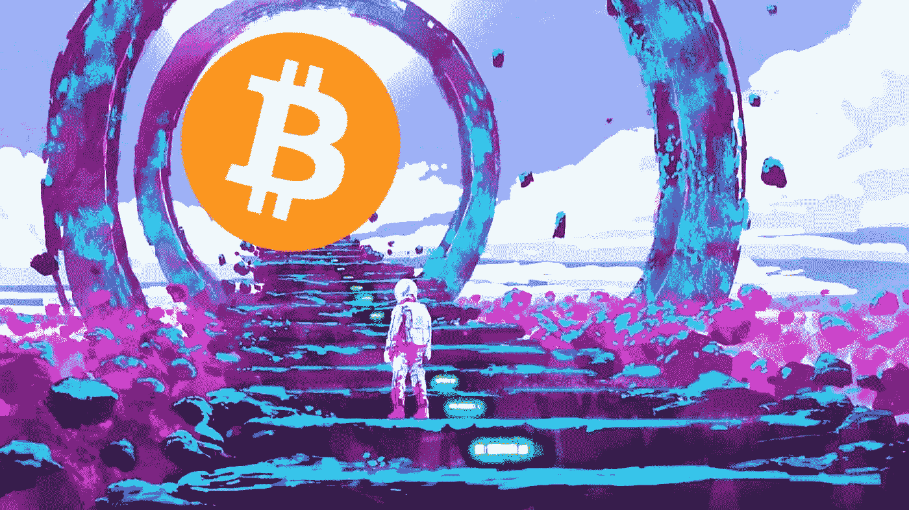

# 比特币未来的价格催化剂

> 原文：<https://medium.com/coinmonks/bitcoins-future-price-catalysts-4da10221c350?source=collection_archive---------7----------------------->

比特币市场现在已经低迷了将近一年半。唯一的例外是在 2021 年 10 月，当时我们看到了一次短暂的势头反弹，导致价格创下历史新高。但是，它是短命的，从那以后一直处于亏损状态。这个行业的兴奋点已经消失，大多数人现在都承认，我们已经进入了熊市。对许多人来说，过去的几个月并不是快乐的时光…