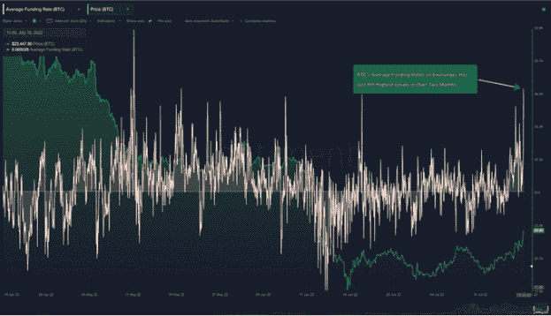
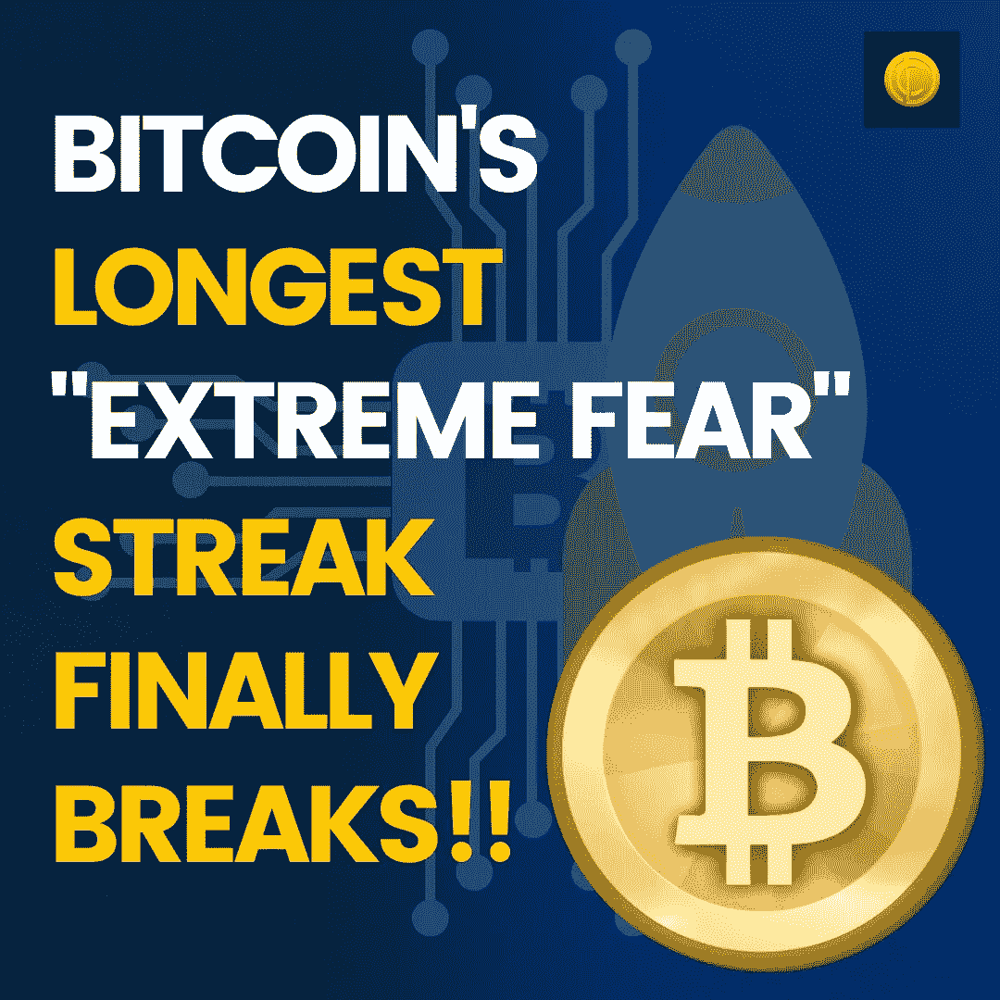

# 比特币持续时间最长的“极度恐惧”终于打破了

> 原文：<https://medium.com/coinmonks/bitcoins-longest-extreme-fear-streak-finally-breaks-e26dbddeaa6a?source=collection_archive---------44----------------------->

这不是 BTC 的结束，而是一如既往的开始！尽管到目前为止已经有 453 份讣告，BTC 总是对怀疑者不屑一顾。这一次，贪婪与恐惧指数再次从极度恐惧区转移到恐惧区，这表明希望已经回归，尽管美联储计划在本周进一步加息，但投资者仍然乐观。

# 这个星期发生了什么？

周二对比特币制造者来说是多事之秋，因为在超过 73 天的时间里 [BTC](https://www.coindhan.com/trading/btcinr) 第一次超越了极度恐惧区域。有高达 19%的增长，这进一步推动了 BTC 向上的势头。公牛抓住了熊的脖子；结果，比特币恐惧和贪婪指数在 100 点的表上达到了健康的 31 点。

甚至长期指标也表明，由于 FOMO 已经形成，将会有一个迫在眉睫的突破。

银河数码首席执行官迈克·诺沃格拉茨已经对数字黄金表示乐观，他说，在未来 5 年内，数字黄金不可避免地会接近 50 万美元。诺沃格拉茨进一步补充说，最坏的情况已经过去，我们正在为未来最好的日子做准备。

# 秘密的冬天会就此结束吗？

这可能是一个是或否的场景，因为当你看更广泛的市场动态时，我们确实存在于一个量子状态中。股市正处于复苏阶段，通胀已经失控，更广泛的宏观经济因素一直不利于传统资产。所有这些加在一起，使得加密市场很容易全速前进。周二，比特币涨到了 23000 美元，这是几个月来我们见过的最高价。尽管美联储缩减购债规模，但投资者高度乐观，ETH 已经上涨了 40%。如果 [ETH](https://blog.coindhan.com/2022/06/15/why-eth-2-0-will-be-revolutionary-for-the-blockchain-ecosystem/) 能够突破 2200 美元大关，这显然将为加密冬天的结束和另一轮牛市的开始定下基调。如果发生这种情况，我们很可能会在今年年底前看到比特币交易价格在 30，000 美元至 35，000 美元左右。

> 交易新手？试试[密码交易机器人](/coinmonks/crypto-trading-bot-c2ffce8acb2a)或[复制交易](/coinmonks/top-10-crypto-copy-trading-platforms-for-beginners-d0c37c7d698c)