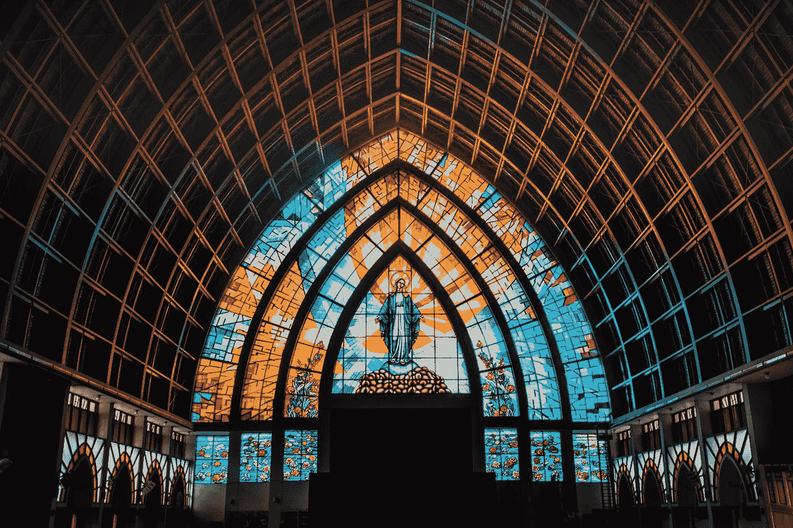

# 比特币的起源和完美构想

> 原文：<https://medium.com/coinmonks/bitcoins-provenance-and-immaculate-conception-c68fc44f142?source=collection_archive---------24----------------------->

Photo by [Eduardo Flores](https://unsplash.com/@eduardoflorespe?utm_source=medium&utm_medium=referral) on [Unsplash](https://unsplash.com?utm_source=medium&utm_medium=referral)

没有宗教隐喻的金钱崇拜是不完整的。在比特币社区，我们深情地称之为“完美构想”。这是围绕比特币的创造和采用的一系列奇迹，使其在整个世界独一无二，更重要的是，证明了它最有可能是不朽的。所以请继续阅读更多的亵渎！

要让区块链像货币一样成功，它应该能够做两件事:第一件是在空间中安全地移动大笔资金，第二件是在任何时候都保持其价值。前者很容易设计和复制，但后者将需要一些奇迹来证明自己。

我说证明它自己，而不是达到，因为不朽只能被社会证实。我们实际上不能确认一个网络会永远存在，但是我们可以看看它的历史来判断其他人是否会继续相信同样的结论。因此，让我们来看看比特币起源的重要部分，看看它是否证实了每个人在评估货币网络时的最大优先事项:它是不朽和廉洁的吗？

这些奇迹中的第一个是造物主是匿名的。没有一个名字或一张面孔来描述创始人中本聪，我们无法将文化或社会政治偏见与这个项目联系起来。这是一个为所有人服务的网络，拥有一个匿名的创建者意味着他的背景不能被用来诋毁这个网络。

第二个奇迹是，创建者在启动项目后不久就消失了，再也没有回来干预或修改参数。在没有创始人不断调整代码的情况下存在了 13 年后，比特币证明了它可以独立工作，并将继续独立工作。

第三个奇迹是，最初的硬币发行没有让内部人士获得相对于公众的不公平优势。今天存在的每一枚比特币，包括 Satoshi 的第一批比特币，都是通过该协议公平开采的。

第四个奇迹是，创始人的硬币从未动过，除了早期测试网络的一些小交易。分析师估计，Satoshi 的绝大多数硬币超过 100 万个比特币，一直都在同一个钱包地址上。它们保持不被触及的时间越长，这些钱包就成为越大的目标，这只是越来越突出网络安全的力量。

第五个奇迹是，比特币没有公司或政府赞助，不像 99%的加密货币是在它之后创造的。这意味着比特币没有使其成功的集中议程，因此它继续享受的成功是源于自身而非外部力量。

第六个奇迹是，比特币交易了 15 个月，没有任何商业价值。最早的采用者，密码朋克和密码学爱好者，交换这些代币作为一种新奇的练习，而不是作为一种价值交换或市场交易。这证明了比特币首先是数字财产，其次才是货币网络。

第七个奇迹是比特币的简单。如果你想优先考虑不朽，那真正的意思是你想尽可能少地改变它。因此，您会希望最大化它的简单性，因为复杂性增加了它将会或可能需要改变的可能性。

第八个(虽然不是最终的)奇迹是 2017 年区块大小战争的结果。在此期间，比特币矿工和交易所合谋改变了一个实际上只是次要的技术参数，即比特币区块的内存大小。但由于网络是由分散的节点控制的，任何人都可以在世界各地运行，所以修改被否决，比特币最初的区块链得到了支持。这证明了网络是由节点控制的，不能被集中议程捕获。

所有这些故事都证明了同一件事:网络在如何启动和如何分配方面是公平的。它的成功没有强迫、操纵或宣传。自比特币诞生以来，包括其创始人在内的所有参与者都在玩同样的游戏，我们今天仍在玩同样的规则。

这是一个令人谦卑的故事，也是给人类的一份真正美丽的礼物。这很令人羞愧，因为我们必须认识到这种事情不会再发生了，正如我们所知:耶稣只有一次生命。

—

我从迈克尔·塞勒和莱克斯·弗里德曼的播客中找到了这个奇迹列表。今晚(9 月 21 日)晚上 9 点，我们将与东南亚的比特币爱好者和自由主义者一起讨论这个非常吸引人的采访。我会准备一些适度的问题，所以不需要真的去听这一集，但是你的想法和观点才是我们想要的。通过这个邀请链接加入我们的不和:[https://discord.gg/XvxYuS2WF6](https://discord.gg/XvxYuS2WF6)

> 交易新手？试试[密码交易机器人](/coinmonks/crypto-trading-bot-c2ffce8acb2a)或者[复制交易](/coinmonks/top-10-crypto-copy-trading-platforms-for-beginners-d0c37c7d698c)