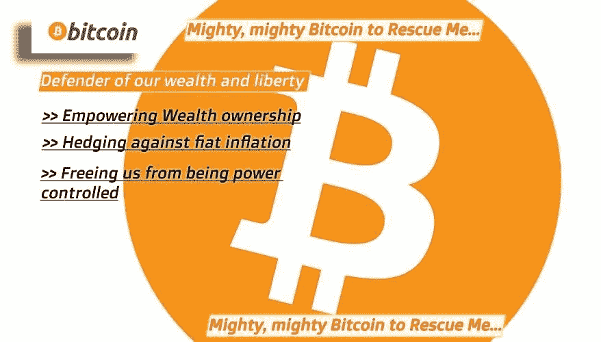
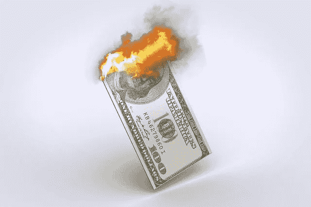
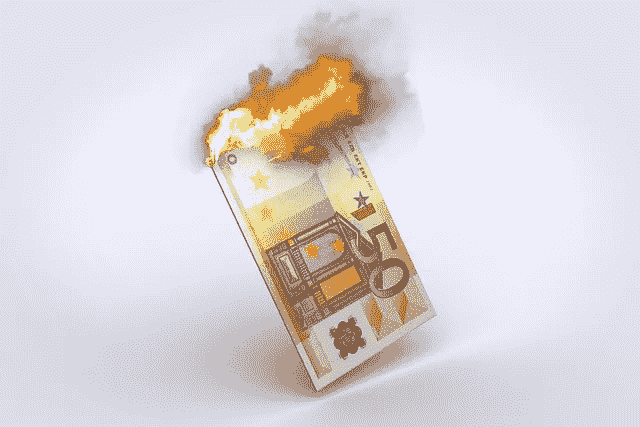
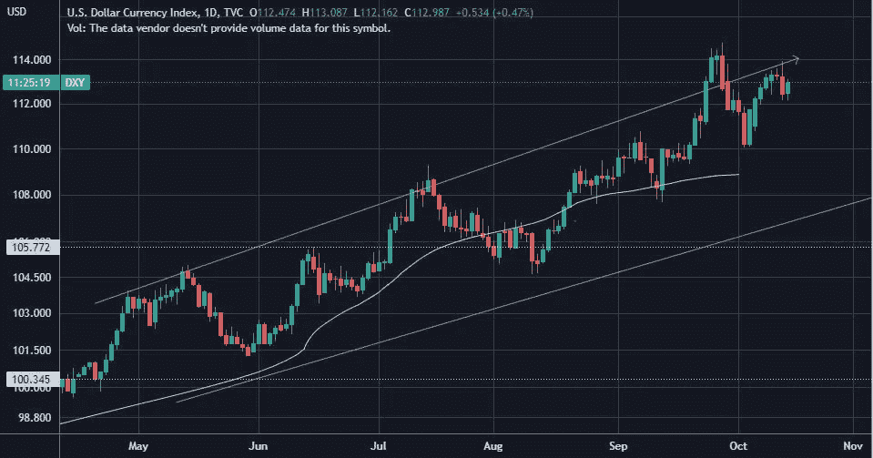
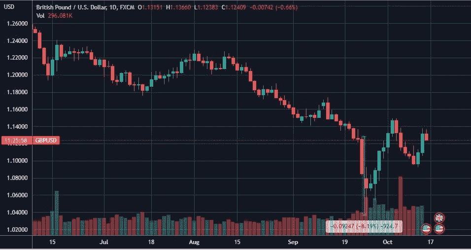
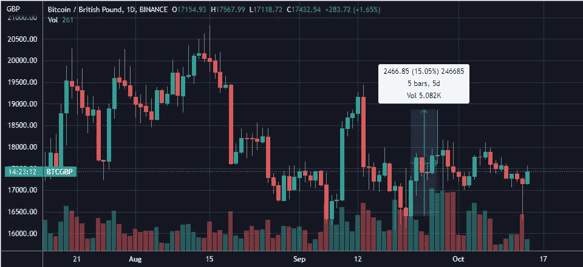
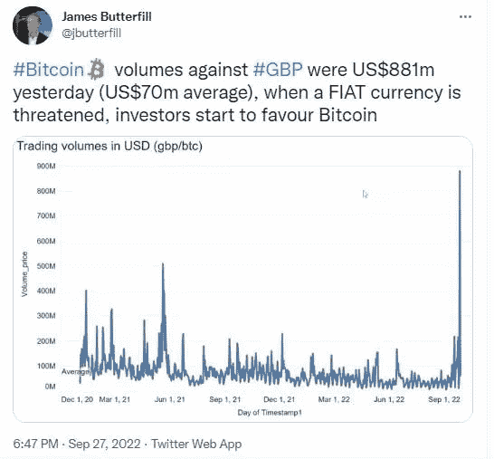
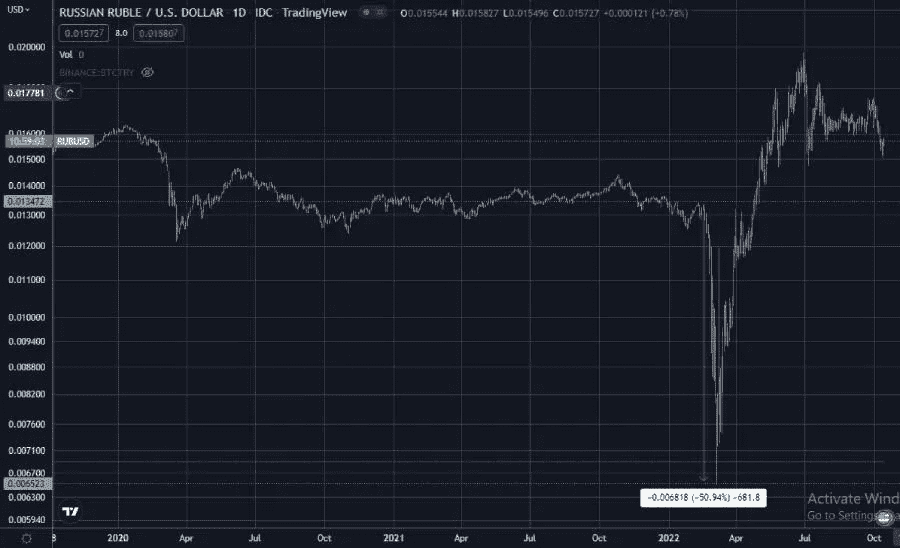
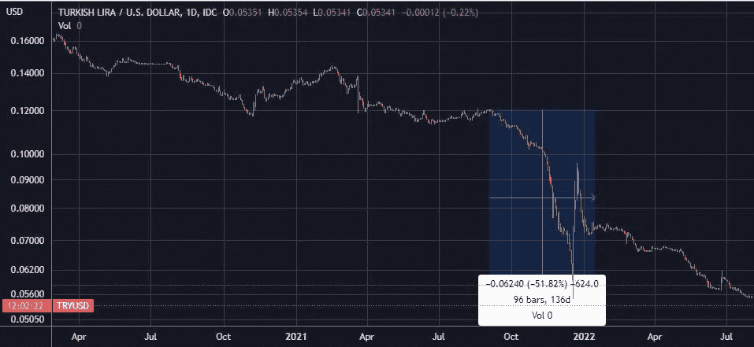
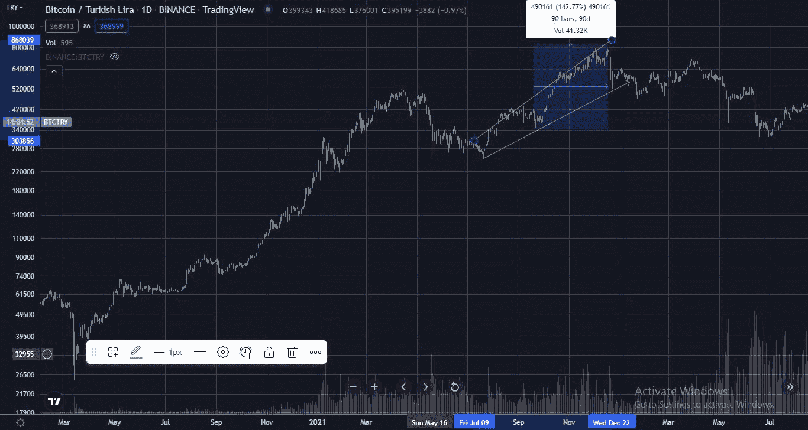

# 每当人们担心他们的法定货币可能崩溃时，比特币就是“后藤资产”

> 原文：<https://medium.com/coinmonks/bitcoins-the-goto-asset-whenever-people-fear-a-possible-crash-of-their-fiat-currency-937f9ebd7516?source=collection_archive---------42----------------------->

# 坚信比特币的基本面使其成为黄金 2.0

***昨天发布我的第二首比特币歌曲***

曾经有一段时间，我对比特币非常乐观，认为它的基本面是黄金 2.0，可以对冲法定通货膨胀，因此我写了一首歌来解释它。

***这是我第一首比特币歌曲的链接—***

*现在，由于我经历了所有的加密创伤，这种热情积极的加密情绪在我身上并不那么普遍，但我刚刚发布了我的第二首比特币歌曲(哈…加密歌手我)，它是我在早期乐观的加密时代创作的，但我昨天才在 youtube 上直播了这首歌。*

*为什么有人会问，我是不是又唱了一首比特币的歌？。那种隐秘的热情又回来了吗？？不，不是真的！！！只是我还是相信比特币基本面让它成为黄金 2.0。*

**现在，你可以听到我的第二首比特币歌曲，这首歌是借用《愤怒的小鸟》电影《强大的红色》中的曲调创作的。**

# *今年，美联储告诉我们货币政策如何影响法定货币的价值*

**

****如今，每个人都能够理解一个政府的货币政策是如何通过政府的加息和降息措施间接影响法定货币的价值的。****

*美元当然是主要原因。作为一种世界储备货币，它在全球范围内受到世界各国的高度需求。每个国家都需要保持足够的美元外汇储备，因为它是用于世界贸易的。美联储的加息正在消除美元的流动性，这就是为什么加息被称为货币紧缩。*

*因此，每个人都想保护他们兑换成美元的财富，因为美元被认为是一种安全的资产。现金为王，美元是现在现金类别中的一个至高无上的王…*

## *美联储的货币紧缩措施降低了其他法定货币的价值*

**

*是的…只要去交易查看平台亲眼看看，世界上大多数货币对美元都在下跌…*

**

*[Trading view](https://www.tradingview.com/) chart. DXY Index*

****DXY 指数衡量美元对其他 6 种主要国家货币的价值，DXY 在从 144 美元的高点降温后，上周一直在攀升，现在是 122 美元。****

*人们只能想象新兴经济体和不发达经济体的法定货币的情况会糟糕得多。*

*有人要求美国停止继续加息，因为它正在将世界拖入全球衰退。*

*所以，美联储的货币紧缩措施是如此有力，以至于它正在影响世界经济…*

# *BTC 的货币机制使其供应稀缺，并赋予其黄金属性！！*

*最近，英国 9 月份英镑对美元的汇率大幅下跌，英国人为了保护自己的财富，将英镑兑换成 BTC 货币……这在一定程度上是疯狂的，因为我们知道 BTC 很不稳定，预计将进一步下跌至 14，000 美元至 12，000 美元的水平。*

*然而，当人们觉得他们的政府正在通过他们的政策危及法定货币的价值时，他们会转向 BTC，因为 BTC 的发行和供应不受任何实体的控制。*

*与法定货币不同，BTC 的供应量上限为 21，000，000 BTC，其发行通过 BTC 矿工的采矿进行，BTC 的发行利率是固定的，每 4 年减半一次。*

*因此，目前比特币矿工成功开采 BTC 区块可获得 6.25 BTC 的区块奖励，但在 2024 年 5 月下一次减半后，这些矿工成功开采 BTC 区块将获得 3.125 BTC 的奖励。*

*随着时间的推移，BTC 的发行越来越少，由于 BTC 的这些货币机制，减少了 BTC 的流通供应。*

*这就是为什么 BTC 是硬通货，正如我在之前的文章中解释的。*

# *当人们对法定货币崩溃的担忧袭来时，他们就会涌向比特币*

## *英国人担心英镑可能在 9 月 1 日崩溃*

**

*[Trading view](https://www.tradingview.com/)*

*在 9 月份，从 tradingview 图表中可以看出，英镑对美元的价值一直在自由下降，从 9 月 23 日到 9 月 27 日下降了 8%，这让英国人担心。*

***那么，现在让我们来分析上述**期间的 BTC/英镑交易对图表*

**

*[Trading view](https://www.tradingview.com/) BTC/GBP chart*

*在 9 月 11 日至 9 月 27 日的相应时间段内，BTC 对英镑的价值上涨了 16%！！*

*BTC/英镑[的交易量在 9 月 26 日暴涨](https://cryptopotato.com/bitcoin-trading-volume-explodes-against-british-pound-as-currency-weakens/)超过 1000%,当天的交易量为 8 . 81 亿美元，而通常该对货币的日均交易量一般在 7000 万美元…*

**

*[Source](https://cryptopotato.com/bitcoin-trading-volume-explodes-against-british-pound-as-currency-weakens/)*

****所以，当人们担心自己的法定货币会崩溃时，他们已经有涌向比特币的倾向了！！****

# *2 月份卢布兑美元汇率暴跌时，俄罗斯人纷纷涌向 BTC*

*在 2 月中旬至 3 月 7 日期间，俄罗斯卢布对美元下跌了 50%，以回应俄罗斯对乌克兰的战争和旨在使俄罗斯无法通过兑换卢布进行国际贸易的国际制裁。*

**

*[Trading view](https://www.tradingview.com/) RUB/USD chart*

*俄罗斯人涌入 BTC，用卢布兑换 BTC，这就是为什么在此期间 BTC 卢布升值了 85%！！！*

**

*[Trading view](https://www.tradingview.com/) BTC/RUB chart*

## *去年土耳其里拉对美元的汇率大幅下跌…*

*去年 9 月至 12 月期间，土耳其里拉对美元下跌了 50%。*

**

*[Trading view](https://www.tradingview.com/) TRY/USD chart*

*现在，让我们看看 BTC 在那个时期是如何对抗 TRY 的。*

**

*[Trading view](https://www.tradingview.com/) BTC/TRY chart*

****BTC 在那段时间内反对试炼上涨了 126%，这肯定应该是因为试炼持有者把试炼换成了 BTC！！****

# *所有上述法定货币贬值都是由于各自国家政府的政策错误*

*所有这些法定货币的下跌都是由于每个国家的政府政策，理解这一点很重要。*

*英镑下跌是因为一项有争议的有利于富人的减税措施。在必须控制通货膨胀的时候，这样的措施是不合理的。这也会影响英国政府的收入。*

*英镑的下跌，将会伴随着更大的下跌，因为人们将英镑套现到其他货币，比如 BTC，当然还有与美元挂钩的货币，比如 USDC、BUSD 和 USDT。*

*更多关于英国政府不健全的货币措施几乎使英镑贬值的信息，请点击这里*

*卢布下跌是因为俄罗斯政府对乌克兰发动战争的坚定立场，这导致了全球混乱，由于石油和天然气价格上涨，俄罗斯是石油和天然气商品的主要出口国，因此对全球经济产生了影响。*

*由于政府的减税政策，股价下跌了。这是一个不明智的举动，因为土耳其的通胀已经很高，当美国等其他政府准备加息以控制通胀时，进一步降息只会使事情变得更糟。*

*在这篇[秘密土豆文章](https://cryptopotato.com/bitcoin-pokes-ath-against-turkish-lira-following-erdogans-latest-rate-cut/)中有更多的内容…*

# *愤怒的小鸟我们和政府一起遏制我们创造财富的可能性*

**

*[Source](https://en.wikipedia.org/wiki/File:The_Angry_Birds_Movie_poster.png)*

*现在，如果我在这种情况下为 BTC 唱一首英雄歌曲，你能怪我吗？…*

*所以，这是我的强大，强大的比特币拯救我的歌词…*

**强大、强大的比特币拯救了我，
我们财富和自由的捍卫者，
赋予财富所有权，
对冲法定通货膨胀，
让我们摆脱权力控制，**

****浩浩荡荡的比特币来救我****

*啦啦啦…啦啦啦…啦啦啦…啦啦啦…啦，啦，啦*

**

*我们对我们政府的中央银行的各种货币政策感到愤怒，这些政策降低了法定货币的价值，导致通货膨胀。*

*我们愤怒还有其他原因，因为他们不允许我们以加密货币的形式拥有财富，只是因为他们觉得加密货币取代了他们发行的法定货币，削弱了他们的权力，这让他们感到威胁。*

*比特币从未经历过衰退，它只是一个 13 岁的资产类别，直到现在它在美国十年的低利率环境下蓬勃发展。现在，由于美联储加息，它像其他科技股一样被抛售。*

****然而，这并不会改变比特币作为黄金的数字资产共享属性，其供应和发行无法被其他实体控制。****

*当然，比特币没有那么强大，我们也可以看看 Monero 的金融隐私。*

*享受我的歌曲强大强大的比特币来回避我！！！…*

**啦啦啦啦啦啦啦啦…啦啦啦啦啦啦啦…**

*结尾…*

> *交易新手？尝试[加密交易机器人](/coinmonks/crypto-trading-bot-c2ffce8acb2a)或[复制交易](/coinmonks/top-10-crypto-copy-trading-platforms-for-beginners-d0c37c7d698c)*