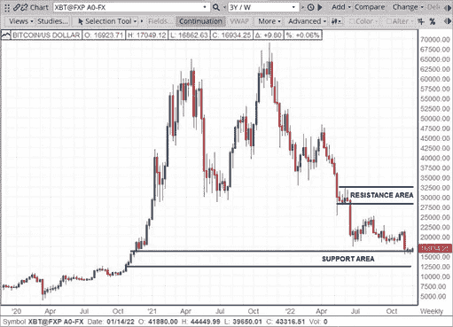

# 交易知识点滴#18

> 原文：<https://medium.com/coinmonks/bites-of-trading-knowledge-18-86e8a41baffd?source=collection_archive---------38----------------------->

**区块链是什么？-**

区块链是一个去中心化的分类账，仅附加，这意味着数据只能添加到其中。一旦添加了信息，就极难修改或删除。区块链通过在每个后续区块中包含指向前一个区块的指针来实施这一点。

指针是前一个块的散列。散列涉及通过单向函数传递数据，以产生输入的唯一指纹。如果输入被稍微修改，指纹看起来会完全不同。由于这些块是以链的形式链接在一起的，所以没有人能够在不使后面的块无效的情况下编辑旧条目，从而实现安全的结构。

**什么是区块链共识算法？-**

共识算法是一种机制，允许用户或机器在分布式设置中协调关于区块链中什么是有效区块的协议。它需要确保系统中的所有参与者能够就单一的真相来源达成一致。共识算法的类型包括工作证明(PoW)和利益证明(PoS)。

**什么是工作证明？-**

工作证明(PoW)是一种防止相同的比特币资金被花费超过一次的机制。工作证明由共识算法组成，这是一种协议，规定了使区块链中的区块有效的条件。保证了比特币分布式账本的安全性和完整性。

**企业和个人投资者的风险和机遇** -
管理风险和机遇的金融市场工具的一般应用。

**对冲投资组合风险**

使用 Bakkt 比特币(美元)现金结算月度期货(BMC)合约对冲比特币风险是一种通过采取与基础资产相反的方向头寸作为保护来管理投资组合风险的方法。

例如，对冲者可能计划使用基于内部市场和投资组合分析过程的期货合约来对冲比特币的价格下跌。市场分析可以使用常见的技术分析技术，如支持和阻力，来制定交易决策。

在图表(图 1)中，如果预计比特币在接近阻力区时会走软，对冲者可能会计划在 27，500 美元或 32，500 美元的价格水平下使用 Bakkt 比特币(美元)现金结算月度期货合约进入空头期货头寸，以锁定其基础比特币头寸的价值。或者，如果对冲者处于比特币空头头寸，并希望随着价格上涨对冲其头寸，则可以考虑在价格水平 12500 美元或 16500 美元以上进入多头期货头寸。

请随时加入我们的˲tradewithufos 社区，我们提供全面的交易课程和交易应用程序。

完成课程设置:
[【www.tradewithufos.com/courses】T2](https://www.tradewithufos.com/courses/)

为所有人免费永久会员:

**传统研究团队**

> **交易新手？尝试[加密交易机器人](/coinmonks/crypto-trading-bot-c2ffce8acb2a)或[复制交易](/coinmonks/top-10-crypto-copy-trading-platforms-for-beginners-d0c37c7d698c)**