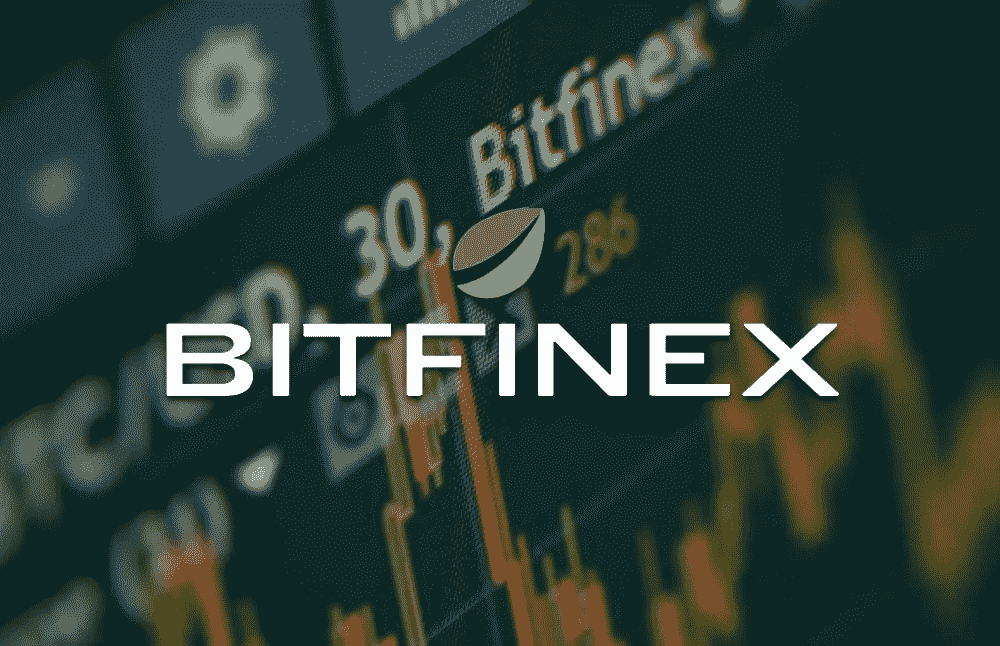
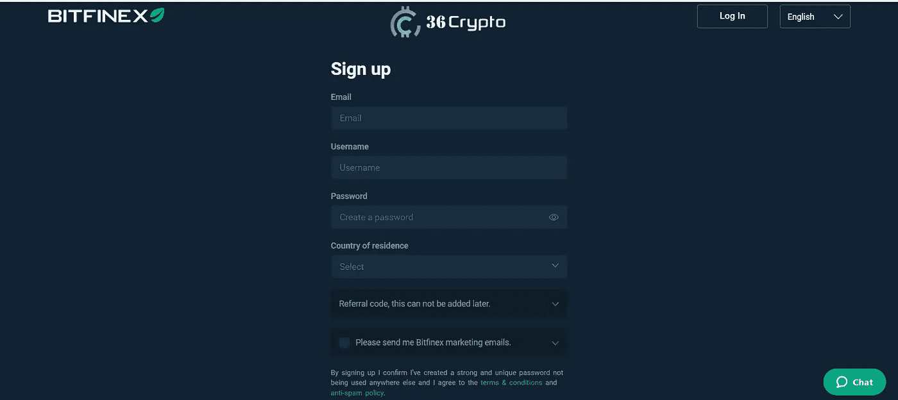

# Bitfinex 评论 2022

> 原文：<https://medium.com/coinmonks/bitfinex-review-2022-d85a09e5e66e?source=collection_archive---------24----------------------->

在这篇文章中，我将对 Bitfinex 进行深入的回顾，它是 2022 年可用的顶级加密货币交易平台之一。

Bitfiniex 是一家由 iFinex Inc .拥有和运营的[加密货币交易所](https://36crypto.com/what-is-a-cryptocurrency-exchange/)，该公司在英属维尔京群岛注册。这不是一个非常适合初学者的平台，但它被交易者广泛用于进行分析或进行保证金交易。

它于 2012 年在香港成立，并一直保持着行业领先品牌的地位。当然，这并没有带来丑闻。Bitfinex 以前因为错误的原因出现在新闻中。在几起事件中，客户的资金被盗或丢失。

自黑客入侵以来，他们加强了安全措施，用户损失的资金也得到了补偿。Bitfinex 在超过 52 个国家开展业务，它支持法定加密和加密加密交易。它有易于导航的仪表板和菜单。

根据 [CoinMarketCap](https://coinmarketcap.com/exchanges/bitfinex/) 的数据，Bitfinex 在全球交易量最大的加密交易所中排名第九。

# Bitfinex 提供的加密货币列表

Bitfinex 支持 170 多种不同的加密货币，以下是 Bitfinex 交易平台上可用的一些顶级加密货币:

*   [比特币](https://36crypto.com/what-is-bitcoin-and-why-is-it-valuable/)
*   [以太坊](https://36crypto.com/what-is-ethereum-and-how-is-it-different-from-bitcoin/)
*   涟漪
*   比特币现金
*   莱特币
*   比特币黄金
*   创
*   莫内罗
*   新的
*   黎明的女神

Bitfinex 在移动和桌面上都可用。移动应用程序完全适应 Bitfinex 平台的功能。

# 一些 Bitfinex 功能

以下是 Bitfinex 上的一些功能，会让你想使用它们:

*   **用信用卡/借记卡购买加密货币的能力** : Bitfinex 让交易者可以很容易地用信用卡或借记卡购买加密货币。他们使用 OWNR 和 Mercuryo——第三方支付处理器。
*   **保证金融资**:这是一个点对点市场，允许用户将资金借给其他用户，并通过杠杆交易赚取利息。
*   **保证金交易**:这是利用从保证金融资中获得的资金，以高达 10 倍的杠杆进行交易。
*   **OTC 柜台**:这是一种**场外**交易，Bitfinex 允许用户之间直接交易。
*   **兑换交易**:用户可以存入、提取或交易数字代币。

# Bitfinex 交易体验

虽然 Bitfinex 上的交易对初学者来说不是很友好，但它非常用户友好，有很好的用户界面，有经验的交易者会喜欢使用这个平台。你可以从使用一个免费的交易账户开始，在你开始用真钱投资之前，你可以在那里测试你的策略。

您可以快速购买和出售受支持的加密货币。如果你是活跃交易的新手，建议从移动应用开始，因为那里也有很多专家级的工具。

# Bitfinex 费用

Bitfinex 有一个非常好的费用结构，这使它成为该平台的一个标准特性。这些费用根据交易的密码数量以及用户是进行新的交易还是进行现有交易而变化。

如果用户的帐户中有 LEO 令牌，他们可以节省费用。LEO 令牌是 iFinex 生态系统核心的实用令牌，在 Bitfinex 上用作降低交易和交易费用的一种方式。

如果您的帐户中有相当于 1 美元的 LEO token，您可以获得高达 15%的承购费，如果您的帐户中至少有 5，000 美元的 LEO token，您可以获得高达 25 美元的承购费以及 10 美元的菲亚特交易折扣。当你有 10，000 美元或更多的狮子座代币时，你也可以获得更大的百分比。

# 安全性

正如我们之前所说的，Bitfinex 已经被黑客攻击了两次，用户的几笔资金被盗，但他们的资金损失得到了补偿。

自从黑客入侵以来，他们已经提高了安全性。他们利用双因素身份认证以及用于连接第三方服务的高级 API，还利用客户资产的冷存储。

此外，Bitfinex 使用了针对 DDoS 的保护，定期更新其软件，每天自动备份他们的数据库，还将客户的资金存储在冷库中。

# 客户服务

Bitfinex 在出现问题时不提供即时帮助，他们通过邮件提供帮助支持，还有一个更新的常见问题和帮助部分，您可以在那里获得大多数问题的答案。

# 客户评论

根据 [Trustpilot](https://www.trustpilot.com/review/www.bitfinex.com) 的说法，Bitfinex 的五星评级为 3.2 分。48%的评论是“优秀”，35%的评论是“差”。

大多数正面评价都集中在平台、良好的用户界面以及自动化交易结构上。大多数负面评论都与客户支持和延迟取款有关。

# 受支持的国家

Bitfinex 在全球超过 52 个国家可用。他们的服务面向大多数国家，除了:

*   孟加拉国
*   玻利维亚
*   厄瓜多尔
*   吉尔吉斯斯坦

由于美国的一些监管问题，Bitfinex 也停止了在美国的服务。

# 开立 Bitfinex 账户

就像每一个其他的[加密交易所](https://36crypto.com/what-is-a-cryptocurrency-exchange/)一样，在你开始使用 Bitfinex 之前，你必须开一个账户，这是一个简单的过程。

如果您不在上面列出的国家之列，您必须通过提供电子邮件并创建用户名和密码来注册。作为 KYC(了解你的客户)要求的一部分，他们还将要求提供个人信息。

你需要提供两个政府颁发的身份证，并分享一张自拍照，以确保你的身份与你提供的身份证相符。

[**在这里开一个 BITFINEX 账户**](https://www.bitfinex.com/)

# 结论

Bitfinex 创建于 2012 年，自那以来已成为业内知名企业之一。他们被黑了两次(2015 年和 2016 年)。2016 年的黑客攻击被称为世纪大盗，黑客带走了超过 12 万比特币(按当前价格计算价值 45 亿美元)。

他们能够补偿因黑客攻击而损失资金的用户。根据我们的评论，Bitfinex 是一个非常用户友好的平台，尽管不是非常初学者友好。该交易所在全球超过 52 个国家/地区提供服务，但不包括美国。

总的来说，客户的评价高于平均水平，如果你愿意通过使用这个平台来赌一把，你可能会从整体上享受这种体验。他们的费用相当不错，当你的账户里有狮子座令牌时，你可以从你的交易中获得一定的百分比。

***免责声明*** *:本文所表达的观点仅代表作者本人，绝不是 36crypto 的建议。在选择与任何平台进行交易之前，我们总是建议您做好尽职调查并进行研究。你如何处理这些信息完全是你自己的决定。*

最初发布于 [36crypto](https://36crypto.com/bitfinex-review-2022/)

> 加入 Coinmonks [电报频道](https://t.me/coincodecap)和 [Youtube 频道](https://www.youtube.com/c/coinmonks/videos)了解加密交易和投资

# 另外，阅读

*   [瓦济里克斯 NFT 评论](https://coincodecap.com/wazirx-nft-review) | [比茨盖普 vs 皮奥克斯](https://coincodecap.com/bitsgap-vs-pionex) | [坦吉姆评论](https://coincodecap.com/tangem-wallet-review)
*   [如何使用 Solidity 在以太坊上创建 DApp？](https://coincodecap.com/create-a-dapp-on-ethereum-using-solidity)
*   [密码交易机器人](/coinmonks/crypto-trading-bot-c2ffce8acb2a) | [OKEx vs 币安](https://coincodecap.com/okex-vs-binance)
*   [币安 vs FTX](https://coincodecap.com/binance-vs-ftx) | [最佳(SOL)索拉纳钱包](https://coincodecap.com/solana-wallets)
*   [如何在 Uniswap 上交换加密？](https://coincodecap.com/swap-crypto-on-uniswap) | [A-Ads 审查](https://coincodecap.com/a-ads-review)