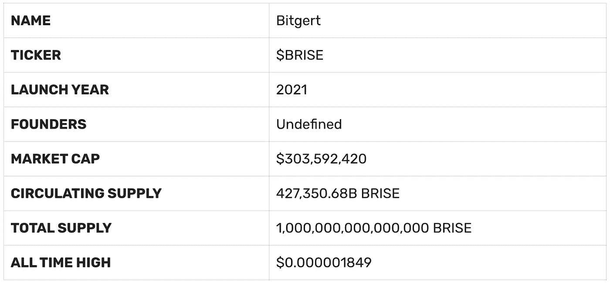

# bitgert(BRISE)price 预测:看涨趋势会持续吗？

> 原文：<https://medium.com/coinmonks/bitgert-brise-prise-prediction-will-the-bullish-trend-continue-65506c0b71e?source=collection_archive---------11----------------------->

尽管自 2022 年夏季开始以来，市场经历了一个秘密的冬天，但这一年见证了许多区块链项目的革命。加密的大规模采用似乎越来越深入——在撰写本文时，市场上存在超过 10，0 00 种加密货币，可被视为投资的资产范围非常广泛。区块链今年的一个重要项目是 Bitgert T1，它在 6 月初上涨了 50%以上。

虽然加密货币项目出现、发展或崩溃，但总有一些项目占据有利位置。Bigert 生态系统定期补充新的项目和产品，使 Bitgert 成为发展最快的区块链之一，并推动其技术的大规模采用。

一些专家声称，在可预见的未来，Brise 可能会飙升 10х，自然，一些人表达了更悲观的态度。在这篇文章中，我们将解释 Bitgert 的性质和它的令牌 BRISE，并组成了 BRISE 未来价格的分析。请继续阅读，了解 Bitgert 对 2022 年及以后的价格预测。

# 比特格特是什么？

Bitgert 是一个网络，或者更好地说，是一个生态系统，它正在建设一个超高速的区块链。每秒处理 100，000 笔交易(TPS)总部位于币安的区块链以拥有区块链市场最快的解决方案而自豪。今年推出的 Bitgert mainnet 旨在解决当前区块链系统中的可扩展性和成本节约问题。

**比特格特的核心特征包括:**

*   延迟时间短的几乎零成本网络；
*   通过分片技术实现高吞吐量；
*   智能合同支持；
*   基于授权证明的共识机制(PoA)。

Bitgert 在一年多前(2021 年 7 月)推出，在速度和安全性方面已经超过了大多数受欢迎的连锁店。这不是一个空洞的说法——当与一些主要的生态系统，如以太坊(速度为 15 TPS)或索拉纳(50，000 TPS)相比时，Bitgert network 在时间上胜出，也提供接近零的交易费用(低至 0，000，000，001 美元)。

这些优势使得 Bitget 区块链的受欢迎程度显著提高，使其领先于许多大型加密货币项目，并有机会吸引越来越多的用户和开发者进入其网络。在推出后不到 400 天的时间里，Bitgert 推出了其交易所的测试版，推出了自己的区块链，并宣布与 Sphynx labs(商业、农业、赌博和占有的一体化解决方案)和 omni another(元宇宙的纪念碑)、Twin 4D 地图(地理参考数字 twin data)和 innovative plastics(回收)等公司达成协议。2022 年，区块链的项目包括 DeFi、NFT、Web 3，还包括一个 BRISE 钱包，可用于 iOS 和 Android 设备(支持 BRC20 / ERC20 / BEP20 令牌)。

# 什么是 BRISE Token？

[BRISE](https://swapzone.io/currencies/bitgert) 是 Bitgert 区块链的原生 BEP-20 令牌，作为平台的公用币，也是 BRISE 钱包内的点对点支付方式。然而，Bitgert 的创始人声称，这种代币有一个更大的目标——作为一个全球公用事业支付系统。

BRISE coins 的总供应量是一千万亿个硬币，它允许大量的用户和交易，而不会降低网络速度。撰写本文时的流通供应量为 427，350.68B BRISE。BRISE 的流动性持续改善。你可以在这里查看最新的流动性统计。

BRISE 可能是一个有利可图的硬币——代币持有者可以获得合同中存储的回购税的 5%。这就是比特币价格和价值增长的原因之一——回报机会增加了其需求。

# BRISE 令牌技术分析

至于根据[coin Index](https://coincodex.com/crypto/bitrise-token/price-prediction/)技术指标撰写的时间，一般的 Bitgert 价格预测情绪是看涨，而恐惧&贪婪指数显示为 41(恐惧)。

BRISE 的交易价格为 0.0000007108 美元，但专家们使用他们对 2022 年 Bitgert 价格的预测来预测该令牌的积极年份。Brise 在加密市场上被标记为 2718，市值为 303，592，420 美元，根据 [CoinMarketCap](https://coinmarketcap.com/currencies/bitrise-token/) 的数据，在撰写本文时，一周内上涨了+215%。

## 比特格特会崩溃吗？

正如我们在下面看到的，分析机构大多同意一种说法，即比特币将保持上涨趋势——截至 2022 年 8 月，两家分析机构都没有估计比特币会崩溃或大幅贬值。加密货币专家和人工智能分析系统预计 BRISE token 的价格将在多年内成功增长，Bitgert 生态系统将会发展壮大。

# 2022 年英国房价预测

在撰写本文时，BRISE coin 显示自 2022 年初以来增长了 44%。CoinDex 的分析预测短期价格会进一步上涨——在 2022 年 9 月 14 日达到 T2 0.000001325 T3。

另一方面，[华尔街投资者](https://walletinvestor.com/forecast/bitgert-prediction-data)的行业分析预计，token 在未来三个月内将下跌 25.3%。然而，资源声明令牌是稳定的，在可预见的将来不会崩溃。

# 2023 年英国房价预测

据 WalletInvestor 称，一年之内，比特币的价格可以从 0.000000684 美元涨到 0.000001 美元。 [DigitalCoinPrice](https://digitalcoinprice.com/forecast/bitrise-token) 还预计 2023 年 BRISE token 的交易均价为 0.00000101 美元。

# 2025 年 Brise 价格预测

到 2025 年底根据 [AMBCrypto](https://ambcrypto.com/predictions/bitrise-token-price-prediction-2025) 的分析，Bitgert 的价格应该在 0.0000021 美元到 0.0000024 美元之间，BRISE 的平均价格应该在 **$0.0000022** 左右。

# 2027 年英国房价预测

WalletInvestor 认为 2027 年的 Bitgert (BRISE)价格为 **0.00000149** 美元，力争超过+100%。根据 GovCapital 预测系统预测，五年后代币的平均价格为 0.000002 美元。

[价格预测](https://priceprediction.net/en/price-prediction/bitgert)对 BRISE 价格预测更加乐观，并指出 Bitgert 价格值可能达到最高 0.00000354 美元，平均交易值为**0.00000308 美元**。

# 2030 年 Brise 价格预测

专家认为，根据 DigitalCoinPrice 的说法，代币将继续呈现上涨趋势，并可能获得高达 0.00000335 美元的价值。然而，重要的是要记住，任何自动预测都可能是错误的，并且永远不能代替你自己的研究。

PricePrediction 预计 BRISE 将在 2030 年达到最小值**0.00000911 美元**，宣布最大可能值达到**0.00001140 美元**。

# 摘要

Bitgert 自 2021 年推出以来取得了非凡的成功，BRISE token 也获得了 100 英镑的价值。然而，BRISE 价格预测似乎是积极的，然而，几乎没有历史数据，所以当你承诺长期 Bitgert 价格预测时，你应该小心。

今年对令牌的期望非常高，因为 BItgert 链的更新应该会使它在今年表现良好。然而，虽然性能预计将进一步高于平均水平，代币的旅程到 1 美元仍然是一个遥远的未来。

> 交易新手？尝试[加密交易机器人](/coinmonks/crypto-trading-bot-c2ffce8acb2a)或[复制交易](/coinmonks/top-10-crypto-copy-trading-platforms-for-beginners-d0c37c7d698c)