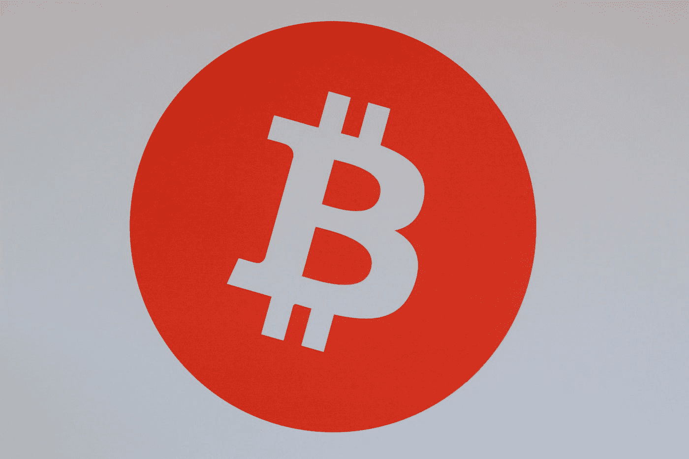

# 美国黑人视加密为致富之路

> 原文：<https://medium.com/coinmonks/black-americans-saw-crypto-as-a-path-to-wealth-9ce97e23d042?source=collection_archive---------52----------------------->

近年来，许多美国黑人投资了加密货币，这使他们在过去一年 crypto 的衰落中变得脆弱。缩小财富差距是一些黑人投资者首先转向加密的原因之一。鉴于许多美国黑人对加密技术的了解，以及许多人起步较晚——以比同龄人更高的价格投资——这一事实，这些投资者已经…