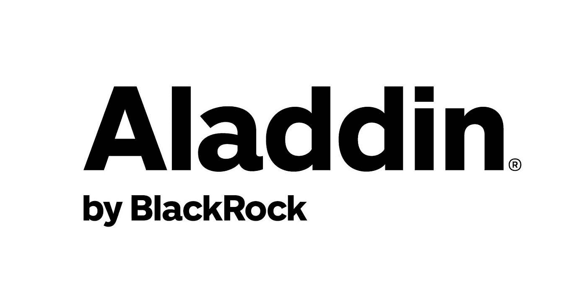
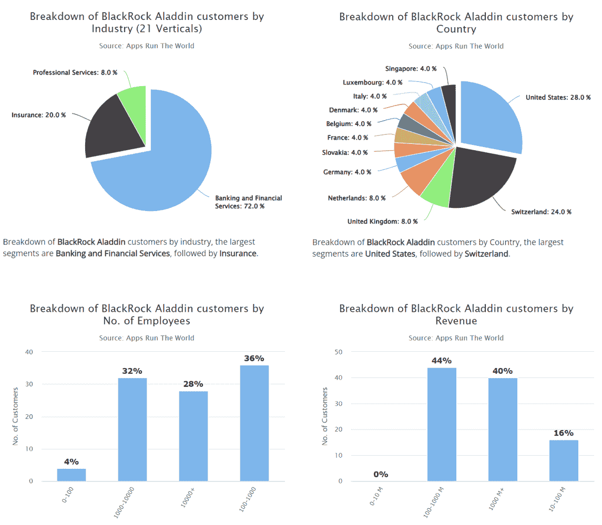
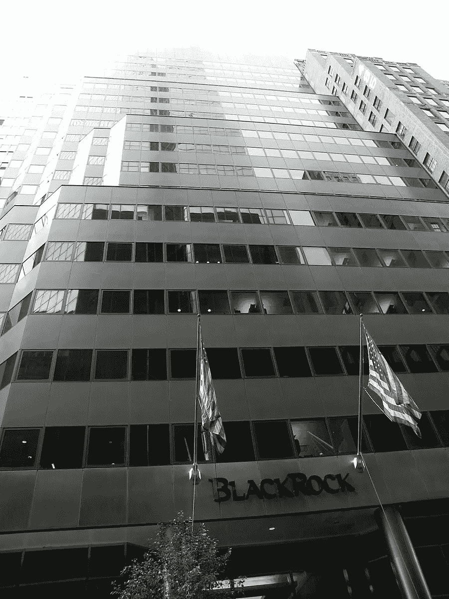
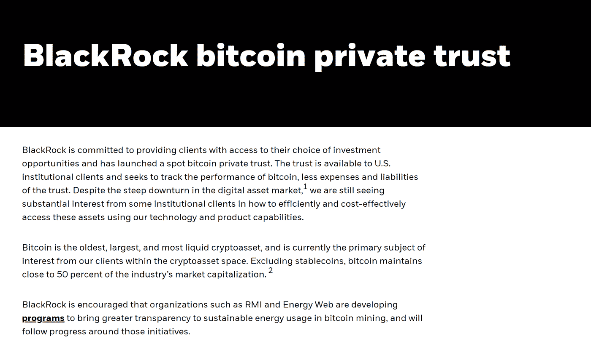
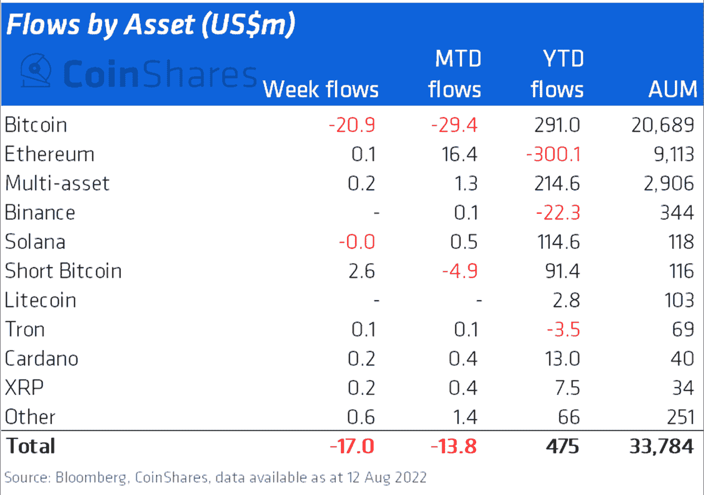
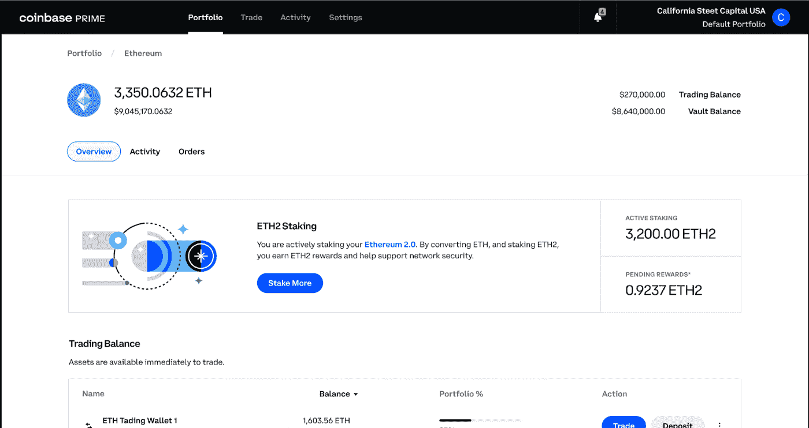

# 贝莱德和比特币

> 原文：<https://medium.com/coinmonks/blackrock-bitcoin-37ce1d47a4ab?source=collection_archive---------2----------------------->

ledgerinsights.com

# 介绍

世界上最大的资产管理公司贝莱德在 8 月 4 日正式宣布，它已经与比特币基地合作，为其机构客户提供加密货币。

贝莱德的客户将可以使用比特币基地 Prime 进行加密交易、托管、大宗经纪和报告。这将最初仅限于比特币。

本文将专注于合作的细节、其意义以及它对比特币等加密货币的未来采用意味着什么。

# 概述

这一合作将为贝莱德端到端投资管理平台 Aladdin 的机构客户提供通过与比特币基地 Prime 的连接直接进行加密交易的机会。

贝莱德战略生态系统合作伙伴关系全球负责人约瑟夫·查罗姆(Joseph Chalom)在发布会上表示，“与阿拉丁的这种连接将允许客户在其现有的投资组合管理和交易工作流程中直接管理他们的比特币敞口，以获得跨资产类别风险的整体投资组合视图。”

最终，它将连接两个系统，为机构加密的采用创造新的接入点。贝莱德和比特币基地将继续推进平台整合，并将分阶段向感兴趣的客户推出相关功能。

# 贝莱德和阿拉丁

贝莱德是全球最大的投资管理公司，管理着 10 万亿美元的资产。它是一个行业领导者，在 DC 华盛顿已经成为一个越来越有影响力的华尔街玩家。贝莱德的业务遍及全球，在 30 个国家设有 70 个办事处，客户遍布 100 个国家。为了充分理解贝莱德与比特币基地在比特币和加密货币方面的合作意义，我们必须首先深入研究，确定贝莱德真正拥有多少权力。

## 理解阿拉丁

Blackrock.com

Aladdin(资产、负债和债务及衍生品投资网络)是一个综合性的投资管理和交易平台，由 BlackRock solutions 于 1988 年建立。

Aladdin 最初是为管理贝莱德的资产而设计的，1999 年向贝莱德的客户开放，允许他们每天管理自己的投资。

据英国《金融时报》报道，阿拉丁管理着至少 21.6 万亿美元的全球资产，帮助 55，000 名投资专业人士分析和跟踪投资组合以及管理风险。尽管贝莱德仍然是阿拉丁的最大用户，但它仍然是广泛用于资金管理行业及其他领域的巨头。

谁是阿拉丁的顾客？

Apps Run the World

使用贝莱德的 Aladdin 进行投资组合和投资管理的公司包括世界上最大的基金管理公司，如 Vanguard、State Street 和瑞士瑞信银行，世界十大保险公司中的一半，如 MetLife、AXA 和 Swiss Re，超过 170 家养老基金，包括日本 1.5 万亿美元的养老基金，汇丰银行、桑坦德银行和瑞银集团等银行，捐赠基金，以及世界上最大的上市公司，如苹果、微软和谷歌。所有这些公司都依赖该系统来管理其公司国债投资组合中的数千亿美元。

对许多人来说，贝莱德的专有软件已经变得不可或缺。管理着 2380 亿美元资产的纽约人寿投资公司首席执行官安东尼·马洛伊告诉《福布斯》杂志，“阿拉丁就像氧气。没有它，我们就无法运作。”

根据贝莱德的一份新闻声明，该协议将允许其客户跟踪其加密资产以及其投资组合的其余部分。

## 了解贝莱德

commons.wikimedia.org — americasroof

**担任政府职务的前贝莱德高管**

贝莱德不仅是世界上最大的资金管理公司，也是影响政治决策的金融巨兽。多年来，该公司聘请了著名的政策制定者，至少有三名前贝莱德高管目前在总统乔·拜登(Joe Biden)的内阁中担任重要职务。

贝莱德首席执行官拉里·芬克的前幕僚长阿德瓦勒·阿德耶莫(Adewale Adeyemo)是财政部的高级官员，贝莱德前投资高管布莱恩·迪斯(Brian Deese)领导拜登的国家经济委员会，贝莱德前全球首席投资策略师迈克尔·派尔(Michael Pyle)是副总统卡玛拉·哈里斯的首席经济顾问。

**在贝莱德担任高级管理职位的前政府官员**

反之亦然，贝莱德聘用了许多著名的前政策制定者、监管者和高级政客。托马斯·多尼隆现在是这家资产管理公司研究部门的主席，此前曾担任奥巴马的国家安全顾问。Dalia Blass 是 SEC 的一名长期前官员，最近负责 SEC 的投资管理部门，于 2021 年 6 月加入贝莱德，负责对外事务。根据英国国会议员利益登记册(register of MPs ' interests ),英国前政治家、英国财政大臣乔治奥斯本(George Osbourne)在贝莱德(BlackRock)担任研究部门投资研究所(Investment Institute)的高级顾问，年薪 65 万英镑。

**援美联储**

Wikimedia.commons

贝莱德 FMA 咨询分公司在美国政府的 COVID 反应中发挥了关键作用。FMA 被美联储选中管理一项紧急资产购买计划，据《华尔街日报》报道，没有其他资产管理公司可以竞标这项工作。

这不是美联储第一次将重大危机管理委托给贝莱德的 FMA 子公司。在 2007-2009 年全球金融危机期间，美联储要求贝莱德的 FMA 部门处理贝尔斯登和美国国际集团的资产，这两家公司都濒临倒闭。

**首席执行官——拉里·芬克**

拉里·芬克是金融界最有权势的人物之一。这位 69 岁的前证券交易员共同创立并仍在运营全球最大的资金管理公司贝莱德(BlackRock)，或彭博最近称之为“政府的第四分支”，效仿拉里·芬克处理冠状病毒危机的角色。

如今，通过一系列政府合同，拉里·芬克通过贝莱德实际上已经成为美国政府救助美国经济的主要管理者。贝莱德在秘密程序中未经竞标就获得重要合同的事实，也引起了国会的关注，并引发了对芬克与政府高级官员长期接触的质疑。

# 理解贝莱德和比特币之间的关系

CNBC, Financial News, Forbes

一开始并不顺利。最初，贝莱德对比特币毫无兴趣，并公开反对。2017 年 10 月 13 日，拉里·芬克在国际金融研究所会议上将比特币称为洗钱指数，称“比特币只是向你展示了世界上对洗钱的需求有多大。仅此而已。”

当时，贝莱德和拉里·芬克认为比特币和加密货币是浪费时间。然而，在接下来的几年里，这一观点稳步转变。

【2019 年 4 月，贝莱德聘请了 Ripple 前产品营销人员 Robert Mitchnick，他现在是贝莱德分布式账本技术和数字资产的负责人。

【2021 年 1 月，贝莱德向美国证券交易委员会提交文件，显示其希望将现金结算的比特币期货纳入旗下两只基金的合格投资。

【2021 年 6 月，美国证券交易委员会(SEC)文件显示，贝莱德(BlackRock)已持有两家比特币矿商的大量股份，马拉松数字控股公司(Marathon Digital Holdings)6.71%，Riot block chain 6.61%。两家矿商之间的资本承诺总额为 3.829 亿美元。在提交申请的前几天，拉里·芬克在彭博接受采访时表示，比特币可能会成为一种价值储存手段，但必须证明自己。

【2022 年 4 月，贝莱德推出 iShares Blockchain and Tech ETF，旨在跟踪一个指数的投资结果，该指数由参与区块链和加密技术开发、创新和利用的美国和非美国公司组成。

【2022 年 8 月，贝莱德与比特币基地合作，为机构客户提供比特币。这种合作关系将允许该公司的机构客户使用加密交易。虽然这仅限于比特币，但未来可能会增加更多的加密资产。

## **贝莱德推出私人比特币信托**

除此之外，一周后，贝莱德推出了私人比特币信托。贝莱德的信托可以与灰度的比特币信托相媲美，后者是一种开放式授权人信托，专门投资于比特币。该信托将提供给贝莱德在美国的机构客户。

# 这一切对比特币意味着什么？

这里有两个基本因素在起作用。首先也是最重要的——比特币作为一种资产类别的需求。机构客户的巨大需求迫使贝莱德和拉里·芬克改变了态度，而不是相反。决定与比特币基地合作，并在 2022 年推出私人比特币信托，而不是更早，主要是因为今年对比特币这一资产类别的兴趣激增。

拉里·芬克在 2021 年 4 月接受美国消费者新闻与商业频道采访时的评论进一步证实了这一点，他表示，“我们没有看到全球机构的广泛兴趣，我想说的是，我们所做的大部分都是我们从客户那里听到的反映。”

此外，在一篇关于私人比特币信托的博客文章中，贝莱德表示:“尽管数字资产市场急剧下滑，但我们仍看到一些机构客户的浓厚兴趣。”

Blackrock.com

其次，对于加密资产，尤其是比特币，有可能出现有利的监管清晰度。鉴于拉里·芬克与政府高级官员的密切关系，在美国监管环境下比特币和数字资产的未来没有得到“认可”的情况下，贝莱德会暴露自己和他们的客户，这令人怀疑。

鉴于这些原因，以及贝莱德在业内的突出地位和影响力，其他之前忽视比特币的大型资产管理公司可能会重新考虑并效仿。

# 这对其他加密资产意味着什么？

未来，更多的加密资产可能会通过比特币基地 Prime 添加到阿拉丁平台。然而，并非所有加密货币都是平等的，近年来，某些数字资产引起了机构的兴趣。

机构资本流入加密货币的数据是这方面最强有力的指标。换句话说，跟着钱走。

CoinShares

根据数字资产管理和分析公司 CoinShares 的数据，截至 8 月 12 日，以太坊见证了第二大机构资金流入。除以太坊之外，机构资金还被分配到币安、索拉纳、莱特币、创、卡尔达诺和 XRP。然而，机构对以太坊的投资金额(迄今为止为 91 亿美元)与其他加密资产之间存在显著差异。

此外，鉴于以太坊是第二大加密货币，其备受期待的合并将于 9 月进行，届时它将过渡到股权证明，从而减少 99.95%的能耗，有效地使其成为“绿色”和通缩货币，这可能意味着以太坊的 ETH 将很快提供给贝莱德客户。

这一点尤其重要，因为比特币基地的机构平台比特币基地 Prime 提供了 ETH staking，这是一种通过向基础区块链提供安全形式的有用工作来赚取高达 10%的年被动收入的好方法。根据比特币基地的说法，以太坊是其平台上最重要的资产。

coinbase prime

由于这种合作关系，贝莱德的客户将能够访问该交易所的机构平台比特币基地 Prime，并开始押注以太网。

至于其他加密资产，这是任何人的猜测，但很可能其他数字资产，如索拉纳，币安或卡尔达诺将根据机构对它们的需求而效仿。

# 摘要

总体而言，全球最大的资产管理公司将比特币描述为历史最悠久、规模最大、流动性最高的数字资产，这清楚地表明了该行业的增长规模有多大，并正朝着更传统的华尔街投资组合发展。这一消息将进一步推动其他大型资产管理公司启动或加快它们的加密计划。

鉴于贝莱德的影响力，与比特币基地的合作可能会对立法者施加压力，推动支持创新的监管，这将决定其他主要资产管理公司进入该领域的速度。

最终，随着越来越多的人采用加密技术，需要一个监管框架，全球资产管理公司可能会效仿，向客户提供比特币和其他几种关键的数字资产，以满足机构需求，避免错失良机。

*免责声明:本文包含的信息仅用于教育目的，并不构成 Wheatstones 的任何形式的建议或推荐，用户在做出(或避免做出)任何投资决定时也不打算依赖这些信息。*

> 交易新手？试试[密码交易机器人](/coinmonks/crypto-trading-bot-c2ffce8acb2a)或者[复制交易](/coinmonks/top-10-crypto-copy-trading-platforms-for-beginners-d0c37c7d698c)