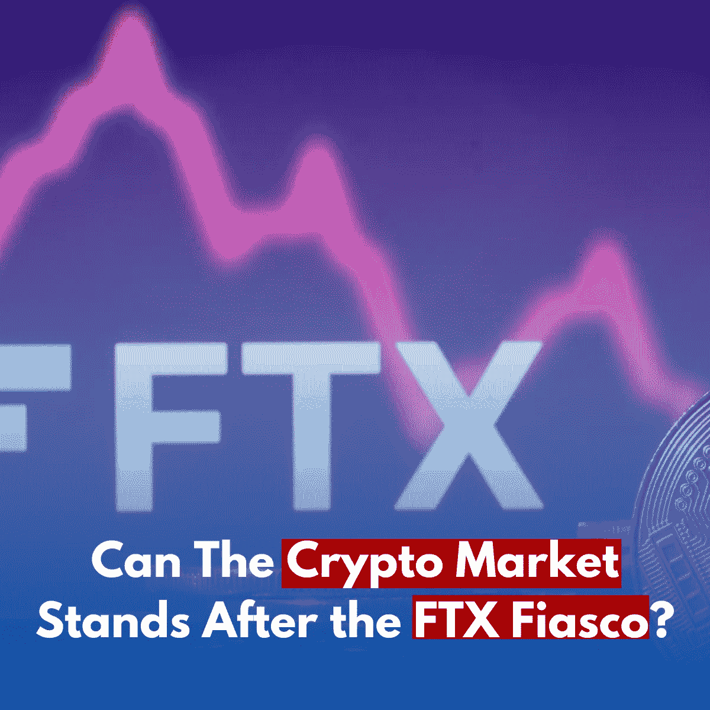
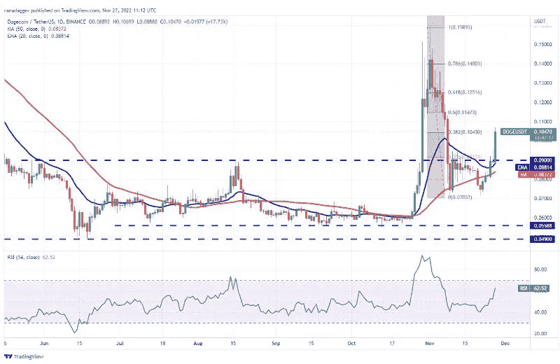
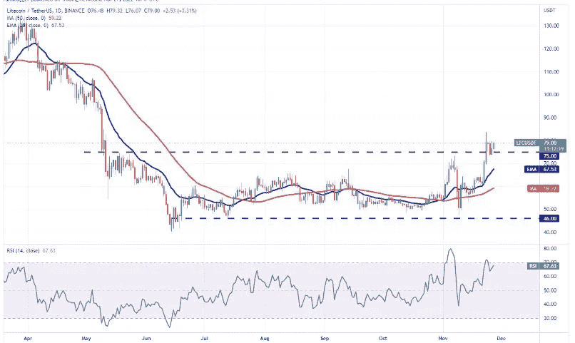
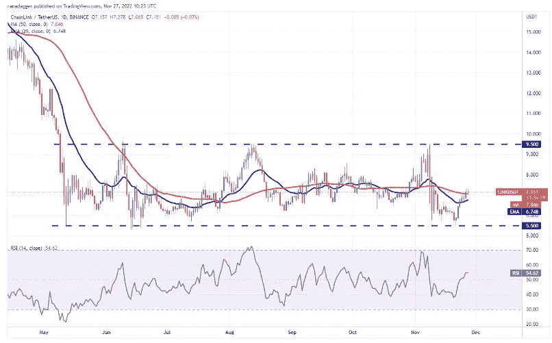
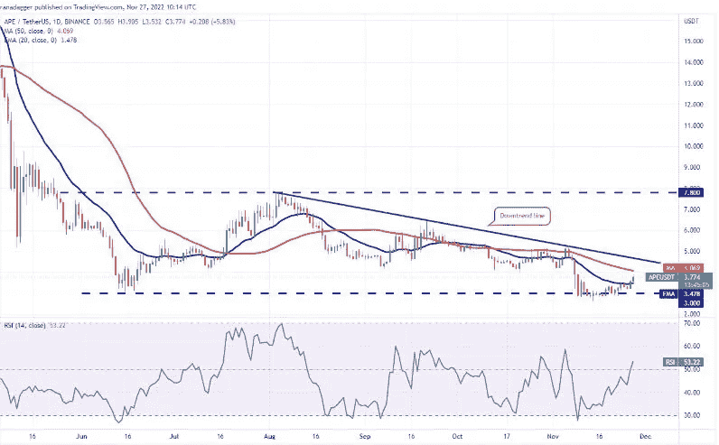

# 在加密的不确定性中塞翁失马，焉知非福&比特币的替代品

> 原文：<https://medium.com/coinmonks/blessings-in-disguise-amid-the-crypto-uncertainty-altcoins-backing-up-for-bitcoin-9db3d825a478?source=collection_archive---------14----------------------->

FTX 的余波不仅仅是报纸上点击诱饵标题背后的灵感。它对密码市场产生了深远的影响。密码交易员现在不得不应对价格行为的不确定性，这意味着他们可能会面临潜在的失败。

然而，我们总是关注的是核心问题和混乱中的一线希望。不要误解我们，我们指出的事实并不是有害的积极。我们仍然看到挑战，但局势并没有走到尽头。不要让悲观情绪淹没我们的精神，让我们找到光明的一面来活跃气氛。

此外，我们为加密交易员和投资者分享了一些很好的替代币参考，以使交易组合多样化，而不是严重依赖比特币。

# 感谢比特币仍然有效

在加密行业的所有危机中，[比特币](https://bit.ly/bitcoinvsethereum)和比特币创造者仍然在工作。在这个过程中，围绕自我监管和新的有用工具进行了许多讨论。此外，比特币的价格维持在 16，000 美元，而公共比特币守护者正在挣扎。比特币稳定的价格水平可以被视为一个显著的亮点。

这是为什么呢？

当事情出错时，你可以看到加密是否有真正的内在力量来抵御*风暴。*比特币价格的稳定让投资者和狂热分子平静下来，因为他们坚信比特币价格会上涨。

# FTX 的失败不完全是 DeFi 的错

DeFi(分散金融)现在似乎是加密市场的双刃剑。事实上，DeFi 使交易者和投资者能够透明地看到整个交易。然而，每当问题发生时，它很容易受到指责，因为没有当局承担责任。

然而，DeFi 并不是 FTX 惨败的原因，这场惨败给许多交易者带来了噩梦。对第三方的信任和名人崇拜的趋势就是如此。

这意味着什么？这意味着协议并没有随着 FTX 的崩溃而被破坏。当加密投资者迄今为止所相信的系统仍然良好时，现在的“情绪低落”只是一个时间问题。如果你有足够强大的财务支持，从短期收益转向长期收益可能是个好主意。

# 熊市中 FTX 的余波

在 FTX 崩溃之前，加密市场已经处于下降趋势。因此，当 FTX 的突破发生时，密码交易员预计会出现新低。为什么是好消息？因为小的加密市场不可能有大的枝蔓。或者，简单地说，传染效应无法达到并瓦解非加密经济。

# 密码行业法规的积极变化

[FTX 破产案](/@libraryoftrader/ftx-the-rise-the-fall-and-the-rebirth-b21c639bdb87)现在是加密市场上最臭名昭著的事件之一。然而，没有在谁是谁的戏剧中八卦和挖掘他们的个人生活，而是有许多关于法规和变化的警告和讨论。

具体来说，客户现在可以获得储备证明，以确保交易所确实持有他们的资金。艰难的时期让事物和人变得更强大，因为他们应该吸取教训。因此，在不久的将来，密码市场将会有更多的变化。

 [## 加密期货和期权:交易者容易犯的 3 个错误

### 错误就像甜蜜的陷阱或有着良好伪装的无害事物。然而，一旦你犯了错误，你…

medium.com](/coinmonks/crypto-futures-and-options-3-mistakes-traders-are-succumb-to-2866c2a03f75) 

# 在加密危机中，你考虑的替代硬币是什么？

# Dogecoin (DOGE)

*The DOGE/USDT Daily Chart — Source: TradingView*

[Dogecoin (DOGE)](http://bit.ly/3XF6vKE) 的买家重整旗鼓，将价格推至 11 月 27 日的 38.2%斐波纳契回撤位 0.10 美元以上。如果价格不低于 0.09 美元，多吉/USDT 对可以获得动力，并向 61.8%斐波纳契回撤水平 0.12 美元反弹。如果这一水平得到加强，该货币对可能处于上升趋势。

同时，如果价格从当前水平下跌，这表明空头继续认为反弹是卖出的机会。如果是这样的话，一对道格/USDT 可能会跌至 0.09 美元。否则，50 天均线 0.08 美元可能会受到挑战。

买家将价格推高到了这个范围之外，这可能会引发上涨趋势。强劲的反弹导致 RSI 进入深度超买水平，表明短期内会出现小幅修正或盘整。

当价格从 38.2%斐波纳契回撤 0.1 美元下跌，但从突破水平反弹时，这是积极情绪和交易者逢低买入的信号。

# 莱特币

*The LTC/USDT daily chart — Source: TradingView*

LTC 的突破超过了 75 美元的顶部阻力，表明潜在的趋势变化。如果多头成功推动价格突破 84 美元的顶部阻力，上涨趋势可能会发生。上涨的 20 日均线 67 美元和超买区附近的 RSI 显示了上行阻力最小的路径。因此，长期资本/USDT 组合可能达到 104 美元的目标。

另一方面，如果价格低于 84 美元，货币对可能会滑向 75 美元的支撑区域。如果这个区域被打破，这对组合可能会移动到 20 日均线。空头必须把价格拉低到这个支撑位以下，才能抓住咄咄逼人的多头。

# 链环(链环)

过去几周，Chainlink 一直在 5.5 美元和 9.5 美元之间来回波动。11 月 21 日在 5.5 美元支撑位的强劲反弹表明多头在这个水平积极买入。

*The LINK/USDT Daily Chart. Source: TradingView*

20 日均线 6.74 美元上涨，RSI 进入正区域，表明多头有一点优势。如果价格维持在 7.15 美元的 50 天均线之上，可能会反弹至 8.5 美元，然后至 9.5 美元。

相反，如果价格低于 20 日均线，这表明空头在高位活跃。然后，林克/USDT 货币对可能再次下跌至 5.5 美元的支撑位，并在此附近盘整几天。

# 猿

*The APE/USDT Daily Chart. Source: TradingView*

[过去几个月，ApeCoin](/coinmonks/bored-ape-nft-why-is-it-expensive-61598dc65185?source=user_profile---------45----------------------------) 的综合价格区间在 3 美元至 7.8 美元之间。空头试图将价格降至支撑区域以下，但无法维持较低水平。这表明强劲的需求处于较低水平。

持续的买盘推动价格高于 11 月 26 日的 20 日均线 3.47 美元，表明多头正在卷土重来。在 50 天均线 4.06 美元处出现了小阻力，但是如果多头清除了障碍，猿/USDT 组合可能会到达下降趋势线。

你如何看待 FTX 案件及其对加密市场的影响？在加密危机中，你对你的交易有什么计划吗？你认为上面的替代硬币对你的利润有潜力吗？在下面的评论里告诉我们吧！

**其他你可能感兴趣的文章有**

 [## 如何度过难熬的密码寒冬？

### 加密市场就像过山车。它用许多巨大的胜利吸引和愉悦人们，尽管他们可能会遭受…

medium.com](/@libraryoftrader/how-to-get-through-the-tough-cryptos-winter-4b047aba4196)  [## 2022 年投资的十大加密货币—第一部分

### 选择一种有利可图的加密货币进行投资反映了你对市场趋势的把握程度以及你的…

medium.com](/coinmonks/top-10-cryptocurrencies-for-your-investment-in-2022-part-i-f5aaa33b3bcf)  [## 2022 年投资的十大加密货币—第二部分

### 在之前的博客中，我们根据对以下领域的研究，向您介绍了 5 种最值得投资的加密货币

medium.com](/coinmonks/top-10-cryptocurrencies-for-your-investment-in-2022-part-ii-da391c6e5d52)  [## 加密期货和期权:交易者容易犯的 3 个错误

### 错误就像甜蜜的陷阱或有着良好伪装的无害事物。然而，一旦你犯了错误，你…

medium.com](/coinmonks/crypto-futures-and-options-3-mistakes-traders-are-succumb-to-2866c2a03f75) 

**您也可以找到我们👇**

*   [交易员库](http://bit.ly/3GQsIiY)
*   [脸书](http://bit.ly/3XyoeTY)
*   [推特](http://bit.ly/3XHQRhK)
*   [领英](http://bit.ly/3ihv3cu)
*   [Reddit](http://bit.ly/3imq76f)
*   [Quora](http://bit.ly/3VcaEUK)
*   [Tiktok](http://bit.ly/3VibUpx)

> 交易新手？尝试[加密交易机器人](/coinmonks/crypto-trading-bot-c2ffce8acb2a)或[复制交易](/coinmonks/top-10-crypto-copy-trading-platforms-for-beginners-d0c37c7d698c)