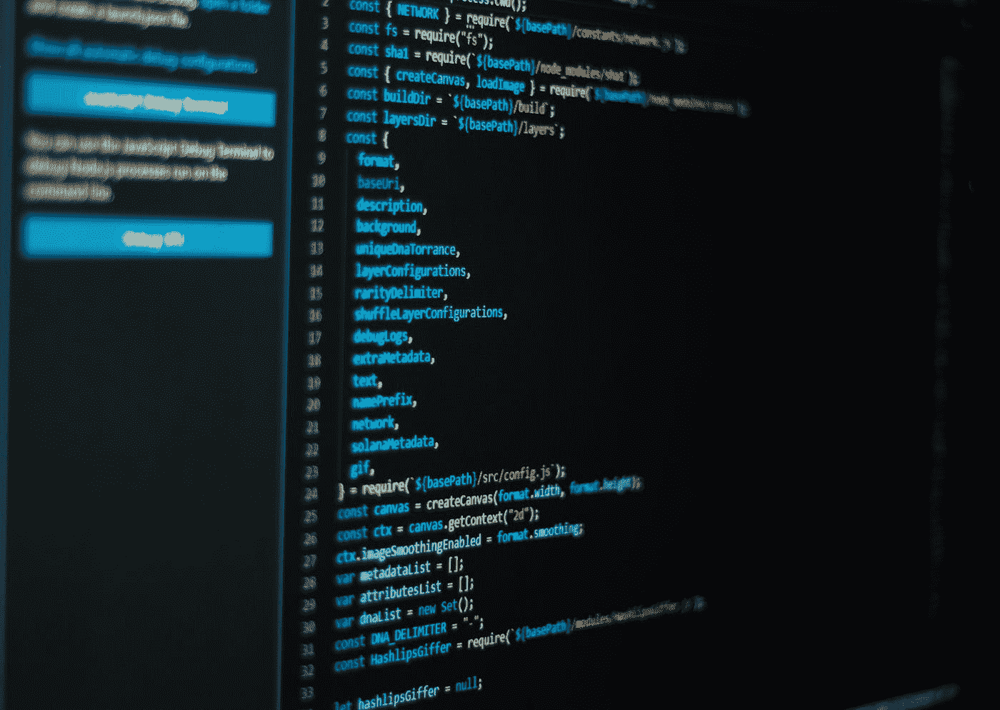

# 区块链 101

> 原文：<https://medium.com/coinmonks/blockchain-101-a4e6bd1c4868?source=collection_archive---------33----------------------->

Photo by [Clint Adair](https://unsplash.com/@clintadair?utm_source=medium&utm_medium=referral) on [Unsplash](https://unsplash.com?utm_source=medium&utm_medium=referral)

动荡的市场环境迫使数字资产价格下跌。供应链问题继续存在，地缘政治不确定性占据主导地位，普京不断提高威胁水平，尽管美联储(美联储)加息，但美国消费者仍面临持续高通胀。9 月份的 CPI(消费者价格指数)报告显示为 8.2%，这迫使美联储继续加息。信贷将会枯竭，借贷变得更加昂贵，资产价格崩溃，经济收缩。

这些普遍的市场条件让投资者感到恐惧，因此，现在仍然是投资者了解什么是数字资产以及它们代表什么的最合适的时机。

加密货币是一种新形式的数字货币。这种新的货币体系将货币的概念从机构、主权发行者和国家中分离出来。这些全球货币是无国界的、分散的和包容的。

Photo by [Rowan Heuvel](https://unsplash.com/@insolitus?utm_source=medium&utm_medium=referral) on [Unsplash](https://unsplash.com?utm_source=medium&utm_medium=referral)

本文概述了这种新货币及其应用的两个关键特征:区块链和智能合约。

**区块链**

纵观历史，中央集权的实体负责记录保存。记录保存要求有一个拥有发布和验证信息权力的实体。然而，这允许单个实体改变历史。例如，在量化宽松政策下，美联储向系统注入了以前不存在的资金。历史的记录被改变了。

加密货币通过使用分布式账本消除了对中央权威机构的需求；每个人都有记录。建立在分权理念基础上的货币体系。

这种由所有人共享的开放分类帐具有四个关键属性:

对等网络——所有节点都享有同等特权的网络

密码术——允许消息的验证和真实性的证明，即使有坏人

共识算法——向记录中添加数据的一组约定规则

惩罚与奖励——遵守规则必须符合人们的最大利益

这些公共区块链对所有人开放，抵制审查，并且没有单点故障。区块链技术是遗留金融系统中固有的集中化问题的解决方案。

Photo by [Emmanuel Edward](https://unsplash.com/@tbonz?utm_source=medium&utm_medium=referral) on [Unsplash](https://unsplash.com?utm_source=medium&utm_medium=referral)

**智能合约**

智能合约是可以自动执行并以完全确定的方式运行的代码片段。分散金融(DeFi)非常依赖智能合约，它们是分散应用(DApps)的基本构件。DeFi 向全球参与者提供无需许可的金融服务，并允许代理商以完全自主的方式使用他们的资金。

智能合约在区块链上存储和执行，使它们变得不可信和安全。他们可以发送、接收和存储资金。他们甚至能够与其他智能合约进行交互。它们通过 if-then 逻辑消除了决策过程中的人为错误。这些条件语句是确定性的，不允许有随机性。它们总是从给定的起始条件或初始状态产生相同的输出。

Photo by [CHUTTERSNAP](https://unsplash.com/@chuttersnap?utm_source=medium&utm_medium=referral) on [Unsplash](https://unsplash.com?utm_source=medium&utm_medium=referral)

**加密货币**

这些数字资产是货币领域的最新创新——人类最古老的技术——并允许以一种前所未有的方式使用货币。潜在的区块链和智能合约技术将允许人类有史以来建造的任何工具中最快速的经济服务扩散。

数字资产的核心是一个由代码管理的替代金融系统，它有一套硬性规则，迫使代理人以更负责任的方式行事。法定货币的供应量不断扩大。非民选官员决定了这一扩张速度，并通过这些政策不断让货币贬值。通过侵蚀人们的储蓄，他们实质上是在窃取人们的时间。可以在教会和国家的分离之间进行类比，加密货币促进了金钱和国家的分离。

Photo by [Shubham Dhage](https://unsplash.com/@theshubhamdhage?utm_source=medium&utm_medium=referral) on [Unsplash](https://unsplash.com?utm_source=medium&utm_medium=referral)

**结论**

数字资产是一种替代的金融系统。在这种情况下，个人仍然完全控制自己的资产，并可以以他们认为合适的任何方式使用它们。代理可以决定是否要使用它们的第一个选择加入货币；菲亚特的使用是通过暴力和胁迫的威胁得到授权的。

数字资产将自由的核心理念与货币融为一体，正处于重塑世界的边缘。

欢迎数字复兴。

> 交易新手？试试[密码交易机器人](/coinmonks/crypto-trading-bot-c2ffce8acb2a)或[复制交易](/coinmonks/top-10-crypto-copy-trading-platforms-for-beginners-d0c37c7d698c)