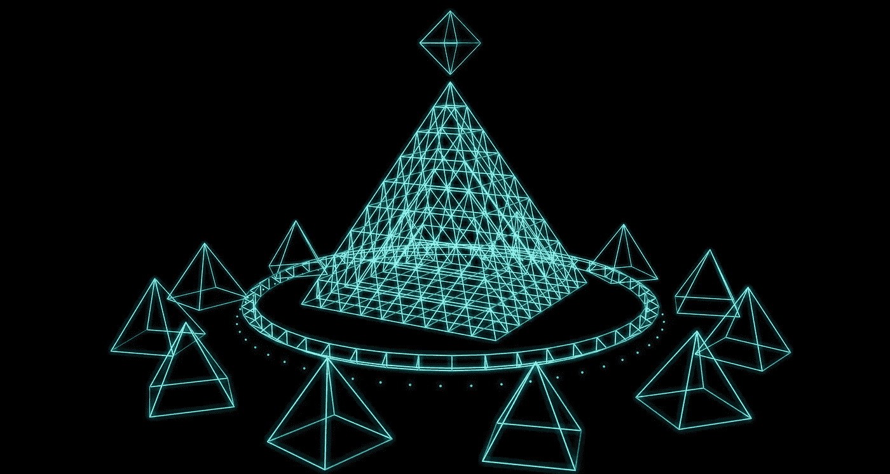

# 区块链 101:Dao 是什么？

> 原文：<https://medium.com/coinmonks/blockchain-101-what-are-daos-fe967569887d?source=collection_archive---------42----------------------->

作为我们博客系列的一部分，我们热衷于确保我们讨论的内容清晰明了，我们将简要探索这个不断发展的行业中使用的一些领域和短语。我们也热衷于突出我们最感兴趣的领域，因此有了这篇文章。所以我们的第一条区块链来了:101 块:*Dao 是什么？*

# 定义 Dao

分散自治组织(Dao)是具有特定利益和目的的自组织团体，其独特的主张是由*而不是*一个人负责，组织内的每个人都参与其治理和指导。

# 分权自治组织如何运作

Dao 由共识管理，所有决策都通过投票做出。Dao 可以有任何目的，从社会联系、集体投资某项资产或资产类别、为某项事业筹款、体育和粉丝俱乐部；你说吧。关键是要有一个公平的、平衡的、非等级的结构来指导一个以去中心化价值观为核心的组织。

该模型的 DAO 版本将支持这些活动，同时允许投票和讨论的链上完全透明，以及由阶层管理和进行的所有支付。在这里，任何阶层成员都可以有效地提出优先事项。

Dao 是一种社交网络，用户的共识控制着社区的机制。DAO 是智能契约，它定义了所有 DAO 资产的用户交互和支付规则(以及其他内容)。道还可以有效地为社会事业或俱乐部筹集和管理资金。智能合同提供的完全透明性使所有捐助方能够清楚地看到和理解"一体行动"的活动，确保资金得到适当使用，并确保所有成员在使用这些资金方面都有发言权。

同样，如果 DAO 持有任何多余或未使用的资金，则可以通过一个简单的过程来“撤销”捐赠并返还捐赠者的资金。

# 分权自治组织和区块链

以区块链技术为核心的 Dao 比任何其他支持集团计划的平台都有相当大的优势。在区块链环境中，用户隐私可以通过内置的无摩擦货币进行精细控制。该功能允许组织或个人在其成员团体内创建企业或筹款。

DAOs 的潜力是巨大的。Daos 将与成员进行有意义的互动，包括分散的金融系统。成员可以就与平台发展、隐私、安全和数据所有权相关的决策进行投票 DAO 将认可您在所有这些方面的声誉。

# 区块链去中心化治理

我们最喜欢的三个词。最近在*连线杂志*上的一篇文章提出了一个有趣的问题，关于 web3 去中心化的争论是否聚焦在了错误的问题上。也就是说，专注于权力下放的程度——而不是类型——很可能会把我们引入歧途。

这句话强调了为什么 Dao 是社区、会员和其他事物的未来:

> “我们认为，权力下放的价值在于真正赋予人们在其社会背景下采取果断行动的能力，同时提供必要的跨背景协调机制。这与当前的技术格局形成了鲜明对比，在当前的技术格局中，信息、计算、审核等方面的决策机构越来越多地掌握在离相关团体“很远”的当局手中。例如，平台内容审核流程试图跨社区和跨文化，但在这两方面都很失败。在这种情况下，决策脱离了应用程序的环境，由与这些事情没有直接利益关系的人做出，这些人就不能利用丰富的分布式信息。”

# Dao 的类型

**发展道道。**区块链币持有者参与区块链战略和结构的全面治理。波尔卡多特和草间弥生是很好的例子，所有 dot 或 KSM 的持有者都可以为连锁店的决策投票。DAO 结构还支持分散 Polkadot 国库基金，支持网络营销和开发项目，并将进一步的控制权交给所有成员。

**投资道。**团体筹集资金购买资产。宪法道是一个很好的例子，因为他们的目标是尝试购买美国宪法的原始实体副本。他们筹集了 4700 万美元，尽管在拍卖中出价高于对手，但这展示了 DAO 在共享所有权方面的未来力量。

**社会道道。**人们通过购买允许参加社交活动或其他 NFT 分散活动的硬币或 NFT 成为具有共同兴趣的团体的成员，从而创建虚拟社交俱乐部。克劳斯之家是一个试图筹集足够资金来购买一支 NBA 球队的集体。他们为会员举办从篮球训练到电子竞技的活动来筹集资金。 *GarageXYZ* 是一家赛车俱乐部，长期计划成为世界第一支道 F1 车队。通过打造独家汽车摄影 NFTs 来筹集资金，俱乐部打算赞助即将到来的车手，购买老爷车，并为会员提供独家观看赛事的机会。

这只是几个小例子。当你想到区块链动力 DAOs 的潜力和范围时，天空真的是无限的。“道”是行动中的民主化——应该有的民主。

# 两块鹅卵石

Two Pebbles 是一个验证服务，它尊重并体现了由区块链支持的 Web3 的目标，提供技术和服务来支持所有类型的社区。

如果你喜欢你所读的，请分享它，并通过提名我们的服务器来支持我们。

[generic-chain.io](http://generic-chain.io/)

polkadot—13 pzskdr 7 pt 67 ntcchsr 4 ufrbf 9 zs 52 nqeyrcesykq 8 MDR me

草间弥生—eima 69 pzwju 1 jmisa u ubn 4 wjqgbexnfxfzpwb 7 amtftp 5 rvj 6 hwesmt 5 pjodcrzvvb 5 ojnqmmvcm 5 inbd 5 w 42s 8 L3 bbvk

kilt:4 sywm 2 nnh 3 of 4d kdlxdrmilhxyrwuwpxvhxaujprkfygnosf