# 区块链和互操作性:全球化 3.0

> 原文：<https://medium.com/coinmonks/blockchain-and-interoperability-globalization-3-0-ea2be8379774?source=collection_archive---------7----------------------->

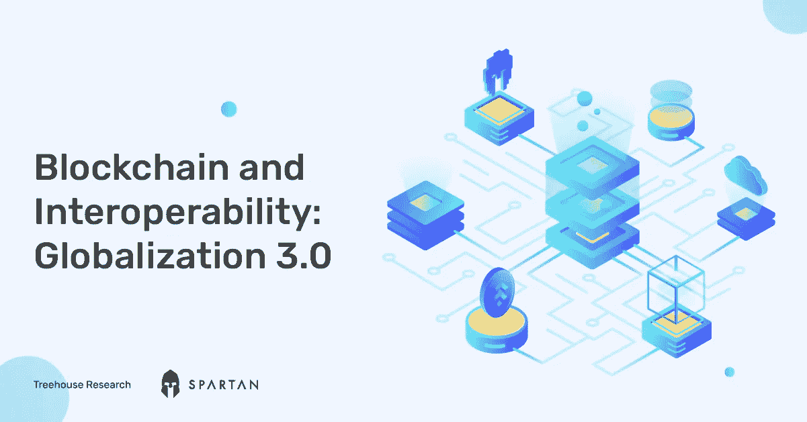

*与* [*斯巴达实验室*](https://medium.com/u/d0724d7efe7f?source=post_page-----ea2be8379774--------------------------------) *研究团队合著。*

# 介绍

在 L1s，L2s 和 NFTs 之后，加密空间不断地寻找下一个叙事。我们认为互操作性是下一个最有可能的主导叙事，因为它将目前隔离的区块链生态系统聚集在一起，就像全球化如何将世界经济锻造成一个整体一样。

在全球化之前，商品的生产和销售是通过本地化的供应链进行的。这种模式意味着高度重复和低效率。通过引入比较优势和国际贸易，全球化使分散的、非本地化的供应链成为可能，消除了这种低效率。今天，像波音飞机这样的产品可以由遍布美国以外 58 个地方的产品专家制造的零件组成。

加密宇宙类似于全球化之前的世界经济。生态系统(国家)是分离的，每个都试图在经济价值链的每一个元素上出类拔萃(不同的指数、货币市场、聚合器等)。).互操作性是允许区块链进行通信的关键要素:类似于国家开放边界，无论是物理上还是虚拟上，以允许信息和资本的自由交换。我们认为，专注于 Web3 互操作性的新进展和技术可以带来自己的“全球化 3.0”并点燃下一波增长。

在本文中，我们将讨论为什么我们需要互操作性，以及如何评估互操作性，更深入地了解现有的和即将出现的解决方案，并以我们对真正可互操作的未来的看法作为总结。

# 为什么我们需要互操作性？

区块链世界正处于十字路口——它已经获得了大量的采用，但缺乏大规模采用的催化剂。我们认为这个问题的答案，从根本上来说，就是互操作性。区块链未来的乌托邦式愿景包含了数字资产和信息在专门的生态系统中顺畅流动的能力，而不会产生冗余数据或要求新的中介。在我们看来，以下是互操作性对促进加密大规模采用至关重要的几个主要原因。

## 互操作性将比较优势引入区块链领域

区块链设计有三大支柱:去中心化、安全性和可伸缩性。由于实现每个支柱的工程要求相互冲突，现有的区块链都不得不在一个或多个支柱上妥协，以在他们选择的专业领域中脱颖而出，因此出现了区块链三元悖论。例如，在 Proof-of-Stake (PoS)链上，提高可伸缩性的一种方法是减少达成交易所需的时间，这可以通过减少验证器的数量来实现——这种设计会损害可伸缩性的分散性。PoS 本身是安全性和可伸缩性的折衷:在最初的工作证明(PoW)网络中，验证者在投票表决阻塞状态之前先解决密码难题，而 PoS 验证者只需证明他们在网络上的股份就可以投票。

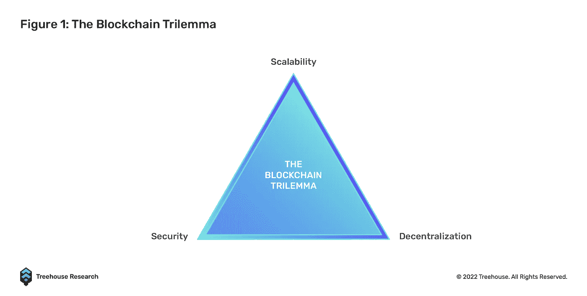

互操作性有可能解决三难问题，因为专业化的区块链将能够专注于他们的强项，而不是像他们现在这样试图提供全栈服务。具有高 TPS(每秒交易数)但更集中的验证器网络的可扩展链可以专注于处理具有更少安全影响的高频任务(例如，用于链上游戏的图形数据)，而具有较低 TPS 的安全链可以处理具有高安全性要求的低频任务(例如，游戏者的游戏内购买记录)。这些只是让加密生态系统变得更易访问和更高效的无尽应用的皮毛。

## 互操作性为最终用户带来简单性，并促进大规模采用

用户体验(UX)通常被认为是软件和技术产品最关键的成功因素。流畅、直观的用户体验对于下一个十亿人使用 Web3 上网至关重要。我们不能现实地期望没有经验的用户保持 10 个不同的钱包和钥匙，每一个在他们的交易需求中服务于一个特定的目的。

互操作性使开发人员能够使用易于使用的 UIUX 构建前端应用程序，该 UIUX 利用后端的多个专用链。如果一个简单的按钮点击就能实现——进入 CEX、交换汽油、撤回到由 CEX 支持的主链、从主链桥接到新链、以及将资本存入新链上的新池，那么这将更加用户友好。

## 互操作性使得 1+1 >2

回到我们的全球化例子，在其他条件不变的情况下，一个一体化的世界经济的价值大于单个经济体价值的总和。我们相信互操作性可以在几个方面对区块链世界做同样的事情。

首先，开发者将从提供全栈服务以吸引采用的冲动中解放出来( [TVL](https://www.treehouse.finance/learn-defi/how-to-make-sense-of-metrics-in-defi#:~:text=1.%20Total%20Value,against%20other%20protocols.) )，转而专注于构建他们的核心优势，这将共同带来更高效的解决方案。

其次，可互操作的区块链带来了可互操作的数据，与如今分散在各个链上的孤立且难以查询的数据相比，这是一个巨大的进步。更好的数据可用性和可组合性将催化 Web3 的自我进化，因为以前从未接触过的想法会从新观察到的数据中浮出水面。

# 如何评价互操作性？

我们认为 Interoperability Trilemma2 很好地总结了真正可互操作的解决方案的三个支柱:可推广性、不可信任性和可扩展性。正如读者将在后面的章节中发现的，当前的互操作解决方案通常涉及折衷一个或多个支柱来实现其他支柱。

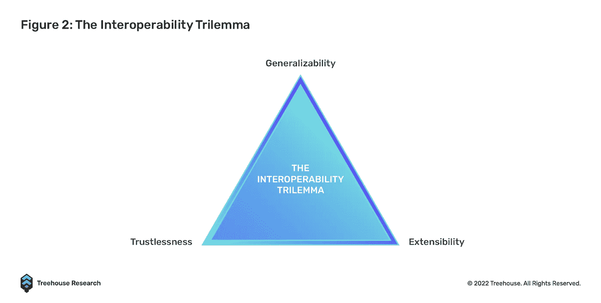

1.  **可推广性:**是指处理简单令牌传输之外的复杂跨链交互的能力，如[智能合约](https://www.treehouse.finance/learn-defi/what-makes-smart-contracts-important-in-defi)呼叫和消息
2.  **不信任**:指拥有与基础区块链同等的安全性
3.  **可扩展性**:指任何区块链或应用程序集成到现有互用性解决方案中的难易程度

这三个支柱可以分解成不同的属性，开发人员和用户可以根据这些属性来评估互操作性的级别。下面讨论一些关键属性。

1.  **安全**:谁来验证交易和系统？该解决方案是否继承了区块链的底层安全机制？解决方案需要外部验证器吗？如果是，它们是允许的还是不允许的？
2.  **便利:**交易完成需要多长时间，用户需要签署多少支持交易才能执行整个交易？对于开发人员来说，集成一个互操作性解决方案需要多长时间，有多复杂？开发商是不是要额外建设基础设施，还是可以瞬间“即插即用”？
3.  **连接性:**指解决方案可以连接多少种不同类型的目标链(即，汇总链、侧链、第 1 层)
4.  **处理复杂和任意数据的能力:**解决方案能否处理消息和更复杂数据(如智能契约调用)的传输？或者它只支持跨链令牌传输(即本地网桥)
5.  **成本效益**:跨链转移资产需要多少成本，维护解决方案需要多少成本？一些解决方案需要额外的交易层，这增加了天然气成本，而一些解决方案仅启动和运行就让开发人员每天花费数百万美元。

# 互操作解决方案

我们已经讨论了为什么我们需要互操作性，以及用什么属性来评估互操作性的级别。以下部分将回顾现有的和即将出现的可互操作的解决方案，分为两类:构建在不可互操作的生态系统上的补丁和本地可互操作的解决方案。

## 基于非互操作生态系统的补丁解决方案

本节中提到的解决方案就是我们所说的“补丁”，因为它们是在不可互操作的链之上事后构建的，试图添加一些可互操作的属性。

**集中交易所**

cex 使用户能够在链之间转移代币，就像银行促进原本孤立的主权经济体之间的价值转移一样。虽然 cex 是用户跨链转移资产的最用户友好和最具成本效益的手段之一，但它们有明显的缺点。

最重要的是，大多数交易所在允许取款前要求 KYC(了解你的客户)，这给普通用户增加了一层额外的复杂性。第二，cex 根据自己的议程装载代币和链，这将用户对其资产的访问置于任意控制之下——例如，在[卢纳-UST 内爆](https://www.treehouse.finance/insights/the-ust-depeg-the-good-the-bad-and-the-ugly)期间，顶级交易所停止向卢纳链提款/存款。在链发生后不久就桥接到新链上的 Degens 也发现 CEXs 不够用，因为 tvl 较低的小链通常要到后来才会上船，如果上船的话。最关键的是，智能合约也不能通过 CEXs 组合，使得交易所只能促进令牌的传输，而不能促进任意数据的传输。

cex 也代表了用户的交易对手和信贷风险。由于 CEX 的监管仍处于萌芽状态，当不计后果的操作导致交易所破产时，用户通常会损失所有资产，而且几乎找不到法律追索权。

**燃烧的桥梁**

跨链资产桥是最广泛使用的互操作性补丁解决方案。这些桥允许用户将他们的资产从源链转移到目的链。桥梁是由一个系统驱动的，这个系统经历了锁定、铸造、燃烧和修复。在这两个链上，将部署智能合约来锁定源链上的本地资产，并在目的链上赊销“包装”资产。

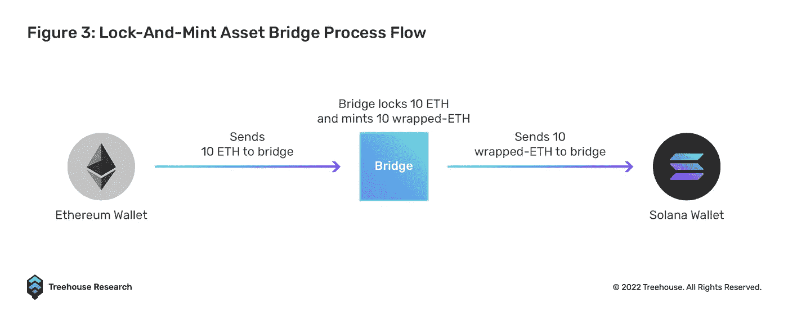

例如，鲍勃通过一座桥把 10 ETH 锁在[以太坊](https://www.treehouse.finance/learn-defi/guide-to-ethereum-how-it-started-and-how-it-is-going)上，把 10 wrapped-ETH (wETH)铸造在索拉纳上。原则上，鲍勃在索拉纳创造的 10 个 wet 由以太坊链上锁定的 10 个 ETH 1:1 支持。鲍勃可以反其道而行之，先在索拉纳上烧 10 个 wet，然后在以太坊链上赎回锁定的 10 个 ETH。在这种情况下，最基本的方面是管理供应，并保证两个供应链同步。

以下是一些著名的桥梁:

1.  包装 BTC (WBTC)
2.  多链
3.  入口
4.  聚网络
5.  浪人桥

在 TVL，桥梁已经膨胀到高达 1235 亿美元。跨链移动资产的需求每天都在增长。问题是，这些资产桥梁的安全性和效率如何？不幸的是，由于 bridges 持有大量资金，因此经常成为攻击目标并被利用，臭名昭著的事件导致超过 18 亿美元的资金受损。下面列出了一些值得注意的漏洞。

1.  **保利网络:6 亿美元** [保利网络被黑](https://www.coindesk.com/markets/2021/08/10/cross-chain-defi-site-poly-network-hacked-hundreds-of-millions-potentially-lost/)是因为对两个重要协议智能合同的访问权限管理不善。结果，系统被黑客攻破，黑客可以添加自己的公钥来清空钱包。
2.  **虫洞(Solana):3.21 亿美元** [虫洞黑客](https://cointelegraph.com/news/wormhole-token-bridge-loses-321m-in-largest-hack-so-far-in-2022)之所以发生，是因为代币兑换过程中验证签名的功能被弃用。然后，黑客能够通过替换他们自己的验证例程来铸造超过 12 万个 wet 令牌，该验证例程总是说签名是有效的。
3.  浪人(Axie Infinity):6 . 25 亿美元
    [浪人桥](https://cointelegraph.com/news/axie-infinity-s-ronin-bridge-hacked-for-over-600m)成为网络钓鱼攻击的受害者。Ronin validators 的私钥落入黑客之手，然后让黑客从桥合同中抽走资金。
4.  **Horizon(Harmony):1 亿美元** [Horizon Bridge 是另一个潜在网络钓鱼活动的受害者](https://cointelegraph.com/news/breaking-harmony-one-s-horizon-bridge-hacked-for-100m)，他们的 multisig 验证器的私钥被盗。
5.  **Nomad:1.9 亿美元
    T2[Nomad 黑客](https://www.coindesk.com/tech/2022/08/02/nomad-bridge-drained-of-nearly-200-million-in-exploit/)是一个糟糕的操作策略的结果，导致了糟糕的 Merkle root 初始化，导致每条消息都被默认为有效。**

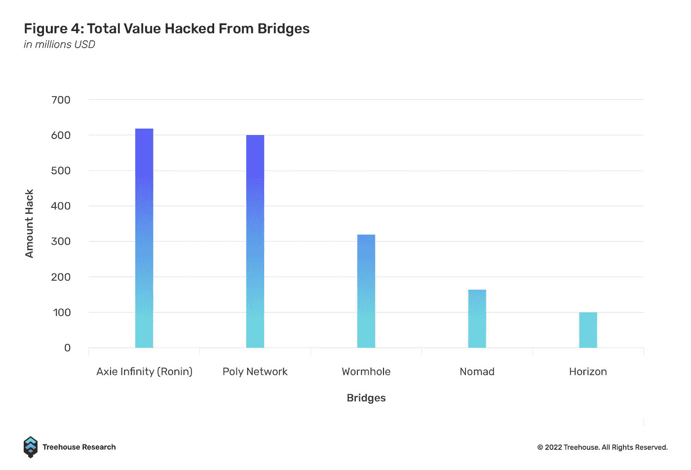

在黑客盛行的情况下，资产桥的一个主要问题就是安全性。大多数 DeFi 协议倾向于继承底层的区块链安全机制，但是现在的网桥不这样做。相反，网桥严重依赖于一组独立的验证器，而不是它们所服务的 PoS 链的验证器，这使得它们在安全性方面明显较弱。

例如，在 PoA(权威证明)共识架构下，Solana 虫洞桥目前只有 19 个“守护者网络验证器”。安全多方计算模式依靠几个多重签名密钥来授权任何交易:例如，Ronin Bridge 需要 9 个多重签名密钥中的 4 个来批准交易，而 Harmony Horizon 只需要 5 个多重签名密钥中的 2 个来授权。最后但同样重要的是，WBTC 桥使用单一托管方法，这带来了集中化风险。由于上述原因，桥梁目前是区块链生态系统的致命弱点，因为它们比区块链本身更容易被利用。

除了安全问题，网桥与 CEXs 的相似之处在于它们不能处理复杂的任意数据。桥本质上是交叉链当铺——没有人期望当铺在两个公司之间传递复杂的指令。

最后，对于普通用户来说，与大多数桥交互是一项麻烦而乏味的任务。下面是一个典型桥接过程的示例:

要在[雪崩](https://www.treehouse.finance/learn-defi/guide-to-avalanche-avax)将以太坊上的 ETH 换成 AVAX，需要:

1.  以指数形式将 ETH 交换到 USDC
2.  通过 AVAX 桥将 USDC 从以太坊桥连接到雪崩桥
3.  通过将 AVAX 代币存入您的 Avalanche 钱包，确保有足够的汽油费来完成 Avalanche 的最终交易
4.  通过另一个 DEX 在 Avalanche 上从 USDC 交换到 AVAX

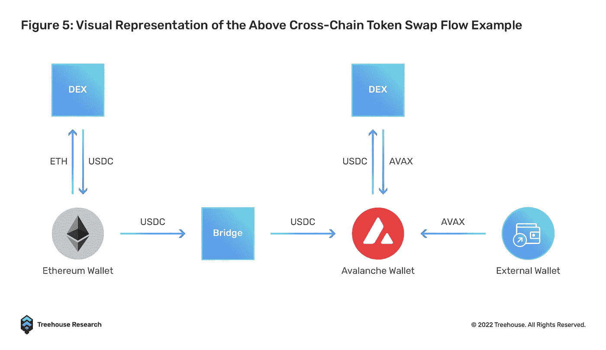

整个过程包括至少签署三次交易，与三个 dApps 交互，如果用户使用 MetaMask，则至少切换一次链。要检查交易状态，用户需要准备好 Etherscan 和 Snowscan。如果不简化这些流程，桥梁和任何跨链 dApps 仍将受到 UX 障碍的严重阻碍。

## 本机互操作解决方案

上面讨论的补丁解决方案只拥有一个可互操作的属性—连接性。它们在安全性、便利性、处理复杂消息的能力和成本效益的每个其他方面都失败了。新一代的解决方案决定将可互操作的特性融入他们的 DNA 中，而不是在以后构建补丁。

**全链指数**

DEX 链在多个链上引入流动性池，并通过一个中间令牌来促进交换。例子包括 THORChain 和 SifChain。与桥不同，全链 dex 不包装资产。相反，在将源资产交换到目标令牌之前，它们将源资产与中间令牌进行交换。当然，这些交易是由流动性提供者促成的。

例如，在 THORChain 上，当用户希望将 Mainnet 上的 ETH 换成 Solana 上的 SOL 时，用户将首先将其 ETH 发送到 THORChain lockup 智能合同。然后 THORChain 将执行从 ETH 到 THOR 的交换，然后是 THOR 到 SOL 的交换。随后，将向 Solana 流动性池智能合约发送一条消息，然后该合约将 SOL 释放到用户的 Solana 地址。

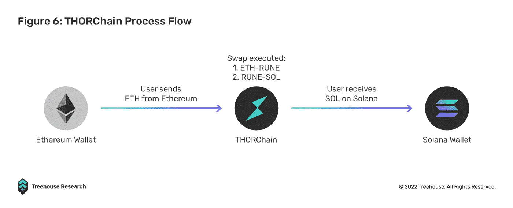

该协议通过一种全新的机制——thor chain——消除了创建包装资产的需要，提供了真正的实用程序，使用户能够在区块链之间的本机资产之间无缝交换。这种简单的用户界面/UX 方法将成为推动大规模采用和从集中式替代方案中吸引用户的关键卖点。

与 cex 相比，全链 dex 不需要 KYC。流动性是统一的，因为所有链都交易同一个“本地令牌-令牌”流动性池。用户不依赖于 DEX 的预言或安全假设，因为 depeg 风险由流动性提供者承担。全链指数也是可扩展的，因为任何人都可以给任何一对增加流动性。

然而，THORChain 的中间链设计带来了一些关键风险和细微差别。由于 THORChain 网络由债券证明网络保护，其中节点运营商承诺一份 RUNE 债券以承保 DEX 流动性池中的资产，因此随着流动性池中 TVL 的增长，节点运营商需要承担更多的风险。受到[激励钟摆](https://docs.thorchain.org/network/incentive-pendulum)的自然激励，节点运营商必须绑定与汇集资本相等的符文，才能在最佳状态下运行。

这意味着在 THORChain 网络上建立一个完整的节点需要越来越多的资金。目前，该网络在 TVL 拥有 [95 个活跃节点](https://thorchain.net/nodes)，价值超过 2.6 亿美元，完整节点的平均债券为 838，499 符文，按市场价格计算为 1，468，839.90 美元。在 95 个活跃节点中，具有最低绑定资本的节点达到大约 528，000 符文或 929，000 美元。结果，具有相对较低资本的小规模节点运营商不能参与保护网络，从而导致对具有较大资本预算的节点运营商的集中控制。

无意中，这回避了一个问题，即具有类似设计的 THORChain 或 full chain 指数是否真的像宣传的那样分散。此外，Thorchain 的大部分(如果不是全部)完整节点都托管在集中式云计算服务上。在 95 个节点中， [87 个节点](https://thorchain.net/nodes)托管在谷歌、AWS 和 Digitalocean 等主要云服务上，其中 AWS 占据了最大份额，占 38%。理论上，这给网络带来了巨大的风险，因为云计算服务可能会面临网络中断甚至受到监管。

虽然这种互操作性设计引入了许多新颖的方法，通过出色的 UI/UX、巧妙设计的令牌组学和安全机制在区块链之间建立桥梁，同时保留了其不可信的设计，但协议的复杂性导致其受到许多攻击和安全破坏。THORChain 协议在过去的一年中被利用了 3 次，损失了超过 1200 万美元的流动资金。正如任何新的创新一样，成长的烦恼是不可避免的。THORChain 团队自此将更多注意力放在协议[安全性](/thorchain/thorchains-layers-of-security-e308d537acf1)以及引入新的[改进](/thorchain/thorchains-next-phase-adoption-growth-scaling-b82062b19569)上，以增加池化流动性和整体网络去中心化。

**网络的网络**

Cosmos 和 Polkadot 是同类“网络的网络”的两个例子。它们被视为区块链堆栈中的第 0 层。这两个第 0 层都引入了一个标准，任何第 1 层区块链都可以连接到它们，形成一个可互操作的网络。

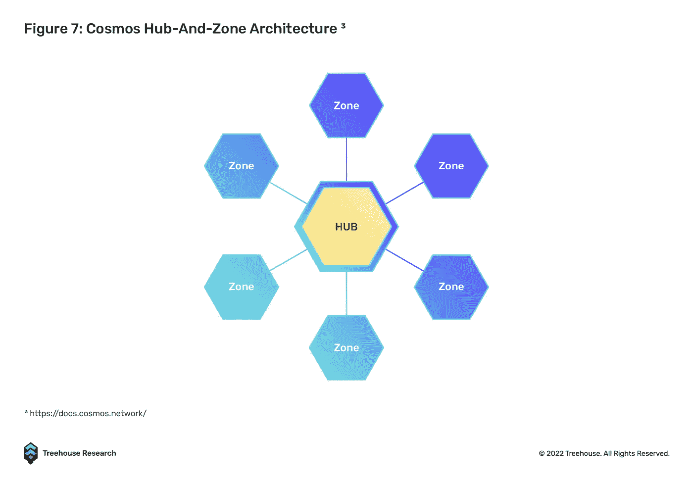

Cosmos 通过区块链间通信协议(IBC)实现互操作性。IBC 通过提供专用中继来验证块状态并以链间标准(ICS)进行通信，从而允许异构区块链以无信任和无许可的方式进行通信。利用 IBC，独立的区块链将不必像在使用桥梁的情况下那样进行双边通信。

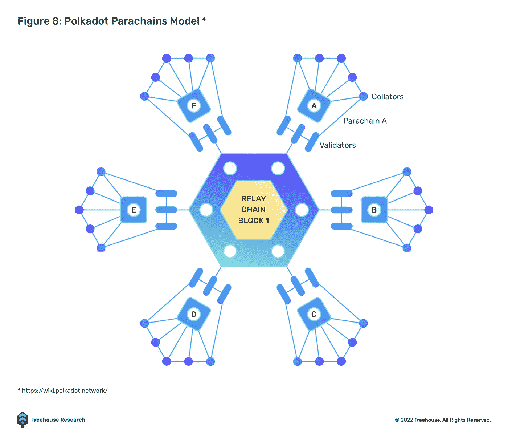

波尔卡多特生态系统由称为副链的专门建造的区块链组成。跨链互操作性是通过基于 XCM 格式的协议实现的。XCM 格式类似于 IBC 的 ICS，它标准化了跨链通信。有两种用于处理 XCM 消息的主要消息传递协议，即垂直消息传递(VMP)和跨链消息传递(XCMP)。VMP 允许副链向/从中继链上传/下载消息，而 XCMP 促进中继链上的信息交换。

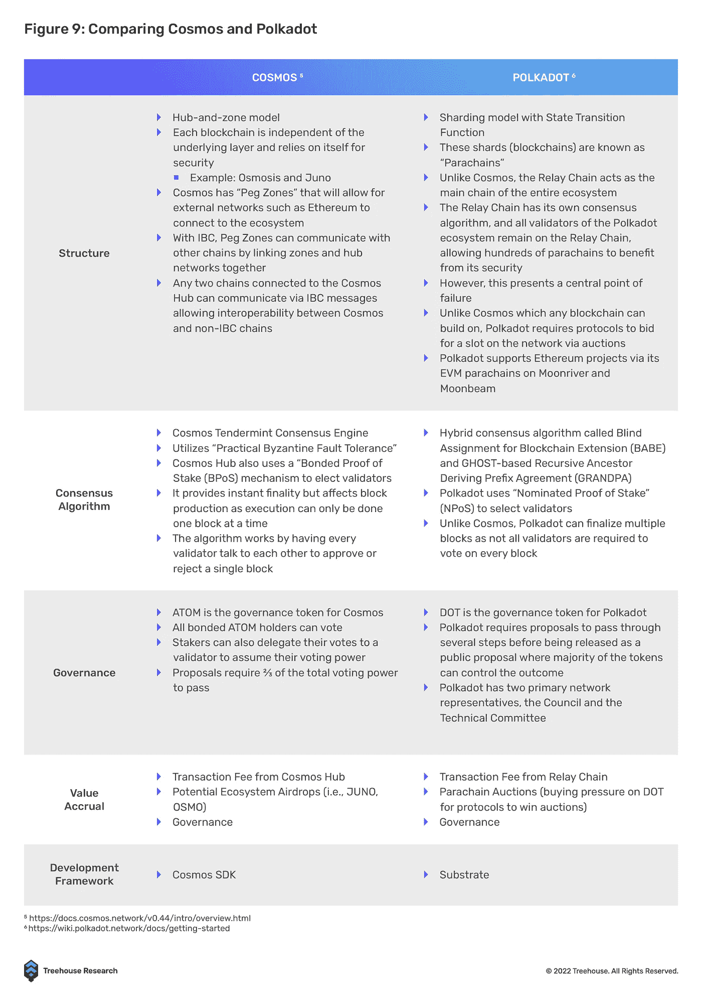

虽然 Cosmos 和 Polkadot 的工作原理相似，但它们在连接和安全机制方面有很大不同。Cosmos 允许任何人在它上面建造，而 Polkadot 的副链插槽有上限。宇宙号上的区域依靠自身来保证安全，而波尔卡多特的副链可以依靠中继链的安全机制。

也就是说，Cosmos 和 Polkadot 都有自己的一系列挑战需要克服，因为这两种设计理念都面临一些相应的问题。第一个是自举问题。虽然 Cosmos 是作为一个开放网络构建的，任何人都可以在其中部署新的链，但是部署者将需要寻找一组全新的验证器，因为不同种类的区块链之间不能共享安全性。这个过程可能是耗时且无效的，因为操作验证器节点对于那些没有适当的硬件和技术知识的人来说是具有挑战性的，因此使得潜在候选人的池非常有限。

相比之下，Polkadot 的副链不需要新的验证器集，因为网络选择了一种共享安全的形式，其中它的副链由中继链的验证器来验证。虽然这看起来是引导新的副链的一个优点，但是这个过程由于要求新的链部署者在蜡烛拍卖中对副链租赁位置进行投标而受到严重阻碍。由于副链是 Polkadot 生态系统中的稀缺资源，随着新副链的加入成为一个漫长而乏味的过程，网络增长的速度受到了限制。考虑到所有因素，Polkadot 和 Cosmos 生态系统仍然难以获得大量采用，在 TVL 分别获得约 3.8 亿美元和 10.5 亿美元。

话虽如此，Cosmos 和 Polkadot 正在实施新的网络升级，以建立一个更强大的基础设施，促进生态系统中的更多采用。Cosmos 目前正在实现链间安全性，以解决消费者链可以依赖于供应商链的安全验证器的引导问题。在增强 Polkadot 的跨链能力时，XCM 的引入应该会促进类似于 IBC 的更高水平的跨链可组合性。虽然在他们自己的生态系统中是孤立的，但像 Evmos 和 Moonbeam 这样的项目试图成为与 EVM 生态系统互操作的桥梁。

与 Fat 协议理论直接相反，特定于应用程序或特定于用途的链被认为是分散化应用程序的最终游戏，因为协议不再受到它们所基于的通用区块链的限制。这使得项目团队可以专注于构建用户想要使用的产品和应用程序，同时保持完全的自主权。根据设计，如果通用区块链在未来变得更加规范和集中，像 Cosmos 和 Polkadot 这样的网络的网络为分散的应用程序开辟了一条与审查风险隔离的途径。因此，通过强大和可扩展的共享安全性、本机可互操作的应用程序特定链、快速和无缝的 UI/UX、无信任的桥梁以及与其他区块链生态系统的整体更好的连接，Cosmos 和 Polkadot 可以引发区块链互联方式的范式转变。

**Relayer-Oracle 协议**

Relayer-Oracle 协议旨在解决 Relayer-Light 客户端协议的新兴问题，即低成本效益。LayerZero 是这一领域最杰出的竞争者之一，它利用链上轻节点来促进跨链信息交换。发送方链的端点与指定的 Oracle 和 Relayer 以及接收方链进行通信。当中继器验证交易时，Oracle 消息将有问题的报头阻塞到接收者链的端点。与 Polkadot XCMP 依赖单个中继链作为中介并引入瓶颈风险(如果中继链失败，互操作性就会失败)相比，LayerZero 的 Relayer-Oracle 解决方案利用现有的端点轻型节点来实现安全性，并且与中继链模型相比具有更多冗余。

为了确保可伸缩性，LayerZero 端点是轻量级客户端节点。与当前的轻中继器客户端解决方案在客户端内存储和复制块头不同，这一过程外包给 Oracles 从链中获取块头，通过消除每隔几秒钟同步块头的需要，显著降低了成本，特别是在气体密集型链上。在操作上，LayerZero 端点作为一个经济高效的链上智能合同发挥作用。当前构建的端点更容易与 EVM 集成，但仍需要为非 EVM 连锁店定制。

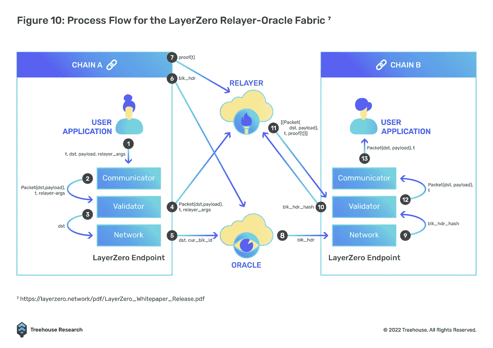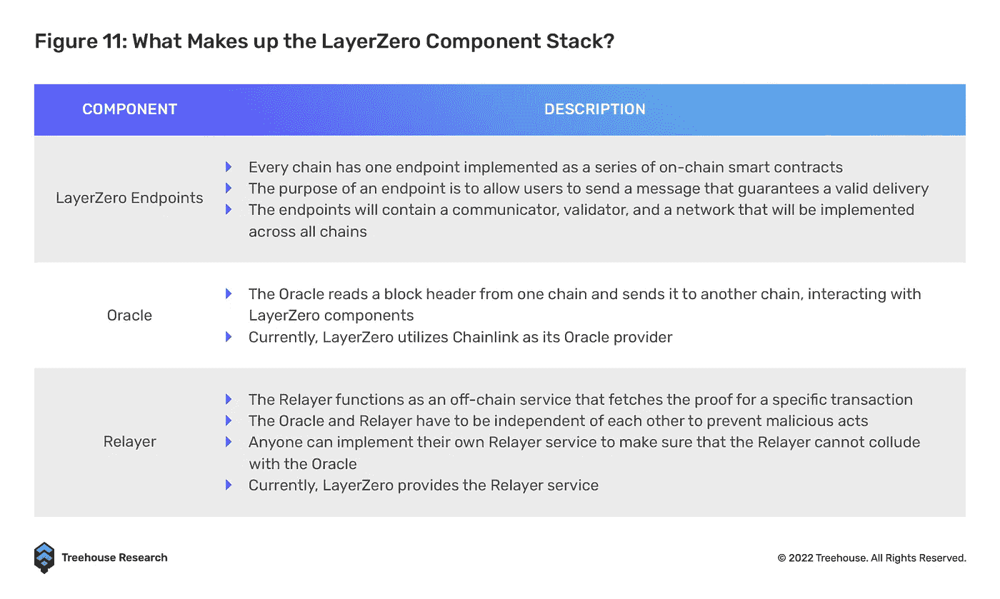

LayerZero 可以培育多种用例，如跨链 DEX (Stargate Finance)、多链收益聚合器以及多链借贷，所有这些都不需要在不同的链上经历多次资产跳跃。该功能将通过为用户提供非常无缝的体验来有效地解决多链环境中 UI/UX 的主要问题，因为用户将能够与其他主权区块链上的 DeFi 应用程序进行交互，而只在源链上拥有资产。例如，在以太坊主网上存放 ETH 作为 Aave 贷款池的抵押品，同时在 Avalanche 上接收借入的 USDC。

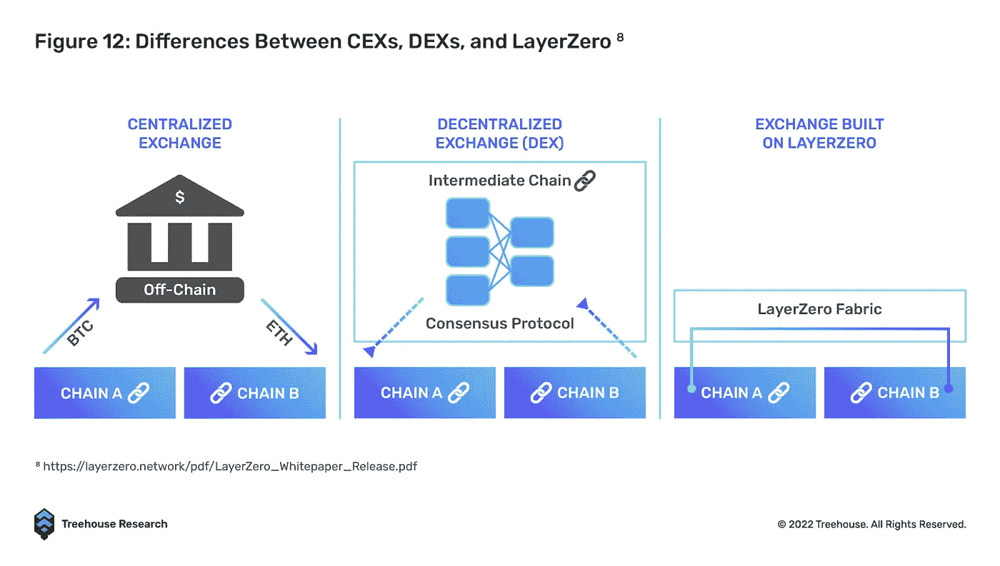

其核心是，LayerZero 提供了一种不可信的通用消息中继机制，该机制专注于有效的传递，如果中继器和 oracle 相互独立，就可以实现这一点。不需要跨链状态机复制或中间包装的令牌，这大大减少了瓶颈和成本。

值得注意的是，LayerZero 通过选择一个更弱的信任条件，即“独立性”，来实现“不信任”。只要 Oracle 和 Relayers 是由独立方运行的(目前 Oracle 由 Chainlink 运行，Relayers 由 LayerZero 运行)，恶意共谋就不可能发生。

为了进一步确保传输层的安全性，LayerZero 还引入了“犯罪前”的概念，使中继能够在黑客攻击发生前阻止它。本质上，犯罪前机制检查区块链相对于目的地区块链的状态，以验证没有实施恶意动作。如果检测到恶意状态，LayerZero 能够在传递通用消息和执行事务之前分叉目标链。

LayerZero 的本地互操作解决方案的实施看起来是最有前途的，它具有优雅、安全和经济高效的设计，因为与传统的锁和薄荷桥、全链 DEX 甚至网络的网络设计相比，移动部件明显较少。通过将数据检索过程外包给独立的链外中继器和 Oracles，跨链消息传递变得更加高效。为了进行扩展，LayerZero 只要求连接区块链启用智能合约，以部署其智能合约端点。

虽然有些人可能会认为，LayerZero 在目前的状态下并没有完全分散，因为中继器是由 LayerZero 团队运营的，但长期愿景是最终允许任何人独立建立一个中继器来支持该平台。与前面提到的设计相比，这将大大减少引导和连接到新链的时间，因为不需要像基于 Cosmos 和 Polkadot 的链那样寻找一组新的验证器。

**优秀奖**

下面是我们为本文研究的一些可互操作的解决方案。我们不可能在一篇文章中涵盖所有的内容，但是对于感兴趣的读者来说，它们每个都有独特的长处。

*   突触:跨链 AMM 和桥梁
*   跃点协议:汇总到汇总通用令牌桥
*   Axelar 网络:连接第 1 层的与链无关的互操作层
*   Connext:使用原子互换跨链转移资产的流动性网络
*   路由器协议:跨链消息传递协议，构建为通过节点连接的链的网状网络
*   图标网络:使用链上轻客户端的通用跨链消息传递
*   跨:第 2 层跨链桥
*   蹦极交换:桥梁聚合器

# 为什么过时的互操作性设计仍然被广泛使用？

根据 DeFiLlama 的[桥](https://defillama.com/protocols/Bridge)和[跨链](https://defillama.com/protocols/Cross%20Chain)类别，在 13.52 亿美元的 TVL 中，有 12.49 亿美元被锁定在传统的锁铸桥中，如包装 BTC、多链和门户。虽然没有考虑 Cosmos 和 Polkadot 生态系统中的各种链，但数据表明，尽管后者带来了创新和安全增强，但在采用网桥和本地互操作协议之间存在巨大差异。这就引出了一个问题“是什么阻止了更好的互操作性解决方案被广泛采用？”我们认为原因有三:

## 易用性

MetaMask 钱包仍然是密码行业中使用最广泛的钱包之一。这是因为元掩码与所有基于 EVM 的链兼容，并且允许在所有链使用相同地址的 EVM 链之间无缝切换。虽然许多较新的本机互操作解决方案，如 Stargate (LayerZero)、Synapse 和 Hop Protocol 很容易与 MetaMask 集成，但大多数 Cosmos 和 Polkadot 链使用其生态系统的本机钱包，如 Keplr 和 Polkadot JS。用户需要下载新的钱包应用程序并创建新的钱包，这大大增加了用户体验的摩擦。这种设计可能会进一步阻止新用户进入生态系统来尝试更新更具创新性的选项。

## 信息不对称

在一个已经新生的行业中，过去两年推出的互操作性协议的数量之多，使得跟踪和确定用户参与跨链活动的最佳路线变得越来越困难。因此，吸引最多用户的协议往往是那些与相应的区块链开发团队或基金会有正式合作关系的协议。就 Evmos 而言，Nomad Bridge 是推荐给新用户的官方网关，用于连接他们来自其他连锁店的资产。

尽管有 DYOR 的明确警告，官方合作伙伴关系通常被用户视为对推荐协议的安全性和可信度的认可。在 Evmos 和 Nomad 的案例中，Nomad bridge 吸引了超过 4.453 亿美元的交易量，因为用户信任 Evmos 的推荐，但在 2022 年 8 月 1 日被利用，损失超过 1.86 亿美元给该桥的攻击者。

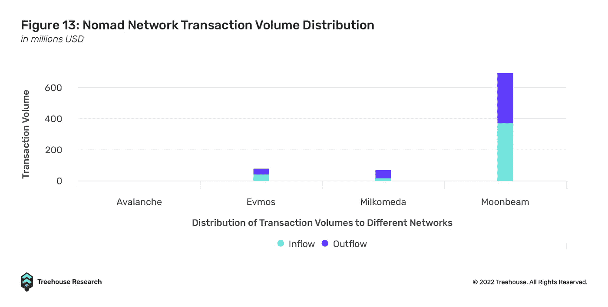

这又把我们带回了信息不对称的问题。虽然可能有更具成本效益和更快的桥接解决方案，但用户往往会随大流，选择最“可信”和“最安全”的协议。因此，信息不对称可能会阻止新的本地互操作协议吸引更多用户，仅仅因为它们没有产生足够的意识。

## 生态系统之间的互操作性

传统的锁和薄荷桥仍然是最容易实现的互操作性形式，因为用户可以很容易地将他们的资产放到 EVM 和非 EVM 生态系统的任何链上。尽管像 IBC 传输这样的互操作性解决方案适用于 Cosmos，但它们只适用于 Cosmos 生态系统本身。例如，如果用户想将他们的资产从 Cosmos 连接到 EVM 连锁店，他们需要使用另一种解决方案，如 Axelar 的卫星桥。

关于 LayerZero，该协议目前只为大多数主要的 EVM 兼容链和以太坊第二层(如 Arbitrum 和乐观)启用了跨链消息传递。该协议尚未将其连接扩展到非 EVM 链，如宇宙生态系统和索拉纳。

缺乏生态系统内部的互操作性也可能部分归因于这些项目的融资方式。不同的风投支持不同的生态系统，除非有实质性的经济利益，否则不太可能向其他人开放他们的领域。这是风投之间的囚徒困境，因为叙事仍然是建立一个统治一切的生态系统——第一个过渡到合作叙事需要冒很大的风险。

生态系统之间的互操作性仍然非常分散，并且该领域非常缺乏能够无缝聚合所有桥梁、流动性网络和跨链消息协议的流动性的桥梁聚合器。因此，传统的锁和薄荷桥仍将是最受欢迎的选择，因为到目前为止，当在不同的区块链之间移动资产时，它们允许最高程度的互操作性和便利性。

## 缺乏互操作性用例

本地互操作协议缓慢的 TVL 背后的另一个原因是，除了桥接令牌之外，没有多少额外的互操作性用例。因此，普通用户没有使用 Stargate、THORChain 或 Cosmos 生态系统的动机，因为增加的复杂性不会给他们带来额外的好处。

正如我们在上面的 LayerZero 段落中所讨论的，本地可互操作的协议可能会导致在没有资产的情况下与其他主权链进行交互——该用例将是用户从桥迁移到新的本地可互操作解决方案的重要激励，因为简单地桥接令牌将变得远不如在一个链上有抵押品并立即在其他链上借款方便。

我们意识到这导致了因果困境的出现，或者更确切地说，是构建互操作性用例的协议和变得可用的互操作性解决方案之间的“鸡和蛋”的问题。然而，随着更多本机互操作设计的出现，我们相信应用层的开发人员将加快创新的速度。

# 未来是一个多链的未来

从目前的状态来看，没有一个区块链能以高效和用户友好的方式主导整个行业。每个连锁店都有一个利基副产品，但开发者和风投被短期冲动蒙蔽了双眼，这种冲动要求他们在所有方面都出类拔萃并吸引 TVL，从而导致向用户提供类似但独立的产品。新项目，如新兴的 L1 链，声称要解决区块链的三难问题，而实际上只是暗中牺牲一两个支柱给其他人。

我们认为区块链困境的真正答案是互操作性，而互操作性困境的答案是天生可互操作的解决方案，而不是建立在互斥链上的补丁。以前的赢家通吃的加密风投模式实际上不利于构建内在可互操作的项目；但是随着更多的人意识到一个真正可互操作的区块链世界的潜力，人才和资本开始流入本地可互操作的解决方案。

广义交叉链网络中的潜在网络效应可能比我们之前看到的叙述更加强大。被赋予互操作性项目是一种链不可知的方法，赌区块链行业将克服大规模采用的障碍。Web3.0 正处于一个转折点，我们期待未来的建设者和用户在一个相互连接的区块链宇宙中茁壮成长。瓦格米。

**脚注**

*1 世界经济一体化的价值受多种因素影响，包括但不限于生产力(如工业革命)、财富再分配(如社会主义对资本主义、战争、自然灾害)。在其他条件相同的情况下，我们只是比较有和没有全球化的情况。*

*2*[*https://blog . connext . network/the-inter operability-tri lema-657 C2 cf 69 f 17*](https://www.pionline.com/interactive/largest-hedge-fund-managers-2021)

*3*[https://docs . cosmos . network/](https://www.businessinsider.com/bridgewaters-flagship-pure-alpha-fund-is-up-over-26-2022-5)

*4*[*https://wiki . polkadot . network/*](https://www.aei.org/carpe-diem/the-sp-500-index-out-performed-hedge-funds-over-the-last-10-years-and-it-wasnt-even-close/)

*5*T14*https://docs . cosmos . network/v 0.44/intro/overview . html*

*6*[*https://wiki . polkadot . network/docs/getting-started*](https://wiki.polkadot.network/docs/getting-started)

*7*T26*https://layer zero . network/pdf/layer zero _ white paper _ release . pdf*

*8* [*同上*](https://layerzero.network/pdf/LayerZero_Whitepaper_Release.pdf)

**免责声明**

*本出版物仅供参考和娱乐。本出版物中的任何内容都不构成财务建议、交易建议或任何其他建议，也不构成买卖证券或任何其他资产或参与任何特定交易策略的要约。本出版物不考虑您的个人投资目标、财务状况或需求。Treehouse 不保证本出版物中提供的信息是最新的或准确的。*

*本文是与斯巴达集团的一部分* [*斯巴达实验室*](https://spartanlabs.studio/) *合作撰写的。一群研究人员、产品经理、工程师、设计师和成长黑客在 Spartan Labs 策划、指导和共同构建 Web3 产品。该团队专注于通过协作和连接点来创造社区和价值，最终释放人的潜力。*

喜欢这件作品吗？查看我们的其他 [*见解*](http://treehouse.finance/insights) *片段进行更深入的分析；还有我们的* [*学 DeFi*](http://treehouse.finance/learn-defi) *文章更广泛的介绍了 DeFi 的各个主题。您也可以尝试我们的旗舰产品，*[*Harvest*](https://harvest.treehouse.finance/connect?utm_source=medium&utm_medium=content&utm_campaign=harvest)*，全面分析您的 DeFi 资产。最后，在这里订阅我们的每日快讯***！**

> *交易新手？尝试[加密交易机器人](/coinmonks/crypto-trading-bot-c2ffce8acb2a)或[复制交易](/coinmonks/top-10-crypto-copy-trading-platforms-for-beginners-d0c37c7d698c)*