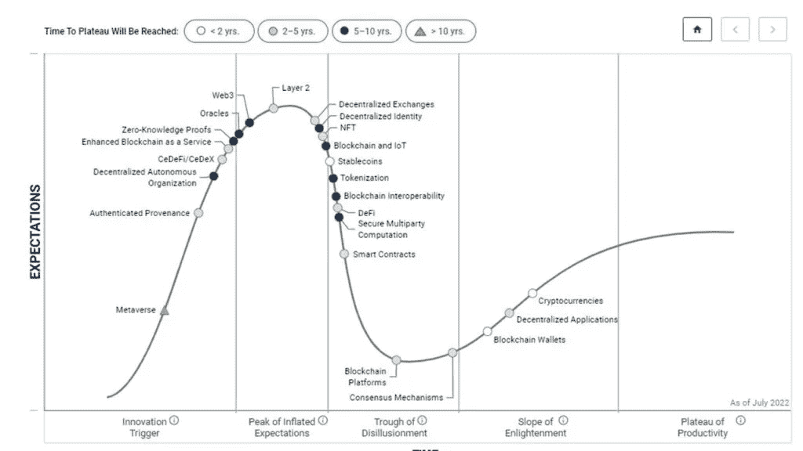

# 区块链和 Web3 炒作

> 原文：<https://medium.com/coinmonks/blockchain-and-web3-hypes-bb6a835784e4?source=collection_archive---------8----------------------->

[https://blogs.gartner.com/avivah-litan/2022/07/22/gartner-hype-cycle-for-blockchain-and-web3-2022/](https://blogs.gartner.com/avivah-litan/2022/07/22/gartner-hype-cycle-for-blockchain-and-web3-2022/)

众所周知，区块链和 Web3 技术是目前科技界最热门的话题。原因显而易见——这些技术有可能彻底改变我们与互联网以及彼此之间的互动方式。

当然，对于任何新的和令人兴奋的东西，总会有一些炒作。区块链和 Web3 也不例外。但是尽管大肆宣传，这些技术仍然…