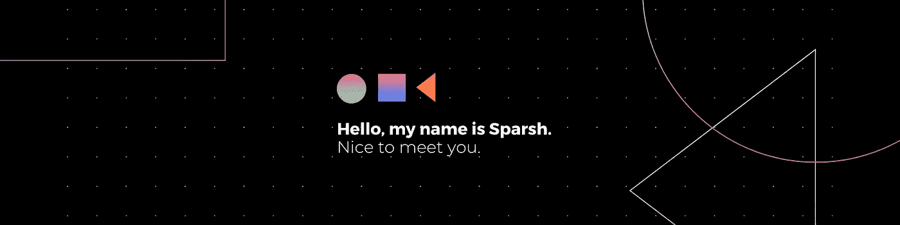

# 区块链热潮！！

> 原文：<https://medium.com/coinmonks/blockchain-boom-2239e9233a07?source=collection_archive---------38----------------------->

**NFT，Web3，区块链，加密**！这些词现在是 Z 世代的热门话题，但它是什么呢？它实际上是如何工作的？

为什么你应该读一个 18 岁的学生写的博客，他刚刚开始在科技行业的旅程？我亲身经历过，我非常理解人们在试图学习这些东西时面临的困境，因为有太多的数据要搜索，为你找到合适的资源变得非常乏味！

因此，我现在可能不是给你关于这个主题的深入知识的人，但我可以帮助你充分理解这个主题，从而**对它们产生兴趣**并自己进一步探索！

从 Web3 开始，顾名思义，它是我们每天使用的第三代网络。早在 20 世纪 90 年代到 21 世纪初，Web1 只包括**浏览带有文字的基本网页**。Web2 允许我们在这些网站上查看并做出反应，比如**喜欢/评论**帖子&人们直接在网上使用应用程序。现在你一定在想，当我们已经拥有了我们所需要的东西时，我们还需要什么呢？

“数据”的因素开始发挥作用，正如正确的说法“数据是新的石油”，这些大的网络 2 公司，如推特、脸书和谷歌存储我们的个人数据，导致侵犯隐私。你一定注意到了，当你在谷歌上搜索一个特定的商品时，同样的商品不断出现在你的广告和购物应用中。为了阻止这种精确的**数据泄露**和阻止所有数据集中在这些精选的少数公司手中，引入了 Web3。

Web3 现在做的是**分散**整个过程，限制数据的集中，因为无论何时你在互联网上互动，受益的都是你，而不是从你的数据中受益的跨国公司。你成为互联网上信息的**股东**，而加密是一种在互联网上确立你所有权的方式。

既然你理解了 Web3。什么是加密？它基本上是一种在线货币，就像我们在现实世界中有卢比和美元一样。但是为什么加密如此有价值呢？**基础经济学**！总金额。有史以来存在的比特币上限为 2100 万，所以当供应有限时，价值会自动上升！

既然你懂了加密！为什么是加密？现在，让我们假设你想从你的印度银行汇款到美国银行，在一个过度征税的地方有各种检查点，有时你最终要支付 1.2%甚至 5%的手续费，整个过程需要 3-4 天，但有了加密，通过在同等水平上分发，它有效地弥合了两个帐户之间的差距，消除了检查点，从而节省了大量时间和金钱！

现在我们知道了 Web3 为我们在互联网上拥有自己的数据提供了框架，加密是数字货币，那么我们到底拥有什么呢？这被称为 NFT(流行的误解——NFT 不仅仅是你看到的人们在网上购买的平面设计或海报)你的**数字印记**中的一切和任何东西，你使用什么应用程序？你买什么东西？甚至你的搜索历史也归你所有，可以作为 NFT 使用。这相当于在现实世界中拥有一辆车、一栋房子或一件产品。

今天就到这里吧！！我希望我能够有效地向您介绍区块链和 Web3 的世界！请记住，我是一名学生，如果任何有经验或知识渊博的人正在阅读这篇文章，并希望纠正错误或添加内容，他们可以把我钉在我的社交手柄上！

[TwitterI](https://twitter.com/Sparxhh)[Linkedin](http://www.linkedin.com/in/sparsh-chakraborty)

我会带着更多关于科技、地缘政治、历史等话题回来！！

> 交易新手？尝试[加密交易机器人](/coinmonks/crypto-trading-bot-c2ffce8acb2a)或[复制交易](/coinmonks/top-10-crypto-copy-trading-platforms-for-beginners-d0c37c7d698c)