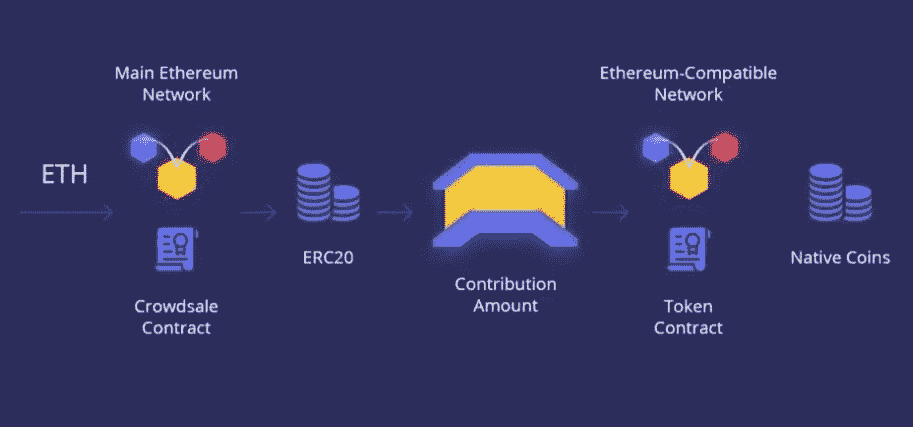
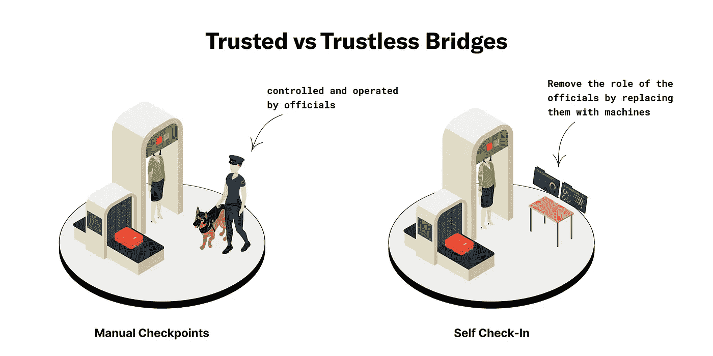
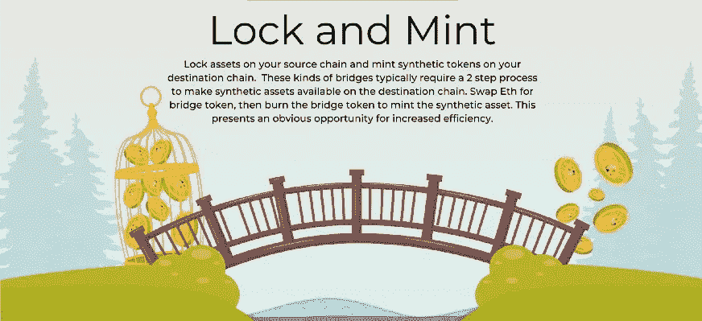
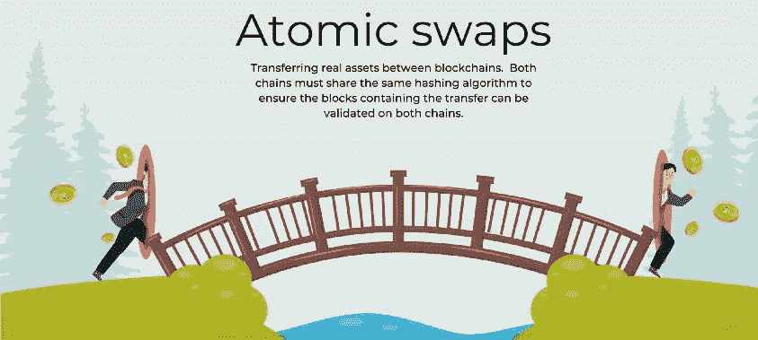

# 区块链桥讲解第 1 部分

> 原文：<https://medium.com/coinmonks/blockchain-bridge-explained-part-1-85487aaa81f?source=collection_archive---------13----------------------->

在早期，当选择很少时，人们会选择比特币或 T2 以太坊。区块链技术的进步[发展](/coinmonks/history-and-evolution-of-blockchain-17e5332e4a6c)导致了大量新协议和加密货币的涌现。现在，许多人拥有一个包含多种加密资产的投资组合，因为他们同时与不同的区块链打交道。因此，互操作性已经成为一个高度优先的问题。区块链大桥正好有助于这一点。

**桥梁如何工作**

一篇关于侧链的早期文章[提到链之间的连接是通过双向桥实现的。即使所涉及的协议是全区块链，而不是主链和侧链，连接原则仍然是相似的。因此，简单地说，区块链桥是一种互操作性协议，它支持数据和/或令牌在两个区块链之间平滑移动。由于传输是跨链进行的，有时也称为跨链桥。举个例子将有助于更好地阐明这个概念。](https://coinsbench.com/what-is-sidechain-4d4dc912ec50)

以太坊区块链[上拥有以太(ETH)的用户](/coinmonks/what-is-ethereum-part-2-design-c9b9f1b39fda)希望在另一个区块链上出现，比如说 Solana，并拥有自己的本地令牌(SOL)。现在，ETH 和 SOL 都不能作为自身存在于对方的网络中，但可以作为包装版本存在。因此，当 SOL 在以太链上变得可用时，它成为包裹的 SOL (wSOL ),类似地，ETH 在 Solan 链上成为包裹的 ETH(wETH)。因此，要回答用户如何受益于区块链桥在平台之间迁移并获得他想要的加密令牌的问题，他有以下两种选择之一:

**选项 A** :使用以太坊链上的 ETH 购买 wSOL - >通过跨链桥将 wSOL 转移到 Solana 链- >解开 wSOL 得到 SOL

**选项 B** :通过跨链桥将 ETH 转移到 Solana 链- > ETH 将转换成 wETH - >使用 wETH 购买 SOL

[**Typical cross-chain token transfer example**](https://www.fiahub.com/en/blog/what-is-the-cross-chain-bridge%3F/)

区块链大桥的优点是不言而喻的。区块链的开发者和用户都会从桥梁中受益。虽然不同生态系统的开发者有机会合作并增强平台功能，但跨链桥用户可以访问并利用这些平台。

**类型**

区块链桥可以根据其信任、连接、资产转移过程和整体功能的性质进行不同的分类。这意味着相同的交叉链桥可以作为不同分类的例子。

1.  **基于信任**

不信任，也就是独立于第三方的审查，是 T2 区块链分权的基础。然而，当两个区块链通过桥连接时，通信是一个问题，因为两个区块链都不熟悉对方的生态系统和协议。因此，**可信桥**带有一个管理和促进所有跨链数据和资产转移的链外中心机构。币安-以太坊桥就是一个例子。但是，为了克服信任边界，第三方的角色也可以通过实现[智能契约](/coinmonks/what-is-ethereum-part-1-smart-contract-74f259708792)和创建特定算法来替代。**不可信桥**遵循此方法。它们的效率导致了原子交换机制的引入。 [Hop](https://app.hop.exchange/#/send?token=ETH) 和 [Connext](https://bridge.connext.network/) 是无信任桥的理想例子。

[**Trusted and trustless bridges concept**](https://li.fi/knowledge-hub/bridge-classification/)

可信桥和不可信桥的概念在上面的例子中用一个真实的机场登记场景进行了完美的说明。

**2。基于连通性**

跨链网桥可以互连不同的区块链，也可以将第 2 层(L2)解决方案与第 1 层(L1)传统网络连接起来。例如，[雪崩桥](https://bridge.avax.network/login)展示了典型的 **L1-L1 连接**将雪崩和以太坊平台结合在一起。为了理解 L1-L2 连接，横跨的[桥是一个很好的例子，它将以太坊的区块链网络与领先的 L2 解决方案如 Arbitrum 和乐观无缝连接起来。可以存在于以太坊生态系统之上的 L2-L2 连接是一些跨链协议如跳提供的专门服务。](https://across.to/)

**3。基于资产移动**

[**Lock and mint bridge**](/momentum6/cross-chain-bridges-explored-929e6b68dcd1)

任何跨链的资产转移都遵循一个特定的过程，该过程提高了效率、安全性，并且便于在两个协议之间移动。例如，[雪崩桥](https://bridge.avax.network/login)使用**锁和铸造**工艺。在这里，用户在源区块链的资产被冻结或锁定，而在目标区块链创建或铸造相同价值的资产。这个过程的一个变体是**燃烧和造币**桥。在这种情况下，原始区块链上用户指定的资产将被销毁或烧毁，以在目标区块链上创建相应的资产。[跳](https://app.hop.exchange/#/send?token=ETH)和[跨](https://across.to/)就是典型的例子。

[**Atomic swap bridge**](/momentum6/cross-chain-bridges-explored-929e6b68dcd1)

**原子互换**是使用不可信跨链桥交换加密货币的最佳形式。该流程使用[智能合约](/coinmonks/what-is-ethereum-part-1-smart-contract-74f259708792)来监督所有操作，并为区块链之间的令牌流畅转移提供最佳的匿名性和安全性。例如，一个拥有 BTC 的用户希望拥有莱特币(LTC ),与另一个拥有 LTC 的用户发起原子互换，后者希望购买 BTC。一份自动执行的散列时间锁合同充当了比特币和莱特币区块链网络之间的管道。它验证并完成转移，从而每个用户最终分别拥有他们喜欢的加密硬币。Connext 是原子交换桥的一个极好的例子。

**4。基于功能**

桥梁的设计和功能是如何分类的决定性因素。因此，**链到链桥**，如[雪崩桥](https://bridge.avax.network/login)支持两个[区块链](/coinmonks/what-is-blockchain-a7082404caa2)之间的连接。原理上类似的还有**多链桥**如 [Connext](https://bridge.connext.network/) 可以跨多个区块链链接。**包装资产桥**是转移令牌的理想选择，它将源区块链上的原始资产替换为目标区块链上的 wETH 或 wSOL 等包装资产。像 [Hop](https://app.hop.exchange/#/send?token=ETH) 这样的**专用桥**专注于适合特定区块链生态系统的功能，提供 L1 和 L2 的卷对卷连接。对于不同区块链之间的[不可替代代币](/coinmonks/what-are-nfts-1082957a63a0) (NFTs)的专用资产转移，一个 **NFT 桥**如万链的[万桥](https://bridge.wanchain.org/#/)是理想的。

有时，分散式应用程序(dApps)可以提供互操作性功能，从而像桥梁一样工作，但从技术上讲，它们本身并不是桥梁。例如， [THORChain](https://www.thorchain.com/) 是一家自动做市商(AMM)，提供跨链流动性解决方案。

**临别赠言**

从到目前为止的讨论中可以明显看出，区块链桥有其优点，值得进一步研究。本系列的[结论文章](/@DC.600/blockchain-bridge-explained-part-2-73dd24936ae0)除了解释跨链桥的挑战和多链宇宙的崛起，还将简要描述一些突出的例子。

**也读作:**

[*什么是区块链*？](/coinmonks/what-is-blockchain-a7082404caa2) *|* [*什么是侧链？*](https://coinsbench.com/what-is-sidechain-4d4dc912ec50) *|* [*区块链桥讲解第二部分*](/@DC.600/blockchain-bridge-explained-part-2-73dd24936ae0)

跟随我:

[**LinkedIn**](https://www.linkedin.com/in/a600dc/)|[**Twitter**](https://twitter.com/dc_111)

联系人:**arnab.dc111@gmail.com**

> 交易新手？尝试[加密交易机器人](/coinmonks/crypto-trading-bot-c2ffce8acb2a)或[复制交易](/coinmonks/top-10-crypto-copy-trading-platforms-for-beginners-d0c37c7d698c)