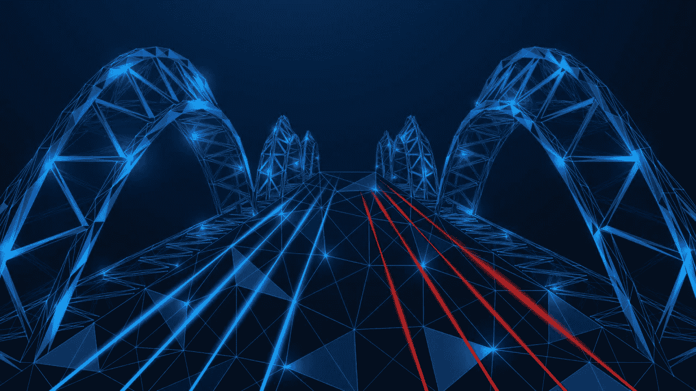

# 区块链桥讲解第 2 部分

> 原文：<https://medium.com/coinmonks/blockchain-bridge-explained-part-2-73dd24936ae0?source=collection_archive---------12----------------------->

互操作性是区块链领域一个非常重要的话题。新网络不断涌现，要么是独特的平台，要么是以太坊衍生的生态系统，协议从简单到复杂。因此，有大量的数据，许多新的令牌也变得可用。如果没有互操作性，所有这些都将限制其用途和价值。前一篇文章描述了各种类型的[区块链桥](/@DC.600/blockchain-bridge-explained-part-1-85487aaa81f)如何使跨链转移变得容易。本文列出了目前使用的一些顶级网桥，解释了跨链网桥的挑战，并简要介绍了多链世界的概念。

**区块链一些顶级桥梁**

[**Cross-chain bridge concept**](https://www.crosschainbridge.org/)

区块链空间有数百个主链和[侧链](https://coinsbench.com/what-is-sidechain-4d4dc912ec50)，第 1 层和第 2 层链，单个网络的数量高达近千个。当一个人加入到混合的不断[开发中时，一般来说，去中心化应用程序(dApps)，特别是去中心化金融(DeFi)平台](/coinmonks/what-is-ethereum-part-3-applications-12097472b9f9)，跨链桥的重要性就变得容易理解了。任何区块链迷都应该知道的一些主要桥梁包括:

1.  索拉纳的虫洞桥和入口
2.  多边形的桩证明(PoS)桥和等离子体
3.  雪崩桥
4.  币安智能链(BSC)桥

**Examples of blockchain bridges**

**虫洞和传送门**

对于那些不想使用以太坊的人来说，Solana 的区块链平台是一个选择。它支持低成本和快速交易，同时充当几个可扩展 dApps 的主机，尤其是在 DeFi 领域。它的虫洞是这些不同网络间交流的完美桥梁。索拉纳以这种方式连接的一些主要链包括以太坊、多边形、雪崩和 BSC 等。虫洞的[锁和造币](/@DC.600/blockchain-bridge-explained-part-1-85487aaa81f)功能也便于分别通过门户的令牌桥和 NFT 桥无缝转移包装的可替换和[不可替换令牌](/coinmonks/what-are-nfts-1082957a63a0) (NFTs)。

**多边形位置和等离子体**

以太坊的第二层多边形使用双区块链桥系统。Plasma 本质上是一个[侧链](https://coinsbench.com/what-is-sidechain-4d4dc912ec50)，与主链以及其他使用子链框架的平台相链接。高度可伸缩、快速、经济高效且不可信的 Polygon [PoS](/coinmonks/understanding-the-role-of-consensus-in-blockchain-db724fa63a53) 桥是在不同的区块链上实现更灵活的跨链数据和资产互操作性的首选。

**雪崩**

[**Avalanche Bridge webpage**](https://news.bitcoin.com/cross-chain-bridges-that-connect-5-different-blockchains-to-ethereum/)

在[上一篇](/@DC.600/blockchain-bridge-explained-part-1-85487aaa81f)中，雪崩桥的例子碰到了很多。它是连接以太坊和雪崩这两个第 1 层网络的链对链桥。它的令牌交换通过锁定和铸造过程进行。它还有一个额外的好处，让用户可以选择将资金保存在本机钱包中，还是转移到可配置的 Metamask [钱包](/coinmonks/learning-about-crypto-wallets-897a30f8f79a)。

**平衡计分卡**

[**Binance Smart Chain Bridge**](https://www.fiahub.com/en/blog/what-is-the-cross-chain-bridge%3F/)

币安智能链或 BSC 是一个可信的区块链桥梁，连接以太坊和币安之间的业务。它的 USP 包括[智能合同](/coinmonks/what-is-ethereum-part-1-smart-contract-74f259708792)功能，与以太坊通常高昂的天然气费相比低廉的运营成本，以及根据其默认 BEP-20 标准的令牌所有权，BEP-20 标准是 ERC-20 的兼容衍生。

除了这些主要的例子，其他一些值得一提的桥梁包括:

● **Tezos Wrap 协议**支持在利用各种 DeFi 协议之前对 [ERC-20 和 ERC-721](/coinmonks/what-is-ethereum-part-3-applications-12097472b9f9) 令牌进行包装。

[**Example of Ethereum-Tezos cross-chain bridge token transfer**](https://story.madfish.solutions/what-is-a-blockchain-bridge-and-how-does-it-work/)

● **Fantom** 通过集成 **AnySwap** 的跨链交换协议，在其生态系统与以太坊、BSC、Polygon、Cosmos、Polkadot 等之间疏导多重连接。

● **Ren Bridge** 在[比特币](/coinmonks/what-is-bitcoin-e98b2b77c81b)和以太坊区块链和加密货币之间建立联系，同时提供资产移植服务和使用 renBTC 等独特代币。

● **Synapse** 除了让用户通过押注其网络和利用其本地自动做市商(AMM)赚取被动收入之外，还支持无信任转移和资产交换。

● **SmartBCH 桥**连接比特币现金(BCH)主链和[以太坊虚拟机](/coinmonks/what-is-ethereum-part-2-design-c9b9f1b39fda) (EVM)驱动的 SmartBCH 侧链，此外还可以用包装的 SmartBCH 令牌交换 BCH，以用于多种 DeFi 解决方案。

**跨链桥的挑战**

跨链桥成功的最大挑战是导致价值数百万的加密货币被盗用的安全漏洞。这与互操作性三难困境的概念有着错综复杂的联系(不要与分散化、可伸缩性和安全性的[区块链三难困境](/coinsbench/what-is-sidechain-4d4dc912ec50)相混淆)。

简而言之，互操作性原则提出了三个问题，即桥是否:

● **不可信**(外部联合管理员组的存在意味着分散化的丧失，并暴露了黑客攻击的漏洞)

● **可扩展**(一个协议对另一个网络域的适应性)

● **可泛化**(无条件访问和处理所有跨域数据集的能力)。

区块链桥的一般经验法则是它们不能同时满足两个以上的属性。这确实是维持跨链解决方案的一个问题。

[**Interoperability trilemma**](https://blog.li.fi/what-are-blockchain-bridges-and-how-can-we-classify-them-560dc6ec05fa)

就安全互操作性而言，不管桥的[可信还是不可信](/@DC.600/blockchain-bridge-explained-part-1-85487aaa81f)性质，在具有可变保护措施的平台之间无限制的资产转移和交换总是会打开明显的安全漏洞的风险。臭名昭著的桥梁黑客攻击包括 thor chain(1000 万美元)，p Network(1200 万美元)，Poly Network(6.1 亿美元)，multi chain(300 万美元)，以及最近对 Solana 的虫洞(3.25 亿美元)和 Harmony 的地平线(1 亿美元)的攻击。

**多链宇宙的崛起**

当一个人知道区块链是如何产生和工作的时候，多链的概念就很容易理解了。与由同构块构建的单个[链相反，多链网络由多个区块链协议共享的异构数据组成。这可以潜在地消除桥的存在，并且通过扩展，消除互操作性三难问题。Polkadot 通过其与平行链系统或副链的互连能力推进了这一概念。它的网络基本上可以解决互操作性的所有方面，因为它可以通过称为 XCM 的跨共识消息格式(使其可扩展和可推广)在不同的](https://coinsbench.com/understanding-the-architecture-of-a-blockchain-f50ad412bdc4)[区块链](/coinmonks/what-is-blockchain-a7082404caa2)之间进行通信，并通过中继链在共享的安全框架中进行通信(使其不可信)。

[**Multi-chain universe example**](https://blogtienao.com/composable-finance-layr/)

多链宇宙构建的一个主要例子是 Composable Finance 在 Polkadot 生态系统上推出的下一代可互操作解决方案。它由用于信息共享的名为[毕加索](https://www.picasso.xyz/)的草间弥生副链和名为[马赛克](https://mosaic.composable.finance/)的跨链资产转移系统组成。

**结论**

多链宇宙依靠不同平台和生态系统之间的交流和协作蓬勃发展。然而，这个概念是新颖的，它仍在探索和试验中。因此，就具有成熟功能的互操作性解决方案而言，目前的答案在于[区块链桥](/@DC.600/blockchain-bridge-explained-part-1-85487aaa81f)。

**也读作:**

[*什么是区块链*？](/coinmonks/what-is-blockchain-a7082404caa2) *|* [*什么是侧链？*](https://coinsbench.com/what-is-sidechain-4d4dc912ec50) *|* [*区块链桥讲解第一部分*](/@DC.600/blockchain-bridge-explained-part-1-85487aaa81f)

跟随我:

[**LinkedIn**](https://www.linkedin.com/in/a600dc/)|[**Twitter**](https://twitter.com/dc_111)

联系人:**arnab.dc111@gmail.com**

> 交易新手？试试[加密交易机器人](/coinmonks/crypto-trading-bot-c2ffce8acb2a)或者[复制交易](/coinmonks/top-10-crypto-copy-trading-platforms-for-beginners-d0c37c7d698c)