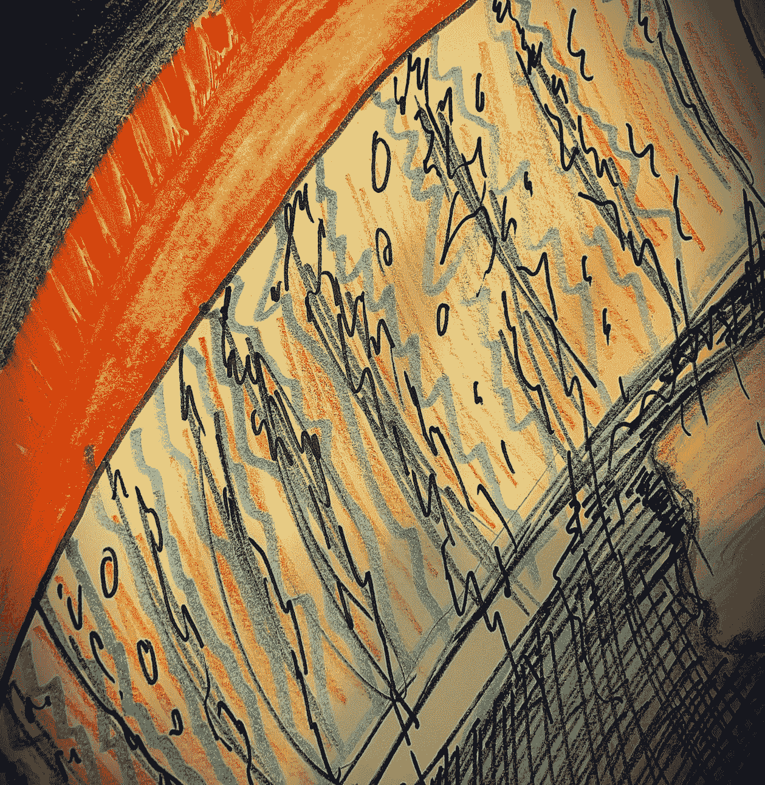

# Web3 商业系列— #7:元宇宙的阴暗面？

> 原文：<https://medium.com/coinmonks/blockchain-business-series-7-the-dark-side-of-the-metaverse-316a9ee664ea?source=collection_archive---------46----------------------->

Dark Side of the Metaverse — Martin El-Khouri

# **乌托邦**

生命点被填充到最大。我睡了一个好觉，吃了一顿丰富的早餐(0.0001 ETH)，并在我的全息桌面上浏览了比赛战术(0.0003 ETH/周)。还有 45 分钟，我就要在圣地亚哥伯纳乌的 V28 房间和其他队员见面了。我瞬间移动到我在马德里附近一个小镇的 800 平方米的别墅(12.8ETH)，坐上我全新的梅赛德斯 V-S63 AMG (1.2ETH)和 blast of(是的，我花了 0.15 ETH 来避免交通堵塞)。我手头有我需要的一切。因为我需要的一切都在我的菜单里。我到达体育场，向右滑动我的苹果 V-watch (0.00248 ETH)，选择我的皇家马德里足球队训练套件。(当然，我加入了球队，有资格在首发阵容中上场。完成了。准备好了。

梦想成真了。我是冠军联赛决赛的前锋，我将穿上传奇的白色球衣。好吧，这是虚拟冠军联赛，每季度举行一次，但不管怎样。我赎回我的 NFT，进入小屋。从训练服换成比赛服。

我和我的队友一起走进球场，知道有 100 万人在看。活下去。在体育场。我看到了所有这些美丽的、有时甚至是怪异的面孔——头像可能真的很奇怪。他们在看。我是皇家马德里的 7 号。今天，我们将在冠军联赛决赛中对阵巴塞罗那足球俱乐部。

这是真的。但这是在一个平行的世界里，另一个我被连接到科技，同时，呼吸，但高度镇静。欢迎来到元宇宙。

# **反乌托邦**

120 分钟和 1 次点球大战后，比赛结束了。我们赢了。我刷了一下我的苹果手表——看到我的生物特征数据进入了暗黄色区域。我选择“机房”。一切都变得黑暗。

我睁开眼睛。我正坐在一把过度使用的椅子上。我用右手摘下眼睛上的两个隐形眼镜，关掉贴在额头上的传感器。我在一个 20 平方米的公寓里。我饿了。冰箱里空空如也，除了一些过期 3 天的牛奶，还有一些又旧又干的面包。我吃它。我必须这么做，我负担不起更多的费用，而且镇静剂在空腹时效果不好。维护这台机器变得极其昂贵。而我唯一的收入来源就是虚拟世界。我的生活是数字化的。其他许多人也是如此。物理领域只维护一个需要加油的浅层机器。我的身体是硬件。我不是唯一的一个。我就是这 80%中的一员。

给你。这是当道决定我们这个月的主题将被命名为“元宇宙的黑暗面”时，你想要读的，对吗？嗯，没那么容易。

# 让我们后退几步

我忍不住像往常一样，通过强调我们生活的时代是多么独特来开始这一集。当然，我有偏见。除了我现在正在经历的，我还没有经历过生活中的其他事件。通过注意这些特性，通过观察细节，我可能会影响结果。但对我来说，我们生活的时代似乎不同了，而且有证据表明。世界从未如此紧密相连。内在的、相互的和彻底的毁灭的威胁从未如此有意识地存在过。事实上，一切都变得全球化了，无论是好的还是坏的。经济、关系、供应链、家庭聚会、文化运动、战争、流行病、网络、宠物。

我们生活的世界充满了各种便利设施。面对看似不断增长的经济奇迹，全球化平均来说提高了我们的生活水平，但它只知道一条轨迹。向上。虽然一切都在全球化，但世界同时也变得数字化了。随着这一过程的继续，我们可能正在接近一个完整的、沉浸式的、数字化的存在状态。

# **为什么这是必然的**

# **人口增长**

尽管增长率在下降，但人口增长的轨迹也是向上的。自二十世纪中叶以来，世界人口增长了两倍多，2022 年达到近 80 亿人。联合国预计，到 2100 年左右，全球人口将增长至近 110 亿。这些灵魂需要培养和娱乐。但是，资源分配显然没有遵循同样的模式。正如联合国所描述的:

“人口增长增加了经济总需求，从而加大了压力。推动全球经济实现更大的可持续性，将需要人口和经济活动的增长与资源开采、废物产生和环境破坏的进一步加剧逐步脱钩。因此，实现可持续性将主要取决于人类在消费和生产中提高资源效率以及使经济增长与环境破坏脱钩的能力和意愿。”

# 自动化正在吞噬你的工作

这一集不是关于可持续性的。这关系到我们能负担什么和不能负担什么。我们似乎根本没有资源来养育、娱乐和雇佣 110 亿人——至少现在还没有。

根据普华永道进行的一项研究，仅在未来十年，三分之一的工作岗位可能会消失。到 21 世纪 30 年代中期，约 30%的工作面临自动化的潜在风险。然而，如果我们从理论上接近劳动力市场，情况甚至更加严峻。

如果我们暂时忽略法律和政治框架，那么——理论上——每一个执行流程的工作都可以被取代。然而，不能自动化的是创造力。因此，创建流程的工作是不可替代的。

让我们简化一下，假设 20%的劳动力创建了由 80%的劳动力执行的流程。如果机器人和过程自动化达到足够高的技术复杂度和经济可行性来取代 80%的过程，这将使 64%的现有劳动力失业。

在通货膨胀上升、生活费用飞涨、资源变得比以往任何时候都更加稀缺的时候，大多数人将很难负担得起生活。在一个无限的空间中，我们将需要新的财富创造来源，在这个空间中，稀缺作为价值的决定因素而存在，但不是以我们赖以生存的有限生态系统的形式存在。换句话说:一个没有地球缺点的世界。

随着区块链技术解决了数字空间中的双重花费问题，而不需要中介，真正的替代生活变得更加现实。所有权的概念是游戏规则的改变者。事实上，我们可以在数字领域拥有稀缺的资产，这使得虚拟现实中的生活令人向往，正如从总体上鸟瞰我们的生活一样，这种生活(希望)不受任何中央实体的控制。这是元宇宙。

# **什么是元宇宙？**

这个术语是在尼尔·斯蒂芬森的科幻小说《冰雪奇缘》中创造的。它表示基于虚拟现实的互联网替代品。这部小说发生在 21 世纪初，描绘了一个黯淡的未来，全球经济已经内爆，联邦政府已经将大部分权力交给了少数几家大型企业。

*“元宇宙是一个救援的地方，小说中的主角是一个破产的电脑黑客和比萨饼送货员，名叫弘主角，他在那里度过了所有的时间。他戴着防护眼镜和耳机进入元宇宙，并以他在数字世界中定制的化身出现。在那里，虚拟角色可以走在一条又长又宽的大道上，这条大道两旁是绵延数千公里的游乐园、商店和娱乐中心。收入较低的个人经常使用公共终端进入元宇宙。拥有更先进设备的个人往往看不起那些拥有不太先进设备的人。”*

我们还没有到那一步。至少对我来说，真实的世界仍然太美好了，以至于不能切换到一个永久的数字替代物，而且技术还不够成熟，不能提供一种全方位的替代体验。但是从技术角度来说，我们正在达到这一步，这就是 Web3 的意义所在。Web3 是一种状态，其中生活本身越来越数字化。它可以被视为一个通向完全数字化和虚拟生活的概念。我们在这个过程中已经走了很远。

# **真正要做的生意**

可能导致元宇宙的 Web 3.0 的展开不仅是不可避免的，而且是许多人所期望的，从经济角度来看也是极其可行的。这个世界可能不是真实的，但确实有生意可做。

根据麦肯锡的数据，2021 年，进入元宇宙的风险投资和私募股权基金达到 130 亿美元，到 2030 年，元宇宙的价值可能达到 5 万亿美元。2022 年，对元宇宙空间的投资已经是 2021 年全年的两倍多。

称之为乌托邦、反乌托邦或混合体，消费者和品牌已经开始参与其中。围绕社交、娱乐、游戏、旅行和购物的活动被认为特别令人兴奋。NFT 将成为一种驱动力，因为它们允许我们在虚拟世界中体验数字所有权——如果你不能吹嘘，为什么要买 LV 包或奔驰，对吗？这种说法完全无视经济的复杂性，一个 NFT 可以团结起来。

时装业看到了一个低成本高回报的环境，规模空前，零浪费。汽车制造商、飞机工程师、游艇等也是如此。

品牌看到了机会。企业看到了机会。机会是巨大的，因为这是不可避免的。

# 需要是发明之母

需要是发明之母。必要性清楚地表明，我们需要一个新的空间和时间框架，我们的大部分消费行为都发生在这个框架中。需要创造新的就业机会，新的经济模式，以及一个虚拟世界，在这个虚拟世界中，我们人类的许多低效行为不会造成太多伤害。

我个人认为，元宇宙的阴暗面不一定只存在于元宇宙本身。它的黑暗之处在于创造必然性的原因。全球 64%的劳动力可能会失去工作，或者在未来十年里，30%左右的劳动力会失去对营养、食物、能源等的需求。110 亿人自然拥有的。然而，如果产品、服务和娱乐在虚拟世界中是负担得起的，并提高了所有在现实世界中负担不起这些便利设施的人的生活质量，这难道不是一件好事吗？如果我们可以满足我们对娱乐和体验的需求，对品牌和地位的需求，如果我们可以在不使用织物，水，油，气，皮革，锂的情况下做到这一点，难道这不是值得努力的事情吗？

最终，它归结为两个方面:

就资源分配而言，它实际上是净正的吗？以及:这样一个地方是如何治理的？

我相信生活中很少有像控制数字世界的中央集权实体那样反乌托邦的。随着巨大的力量而来的是巨大的责任，那些掌管着无限世界的人是极其强大的。在一个乌托邦式的故事中，元宇宙是以分权的方式治理的。在一个反乌托邦的世界里，我们可以在任何时候被关掉。

所有权经济这个术语并不意味着你拥有数字“东西”，它意味着你承担责任。像往常一样，是人们决定了这个故事将如何展开。元宇宙是不可避免的。结果还没有决定。所以让我们确保我们做对了。

> 交易新手？试试[加密交易机器人](/coinmonks/crypto-trading-bot-c2ffce8acb2a)或者[复制交易](/coinmonks/top-10-crypto-copy-trading-platforms-for-beginners-d0c37c7d698c)