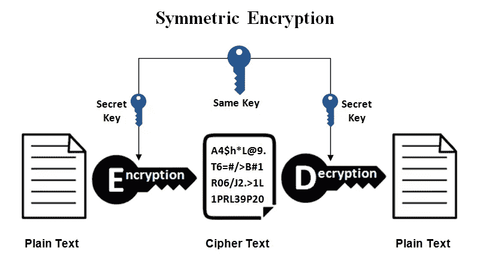

# 区块链和组件(简介)

> 原文：<https://medium.com/coinmonks/blockchain-components-introduction-efa078fd0c73?source=collection_archive---------17----------------------->

Introduction to blockchain & blockchain components

# 介绍

**“比特币”**你可能知道或者听说过。但是，**【区块链】**你知道吗？。嗯，你可能会说这是比特币技术或者如果你了解它，你会说**“这是比特币内置的技术”** &没错。大多数人认为区块链是比特币的技术，这是一个很大的误解。因此，在**“区块链宇宙”**系列中，我们将从基础开始讨论区块链技术，区块链的工作方式，如何创建区块链&区块链的安全方面，其中包含可能发生在区块链的威胁&攻击。

# 什么是区块链？

它是一个记录链(块),包含分布在分散网络中的信息和数据记录。这就是区块链。现在，你在想**【去中心化网络】**是什么意思？。为了清楚地了解区块链，我们需要了解区块链的组成部分。因此，当我们把这些部件结合在一起时，我们将能够解释区块链是如何工作的。

# 区块链历史

你可能认为区块链技术是新的。但是，其实自**【90 年代】**以来，区块链的概念就一直存在。直到 2009 年，随着一种新型货币**“数字货币”****“比特币”的问世，区块链诞生了。**在区块链技术&的应用经历了一次大的更新&进化之后，我们将在我们的**区块链宇宙**系列中讨论所有这些更新&进化。

# 网络类型

默认的**“网络”**定义，即两台或多台主机一起交换信息，大多数时候网络只有一个控制网络的机构**“集中式网络”**。

## 网络类型:

*   *集中式*
*   *分散*
*   *分发*

> 集中式网络:

Centralized Network

这种类型的网络有一个控制网络的权威节点(服务器),所有的节点都连接在一个权威之下&只有特权用户才能访问。

## 优势:

*   **配置和部署:**您可以轻松地配置和部署集中式网络，因为只有一个机构，配置和部署起来花费的时间和精力更少。
*   **易于添加&移除“控制”节点/客户端:**单一授权为您提供了一种控制其下连接的客户端/节点的简单方法。因此，添加/删除或控制节点很容易。
*   **更少的设备:**启动一个集中的网络需要更少的设备，因为它是通过一个机构提供的。
*   **可扩展性:**通过单一授权机构扩展集中式网络很容易，但这需要更多设备和更多资金来获得合适和匹配的资源来扩展网络。

## 缺点:

*   **停机&延迟:**由于只有一个服务器/节点在做所有的工作，更多的工作将导致网络延迟&停机，因为流量很大，并且在单个节点上中继。所以，网络要慢了。
*   **高安全风险:**集中式网络风险更大，存在一个节点/服务器集中控制网络。如果节点/服务器受损，这意味着整个网络受损，并且很容易操纵存储在单个节点/服务器上的数据。
*   **单点故障:**如果节点/服务器因其上的网络中继而停机。结果，整个服务将会停止，这使得业主的生意失败。

> 分散网络:

Decentralized Network

**“分散网络”**包含不止一个机构，没有任何单个核心来控制网络，这为网络提供了灵活性和速度。并且每个机构都有数据的副本。

## 优势:

*   **高安全性:**由于网络不是集中式的。很难跟踪网络上的用户，因为它不通过一个单点，这为用户提供了更多的隐私。当权威机构受到危害时，将很难操纵数据，因为每个权威机构都有一个副本，所以很容易检测到数据是无效的并且被改变了。
*   **性能:**分散式网络提供高性能和高速度。因为，工作和任务被分配给多个服务于网络的权威机构。
*   **可用性:**我们知道，分散式网络有不止一个权限。因此，如果一个机构关闭，其他机构就会启动，这意味着网络将继续运行。
*   **可扩展性:**分散式网络提供了硬可扩展性。但是，由于有多个节点/服务器服务于网络，成本较低，因此扩展不成问题。

## 缺点:

*   **高成本:**节点相互连接，协同工作，使得维护成本更高。
*   **多设备:**为有多个节点。分散的网络需要更多的机器/节点来工作并服务于用户&其他节点。

> 分布式网络:

Distributed Network

**“分布式网络”**没有单点授权，所有节点彼此平等，所有节点共享相同的数据。这些类型的网络为我们提供了高性能和零停机时间。

## 优势:

*   **容错:**由于这类网络的分布式架构。如果一个节点停机，它对网络没有任何影响，网络将保持可用，这使得停机率为 0%。
*   **高透明度:**操纵或破坏给我们提供高透明度的网络数据在这里令人窒息。

## 缺点:

*   管理:不幸的是，在所有类型的网络中，管理这种类型的网络是最具挑战性的，因为只需对网络的所有节点进行一次更改，它就会被阻塞。
*   **维护:**由于节点的分布，分布式网络比所有网络更难维护，并且没有调试或监控节点的中心点，这要花费很多钱。

# 区块链类型

正如我们讨论的区块链网络类型。根据我们的用途和需求，我们可以将区块链分为以下三种类型:

*   *公有区块链*
*   *私有区块链*
*   财团/联盟区块链

> 公共区块链

**“公共区块链”**是一种无需许可的区块链和分权制。任何人都可以加入它，并拥有阅读、写作和参与公共区块链的权限。

## 特点:

*   **访问:**任何人都可以访问并使用公共区块链。
*   **当局:**区块链正在与分散网络合作。
*   **速度:**由于这个区块链的知名度，任何人都可以访问，这意味着将会有大量的人使用它。因此，与专用区块链相比，该网络将会很慢。
*   共识:公共区块链是不需要许可的。
*   **成本:**成本&公立区块链的费用(例如:交易)比私立区块链高。
*   **数据处理:**每个人都有读&写权限。
*   **不变性:**在公共区块链上创建的块或记录不能被修改或删除。

> 私有区块链

一个**“私人区块链”**被许可，只有被允许加入网络的人才能访问它。

## 特点:

*   **访问:**只有一个所有者(组织)可以访问。
*   权力:私立区块链的权力已经部分下放。因为，最终它属于一个所有者(组织)。
*   速度:与公共区块链相比，私人区块链效率高。
*   **共识:**私人区块链被允许。
*   **数据处理:**给一个组织的读&写权限。
*   不变性:私有区块链是部分不可变的。因为，最终它属于一个所有者(组织)。

> 财团/联盟区块链

一个**“联合体/联合区块链”**是半中心化的。只有少数组织可以访问它，这是半公开的区块链，可以在组织之间使用。

## 特点:

*   **访问:**很少有组织能够访问它。
*   **权威:**财团/联盟区块链是半中心化的。因为，最终它属于少数所有者(组织)。
*   **速度:**联盟/联合区块链仍然高效，因为只有少数人能够访问它。
*   **共识:**联合体/区块链联邦被许可。因为，这不是公开的，而是半公开的。
*   **数据处理:**给予多个组织的读&写权限。
*   **不变性:**财团/联邦区块链是部分不可变的。因为，最终它属于少数组织。

# 区块链是如何运作的？

我们需要知道**“点对点(P2P)”**网络这是区块链的关键部分，一个 P2P 网络基本上是让节点互相验证和执行交易(在比特币交易的情况下)而没有任何集中点。我们将以银行交易为例，并将其与基于区块链的**“比特币”**交易进行比较。

> 银行交易

Bank Transaction

**“用户 A”**正在向**巴勒斯坦的**“用户 B”**汇款，为了完成**的交易，您必须作为汇款人**“用户 A”**&收款人**“用户 B”**和**“用户 B”**的国家(即**“巴勒斯坦】**共享您的信息，所有这些信息将共享给银行，然后由银行共享然后在最后交付给**【巴勒斯坦】**中的**【用户 B】**。

在这个交易中，由于信息是共享的，而且还有第三方，所以隐私更少。并且交易被跟踪。这笔交易需要几天时间才能完成。

> 比特币交易

Bitcoin Transaction

**【用户 A】**直接向**【巴勒斯】**的**【用户 B】**汇款，无需任何人或集中点介入，完成交易。

在这个交易过程中，由于每个用户的信息不共享，因此保密性很高。完成交易需要几秒/几分钟。这意味着提供匿名和更少的时间消耗。

# 区块链组件

*   *密码术*
*   *共识算法*
*   *分布式台账*
*   *分散网络*

以上组件我们之前在**【Part-1】**中提到过。现在，我们将深入讨论它。

> **密码术**

Cryptography

## 什么是密码学？

基本上，**“密码术”**是通过对给定数据执行一些算法操作来创建不同且不可理解的数据格式以确保其机密性的保护信息的科学/艺术。

*   *例子:*

Example on how cryptography changing the data format

现在，我们可以使用 3 种方式/类型将它应用于信息，如下所示:

*   *编码*
*   *散列法*
*   *加密*

> 编码

**“编码”是使用公共算法将数据格式转换成一种新格式的过程，并且可以反转为原来的格式。因此，这是一个 2 路首先是**&**【解码】**，它逆转了**【编码】**过程，把数据恢复成原来的格式。****

## ****示例:****

****编码有很多种。但是，我们要用的类型叫做**【base64】**。我们将用来展示这个例子。****

********

****Encoding example****

****上面的截图显示的是**“hydrax chain”**字的**“编码”**。****

****下图为**【ahlkcmfy2hhaw 4k】**的**【解码】**，也就是**【hydraXchain】**的**【编码】******

********

****Decoding Example****

> ****散列法****

******“散列”**是一种单向过程，它将给定的数据格式改变成另一种格式的固定长度。****

## ****示例:****

****有许多散列算法。但是，在我们的例子中，我们将使用**“MD5”**散列算法。****

********

****MD5 hashing example 1****

****如你所见**“MD5”**哈希为**“hydrax chain”**。如果我们改变了后者，整个结果就会改变。但是，它将具有相同的固定长度。****

********

****MD5 hashing example 2****

****我们可以看到，通过用小写**“X”**替换大写**“X”**，整个值发生了变化，但长度仍然相同。****

> ****加密****

******【加密】是一个双向过程，如**【编码】**，将数据格式改变为全新的格式，称为**【密文】**，只有授权的人才能使用**【秘密密钥】****【解密】**加密的数据为原始格式。******

****有两种类型的加密:****

*   *****对称*****
*   *****不对称*****

## ****对称:****

********

******“对称”**是指密钥同时用于加密和解密功能。****

## ****不对称:****

********

******【非对称】**是使用一对相关的密钥一个公钥和一个私钥对消息进行加密和解密，并保护其免受未经授权的访问或使用的过程。****

> ******共识算法******

********

****Consensus Algorithm****

******“一致算法”**基本上是对来自网络 e.x 中的节点的数据值的一致(对于要完成的交易，它需要来自网络中的节点的确认)。****

****注意:***A****【Miner】****是以信任的方式确认和验证交易并获得添加到区块链的新块的节点。*******

****以下是不同类型的**“共识算法”:******

*   ******工作证明(PoW):** 工作证明是一种软件算法，由**【比特币】**和其他区块链使用，以确保块只有在需要一定的计算能力才能产生时才被视为有效****
*   ******利益证明(PoS):** 加密货币协议用来达成共识的算法。在 PoS 区块链中，通过算法选择一个人或一组人，根据他们在网络中作为一种抵押品押下或锁定的令牌，用计算机硬件验证交易。****
*   ******授权证明(PoA):** 与区块链一起使用的一种算法，它通过基于利益相关者身份的共识机制交付相对较快的交易。****
*   ******容量证明(PoC):** 区块链使用的共识机制算法，允许网络中的采矿设备使用其可用的硬盘空间来决定采矿权和验证交易。****
*   ******运行时间证明(PoET):** 由英特尔公司开发的一种共识算法，允许区块链网络确定谁创建下一个块。PoET 遵循一个抽签系统，在网络参与者之间平均分配中奖机会，给每个节点相同的机会。****

****更多:[https://www . geeks forgeeks . org/consensus-algorithms-in-区块链/](https://www.geeksforgeeks.org/consensus-algorithms-in-blockchain/)****

> ******分布式台账******

********

****Distributed Ledger****

## ****什么是账本？****

****分类账是记录账户交易的账户集合。每个账户都有一个期初或结转余额，每笔交易都要分别记为借方或贷方，以及期末或期末余额。****

> ******分散网络******

******“分散网络”**包含不止一个机构，没有任何单个核心来控制网络，这为网络提供了灵活性和速度。并且每个机构都有数据的副本。我们之前已经解释过**【去中心化网络】**。****

# ****结论****

****不要忘记在我们将讨论的下一部分中进行更深入的搜索，深入研究区块链流，以及如果没有任何银行或集中点来验证和确认交易，交易如何被视为有效。以及被认为是区块链工作的关键部分的区块链组件/特征。此外，我们还会练习&我们不会忘记开发和安全部分。****

> ****关注我们(团队):****

*   ******泽亚德·阿齐马******

****[*Linkedin*](https://www.linkedin.com/in/zer0verflow/?source=about_page-------------------------------------)*——*[*Twitter*](https://twitter.com/AzimaZeyad?source=about_page-------------------------------------)*——*[*Github*](https://github.com/Zeyad-Azima?source=about_page-------------------------------------)****

*   ******穆罕默德·胡萨姆·阿尔泽亚特******

****[*Linkedin*](https://www.linkedin.com/in/mhzcyber/?source=about_page-------------------------------------)*——*[*Twitter*](https://twitter.com/mhz_cyber?source=about_page-------------------------------------)*——*[*Github*](https://github.com/mhzcyber?source=about_page-------------------------------------)****

> ****交易新手？尝试[加密交易机器人](/coinmonks/crypto-trading-bot-c2ffce8acb2a)或[复制交易](/coinmonks/top-10-crypto-copy-trading-platforms-for-beginners-d0c37c7d698c)****