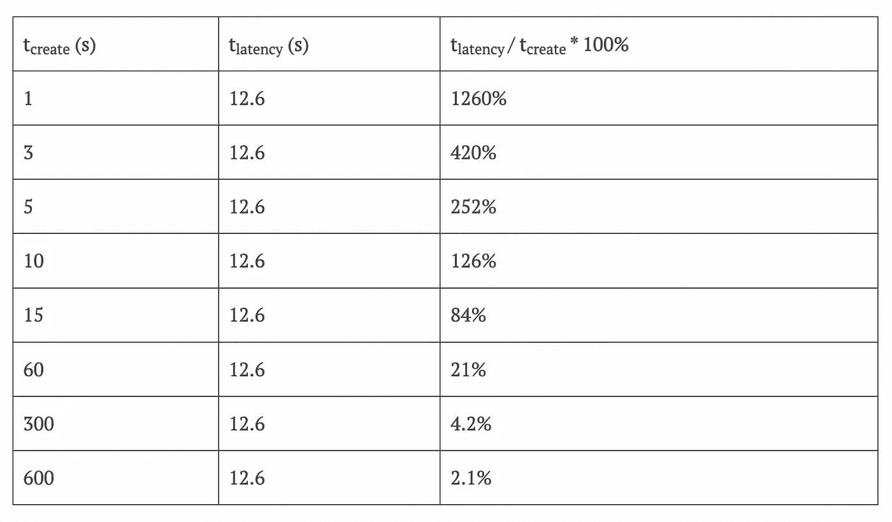

# 使用拼图的区块链共识

> 原文：<https://medium.com/coinmonks/blockchain-consensus-using-a-puzzle-9dbbed2129fc?source=collection_archive---------25----------------------->

## 区块链

[在上一篇文章](https://www.thearmchaircritic.org/mansplainings/establishing-an-order-of-transactions-in-blockchain)中，我们看到了如何通过散列事务在区块链中对事务进行排序。然而，这本身无助于达成共识，因为我们还没有找到一种方法来解决我们在那篇文章中谈到的困惑。在本文中，我们将看到如何通过引入一个谜题来解决这一困惑并达成共识。

在上一篇文章中，我提到了在实践中，餐厅不会立即接受我的交易。这是因为我与餐馆的交易是在一个分支机构。当一个链有分支时，分支中的事务不能被信任，因为最终只有一个分支会存活下来，而其他分支将被忽略。

但是我们如何决定保留哪个分支，丢弃哪个分支呢？我们可以简单地选择最长的分支并保留它，而忽略其他的。但这带来了一个新问题。

事实上，每秒钟将发生数千个事务，我们的解决方案无法很好地扩展。随着参与节点创建越来越多的事务，分支将呈指数级增长。很快，我们将有太多的困惑要解决，以至于区块链永远不会稳定。

# 解决困惑

我们如何解决这个问题？一种方法是允许节点轮流执行它们的事务。但是在不确定有多少个节点的情况下，我们如何决定转弯呢？在区块链网络中，任何节点都可以随时离开或进入。所以，这是不可能的。

如果我们能减缓交易速度呢？如果我们能确保每单位时间只能创建一个事务，我们就能防止指数分支。但是我们如何降低交易的速度呢？这是通过增加创建交易的难度来实现的。

那么，我们如何使创建事务变得困难呢？通过引入一个难题！解决难题的第一笔交易获得批准，并被添加到分类账中。但是需要多长时间呢？

> 交易新手？在[最佳加密交易](/coinmonks/crypto-exchange-dd2f9d6f3769)上尝试[加密交易机器人](/coinmonks/crypto-trading-bot-c2ffce8acb2a)或[复制交易](/coinmonks/top-10-crypto-copy-trading-platforms-for-beginners-d0c37c7d698c)

# 解决这个难题需要多长时间？

让我们假设破解一个难题所需的时间是 t 创建，并且网络中的所有节点接收该事务需要 t 延迟。如果我们考虑 tcreate 值为 10s，tlatency 值为 60s，那么当网络中的所有节点都收到首先创建的事务时，我们将有 6 个新事务。这意味着我们现在可能有多达 7 个分支机构。不太理想但也没有之前的情况那么糟糕。

分支少了，稳定性就多了。然而，当我们最终选择一个分支时，节点放入其他分支的工作将被浪费。我们能减少这种浪费吗？如果有，如何实现？

这里有两个参数——t latency 和 tcreate。您可以看到，t 延迟值越高，这种损耗的窗口就越大。如果 t 延迟可以降低，那么我们可以减少最终被丢弃的事务的数量。但是我们如何降低测试延迟呢？[2013 年写的一篇论文](https://tik-old.ee.ethz.ch/file//49318d3f56c1d525aabf7fda78b23fc0/P2P2013_041.pdf)声称传播到 95%的网络需要 12.6 秒。为了进一步减少这种延迟，我们必须对网络进行结构和架构上的改变，这是不可能的，因为你不可能让网络中的每个节点都对其网络进行这种改变。此外，提高网络速度也有技术限制。

那么，如果我们不能降低死亡率，我们能做些什么呢？如果我们不能减少 t 延迟，那么缩小窗口的唯一选择就是增加 tcreate，即解决难题所需的时间。

# 减少浪费

让我们看看下表:

这里的直觉是，一旦我们创建一个新事务并广播它，节点在接收到广播事务之前创建新事务的工作就是浪费精力。我们可以通过将 t 延迟除以 t 创建来表示这种浪费，并将其表示为百分比。如表所示，我们通过增加 tcreate 来减少浪费。

然而，增加创建一个事务所花费的时间，只是为了减少节点等待广播事务时创建新事务所浪费的时间，这似乎是违反直觉的。这就像一家餐馆花更多的时间来准备一道菜，以便在交付给客户的过程中花费的时间看起来很少。

# 一个耗时的谜题其实是好的

但是正如您稍后将看到的，创建一个事务所花费的更长时间实际上有助于增加我们的区块链的健壮性。再次使用餐馆的例子，把它想象成餐馆用更长的时间花更多的精力准备菜肴，使它更美味。

因此，我们不能认为破解这个难题的努力是一种浪费。他们把时间和精力投入到一场比赛中，以成为第一个解决这个难题的人。跑输一场比赛没关系。但是跑一场已经结束的比赛是愚蠢的。因此，一个事务试图在另一个事务已经解决了这个难题之后再去解决它是愚蠢的。

因此，通过增加 t create，我们可以确保在潜伏期浪费的精力比解决难题的精力要少。此外，当 tcreate 大于 tlatency 时，我们确保节点不能在等待时间期间创建新的事务，因为节点甚至会在完成拼图之前接收广播事务。

因此，我们减少了浪费，提高了稳定性，并通过减少新交易的难度，使区块链变得更加稳健。我们使用谜题使创建新交易变得困难。在下一篇文章中，我们将看到这个难题是如何工作的。

*原载于 2022 年 12 月 3 日*[*【https://www.thearmchaircritic.org】*](https://www.thearmchaircritic.org/mansplainings/blockchain-consensus-using-puzzle)*。*