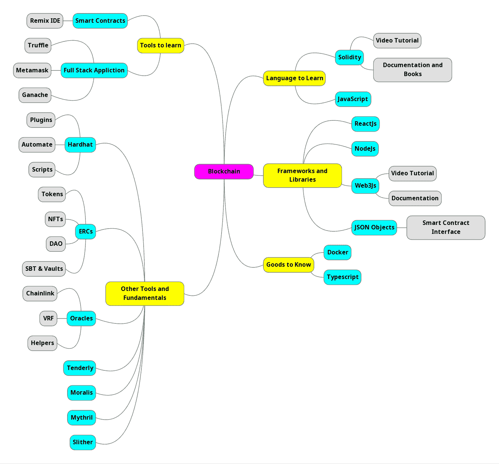

# 区块链开发者路线图！

> 原文：<https://medium.com/coinmonks/blockchain-developer-roadmap-83e7f64a770f?source=collection_archive---------10----------------------->

我确信，如果你正在读这封信，那么你会对区块链感兴趣。对吗？

所以，如你所知，这项技术是明天的未来，所以，我们必须为此做好准备。你有没有想过，如何在 2022 年成为一名区块链开发者？获得区块链开发者角色的学习曲线是怎样的？

好了，今天我们就来简单讨论一下这个。

# 区块链！

在进入开发者路线图之前，首先，我们必须了解什么是区块链，为什么它现在如此流行和流行。

简单地说，它是一个数据库，用来存储 SQL 和 NoSQL 之类的数据。区块链是一个公共和分散的数据库，我们可以在其中安全地存储我们的数据。而且，为了开发一个端到端的应用程序，我们需要一个前端、后端和一个数据库。为此，我们必须学习成为全栈区块链开发者所需的所有东西。

让我们探索完整的全栈区块链开发。

# 路线图！

首先，我们将讨论区块链开发者需要了解哪些语言。

**需要了解的语言**

开发东西的重要部分是编码语言。区块链就是智能合约，我们将在其中编写所有的业务逻辑和功能。为此，我们需要稳定。

*是的，坚实！*

可靠性是写智能合同的语言，主要是在以太坊区块链。坚固性是 Javascript、Java 和 C++的混合。如果你意识到这些语言，那么你会发现扎实更容易学习。有大量的在线视频教程可供学习。但是我更愿意首先浏览官方文档来理解核心概念。也可以参考以太坊和 Solidity 的书来读概念。

*最佳参考书籍:Andreas M . Antonopoulo 和 Gavin Wood 博士的《掌握以太坊》*

**要学习的框架和库**

只有扎实，我们无法开发出完整的 app。正如我早些时候告诉你，区块链是一个数据库，我们需要一个完整的应用程序后端和前端。为此，我们需要一些框架和库。

1.  反应
2.  结节
3.  Web3。射流研究…

React 是一个用于创建前端应用程序的流行库。我们还需要理解 Node.js 的概念，以创建完整的全栈应用程序。最后，web3js 是用于创建分散式应用程序的库。为此，您可以关注视频和官方文档。

> 交易新手？尝试[加密交易机器人](/coinmonks/crypto-trading-bot-c2ffce8acb2a)或[复制交易](/coinmonks/top-10-crypto-copy-trading-platforms-for-beginners-d0c37c7d698c)

**学习工具**

工具是建造东西最重要的东西。在区块链开发路线图中，我们需要一些重要的工具，这些工具使我们的开发工作更加容易。为了开发智能合同，我们需要一个可以编写智能合同代码的 Remix IDE。为了测试我们的代码，我们需要 Ganache，为了与区块链后端交互，我们需要 Metamask。

*区块链开发工具*

1.  混合 IDE
2.  松露
3.  元掩码
4.  加纳切

**基础和其他工具学习**

不仅是语言和工具，基础知识也是最重要的。如果你没有打下坚实的基础，那么你就无法开发出优秀的应用程序。对于一个成功的区块链开发者来说，有很多东西需要学习。下面是一些需要学习的最重要的东西。

1.  代币
2.  非同质化通证
3.  数据访问对象(Data Access Object)
4.  SBT 和金库
5.  神谕
6.  柔和地
7.  道德家，米西里尔和斯利瑟

**还有更多！**

酷:)

这是一个区块链开发者的路线图，主要是在以太坊平台上。有很多东西要学。

我知道这不是一条小路。但我知道，你可以。也许不会马上，但肯定会。

谢谢你把这个读出来。新文章再见:)

点击此处访问[路线图](https://atlas.mindmup.com/2022/07/3af3495005b711edbfe22ff9aec7627e/blockchain/index.html)

> *加入 Coinmonks* [*电报频道*](https://t.me/coincodecap) *和* [*Youtube 频道*](https://www.youtube.com/c/coinmonks/videos) *了解加密交易和投资*

# 另外，阅读

*   [Bookmap 点评](https://coincodecap.com/bookmap-review-2021-best-trading-software) | [美国 5 大最佳加密交易所](https://coincodecap.com/crypto-exchange-usa)
*   [加密交易机器人](/coinmonks/crypto-trading-bot-c2ffce8acb2a) | [造币评论](https://coincodecap.com/coingate-review)
*   最佳加密[硬件钱包](/coinmonks/hardware-wallets-dfa1211730c6) | [Bitbns 评论](/coinmonks/bitbns-review-38256a07e161)
*   [新加坡十大最佳加密交易所](https://coincodecap.com/crypto-exchange-in-singapore) | [购买 AXS](https://coincodecap.com/buy-axs-token)
*   [红狗赌场评论](https://coincodecap.com/red-dog-casino-review) | [Swyftx 评论](https://coincodecap.com/swyftx-review)
*   [投资印度的最佳密码](https://coincodecap.com/best-crypto-to-invest-in-india-in-2021)|[WazirX P2P](https://coincodecap.com/wazirx-p2p)|[Hi Dollar Review](https://coincodecap.com/hi-dollar-review)