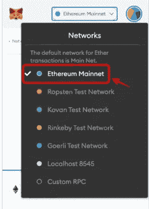

# 区块链 Web3.0 发展路线图

> 原文：<https://medium.com/coinmonks/blockchain-development-roadmap-416f22802fe2?source=collection_archive---------10----------------------->

近年来，区块链科技因比特币而出名，这是区块链科技的第一个项目。现在有许多部门正在采用这项技术，如**银行、网络安全、供应链管理、医疗保健、保险、政府、**等。

区块链是一个**共享的、不可变的账本**，它促进了商业网络中记录交易和跟踪资产的过程。它是一个区块链，一个区块包含数据库(**对等网络)。**这是一项**安全技术，很难破解**，因为一旦记录，任何块中的数据都无法在不改变所有后续块的情况下进行追溯更新。

# 区块链的三大支柱

## 皮勒 1:权力下放:

区块链是分散的，因此没有一个人或团体拥有控制权，而是所有用户集体保留控制权，并由分散在世界各地的专用计算机的开放网络运行。

## 皮勒 2:透明:

透明在区块链意味着零隐私。所有交易都是公开的，网络上的任何人都可以查看。同样，区块链是开源软件，这意味着任何人都可以查看它的代码。

## 皮勒 3:不可改变:

不可变意味着不能被改变的东西。也就是说一旦在区块链发生了什么？它不能被改变。如果有人试图改变这一点，他们必须在所有块中进行更新，这是不可能的。

# 区块链发展

有两种类型的区块链开发:

## 1.核心区块链发展:

这些都是区块链的技术平台，支持广泛的分散应用，它就像一个汽油泵，给汽车提供燃料。核心区块链的著名例子是以太坊，卡尔达诺等。

## 2.区块链 Dapp

Dapps 是分散的应用程序，可以使用核心区块链平台来支持和开发。对于 Eth，他们使用智能合约进行逻辑分析。Dapps 的一些例子是 Axe infinity、OpenSea、Pancakeswap、Alien words、Metamask、分散的等等。几乎 90%的开发人员是 Dapp 开发人员，在微软、Cognizant、Tech Mahindra、IBM 和摩根士丹利等大公司工作。这些开发人员可以比正常开发人员多挣 2-3 倍的工资。

> 交易新手？尝试[加密交易机器人](/coinmonks/crypto-trading-bot-c2ffce8acb2a)或[复制交易](/coinmonks/top-10-crypto-copy-trading-platforms-for-beginners-d0c37c7d698c)

# 区块链基础知识

## 学什么语言？

要成为一名优秀的区块链开发人员，需要大约 3-6 个月的时间来学习语言。

## **前端** (web 开发):

对于前端，你需要学习一些基本的语言，比如用于页面结构的 HTML，用于样式的 CSS，以及用于动态特性的 Javascript。在 web 开发中，您需要了解 Node.js，因为您正在区块链开发中编写服务器站点的代码。你的区块链是你的后端网络，也是用户与之互动的前端。

## 智能合同和可靠性语言:

在智能合同中，开发人员编写可靠的代码。在智能合约中，当某些条件被触发时，程序执行。例如，您希望每个月的 28 日，4000 欧元将从一个帐户转移到另一个帐户，并且您希望此代码永不改变，以便您可以保存此代码并将其放在区块链网络上。所以当条件满足时，它会执行命令，把钱从一个账户转到另一个账户。

# 你需要什么样的工具？

我们学习了如何用语言来达成智能合约，现在下一个问题是:如何在核心区块链网络上部署它们？

一旦你完成了你的代码，你可以把它托管在 EVM(以太坊虚拟机)上，但是你不能一开始就直接部署在 EVM 上，因为这样做成本很高，而且我们不确定编程的工作条件。

因为你可以做测试，所以你需要一个测试网络，你必须验证这个代码(智能合同)的工作。当它被确认后，你可以发布它并在 EVM 直播。

为了测试程序，你需要一个网络，就像一个智能合约来测试你的代码一样。所以你可以在 **ganache 的帮助下在电脑上创建一个小网络。**

## Ganache=用于在开发期间进行测试

另一个问题是你不能直接在这个网络上托管。你必须改变和建立这个契约。这就是松露的用处。

## Truffle =它有助于设置编码环境、构建、测试和部署智能合约。

# 如何与用户互动？

现在，您已经创建、构建并部署了智能合约，但是用户如何进行交互呢？-他们需要前端。

所以你要创建一个前端(我们在电脑屏幕上能看到的)。

一旦您创建了前端，您必须在前端和区块链网络之间建立一个链接。为此，您需要一个库。我们使用 W3JS 库来完成所有的操作。

## W3JS 库:它有助于前端和区块链网络之间的通信

# 最终用户如何与前端连接？

我们在区块链做什么都是交易。一旦你完成了网站并将其托管在区块链网络上，就不可能进行直接交易，因为 Chrome 和 Mozilla 等浏览器不支持 Eth 交易。为了实现这一点，用户需要一个元掩码网关，因此无论需要做什么交易，都由元掩码来完成。

如果你喜欢这篇文章，请点赞并分享！