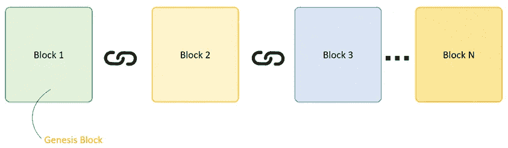

# 为假人讲解区块链

> 原文：<https://medium.com/coinmonks/blockchain-explained-for-dummies-4b5dc1c3af66?source=collection_archive---------15----------------------->

## 我终于明白了，你也能明白。

Source: [IDB](https://blogs.iadb.org/)

回到 2020 年末，我的生活是一场金融灾难。关系破裂，投资决策失误，应有尽有。为了节省你的时间，我将把细节留到另一个故事中。

事实是，我急于从我的财务错误中恢复过来，并考虑各种(显然)合法甚至危险的可疑投资选择。

所以我听说了加密货币。

我最初的兴奋是想要全押，因为我想尝试一下加密货币被熟知的*大利润乐土*和*快速致富*趋势。

有东西不见了。我对加密、比特币或区块链一无所知，也不知道我要投资什么！

幸运的是，我从过去的失败中吸取了教训，所以我开始研究这个课题。

几个月后，我的一次*点击*改变了我对加密货币投资的态度。

这让它从快速致富的冲动转变为对区块链的基本理解，区块链远远超出了比特币和加密货币，以及这项技术如何影响世界。

Source: [Oprah](https://www.oprah.com/health_wellness/science-of-eureka-moments)

当我们学习或研究某个主题时，发生的*点击*或*触发*，感觉就像是我们找到了缺失的理解片段的短暂瞬间。

这就像拼图的一部分，最终融入并改变了我们对我们试图学习的主题的看法。它给了我为什么要投资加密货币的答案。哪个去远远超出了投资本身的行为。

对于新手来说，理解区块链似乎需要了解许多其他基本概念，并花时间导航和破译我们许多普通人无法理解的技术术语的行话。

Courtesy of [AmarCrypto](https://amarcrypto.com/crypto-glossary-of-terms/)

我们大多数人都没有时间，也可能缺乏耐心去读完没完没了的讲座或 700 多页的书。

如果你属于缺乏耐心和时间紧迫的那一类，帮你自己一个忙，跳过那些一个多小时的讲座。

从小块容易消化和简单解释的知识开始，就像这个。

如果你不能马上得到它，也不要担心，重要的是开始并捡起旅途中的那些小碎片。最后，一切都会水到渠成。

## 那么区块链到底是个什么鬼！？

想想孩子们交换棒球卡的时候(早在口袋妖怪卡之前，棒球卡就是潮流！).

现在想象一下*迈克*，*街头混混*滑板小子去查比*别碰我的汉堡*，*查理*想交易他的 6 张棒球卡。

他们同意和他们的两个好朋友鲍比和史蒂夫一起做证。

Photo by Otto Bettmann | Betmann Archive

四个男孩中的每一个都决定在他们的学校笔记本上记下，在那一天，*迈克*用他的 6 张棒球卡换了 3 张*查理的，*无论他们同意这些卡值多少钱。

他们还确保在笔记本上自己的交易记录前签上自己的名字。在这个例子中，*迈克*和*查理*核实和签署他们的 6 对 3 交易。

如果*迈克*说*查理*只给了他两张棒球卡，那么*鲍比*、*史蒂夫*和*查理*保持的另外三张相同的记录，就是*迈克*在说谎，并且 6 对 2 交易从未发生的证据。

Credit: [Tom Kelly Archive](https://www.istockphoto.com/search/2/image?artist=Tom+Kelley+Archive&family=creative)

让我们假设男孩们把记录保存在他们的床下，并且他们中的任何人都可以在任何时候要求看对方的笔记本。

交易记录总是可供男孩们检查。因此，他们不仅有证据证明 6 对 3 交易的发生，而且有一个验证，因为它是由两个男孩签署的。

在这种情况下，记录是交易分类账的一部分。他们希望用棒球卡进行的所有未来交易都将被记在这个账本上。

## 什么账本？？

根据剑桥英语词典，分类账的简单定义是:

> 定期记录事物的本子，尤指商业活动和收到或支付的钱

或者，如柯林斯英语词典中所述:

> 分类账是一个公司或组织记录其支出和收入金额的账本。

所以，我们的男孩对这些卡片的热爱激励他们以这样的方式保存他们交易的分类账:

*   ***打开*** ，通过允许他们随时查看对方的笔记本
*   ***准确的*** ，通过记下谁交易了以及他们之间交易的牌的准确数量
*   按照**的顺序，逐笔记下每笔交易的日期和时间**
*   **保持*不变，从不擦除或刮擦记录中的任何信息***
*   *****通过确保他们所有人的笔记本上都有交易记录的准确副本*****
*   ****、通过在自己的交易记录中签名****

**简而言之，记录就是这样保存在交易的**开放式分布式分类账**中的(在这个例子中，我们男孩的交易被记在笔记本的页面上)。**

**记录以**精确**、**按时间顺序、不可变**和**验证**的方式保存。值得信赖的账本的所有重要属性。**

**一个**区块链**实际上是一种**分布式账本。**它是一种记录信息的系统，以这种方式很难或不可能改变(记住，保持**不变 *)*** 。**

**定义分布式账本时要考虑的其他非常重要的属性是安全性、匿名性和分散性。出于这篇文章过于简单的意图，但需要注意一些小细节，加起来才能完全理解区块链的概念。**

**现在，为了使用我们的男孩的棒球交易卡记录来完成区块链的画面，我们可以想象记录的页面都链接在一起，每个都作为一个单独的区块，其中记录的交易信息永远不会改变或不可能改变。**

**如果出现新的交易或交易，它们将被添加并记录在各自的区块上，当被填充时，它们将与前一个区块“链接”，形成一个信息链，称为**区块链**。**

****

**Source: [Guru99](https://www.guru99.com/blockchain-tutorial.html)**

**这是一个非常简单的方式(请专家原谅我)，区块链是如何运作的。**

**在现实世界的应用中，区块链是一种特殊类型的**分布式账本技术****【DLT】**在这种技术中，交易被数字化存储，复制并分布在世界各地制造区块链的整个计算机系统网络中。**

## **但我只想投资比特币，为什么要关心区块链？**

**你应该这么做。而且最起码因为比特币和区块链是不一样的。比特币本身是一个完全不同的主题，值得一文。**

**总之，区块链是一种特殊类型的账本，以数字形式分布在世界各地的计算机网络中。另一方面，比特币利用了区块链技术。这是一种数字货币，由一个化名为中本聪的人(或一群人)在 2008 年匿名创造。**

**如果你真的想将比特币纳入投资组合，你不仅必须研究比特币作为数字资产的投资技术和基本面，还必须了解其背后的底层技术，即区块链。**

**那么下次有人接近你谈论比特币并劝你购买它时，也许你可以问他们关于区块链或分布式账本的问题，看看他们是否真的知道自己想投资什么。**