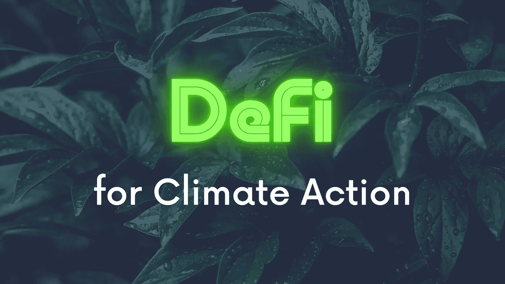
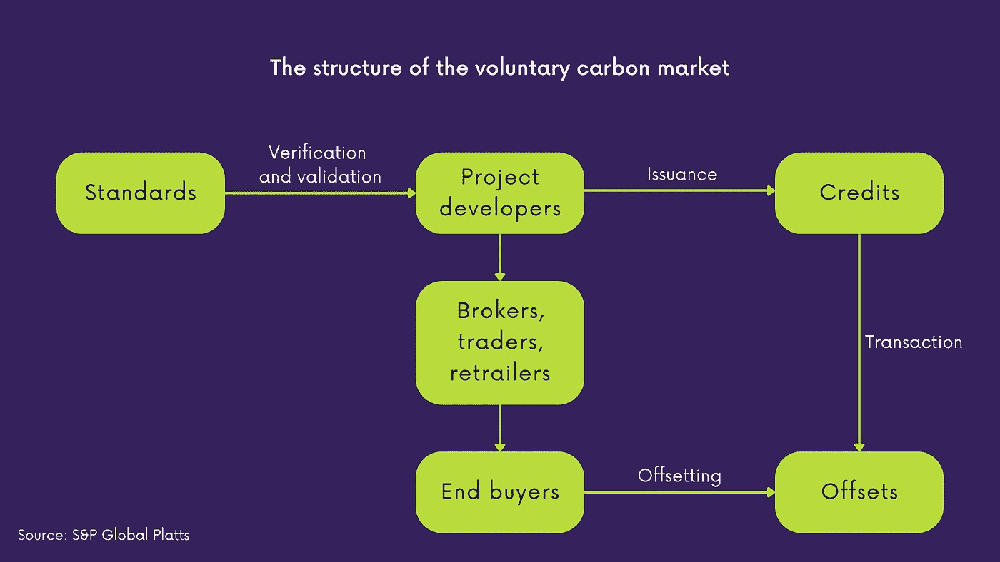
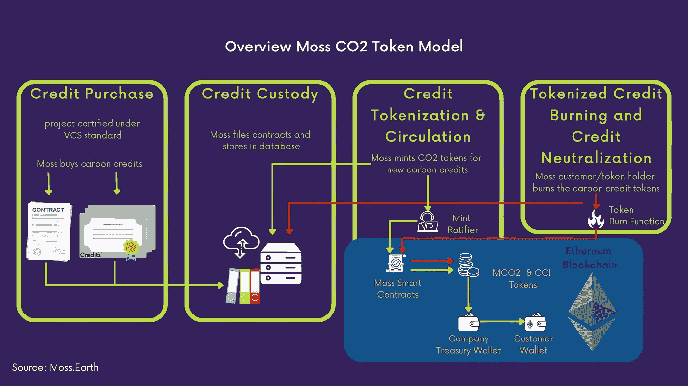
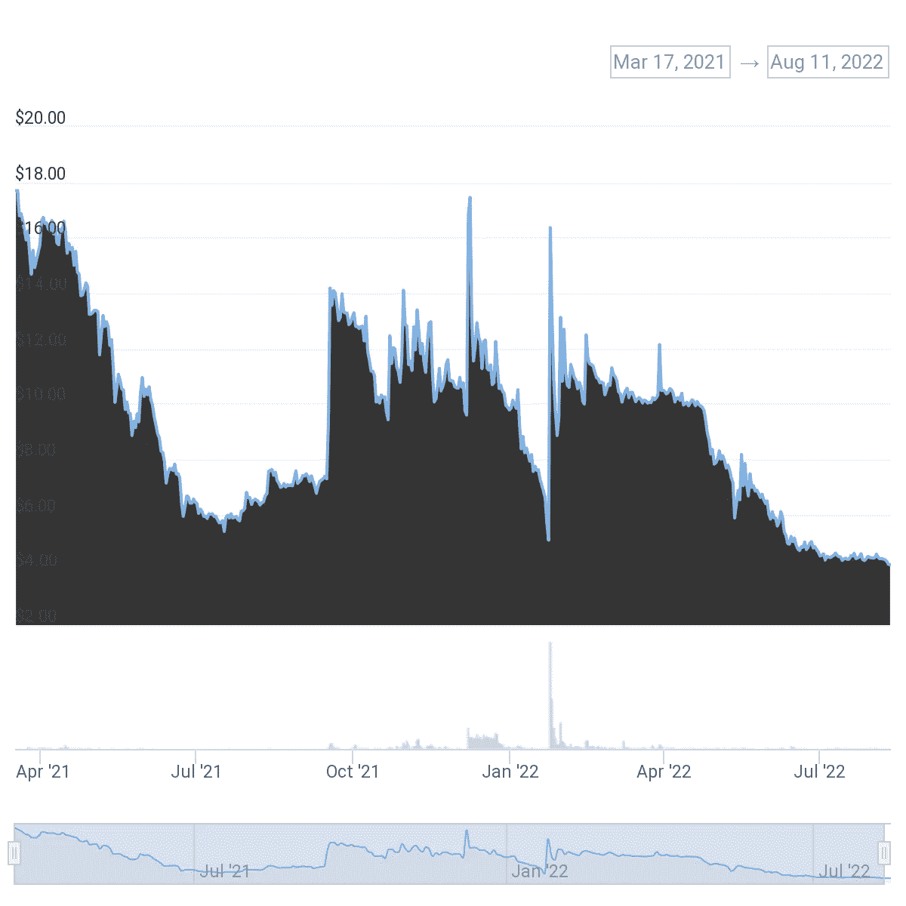
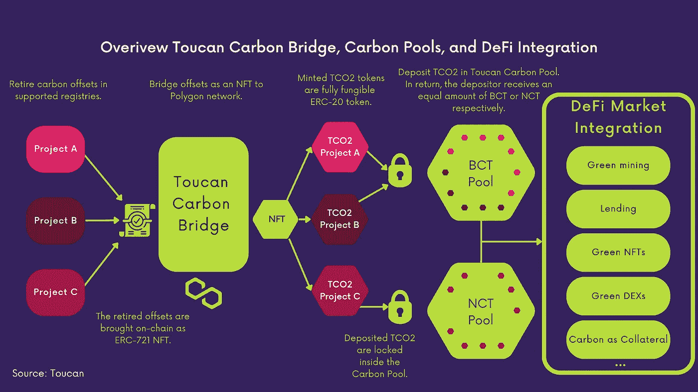
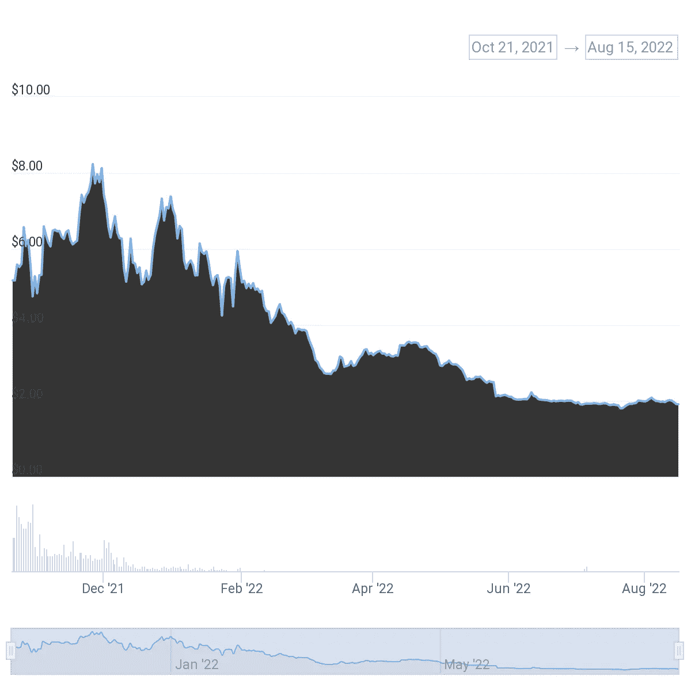
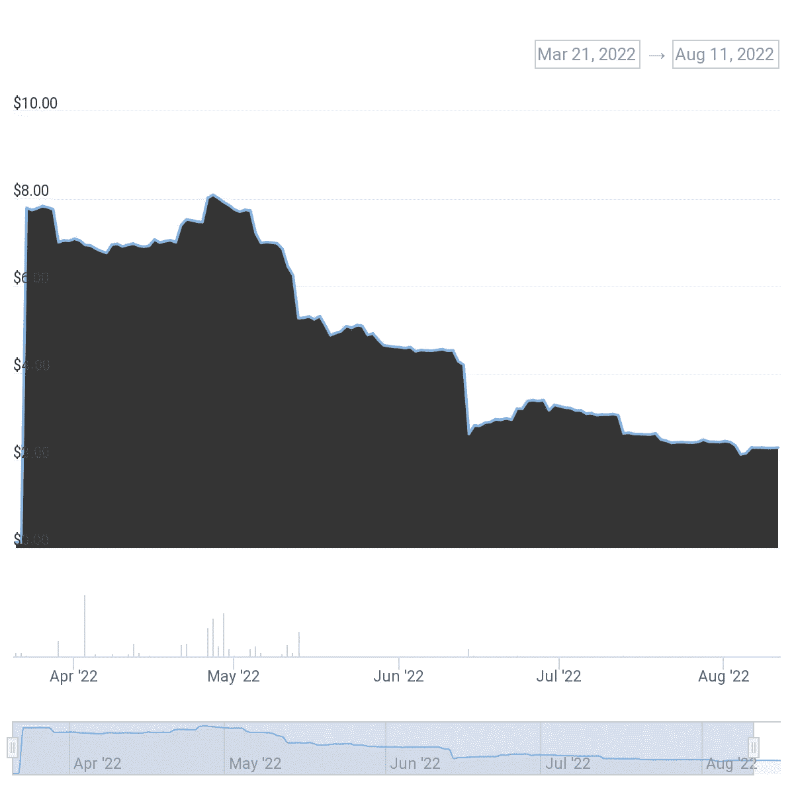

# DeFi for Climate Action——碳信用的符号化

> 原文：<https://medium.com/coinmonks/blockchain-for-climate-action-4d2f593c8080?source=collection_archive---------20----------------------->

地球正在升温。根据研究，最大的驱动因素之一是排放到大气中的大量二氧化碳(CO2)和温室气体(GHG)当量。现代生活正在导致森林砍伐、单一作物种植和过度捕捞，这降低了地球吸收二氧化碳和 GHG 当量的能力。

如果我们继续目前的做法，将不可能把气温上升限制在 1.5 - 2.0 度，防止气候危机。

防止危机的一个雄心是向净零世界过渡，在这个世界上，二氧化碳排放量将大幅减少，那些无法减少或避免的排放量将被抵消。抵消碳足迹的一种方法是使用碳信用额。

一个碳信用额代表一公吨二氧化碳或 GHG 当量(1 tCO2e)。碳信用额是由清除或避免二氧化碳或其等价物的项目发放的。通过购买碳信用，像这样的项目可以得到资助，气候友好的做法应该得到激励。

获得碳信用的一种方式是自愿碳市场。也有强制性碳市场，但这些只能由某些地区和行业进入。

在第 26 次缔约方会议和“基于科学的目标倡议”或“扩大自愿碳市场特别工作组”等组织活动的推动下，初级自愿碳市场在 2021 年增长了 190%，接近 10 亿美元，预计在 2022 年增长 50-80%，达到 15-17 亿美元。[1]

随着风险资本市场的崛起，这也吸引了大量的创新和新业务。尤其是传统的 VCM 有很多缺点。它们大多是基于纸面的，不清楚基础项目是否收到了适当的资金或减少/避免了计算的 tCO2e，有许多中介机构，如碳信用登记机构，它们具有验证和确认碳信用的标准(如金标、Verra)、经纪人、零售商和交易商，这些都很昂贵，绿色清洗、碳信用的双重支出、困难的价格发现、碳信用的质量控制等等。

为了真正通过利用碳信用将资金转移到环境项目，重要的是它们有一个合适的价格标签。碳信用的平均价格目前在 3 美元左右。[2]专家估计，要真正资助气候行动并激励 2050 年前的净零排放，现在的价格至少应该是每碳信用额 100 美元。[3]

这些主题吸引了许多来自区块链和分散金融(DeFi)领域的项目。在过去的一年中，许多新项目被启动，以利用区块链技术提供的透明性、安全性和可追溯性，以及其分布式账本的性质。DeFi 带来了许多工具，通过使用智能合约，进一步消除中介，并在区块链技术的基础上创建更复杂的面向金融的用例。

让我们看看区块链和特别是 DeFi 如何被用来将碳信用额令牌化，以解决遗留的 VCM 的一些缺点。为此，我们将仔细观察苔藓。地球和巨嘴鸟。

# **苔藓。地球:抵消你的碳足迹**

莫斯。地球是一家成立于 2020 年的公司，其使命是通过抵消个人和公司的碳足迹，使保护地球变得容易和安全。

为了实现这一目标，莫斯。地球聚焦亚马逊雨林。由于巴西有 40%的森林，苔藓的存在是合理的。地球和它的创立者路易斯·菲利普将从那里开始。就这样莫斯。地球不仅希望通过使用碳信用在抵消二氧化碳方面带来更多的透明度和便利，而且他们也看到了巴西自身的巨大机会，因为它每年可以认证大约 15 亿碳信用，这可能导致相当于 600 亿美元的环境项目。这也将对巴西社区运营这些项目、创造就业机会以及改善社会、经济和环境繁荣产生积极影响。[4]

莫斯。地球引入了他们的 ERC-20 实用令牌 MCO2 (Moss 碳信用),以利用链上碳信用的安全性和可追溯性。另一个好处是可编程性，因此 MCO2 令牌可以在 DeFi 中用作抵押品，用于分散式交易所的交易等。一个令牌代表一个 tCO2e。MCO2 代币的持有者以 1:1 的关系代表碳信用的虚拟所有权。[5]

带来碳信用额，莫斯。地球自己购买这些信用。这些信用额度是由与亚马逊雨林相关的环境项目发放的，并由 VCMs 中的标准验证者 [Verra](https://registry.verra.org/app/search/VCS) 认证。莫斯。地球收到他们购买的证书和合同，并将它们存储在他们的数据库中。就这样莫斯。地球保管着碳信用额。

根据购买的碳信用额，MCO2 代币被铸造给区块链以太坊。当代币持有者想要抵消他们的碳足迹时，他们会燃烧 MCO2 代币和苔藓。地球关心的是收回潜在的碳信用。这导致在 Verra 注册中的更新，其中碳信用然后被收回，表明它被用于抵消排放。

为了促进这一进程莫斯。地球使用不同的智能合同。碳信用登记合同存储与碳信用相关的信息，如项目、年份和批次。碳控制(CC)合同铸造和燃烧 CCI(碳信用库存令牌)和 MCO2 ERC-20 令牌。CCI 令牌用于跟踪活性炭信用令牌的总供应量，并使用信用库存合同。此外，还有一个针对 MCO2 令牌的智能合约。[6]

MCO2 令牌于 2021 年 3 月推出，令牌价格为 17.40 美元，交易量为 230，372 美元。直到 2022 年 8 月，价格降至 4.00 美元左右。MCO2 也可用于 Polygon 和 Celo 区块链。

KlimaDAO 新推出的[碳仪表板](https://carbon.klimadao.finance/MCO2)很好地概述了 Moss 项目。地球曾经购买碳信用额。列出的每个项目都直接链接到 [Verra 注册中心](https://registry.verra.org/app/search/VCS/All%20Projects)。它还指出到目前为止莫斯。地球向区块链提供了约 300 万碳信用额作为碳二氧化硫代币，约 23 万信用额通过在链上燃烧碳二氧化硫代币被回收(抵消)。[7]

MC02 price development

# 巨嘴鸟:让 DeFi 为地球服务

《巨嘴鸟协议》旨在创建一个基础设施，将传统的 VCM 引入区块链公共领域，利用 DeFi 为气候行动提供资金。

将碳信用额从传统的碳登记系统转移到链条上并使其准备就绪需要三个步骤。

首先，碳信用需要从传统的 VCM 作为 BatchNFT 连接到多边形区块链，这是一个 ERC-721 不可替代的令牌。最初，Toucan 协议只支持来自 Verra 的验证碳信用额，即所谓的 VCUs(验证碳单位),以确保只有验证和活性碳信用额在船上。要将 Verra 注册表中具有相同年份的项目中的特定 vcu 链接到 Polygon 区块链上的 BatchNFT，这些 vcu 必须退役，退役原因为“其他”。在 Toucan 的理论中，碳信用本身仍然有效，没有被抵消。有了这个退休事件，所创建的 BatchNFT 的唯一标识符就永久地链接到 Verra 注册表中的相应 vcu。通过这种方式，应该可以防止碳信用额抵消的双重支出。[8]

第二步是将批量碳交易细分为巨嘴鸟碳补偿权标(TCO2s)，即 ERC-20 权标。这样，一个 TCO2 代表一个 tCO2e。[9]

在第三步中，可以使用由 Toucan 协议引入的碳参考标记将 TCO2s 汇集成碳库。目前有两种碳参考标记:基础碳吨(BCT)和自然碳吨(NCT)

TCO2 令牌的元数据保存了关于底层项目的描述信息，如一些属性和年份。由于碳信用的质量和价格在很大程度上取决于项目的类型及其年份，不同项目的 TCO2 令牌不具有可比性和流动性。因此，Toucan 协议引入了碳参考标记(目前为 BCT 和 NCT ),以便来自可比类型的 TCO2 标记可以汇集在一起。通过这种方式，更多的液态碳指数被创造出来，它们更具可比性，也更容易发现价格。

为了保证最佳控制技术和新技术之间的可比性，TCO2s 必须满足一定的标准。这意味着 TCO2 令牌的元数据中列出的属性必须匹配 BCT 池或 NCT 池的标准，具体取决于应添加哪个池特定的 TCO2 令牌。

BCT 和 NCT 是 ERC-20 代币，每个代币代表一个碳信用额。然后，这些碳指数令牌可以整合到 DeFi 市场，如分散交易所、贷款或用作碳抵押品(如 Klima DAO)。[10]

2021 年 10 月,《巨嘴鸟协议》发布，并获得了相当多的关注。自那时起，它声称已经弥合了近 2200 万吨二氧化碳的总量，总碳供应量略高于 2100 万吨，这意味着从潜在碳吨中沉积的 BCT 和 NCT 的总数。将近 180，000 吨二氧化碳当量被抵消。[11]

为了抵消碳排放，必须兑换现金交易券和现金交易券，以获得基础的二氧化碳排放权。通过这种方式，特定项目的 TCO2 令牌将从池中取出并循环使用，因此它们不能再被使用。[12]

BCT 池于 2021 年 10 月启动，NCT 池于 2022 年 3 月加入。正如你从下面的价格图表中看到的，它们的价格随着时间的推移而下降。BCT 从 5.17 美元开始，2021 年 11 月达到 8.23 美元的峰值，目前正好低于 2.00 美元。NCT 从 7.79 美元开始，2022 年 4 月达到 8.09 美元的峰值，现在略高于 2.00 美元。

BCT price development

NCT price development

从今年五月开始，巨嘴鸟协议受到了很多批评和负面报道。主要问题一方面是围绕只使用退役碳信用的混乱，另一方面是将低质量的碳信用与多边形区块链联系起来。

当你谈到 VCMs 中的碳信用的回收时，这意味着这种信用的消耗。当一项碳信用被收回时，它们就会被使用，因此不得再出售。由于《巨嘴鸟协议》使用碳信用的退役事件将其直接与区块链的 NFT 联系起来，因此它没有消耗碳信用，但退役碳信用被用作活性碳信用的事实完全违背了 VCMs 的直觉，并带来了一层迷惑和不信任。因此，Verra 本身在 2022 年 5 月表示，他们“禁止基于已撤销信用创建工具或代币的做法”,并希望就如何利用区块链启动公众咨询，特别是探索“固定”Verra 登记处账户中的信用的可能性。[13]

这一声明并不妨碍《巨嘴鸟协议》的继续，尽管他们目前无法再桥接任何 Verra 碳信用额，但该协议的其他功能仍然完好无损。总的来说，他们对 Verra 的发展感到兴奋。问题只是速度有多快。[14]

在仔细研究了使用巨嘴鸟协议连接到多边形网络的碳信用后，发现大约 28%的信用不仅质量低，而且是从僵尸项目中创建的。格雷森·贝格利(Grayson Badgley)和丹尼·卡伦沃德(Danny Cullenward)将它们定义为“要么(1)在与巨嘴鸟相关的退休之前的两年内没有任何公共退休记录，要么(2)通过巨嘴鸟完成了 95%以上的公共退休记录。”。他们列举的例子有 [VCS949](https://registry.verra.org/app/projectDetail/VCS/494) 或 [VCS191](https://registry.verra.org/app/projectDetail/VCS/191) 。[15]

# 结论

莫斯。Earth 和 Toucan 给出了如何通过使用公共区块链和 DeFi 向市场打开 VCM 的两种不同方法。

莫斯。地球强调提供高质量和 100%支持碳信用的 MCO2 代币。随着 2022 年 5 月治理令牌 [MOSS](https://governance.moss.earth/) 的推出，它正在分散对选定亚马逊雨林项目的碳信用进行令牌化的过程，以吸引更多的人和观点。

Toucan 强调引入基础设施，因此任何人都可以将碳信用额令牌化并引入链中。通过使用碳参考令牌，Toucan 开发了一种机制，通过对碳信用令牌进行分类，使它们具有可比性。这样，他们可以很容易地在 DeFi 空间使用。

特别是 [KlimaDAO](https://www.klimadao.finance/en) 利用 MCO2、BCT 和 NCT 来支持他们的代币 KLIMA，创造流动性池。

将 DeFi 引入 VCM 仍处于早期阶段，但 Moss。《地球》和《巨嘴鸟》展示了当创新不断涌现时，新的动力、透明度和可及性可以创造得多快。

风险资本市场仍然存在许多问题和挑战，不能简单地通过引入区块链技术来解决。像 Moss 这样的当前项目。Earth 和 Toucan 正在进一步开发他们的服务，并与 VCMs 的传统参与者密切合作。

这篇文章只是关注区块链两个致力于碳信用的项目。许多其他代币已经推出，还有更多正在筹备中。这是一个热门话题，而且似乎不会很快降温。

# 参考

[1] Throve《自愿碳市场:2021 年回顾与 2022 年展望》。生态系统市场报告。

[2][https://www . IMF . org/en/Publications/fandd/issues/2021/09/five-things-to-know-about-carbon-pricing-parry](https://www.imf.org/en/Publications/fandd/issues/2021/09/five-things-to-know-about-carbon-pricing-parry)

[3][https://www . Reuters . com/business/COP/carbon-needs-cost-less-100t onne-now-reach-net-zero-by-2050-2021-10-25/](https://www.reuters.com/business/cop/carbon-needs-cost-least-100tonne-now-reach-net-zero-by-2050-2021-10-25/)

[4]莫斯。地球“白皮书碳信用 MCO2 令牌 1.0 版”。

【https://real-time-attest.trustexplorer.io/moss 

[6] Armanino“商定程序报告”。编制对象:Mos 管理和授权用户。26.01.2021.

[7]https://carbon.klimadao.finance/MCO2

[8][https://docs . toucan . earth/protocol/bridge/carbon-bridge/retire-on-verra](https://docs.toucan.earth/protocol/bridge/carbon-bridge/retire-on-verra)

[https://docs.toucan.earth/protocol/bridge/fractionalize](https://docs.toucan.earth/protocol/bridge/fractionalize)

[https://docs.toucan.earth/protocol/pool/pools](https://docs.toucan.earth/protocol/pool/pools)

[11][https://toucan.earth/overview?chainId=](https://toucan.earth/overview?chainId=)

[12][https://blog . toucan . earth/how-to-retire-nature-based-carbon/](https://blog.toucan.earth/how-to-retire-nature-based-carbon/)

[13][https://Verra . org/Verra-addresses-crypto-instruments-and-tokens/#:~:text = Verra % 20 将% 2C % 20 立即% 2C % 20 生效% 2C % 20 禁止% 20 信用% 20 的% 20 环境% 20 利益](https://verra.org/verra-addresses-crypto-instruments-and-tokens/#:~:text=Verra%20will%2C%20effective%20immediately%2C%20prohibit,of%20the%20credit's%20environmental%20benefit)

[14][https://www.youtube.com/watch?v=2oGsdeAaKfE&ab _ channel = Toucan](https://www.youtube.com/watch?v=2oGsdeAaKfE&ab_channel=Toucan)

[https://carbonplan.org/research/toucan-crypto-offsets](https://carbonplan.org/research/toucan-crypto-offsets)

**图表**

自愿碳市场的结构:[https://www . sp global . com/commodity insights/en/market-insights/blogs/energy-transition/061021-自愿碳市场-定价-参与者-交易-corsia-信用](https://www.spglobal.com/commodityinsights/en/market-insights/blogs/energy-transition/061021-voluntary-carbon-markets-pricing-participants-trading-corsia-credits)

概述 Moss CO2 令牌模型:Armanino“商定程序报告”。编制对象:Mos 管理和授权用户。26.01.2021.第 7 页。

MCO2 价格开发:[https://www . coin gecko . com/en/coins/moss-carbon-credit/USD # panel](https://www.coingecko.com/en/coins/moss-carbon-credit/usd#panel)

Toucan 碳桥、碳池和 DeFi 整合概述:【https://docs.toucan.earth/protocol/pool/deposit-+-receive】T2【https://docs . Toucan . earth/protocol/introduction/overview # conceptual-architecture，T4

BCT 价格发展:[https://www . coin gecko . com/en/coins/toucan-protocol-base-carbon-Tony](https://www.coingecko.com/en/coins/toucan-protocol-base-carbon-tonne)

NCT 价格开发:[https://www . coin gecko . com/en/coins/toucan-protocol-nature-carbon-Tony](https://www.coingecko.com/en/coins/toucan-protocol-nature-carbon-tonne)

> 交易新手？尝试[加密交易机器人](/coinmonks/crypto-trading-bot-c2ffce8acb2a)或[复制交易](/coinmonks/top-10-crypto-copy-trading-platforms-for-beginners-d0c37c7d698c)