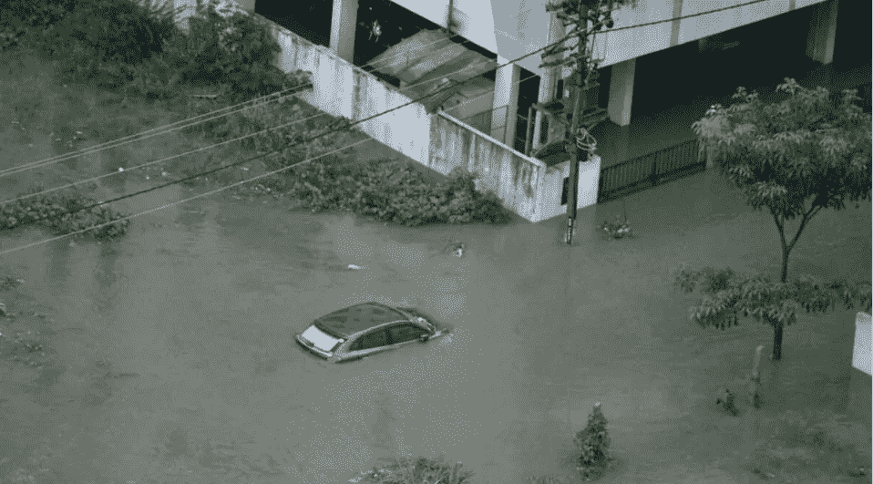

# 区块链能解决班加罗尔的洪水问题吗？

> 原文：<https://medium.com/coinmonks/blockchain-for-governance-cf044aabd6af?source=collection_archive---------6----------------------->

Image: Indian Express News Dated 7th Sept ’22

2022 年 9 月 4 日晚，班加罗尔的道路被洪水淹没。这座城市的几个地方都有齐膝深的水。拖拉机、木筏、甚至 JCB 都被用来营救班加罗尔的市民。水从下水道渗出，raja kaluves(城市下水道)堵塞，湖泊泛滥。仅在 9 月 5 日，损失金额就达到了 22.5 亿卢比(2800 万美元)。数百万城市居民遭受了灾难，数千人在酒店、学校和办公室避难。虽然大多数住宅和别墅淹没在水中，但政府宣布，阻碍水流的公寓项目将受到处罚。

政府的声明令人震惊，因为班加罗尔市政公司已获得 10，000 亿卢比(接近 100 万美元)的城市发展拨款。然而，BBMP 未能对城市进行有效的雨水排放(SWD)规划，尤其是在奥尔正在进行的地铁项目周围。此外，是 BBMP 批准住宅和商业项目。大多数乐观主义者声称，如果公民利用他们的投票权选择了正确的政治领导人，那么这种情况就可以得到补救。然而，这与事实相去甚远，因为选票银行政治和诚实政治家的缺乏。于是就产生了这样一个问题:从长远来看，我们可以做些什么来补救这种情况。

良好的社会福利署规划，加上诚实地评估限制水流的项目，可以在很大程度上解决这个问题。这个系统是腐败的，建筑许可证被发放给贪婪的建筑商。此外，公民对如何批准项目没有发言权，费用是在他们投票选举政治代表后分配的。只有在政府运作中引入透明度，才能听到公民的真正声音。幸运的是，技术进步让公民可以利用社交媒体表达他们的愤怒、沮丧和不满。但这就够了吗？

这就是区块链技术可以派上用场的地方。许多非政府组织、企业和政府正在成功地将区块链用于环境、社会和治理(ESG)计划。透明、信任和安全是区块链的三个主要目标。这项技术允许所有的参与者，也就是公民，在没有任何审查的情况下表达他们的观点。参与者可以通过创建区块链账户轻松行使投票权。利用互联网和边缘计算的力量，可以从移动设备、笔记本电脑和台式机上使用类似钱包的应用程序启动交易(在这种情况下为投票)。本文旨在更深入地探讨区块链的独特功能，这些功能使其成为治理的理想选择。

## 包含

与开立银行账户不同，区块链不需要身份证明。区块链账户可以通过在参与者的手机、笔记本电脑、平板电脑或台式机上安装类似钱包的应用程序来创建。目前，许多生活在偏远地区和村庄的人因为缺乏政府身份，如 Aadhar、配给卡、选民身份证，甚至出生证，而难以开立银行账户。公共区块链让每个人都可以参与。所有人！

## 信任

任何交易，如区块链上的投票，都是可信的，因为每笔交易都是在大多数区块链节点达成共识后才记录的。尽管以这种方式达成共识在数字世界中相对较慢，但它提供了一种只记录合法交易的方式。区块链机制被称为“无信任”，因为参与者相互信任，而不是第三方。

## 隐私

每个人的邮件 id、手机号码和地址等个人可识别信息(PII)被隐藏，只有区块链帐户的数字表示可见。因此，尽管其他参与者可以看到交易，但他们无法通过区块链账号识别参与者。这对于投票等应用非常有用，因为投票者可以匿名发表意见。由于区块链账户是唯一的，因此可以使用唯一账户的数量来统计投票。

## 安全性

如今的中央服务器很容易受到网络攻击，社交媒体账户不时遭到黑客攻击。区块链是去中心化的，减少了网络安全和恶意攻击的机会，因为没有中心系统可以攻击。区块链账本驻留在所有参与者节点上，因此改变区块链上的任何数据都是成本和资源禁止的。即使黑客设法破坏了其中一个节点上的数据，同样的信息也会有多个副本。

## 透明度

区块链分布式账本，每个人都可以查看。所有的政府交易、决策和行动，如财务审批、费用分配和项目评估，都可以添加到区块链中。由于公众压力，这种透明度可以迫使政府官员和政治家诚实。参与者不仅可以决定纳税人的钱如何使用和用在哪里，还可以要求任何决定背后的正当理由和基本原理。

## 不变

区块链分类帐是不可变的，因为每个生成的区块都包含前一个区块的哈希。因此，每个块的完整性将被传递给其后的块。这意味着改变链中的任何块都需要改变该块之后的所有块。因此，从资源和能源的角度来看，任何改变记录的尝试都是不可行的。区块链上的记录永远不能被篡改或篡改！

## 结论

虽然预算分配向公众公布，但并不征求他们的意见。为 BMTC 公交车预留单独车道的项目就是滥用纳税人资金的一个例子。该项目只是给通勤者带来了不便，尽管公众抱怨，BBMP 没有采取任何行动。这样的项目可以在一开始就被否决，资金可以分配给更有价值的项目。虽然区块链有很大的前景，但第一步是让公民加入平台。幸运的是，移动服务在全国各地和不同收入阶层中无处不在。测试区块链可行性的试点项目正在进行中，马哈拉施特拉邦政府和 CBSE 已经采用区块链来发放教育证书。因此，区块链也有望很快大规模应用于治理。

> 交易新手？试试[加密交易机器人](/coinmonks/crypto-trading-bot-c2ffce8acb2a)或者[复制交易](/coinmonks/top-10-crypto-copy-trading-platforms-for-beginners-d0c37c7d698c)