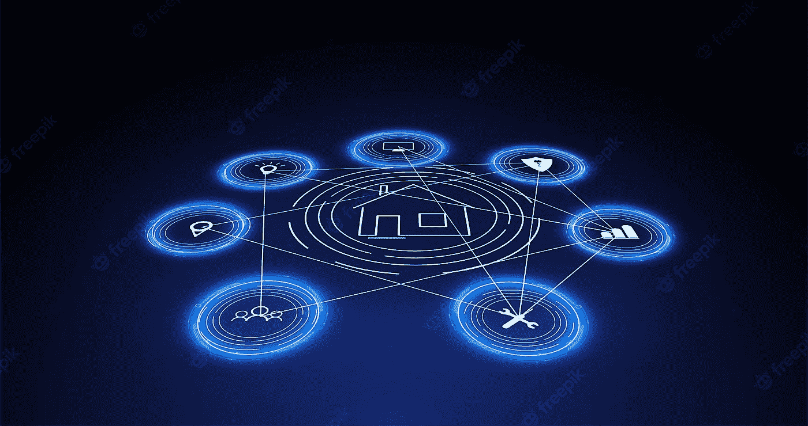

# 面向物联网和互联设备的区块链

> 原文：<https://medium.com/coinmonks/blockchain-for-iot-and-connected-devices-7a3d45c24227?source=collection_archive---------32----------------------->

毫无疑问，区块链将继续增长并影响许多行业。虽然大多数应用程序都围绕着监控交易和验证数据，但也有开发人员将区块链集成到互联网连接的设备中(也称为物联网；IoTs)。

# 连接的设备和安全问题

借助互联设备，城市、家庭、工厂、商店、学校和医院都可以得到改善。例如，智能门锁允许您授予朋友或家人访问权限，并跟踪谁来谁往；如果窗户或门在不应该被打开的时候被打开了，你家里的传感器会提醒你；如果某样东西在变坏之前需要更换，如果某样东西被打破或被盗，你可以收到警报。，配有冰箱等智能家电。增加连接不仅仅是让事物变得“智能”，而是将它们带到下一个层次。

然而，人们担心安全漏洞。在绝大多数情况下，互联设备是集中的，这意味着如果攻击者设法渗透到智能设备或其服务器，这就为整个黑客和入侵网络打开了大门。想象一下这样一种情况，你的智能门锁制造商被黑客攻击了，黑客可以访问你的门锁。

# 如何将区块链应用于物联网？

首先，让我们谈谈什么是区块链，它是如何工作的。简而言之，你可以把它想象成一个巨大的电子表格，在计算机网络上被复制成千上万次。区块链是存储和验证数据的分布式分类帐或分散数据库。区块链由许多数据块组成，这些数据块通过时间戳和到先前数据块的链接相链接。每个块中的数据都被加密，整个链在分散网络中的数千台计算机或节点上被复制。因为区块链是加密和复制的，所以它们非常安全，而且因为它们是分散的，没有一个实体能够控制它们。

在区块链物联网网络中，每个设备都是网络上的自主参与者(节点)。这种设置使得黑客破坏网络变得极其困难，因为他们需要侵入每个设备才能访问网络。企业还可以利用区块链令牌或智能合同的力量来自动化某些业务工作流或功能。

# 基于三星区块链的智能设备安全性

三星最近宣布在其智能设备上实施“私人区块链”系统。这将是他们的安全平台 [Knox Matrix](https://news.samsung.com/us/samsung-knox-matrix-revolutionary-security-solution-cross-device-experiences-sdc22/) 的扩展。

三星没有透露太多，只是说他们将为他们的区块链解决方案发布一个统一的安全 SDK。我们希望 unified security SDK 能够跨不同的操作系统工作，并为多个跨设备提供安全凭证。一句话，三星的统一安全 SDK 是一个跨设备认证系统，可以通过区块链轻松、安全地登录不同的设备。

# 物联网和区块链集成的挑战

区块链与物联网设备的集成面临诸多挑战。设备收集和访问的数据应经过验证，以便获得批准并放入区块链。这意味着它应该是可扩展的，这样成千上万的设备可以很快同步。此外，由于无法在区块链上编辑数据，一些用户或设备并不总是希望数据位于区块链下。因此，一些组织或最终用户希望决定是否加入区块链网络。

寻找合适的共识机制也是一个挑战。这是指区块链上的节点如何就新事务达成一致。理想情况下，共识机制应该是安全的、分散的和可扩展的。

大多数区块链物联网网络都是许可的(私有的)。这种方法使组织能够创建一个区块链网络，作为物联网设备的单一真实来源。传感器、摄像机、数据库和其他设备可以添加到区块链网络中，实现实时数据分析、提高运营效率和其他业务优势。

从隐私和安全的角度来看，物联网专用区块链似乎很棒。但有一个根本的缺点，那就是它可能是另一个由单一实体控制的过时和分裂的区块链。在某种程度上，由于缺乏透明性，它可能会导致外部攻击者引起的安全问题。在我写这篇文章的时候，[微软宣布](https://www.bleepingcomputer.com/news/security/microsoft-data-breach-exposes-customers-contact-info-emails/)最近的一次数据泄露暴露了客户的电子邮件和联系方式。这是任何中央系统的基本风险。

更好的方法是让智能设备在公共链下开源，由制造商出资，但不受他们控制——这是区块链开发者做出的决定。Dao 可以支持智能设备所有者并控制他们设备的区块链网络。混合使用公共链和私有数据处理可能是最终的解决方案。这个概念类似于混合云的优势。

# 包扎

区块链催生了大量新颖的商业模式和服务，因此可能会对物联网产生重大影响。智能设备可能能够自主通信，相互验证，并通过区块链网络实时共享数据。底线—通过采用具有共识算法、开发和部署策略的适当类型的区块链，具有物联网的企业可以受益于区块链的效率、透明度和分散的工作流程。

> 👉 [GearChain.io](http://www.gearchain.io) — GearChain 是一款面向供应链的零编码区块链 App 构建器。通过社交媒体渠道关注我们来支持我们。

> 交易新手？试试[密码交易机器人](/coinmonks/crypto-trading-bot-c2ffce8acb2a)或者[复制交易](/coinmonks/top-10-crypto-copy-trading-platforms-for-beginners-d0c37c7d698c)