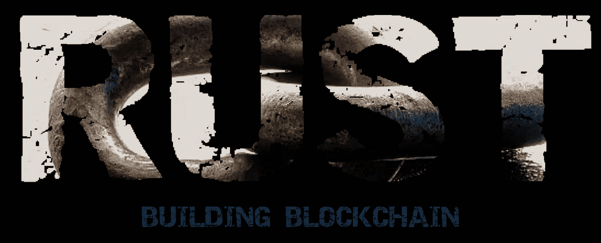

# 从零开始的区块链:网络安全

> 原文：<https://medium.com/coinmonks/blockchain-from-scratch-network-security-dc462edc8cbc?source=collection_archive---------25----------------------->

# 介绍

今天，网络安全是数字世界的重要话题之一。随着区块链技术的兴起，网络安全显得更加重要。

区块链技术是一种去中心化的分布式账本系统，用于存储、管理和保护数字资产和交易。它是一个由计算机连接而成的分布式网络，所有的交易都记录在一个共享的分类账上。这项技术提供了许多好处，包括安全性、隐私性和不变性。

这篇博文将讨论区块链网络安全的各个方面，包括安全挑战和解决方案。

我们还将介绍可用于攻击区块链网络的不同类型的攻击，以及可以采取的保护措施。最后，我们将讨论网络安全的重要性及其对区块链技术未来的影响。

# 什么是网络安全？

网络安全包括识别、预防和应对威胁，以及保护网络免受恶意活动的侵害。网络安全是保护网络免受未授权访问、恶意活动和其他威胁的实践。它也是确保只有授权用户才能访问网络及其资源的实践。

对于任何依靠网络来存储、管理和访问数据的组织来说，网络安全都是至关重要的。如果没有足够的网络安全，组织很容易受到恶意攻击、数据泄露和其他网络威胁。

> 交易新手？在[最佳密码交易所](/coinmonks/crypto-exchange-dd2f9d6f3769)上尝试[密码交易机器人](/coinmonks/crypto-trading-bot-c2ffce8acb2a)或[复制交易](/coinmonks/top-10-crypto-copy-trading-platforms-for-beginners-d0c37c7d698c)

# 区块链中的网络安全

网络安全在基于区块链的系统中至关重要，因为它有助于保护网络免受恶意行为者的攻击。由于区块链网络是分散的和分布式的，它们暴露于各种威胁。这些威胁可能来自网络内外，从简单的攻击到复杂的攻击。

对区块链网络最常见的攻击类型有:

*   51%的攻击
*   西比尔攻击
*   双重支出攻击
*   重放攻击
*   竞争条件攻击

## **51%攻击**

51%攻击是当单个实体或团体控制了区块链网络一半以上的计算能力时发生的一种攻击。这使得他们可以以任何方式控制和操纵网络。这种攻击特别危险，因为它会导致重复消费和其他恶意活动。

为了防止 51%的攻击，区块链网络必须使用一种安全且能抵御此类攻击的共识算法。这种共识算法的例子是工作证明(PoW)、利益证明(PoS)和委托利益证明(DPoS)。

## 西比尔发作

Sybil 攻击是一种攻击者创建多个假名身份以获得网络优势的攻击。这使得攻击者能够控制大部分网络并破坏其运行。网络必须有一个安全可靠的身份管理系统来防止这种攻击。

## 双重支出攻击

双重消费攻击是攻击者同时向两个或更多不同位置发送交易的攻击。这使得攻击者可以两次花费相同的数字货币，从而获得优势。为了防止这种类型的攻击，区块链网络必须使用一种安全且能抵御这种攻击的一致算法。

## 重放攻击

重放攻击是攻击者记录并重放从一个节点到另一个节点的事务的攻击。这使得攻击者能够控制网络，并以他们想要的任何方式操纵它。区块链网络必须使用安全可靠的认证机制来防止这种攻击。

## 竞争条件攻击

竞争条件攻击是指攻击者同时发送多个事务，并试图在其他事务之前处理它们。这使得攻击者能够在网络上获得优势。为了防止这种类型的攻击，区块链网络必须使用一种安全且能抵御这种攻击的一致算法。

# 区块链的安全挑战

区块链网络容易受到各种威胁，包括恶意行为者、数据泄露和其他网络威胁。这些威胁可以分为两大类:外部和内部。

外部威胁包括来自网络外部的攻击，如 51%攻击、双消费攻击、Sybil 攻击等。内部威胁包括来自网络内部的威胁，如恶意行为者、数据泄露和其他网络威胁。

# 区块链中的安全解决方案

可以采取多种措施来保护区块链网络免受恶意行为、数据泄露和其他网络威胁。这些措施包括:

*   实施强身份验证和访问控制措施
*   实现安全共识算法
*   实现健壮的身份管理系统。
*   实现安全通信协议。
*   实施安全存储系统。
*   实施安全监控系统。

# 最后的话

总之，网络安全是任何基于区块链的系统的重要组成部分。区块链网络的安全性取决于它保护自己免受外部和内部威胁的能力。可以采取各种措施来保护区块链网络免受恶意行为、数据泄露和其他网络威胁。

网络安全对区块链技术的未来至关重要，了解安全挑战和解决方案以确保区块链网络的安全性和完整性非常重要。

> 加入 Coinmonks [电报频道](https://t.me/coincodecap)和 [Youtube 频道](https://www.youtube.com/c/coinmonks/videos)了解加密交易和投资

# 另外，阅读

*   [ProfitFarmers 回顾](https://coincodecap.com/profitfarmers-review) | [如何使用 Cornix 交易机器人](https://coincodecap.com/cornix-trading-bot)
*   [如何匿名购买比特币](https://coincodecap.com/buy-bitcoin-anonymously) | [比特币现金钱包](https://coincodecap.com/bitcoin-cash-wallets)
*   [瓦济里克斯 NFT 评论](https://coincodecap.com/wazirx-nft-review)|[Bitsgap vs Pionex](https://coincodecap.com/bitsgap-vs-pionex)|[Tangem 评论](https://coincodecap.com/tangem-wallet-review)
*   [如何使用 Solidity 在以太坊上创建 DApp？](https://coincodecap.com/create-a-dapp-on-ethereum-using-solidity)
*   加密交易机器人 | [OKEx vs 币安](https://coincodecap.com/okex-vs-binance)