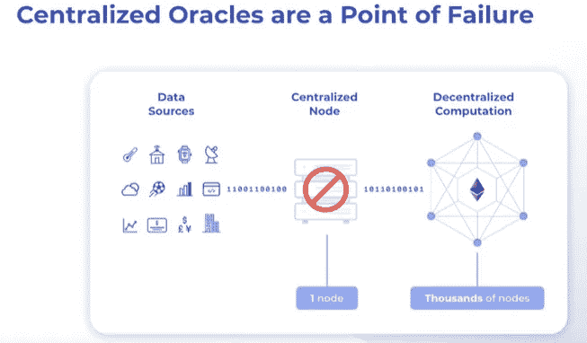

# 区块链基础知识-1

> 原文：<https://medium.com/coinmonks/blockchain-fundamentals-d7ccfcf2d6d5?source=collection_archive---------31----------------------->

区块链是未来的技术之一。比特币建立在中本聪的区块链技术上，那里是区块链技术发明的地方，比特币是让区块链流行的主流。以太坊后来的发明让比特币和区块链技术更进了一步。区块链是一种资产，但以太坊由于其协议而被视为资产和公用事业。

# **智能合约:-**

智能合约是一个自我执行的指令，它是用代码编写的，在没有第三方参与的情况下执行，它们在区块链上运行。用代码编写的条款和协议在分散的区块链网络上自动执行。比特币也有智能合约，但它没有完整的功能，而以太坊也有气体限制，所以以太坊也不完整。

比特币开发者认为比特币是一种资产，但 ethrium 开发者将其作为一种资产和工具来开发智能合约。

# **甲骨文问题:-**

智能合约需要真实世界的数据和外部计算，这就是 Oracle 发挥作用的地方，Oracle 是他们将数据引入区块链或使用外部计算的设备。

这意味着 oracle 正在解决区块链的问题，但这是不对的，这里区块链和智能合同是分散的，因此我们也需要我们的数据和计算也是分散的。正如我们看到的，区块链是链上分散的，我们也需要链外数据和计算是分散的。

> 交易新手？试试[密码交易机器人](/coinmonks/crypto-trading-bot-c2ffce8acb2a)或[复制交易](/coinmonks/top-10-crypto-copy-trading-platforms-for-beginners-d0c37c7d698c)

# 混合智能合约:-

链上结算层和链外数据和计算的结合构建了所谓的混合智能合约。当今最大的应用程序中的大多数 D5 应用程序都是这些混合智能合同。

# **链环:-**

这就是链式链接发挥作用的地方，链式链接是分散的模块化 oracle 网络，它允许我们将数据引入您的智能合约并进行外部计算。chainlink 是一个非常强大的 oracle 网络，它允许我们以任何我们想要的方式获取数据和定制我们的智能合同。

DAPP =智能合约+去中心化 APP。

分散式应用程序通常是几个智能契约的组合。以太坊协议已经给出了许多范例和行业，包括 NFT、dows、dapps 或去中心化自治组织。

其他以太网协议的夫妇已经采取了以太网视觉和不同的方向，如多边形，圆点和雪崩。

如果我们学习以太坊智能合约的核心概念，所有这些技能都可以转化为其他链，我们可以理解大多数平台和链在每个区块链上的工作，如多边形、以太坊、圆点和雪崩。