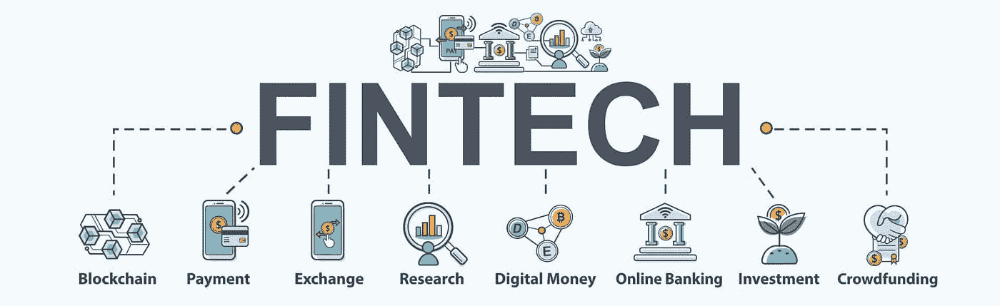
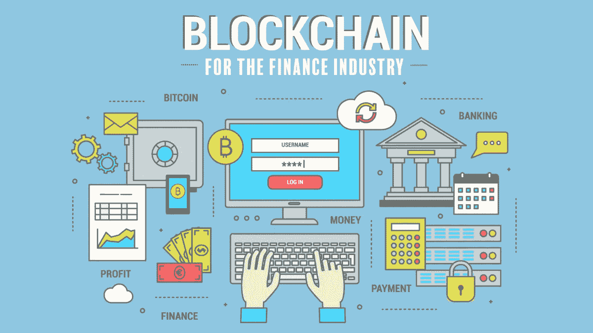

# 金融科技中的区块链:彻底改变金融世界！

> 原文：<https://medium.com/coinmonks/blockchain-in-fintech-transforming-the-finance-world-for-good-aab7b20782f2?source=collection_archive---------31----------------------->

几乎所有的行业，即使是在起步阶段，都在利用区块链的技术来实现更快的交易、更顺畅的流程和更高的透明度。与任何其他以技术为导向的行业一样，Fintech 正在认识到区块链的变革性影响，以创造更多收入、降低风险、提高效率，同时不忘改善企业运营中的最终用户体验。如果你认为自己跟不上金融市场的发展，不要惊慌！让我来解释一下金融科技和区块链对处理和管理支付的这种不断增长的刺激，支付在金融业中占据了最大份额。

# 金融科技的潜力

MENA(中东和北非地区)市场为金融科技带来了巨大的机遇；感谢已建立的金融机构。中东和北非地区的人口精通技术，并准备接受新技术。例如，在**#阿联酋**，超过 50%的人口使用数字钱包。这些国家(主要参与者包括阿联酋、沙特阿拉伯、埃及和巴林)举办了一些自由区活动，如阿布扎比金融周、巴林金融科技节、中东和非洲峰会以及世界金融科技展。政府支持的金融科技友好型法规正在培育该地区的本土企业家精神，并吸引全球参与者，从而推动了金融科技领域的并购活动。随着并购的兴起，像巴基斯坦这样在金融监管方面苦苦挣扎的发展中国家，可以促进私人金融科技公司进行**收购**，并帮助为最终用户带来便利，让他们能够快速接收和立即发送国际支付。

现在，让我们展示一下通过金融科技区块链接收、发送、存储和管理您的资金的便利性。

# 什么是 Fintech 区块链？

金融科技行业在疫情的恐慌中浮出水面。银行系统失灵迫使科技巨头们想出一个创新的解决方案来减少对当前金融系统的依赖。DeFi 或分散金融支持 **#P2P** (点对点)金融，使用基于 **#Ethereumblockchain** 的分散智能合约。与区块链达成 fintech 的技术收购。虽然，两者并不相同，在金融领域有不同的用例。

拥有区块链技术的 DeFi 公司创造了一种替代日常金融交易的方式。鉴于金融区块链以其安全性和自由性而闻名，具有去中心化、分布式、不可变和透明的数字账本技术等特征。

金融服务的用户需要赋权，他们厌倦了遵守政府对其金融事务的规定。为了控制交易，用户需要透明的金融服务，为最终用户增加价值。金融科技中的区块链可以为萌芽中的**#初创公司**重新设计金融格局。

但在我们深入这个利基市场之前，你应该对金融科技的趋势和区块链在金融中的作用有一个概念——让我简单地详细介绍一下区块链驱动的分散金融(DeFi)的影响

# 区块链重塑金融科技行业的方式

要了解区块链技术对金融科技的影响，最好分析几个用例，以了解它对经济的影响。以下是重要子部分的细目分类

*   **银行和 P2P 支付。**

传统银行业务已经成为现代高科技企业头疼的问题。中间环节造成的延误不仅会降低运营速度，还会增加服务成本。为了减少多层层级的参与，需要一个分散的系统，该系统使用一种**#共识**算法来实现快速安全的交易，这就是区块链技术进入金融领域的方式。

今天，经济的贬值促使金融部门转向数字货币，而不是传统货币，以降低交易成本，确保更快的交易。对廉价、便捷和安全的银行和投资的需求促使全球金融公司探索区块链金融科技解决方案，以建立一个共同的平台，将具有相似兴趣和需求的人们联系起来。我们都知道找不到稳定的国际支付解决方案的痛苦，因此错过了许多机会。国际支付通常需要 2-3 个工作日，取决于支付机构的开放时间，因为在到达目的地之前，您的付款必须通过多个银行系统。当然，它们都扣除了交易费用，减少了一大笔费用。

但总部位于区块链的金融科技移动应用程序可以成为救星，跨不同组织的交叉检查数据可以通过几级检查轻松认证，国际基金的转账也得到简化。

**法规合规性**

对全球监管合规性的需求推动了金融科技行业对区块链的采用。它有助于跟踪每一笔经过核实的交易，并记录相关人员采取的所有行动，这样监管机构就不需要确认记录的真实性。此外，该技术使监管机构能够审查原始文件，而不是手稿副本。

在概述了这一最新金融趋势的影响后，让我给你一些在金融科技中使用区块链的优势。

# 区块链在金融方面有什么优势？

**#区块链**赋能了包容、开放、安全的商业网络，在更短的时间内实现数字身份，降低单位交易成本，并根据用户需求提供强大的定制功能。最近，区块链技术已经成熟，并带来了以下好处

*   **透明。**区块链技术是去中心化和不可变的，并采用协议来提高数据完整性，并通过更快的处理来增强客户体验。基于区块链的金融科技移动应用程序可以为许多企业甚至寻求与全球企业合作或工作的自由职业者解决国际支付处理问题。
*   **安全。**金融领域的区块链实现了专门针对恶意第三方设计的安全应用代码，从而使黑客无法入侵或操纵。
*   **信任。在智能合同的帮助下，商业网络中的潜在各方可以管理数据协作并达成协议。对于外包公司来说，这是一个作为远程团队协作以支持内部需求并跟上业绩步伐的机会。**
*   **可编程性。如前所述，金融科技领域的并购市场正在蓬勃发展，金融领域的区块链支持智能合约和防黑客软件的创建和执行，提高了效率和信任度。**

# 外卖食品

金融机构，无论是初创公司还是企业，都应该考虑利用这一先进技术并将其集成到自己的商业模式中，以创建像 PayPal 这样的品牌，在提高生产率、降低成本和管理客户满意度方面值得全球信赖。

订阅 Techies 笔记本，了解所有最新的技术见解！

**# adfw 2022****# BHFinTechFestival****# FintechBay****# fintech startups****# menafintech****# green finance****# sustain****# net _ zero****# financial freedom****# sustain _ summit****# ADGM****#**

*最初发表于*[*https://www.linkedin.com*](https://www.linkedin.com/pulse/blockchain-fintech-transforming-finance-world-good-sana-ahmad/?trackingId=mhz0BBcdTTKLF%2BniVdc0AA%3D%3D)*。*

> 交易新手？试试[加密交易机器人](/coinmonks/crypto-trading-bot-c2ffce8acb2a)或者[复制交易](/coinmonks/top-10-crypto-copy-trading-platforms-for-beginners-d0c37c7d698c)