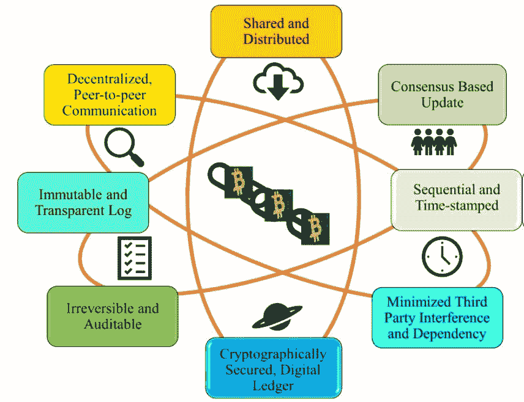
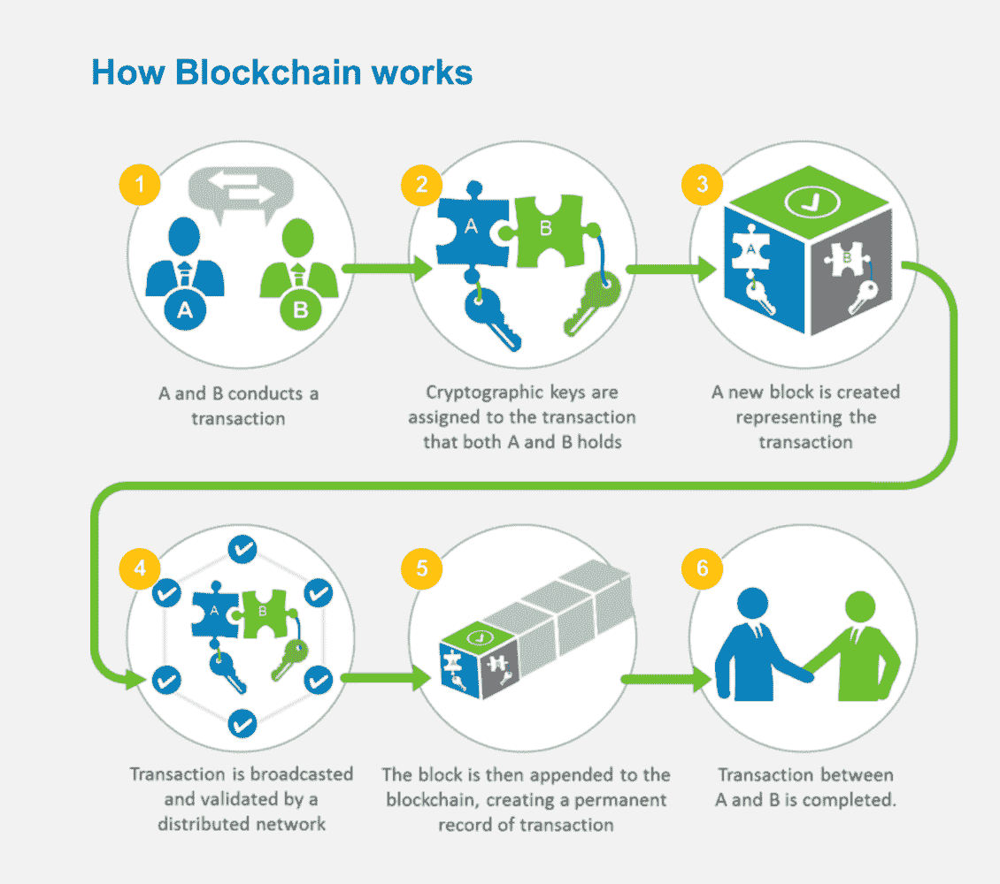

# 游戏中的区块链:趋势和局限性解释

> 原文：<https://medium.com/coinmonks/blockchain-in-gaming-trends-and-limitations-explained-288d5cf0cca1?source=collection_archive---------10----------------------->

你刚刚开始玩游戏，这种技术术语，“区块链游戏”听起来很奇怪吗？不要害怕，因为区块链只是一个数据库- *仅追加*。但是，它通过实现游戏内资产的安全交易、赚取加密货币奖励、产生被动收入流进行投资以及允许游戏内资产转移到游戏之外，增加了游戏行业的收入。区块链游戏是区块链大规模采用后的第一个真正的用例。

有所有权保证的游戏内资产推动了游戏行业的增长。尽管面临微观和宏观经济挑战，区块链博彩业自 2021 年以来增长了[2000%，并吸引了 25 亿美元的投资](https://www.forbes.com/sites/theyec/2022/08/02/3-things-you-need-to-know-about-blockchain-gaming/?sh=bf760ab4a850)。尽管许多企业都在努力使这个领域更具创造性，但它仍处于萌芽状态，有一定的局限性。

那么区块链科技是如何支持游戏产业的呢？请允许我用简单的话给你解释一下。

# 什么是区块链？

区块链是一种数据库，类似于您在电子表格中创建的数据库，并隐含着某些限制。在区块链，用户可以添加数据，但无权删除任何数据。这意味着每一个条目都被永久保存，给你所有权的自由，没有你的允许，不会与第三方共享存储在这个数据库中的任何数据。

其次，每个新条目(块)都与最后一个条目加密链接，这有助于维护历史。对于一个新的条目，它应该是链接的或有一些数字指纹的最后一个(哈希)。

事情就是这么简单，因为每个指纹都与最后一个指纹相关联，你最终会制造出一连串或一连串的事件——或者——技术人员喜欢称之为——区块链。

简而言之，区块链是不可改变的。我们一直在经历数据被盗和泄露，但当涉及到区块链时，即使最酷的黑客试图侵入并更改数据，每个记录中的指纹都会发生变化——这一点显而易见。信息的任何变化都不会被忽视。

使用这种数字分类账，用户可以享受安全交易的和平，并为未来的后续行动保留记录。现在，这是许多新创业公司和玩家的诱饵，他们打算以游戏内资产的形式赢得 NFT 和加密货币，并将其兑换成现实生活中的金钱。例如， [Axie Infinity](https://www.linkedin.com/company/axieinfinity/) 、 [CryptoKitties](https://www.linkedin.com/company/cryptokitties/) 、 [Sorare](https://www.linkedin.com/company/sorare/) 和 [#EtherLegends](https://www.linkedin.com/feed/hashtag/etherlegends) 有数百万玩家通过这些基于[#以太坊](https://www.linkedin.com/feed/hashtag/ethereum)[#加密货币](https://www.linkedin.com/feed/hashtag/cryptocurrencies)获利。玩家和游戏开发商可以在北海巨妖和比特币基地等可信的交易所出售所持股份以换取现金，甚至可以在加密自动取款机上取款。

# 区块链在游戏中是如何使用的？

游戏领域的区块链实现了玩家档案的互操作性。这意味着你可以将你的幻想转化成一个角色，并在所有区块链游戏中作为你的独特身份。用户可以在区块链上拥有自己的角色——你可以打造自己的品牌！

玩家赢得的版税和游戏币等游戏内资产现在会被保存并滚入下一场游戏。任何大师级玩家都可以用他们的游戏内资产解锁高级关卡。好的方面是这些资产在玩家的所有权下是可追踪的。

虽然区块链已经向小额支付机会开放了游戏空间，但一个与玩家一起玩游戏赚钱的社区正在寻找战利品或收藏品等稀有物品，这些玩家的热情激发了他们的兴趣并希望获胜。游戏开发公司，基于他们的激情和技能，雇佣玩家。玩家可以炫耀取得的里程碑。随着游戏空间在美国、英国和沙特阿拉伯的萌芽，很有可能我们会看到视频游戏在未来的奥运会上被列为电子竞技项目。区块链通过陈述不能改变的法律和保证每个玩家遵守规则来确保公平游戏。

前面解释过的区块链的光明面只是一个来自大海的杯子！只是为了给名单多添几个人

*   安全透明

反机器人保护软件 Jigger 的创始人 Levan Kvirkvelia 最近报告说，在 web3 游戏中，40%的玩家基数是机器人。不过，大多数游戏都使用这些机器人账户来增加玩家数量。区块链增加了透明度，无需重复花费，并有强大的游戏社区来帮助玩家报告问题。这为玩家增加了一层信任，并在进行数字交易时赋予他们所有权。凭借 NFT 人物、域名和数字钱包，《区块链》为玩家提供了一个安全的环境来分享甚至交易他们的资产。

*   增强的安全性

区块链使用加密系统来保护用户的姓名和身份。用户可以在他们的身份旁边有他们的人类可读的唯一域名。该系统使用双因素认证和安全消息来加强安全性，允许玩家共享他们的个人信息、兴趣、游戏数据甚至交易，从而防止数据篡改和黑客攻击。

*   改善用户体验

区块链增强了玩家对游戏体验的控制。玩家可以创建自己的角色，并在不同的游戏平台上使用自己的域名。每个档案都可以是独一无二的，允许玩家选择他们的游戏，甚至通过培育游戏中的角色来计划他们的游戏。这更像是发挥创造力，建立一支军队，并选择你想从你这边扮演的人。此外，用户可以远程访问他们的游戏资产，而不会影响他们的游戏体验。

*   核对批准案件

现代游戏伴随着使用资产完成任务的趋势。玩家需要道具，枪支，人物，美术，汽车，计划。然而，这些资产是稀缺的，可以用真金白银购买，就像你用万事达卡在易贝买东西一样，或者可以随着玩家赢得更多关卡而赚取。

玩家可以努力解锁更多游戏内资产，也可以通过信用卡购买。但在这两种情况下，交易都应该是合法且可验证的。区块链通过标记这些资产来实现认证验证。由于该分类账对每个人都开放以供验证，因此它增加了信任，并为所有用户建立了基于开放账簿的公平价格市场。

*   赢取奖励

奖励账户是数字钱包中的一个加密存储设施，根据您在其中转账或存储的金额赚取奖励。如果你打算更长时间持有你的密码，在一定时间内将你持有的部分锁定在赌注池中；作为交换，你将获得奖励。但这也有不好的一面。赌注奖励以本地加密货币支付，可能会有波动。然而，你可以购买或赚取美元挂钩的稳定硬币，如美元硬币(USDC)或戴。

*   创建集成的游戏档案

区块链比互动游戏社区更有优势，在互动游戏社区中，玩家有发言权，可以发表自己的意见。要成为这些集中社区的一部分，玩家可以使用他们的游戏档案来参与。如果这有助于游戏的积极发展，玩家可能会被游戏开发公司雇佣来审查游戏，并为玩家设计身临其境的游戏体验。玩家可以在多个平台上使用他们的游戏档案，而不用担心身份被盗。

区块链游戏比传统游戏更有潜力，但也有局限性。

# 区块链技术在游戏中的局限性

机遇伴随着挑战；用户应该了解区块链的方方面面；我在这里列出了几个例子，让你有更好的理解。

*   进入壁垒

以玩赚为口号的区块链游戏，吸引了一定的市场，构建了被动收入流。但是每个玩家登录游戏必须支付的入场费阻止了他们尝试新的平台。对新玩家来说，为每场游戏付费似乎很昂贵。

在秘密经济介入之前，玩家将与游戏机器人作战。但是，为了带来有机的流量，玩家应该可以自由地玩，如果他们感兴趣，以后想把他们的奖励变成真正的钱，可以没有任何麻烦地这样做。这是大多数玩家寻求的自由。如果每一次输赢都被转化为奖励，影响可能是巨大的，并导致失去热情的玩家。

*   复杂性

难点在于游戏性。要开始一个游戏，用户需要建立一个用户帐户；这很容易，但麻烦来了；根据区块链游戏的不同，玩家需要建立一个密码钱包，并购买一定数量的密码，这很有挑战性。随着万事达卡的到来，其对 web3 的支持可能会为菲亚特支付带来认证，但玩家只能在英雄联盟等特定平台上享受这一点。

# 区块链游戏的真实例子

市场上有数百款区块链游戏准备推出，但为了更好地保留信息，我将保持简洁。

[隐猫](https://www.linkedin.com/company/cryptokitties/)

如果你是一个爱猫的人，crypto kitties 可以让你想养多少只猫就养多少只。这款游戏于 2017 年推出，是区块链游戏的先驱之一，随着时间的推移，它越来越受欢迎。在以太坊的基础上，玩家可以创造出具有独特特征的新一代小猫，以最大化它们的价值。

玩家可以在公开市场上交易他们的小猫，或者持有它们，直到它们获得好的价值。每个猫咪的角色都可以代表不同的特征，比如眼睛形状、嘴巴形状、皮毛图案、配饰颜色和底色。

*   国际足联硬币 4 销售

对于所有足球爱好者来说，这是一个热门的市场，用户可以在这里为国际足联买卖游戏中的物品。由于该网站使用分散的市场，用户可以安全地购买合法的 FIFA 硬币。

区块链可以帮助永久存储数字资产，而不用担心被撕掉或褪色。

# 多亏了区块链，游戏领域正在发生这些变化

熊市最近影响了大多数数字资产，但据推测，这个技术冬天将导致 NFT 再次繁荣。最近，特斯拉已经接受比特币作为未来的支付方式，万事达卡也支持 web3，为游戏内经济的复兴带来了信心。

在区块链游戏中，玩家可以成为程序员，有能力以武器和角色的形式将他们独特的品牌货币化，甚至可以出售整个账户。有无限的可能性，但游戏开发商应该确保游戏的乐趣部分完好无损，门槛低。区块链还是新生事物，游戏行业还有很多需要探索和发展的地方。因此，任何期待在游戏领域建立职业生涯的人都应该关注这个领域的新发展。

> 交易新手？试试[密码交易机器人](/coinmonks/crypto-trading-bot-c2ffce8acb2a)或者[复制交易](/coinmonks/top-10-crypto-copy-trading-platforms-for-beginners-d0c37c7d698c)