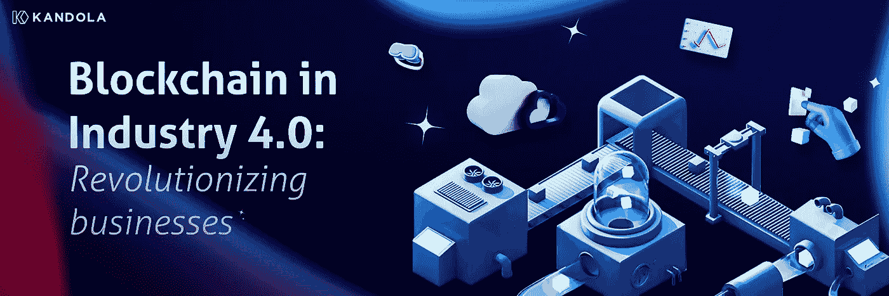

# 工业 4.0 中的区块链:彻底改变商业

> 原文：<https://medium.com/coinmonks/blockchain-in-industry-4-0-revolutionizing-businesses-a96ee8c805c7?source=collection_archive---------12----------------------->

机器人、物联网传感器和先进的自动化已经将工厂转变为其新的智能化身，称为智能工厂。虚拟现实、增强现实、机器学习和人工智能正在为这些工厂增加新的观察维度。

5G、云技术、虚拟化和边缘计算正在为连接、存储和高效执行提供必要的基础设施。区块链通常与去中心化金融、NFTs 和加密货币联系在一起，但似乎并不完全适合工业 4.0 (I4.0)。然而，区块链的真正目标是建立透明、信任、安全和隐私。这些核心目标与技术进步相结合，是包容、意识、民主和真正数字所有权的催化剂。我们已经精心挑选和策划了区块链的这些方面，这些方面对于 I4.0 来说是真正的转型。

## **可审计性、问责制和透明度**

安然公司的倒闭是美国迄今最大的破产申请，是可疑会计实务和标准的最好例子。该公司通过将未实现的未来收益写入当期损益表，给人一种利润更高的假象。它还通过在账面上隐藏一些资产来掩盖损失的严重性。随着会计欺诈细节的曝光，安然公司的股票从 90 美元跌至 1 美元，导致数千人失业以及员工养老金的损失。机构欺诈的影响不仅仅是昂贵的诉讼、失业和形象受损。区块链可以通过将金融交易记录在不可变的分散式账本上来恢复问责制和透明度。然后所有的利益相关者都可以查看交易，但是没有人可以修改它们。有了不可变的分类账，对公司的审计变得相当容易，任何偏差都可以快速追溯。

## **数字供应链**

物联网为各种性能、消耗和维护相关参数提供了独特的见解。这些独特的见解导致了复杂的分析能力。基于 GPS 的传感器等支持跟踪的物联网设备可以收集从源头到目的地的准确旅程数据。这种可追溯性对于供应新鲜农产品、咖啡、茶叶和疫苗的行业尤其有用。现代消费者想知道他们的钻石来源是否合乎道德，衣服是否不是在血汗工厂制造的。全程跟踪绩效和交易还有助于企业、制造商和工厂改进采购、仓储和运输实践。物联网设备和传感器记录区块链上的交易、位置和其他各种与物流和运输相关的参数。使整个事件和交易链在区块链上可用，提供了优于传统供应链的显著优势，并建立了对数字化供应的信任。

## **医疗保健**

如今困扰医疗保健的两个主要问题是健康数据的安全性和隐私性，以及所有记录在一个地方的可访问性和可用性。诊断、处方、手术和其他治疗记录以数字化格式存储，称为电子健康记录(EHR)。然而，当患者更换医疗服务提供者和医生时，患者的 EHR 被记录在单独的数据库中。完整的健康记录既不容易获得，也不能从一个数据库中获得。医生和医疗保健提供者缺乏从患者的单个综合电子记录中收集的洞察力。区块链可以作为安全访问这些数据库孤岛的单点。患者可以使用他们的区块链帐户安全地访问他们选择的医疗保健提供商和医生。区块链上的记录是不可变的，只能在未来更新。

## **将隐私添加到大数据和分析中**

如今，企业和制造商面临着一个独特的困境。如果他们收集顾客和消费者的信息，那就是侵犯隐私。然而，如果没有这些信息，他们就无法运行 ML/AI 算法来生成高效运营业务所需的洞察力。对于医疗保健行业来说，这个问题更加严重，因为识别模式是治疗成功的关键。将个人身份信息(PII)从用户数据中分离出来可以解决隐私问题。一个人的区块链账户不绑定任何 PII。区块链可以保护用户的 PII，同时在用户同意的情况下共享用户数据。企业可以对其余的用户数据运行他们的 ML/AI 算法，而完全无视用户身份。区块链因此可以增强企业的能力，同时保护用户的隐私。

## 基础设施的民主化

区块链正在为许多基础设施企业基于去中心化和激励的新收入模式铺平道路。去中心化允许用户做出贡献，激励机制激励他们做出更多贡献。Nova 实验室的物联网网络 Helium 是最大的分散式无线物联网网络。氦热点是一种带有天线的小型设备，可以传输少量数据，尤其是物联网数据，传输距离是传统 wi-fi 热点的 200 倍。热点的所有者与附近的联网物联网设备(如停车计时器和空气质量传感器)共享带宽。这种模式运作得如此之好，是因为所有者受到了氦的 HNT 代币的激励。同样，Storj 等基于区块链的存储公司正计划利用全球各地人们未使用的磁盘空间来存储区块链离线数据。这种安排使存储空间真正分散和安全。用户对基础设施的贡献是全球网络的真正民主化。

## **可持续性**

环保主义者正在想办法奖励那些为可持续发展做出努力的人和组织。他们打算利用区块链创造的分布式账本技术带来透明度和意识。物联网传感器可以测量车辆行驶和燃烧化石燃料等日常操作的碳排放。传感器将这些数据记录在区块链提供的分布式账本上。由于分类帐是分布式的，每个人都可以查看数据，没有人可以更改数据。对污染水平的认识有助于组织采取措施减少碳足迹。MSRcosmos 集团有一个名为 MSRvantage 的初创项目。该倡议正在帮助企业优化能源消耗和采用可持续的做法。现代消费者想知道产品背后的碳足迹。由于公众意识的增强，碳足迹大的行业必须采取纠正措施。

## **结论**

区块链作为一项技术，不仅仅是提高生产力、效率和速度。它试图将所有利益相关者纳入同一平台。它为所有参与者提供平等权利和平等待遇，并赋予他们权力。区块链将成为企业和行业行为转变背后的催化剂。通过记录产品和流程的旅程，让人们意识到不道德的做法，让人们为全球基础设施做出贡献，让利益相关者清楚地了解所有交易，区块链将改变企业和行业的运营方式。

在 Kandola Network，我们正在构建区块链版本，可以做到这一点以及更多。要了解更多关于 Kandola 区块链解决方案的信息，请访问 www.kandolanetwork.com[。](http://www.kandolanetwork.com.)

> 交易新手？试试[密码交易机器人](/coinmonks/crypto-trading-bot-c2ffce8acb2a)或[复制交易](/coinmonks/top-10-crypto-copy-trading-platforms-for-beginners-d0c37c7d698c)