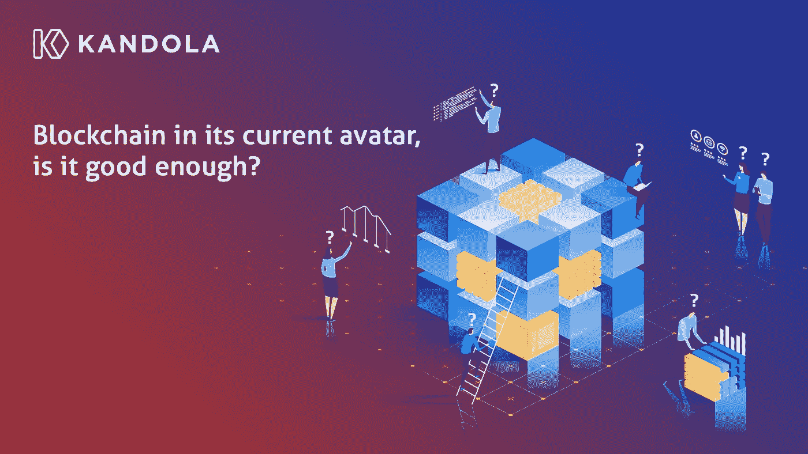

# 区块链目前的头像，够好吗？

> 原文：<https://medium.com/coinmonks/blockchain-in-its-current-avatar-is-it-good-enough-aa0918e1a885?source=collection_archive---------21----------------------->

~ Shruti Dutta，Kandola 网络

尽管对许多人来说这是一个奇妙的解决方案，但就其目前的形象来看，它并不是理想的解决方案。私立区块链经常因其集权而受到谴责，而公立区块链经常因其分权而受到称赞。公共区块链的支持者断言，权力下放对于保证信任和安全至关重要。而私有区块链的支持者则认为集中化是提高效率和可伸缩性所必需的。然而，区块链公立和私立学校面临的基本问题是一样的。

在本帖中，我们将探讨现有区块链的一些基本问题，以及坎多拉网络如何解决这些问题。

**性能**

区块链网络可能既慢又笨重，尤其是与传统数据库相比。这是因为链中的每个块在被添加之前都必须由网络中的所有节点验证，这可能需要时间。此外，随着越来越多的数据添加到区块链，节点验证所有信息会变得越来越困难，这可能会导致性能下降。

这种滞后和经常性的安全漏洞导致区块链的采用速度较慢，从集中但速度更快的数据库中迁移的数量也较少。

权力下放虽然高度透明和民主，但并不能有效地扩大数据传输。

**Kan dola 网络方式(Kan 方式)——**消息验证功能支持极其轻量级的原子操作&极高的网络吞吐量

**使用困难**

消费者可能很难穿越这种环境，这是广泛采用的另一个严重障碍。对于新用户来说，理解所需的硬件、前端交互和安全实践可能具有挑战性。不友好的 DApp 界面吓坏了潜在的企业和用户。

这是因为很少有工具可以帮助消费者开始使用。我们相信开发人员社区想要简化问题，但是区块链的分散化、可伸缩性和安全性的三难困境阻碍了他们。

**“Kan 方式”——**易于部署的 SDK 工具包，无代码仿真器&易于集成的合成器

**高额燃气费**

矿工收取的天然气处理费可能相当高，尤其是在高需求时期。这使得一些用户很难甚至不可能在区块链上进行交易。

高昂的汽油费成为进入的障碍。如果有人不愿意支付高额费用，他们可以干脆选择不使用区块链。当然，高昂的汽油费不一定是一个永久的问题。可持续的区块链，当务之急；将为未来几年更高的采用率铺平道路。

**“菅直人之道”——**用零汽油费政策让高汽油费成为过去

**Defi Centric**

区块链技术通常与加密货币密切相关。虽然区块链解决方案确实给金融行业带来了巨大的好处，但它目前正在许多其他行业中实施。医疗保健和生命科学、供应链、保险、媒体和通信以及更多的行业都被定期添加到这个列表中。为了更快和更广泛的工业应用，需要一个更通用的 L1 区块链。

**【The Kan Way】-**实时消息队列&数据存储将支持任何需要快速消息功能的行业，即物联网、电动汽车、智能可穿戴设备、全球定位系统、医疗保健、基于 Kandola 的社交信息。阅读更多-[https://Kan dola . network/](https://kandola.network/)

在我们接下来的文章中，我们将详细讨论 Kandola 的显著特征。请通过 hello@kandola.network 告诉我们您的想法

敬请期待！！

> 交易新手？尝试[加密交易机器人](/coinmonks/crypto-trading-bot-c2ffce8acb2a)或[复制交易](/coinmonks/top-10-crypto-copy-trading-platforms-for-beginners-d0c37c7d698c)