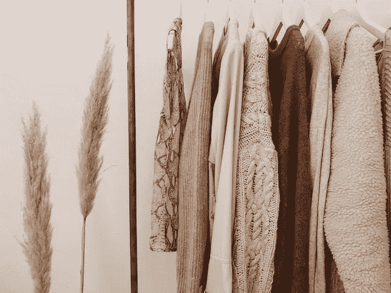

# 时尚行业的区块链

> 原文：<https://medium.com/coinmonks/blockchain-in-the-fashion-industry-3dbeea45acb7?source=collection_archive---------39----------------------->

我们不断看到区块链在许多行业的影响力越来越大——这包括时尚。毕竟，该技术在商品和它们在区块链中的数字标识符之间建立了物理-数字连接。对于时尚行业来说，这意味着提供许多有价值的功能，保护版权，或有效地消除知名制造商推出的假冒商品。**那么，时尚中的区块链是什么？区块链如何支撑时尚产业？**你将在文章的其余部分读到它。

**目录**

*   [什么是区块链技术？](https://blufol.io/blockchain-in-the-fashion-industry/#1)
*   [时尚中的区块链——这个市场面临哪些挑战？](https://blufol.io/blockchain-in-the-fashion-industry/#2)
*   [区块链在时尚界是如何使用的？](https://blufol.io/blockchain-in-the-fashion-industry/#3)

# 什么是区块链技术？

区块链可以有两种理解。首先，它是区块链比特币，即使用这种技术作为所谓的加密货币，也是区块链技术——一种包含交易历史的数据库结构。因此，像传统的登记处一样，它是一个包含不可变的、按时间顺序排列的数据的分类账——数字条目。**该技术保证并认证与每笔交易相关的数据和操作的全部历史。**因此，如果不自动记录该操作的日期和信息，就无法更改该系统。交易历史可以反映事务的当前状态，例如产品的所有权或拥有权，但也可以反映手表的服务历史等事实。

# 时尚中的区块链——这个市场面临哪些挑战？

时装业和其他行业一样，面临着许多挑战。长期以来影响它的一个大问题是充斥市场的假货。因此，某些品牌形象受损，甚至出现亏损。另一个挑战是**跟踪交付和及时交付具有适当规格的货物**。幸运的是，区块链技术正在拯救我们。

# 区块链在时尚界是如何使用的？

想知道现在流行什么区块链？想知道这项技术如何应用于时尚领域？下面你会发现一些重要的使用案例。

# 供应链管理

**区块链技术在时尚行业最相关的应用之一是供应链和库存管理**。与射频识别(RFID)和其他物联网技术一起，区块链可以帮助您从源头到工厂即时跟踪原材料。成品可以在整个过程中追踪到消费者。此外，区块链允许实时访问所有产品信息。供应商可以从供应商那里获得关于库存和消费者反馈等问题的即时信息。

# 保护知识产权

时装制造商和设计师可以使用区块链来确保每个制造物品的来源和所有权都是可追溯的。此外，由于伪造品没有真实的记录链，因此很容易追踪。

**伦敦设计师 Martine Jarlgaard 是在时尚行业使用区块链的先驱。**2017 年，他创建了第一条使用区块链记录和跟踪的智能服装线。因此，消费者可以检查生产过程中的几乎每一个步骤——从购买原材料到生产成品。这种透明度保护了知识产权，也是一种竞争优势，因为买家可以找到他们的衣服是在哪里以及如何制造的。

# 版税会计

区块链可以在时尚行业发挥积极作用的另一个例子是**版税跟踪**。这是因为该技术允许设计师许可他们的作品，并轻松注册商标。在区块链的帮助下，时尚专业人士还可以跟踪版税的分配和他们设计的销售。

如你所见，区块链技术在时尚行业有很多应用。我们甚至可以说，它支持创作者促进他们的业务。毫无疑问，在未来几年，区块链将彻底改变时尚领域。

**类似文章:**

*   [区块链正在如何改变游戏行业？](https://blufol.io/how-is-blockchain-changing-the-gaming-industry/)
*   [银行业的区块链技术](https://blufol.io/blockchain-technology-in-banking/)
*   [物流中的区块链。它是如何改变这个行业的？](https://blufol.io/blockchain-in-logistics-how-is-it-changing-the-industry/)

> 交易新手？尝试[加密交易机器人](/coinmonks/crypto-trading-bot-c2ffce8acb2a)或[复制交易](/coinmonks/top-10-crypto-copy-trading-platforms-for-beginners-d0c37c7d698c)