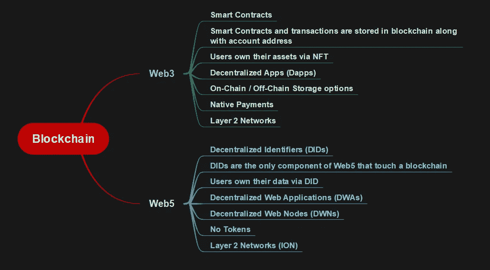
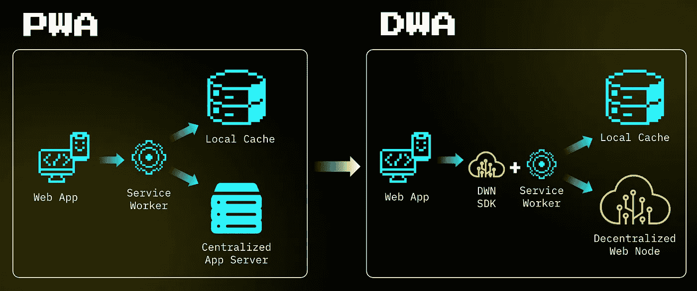

# Web3 和 Web5 中的区块链

> 原文：<https://medium.com/coinmonks/blockchain-in-web3-and-web5-e78181670678?source=collection_archive---------8----------------------->

## 并列比较

Twitter 前首席执行官杰克·多西推出了一个新的分散式网络平台“Web5”，它是 Web3 和 Web2 的混合体。自从 TBD 在网上发表了他们的想法，我就想深入研究一下。这篇博文的目的不是说 Web3 比 Web5 更好，或者相反，而是这篇博文的目的是展示区块链作为一种技术如何在 Web3 和 Web5 中得到利用。为此，我们将在区块链实施、资产/数据所有权、应用程序部署、数据存储、本机令牌和可扩展性等因素上比较 Web3 和 Web5。

*免责声明:*为了简单起见，我们只关注 Web3 中的以太坊区块链和 Web5 中的比特币。对于那些想在 Web3 上回顾定义的人，请访问[以太坊的文档这里](https://ethereum.org/en/web3/)，对于 Web5，请看看这里的 [TBD 文档。](https://developer.tbd.website/projects/web5)

## **区块链**实现

在 *Web3* 中，以太坊等区块链平台被用来以智能合约的形式部署应用逻辑。然后，用户帐户可以通过提交执行智能合约功能的交易来与智能合约通信。以太坊的每一笔交易都有记录，并且是公开可见的。

而在 *Web5* ，[分散标识符](https://www.w3.org/TR/did-core/) (DIDs)是唯一接触区块链的组件。比特币等区块链正在 Web5 中用于锚定 DIDs。DIDs 是 W3C 提出的一个建议，它将用户和他们的信息联系起来，并且有一个标准化的结构。

## 资产/数据的所有权

通过不可替代令牌(NFT)，Web3 以前所未有的方式为用户提供了对其数字资产的控制。就像现实或数字世界中的物品契约一样，NFTs 可以用来表明任何独特资产的所有权。它们由以太坊区块链担保，一次只能有一个合法所有者；没有人可以通过复制和粘贴现有的所有权记录来更改所有权记录或创建新的 NFT。

> 交易新手？尝试[加密交易机器人](/coinmonks/crypto-trading-bot-c2ffce8acb2a)或[复制交易](/coinmonks/top-10-crypto-copy-trading-platforms-for-beginners-d0c37c7d698c)

位于链外的 DID 文档通过 Web5 中的 DID URI 连接到 DID 的主题(被识别的人、企业或对象)。使用 Web5，用户可以托管自己的个人数据存储，并将他们的数据与他们使用的应用程序隔离开来。如果应用程序可以访问特定用户数据存储的位置，它可以向该用户发送访问数据的请求，从而让用户完全控制他们的数据。

## 应用程序部署

在 Web3 中，分散的应用程序(Dapps)在分散的网络上运行它们的后端代码(智能合同),而不是使用集中的服务器。他们在以太坊区块链上存储数据，并使用智能合约实现他们的应用程序逻辑。Dapps 可以去中心化，因为它们是由写入契约的逻辑控制的，而不是个人或公司。

Web 5 使开发人员能够构建分散的 Web 应用程序(DWAs ),这些 web 应用程序增强了分散的身份和数据存储能力。DWA 的工作方式类似于渐进式 web 应用程序(pwa ),但是您需要添加分散式 Web 节点 SDK，这样应用程序就可以自由地脱离服务器，因为数据并不存储在应用程序中。PWA 代表 Progressive Web Apps，这是一种可安装 Web 应用的标准，目前在所有主流浏览器中都有实现。)

## 数据存储

由于部署在以太坊等公共区块链上的 web 3 dapp 会要求用户在每次交易需要添加新状态时支付额外费用，因此大多数 web 3 dapp 都使用分散式链外存储解决方案，如其架构中的 [IPFS](https://ipfs.io/) 或 [Swarm](https://www.ethswarm.org/) 。IPFS 是一个分布式文件系统，用于存储和访问数据。因此，IPFS 系统不是将数据存储在中央数据库中，而是将数据分布和存储在对等网络中。Swarm 类似于其他分散存储网络，但有一个关键区别。Swarm 的激励结构是使用以太坊区块链上的智能合约来整合和执行数据存储和检索的，不像 Filecoin，它是一个独特的系统。有关 Web3 架构的更深入分析，请访问 Preethi Kasireddy 的博客。

正如我们在“资产/数据的所有权”一节中所讨论的，Web5 允许其用户托管他们自己的个人数据存储，称为分散 Web 节点(dwn ),从而将用户数据从应用程序中分离出来。dwn 不存在于区块链，可以保存公共数据和加密数据。如果应用程序有用户的 DWN 地址，它可以向用户发送数据请求。由于 dwn 中的数据是符合全球标准的 JSON 对象，任何应用程序都可以访问和使用给定语义类型的数据。如果数据是私有的，节点所有者必须授权访问应用程序；如果数据是公开的，这些对象将自动返回给应用程序。

## 本地令牌

在 Web3 中，以太坊等公共区块链平台提供本地令牌。以太(ETH)是以太坊区块链使用的本地令牌，作为验证交易的支付系统。

正如我们之前在 Web5 中讨论的，DID 是唯一接触区块链的组件，Web5 利用运行在比特币之上的第二层 DID 网络[来存储 DID。因为对于身份标识符，ION 是 DNS 的分散替代方案，所以它没有任何集中的权威、协调者、令牌或瓶颈。](https://identity.foundation/ion/)

## 可量测性

广泛采用 Web3 应用的主要障碍之一是提高后端区块链网络的速度和吞吐量的必要性。可伸缩性的基本目标是提高事务吞吐量(每秒高事务数)和事务速度(更快的终结)，而不损害安全性或分散性。由于需求过大，第 1 层以太坊区块链经历了较慢的交易时间和无利可图的天然气定价。像以太坊这样的区块链平台提供了各种各样的扩展解决方案，比如链上扩展、链下扩展、等离子链、侧链等。

与 Web3 类似，Web5 也存在可扩展性问题，因为 Web5 使用比特币区块链平台来锚定 did。为了克服比特币的可扩展性问题，Web5 利用了 ION，这是一个运行在比特币之上的第二层 DID 网络，用于存储 DID。由于 ION 是为扩大规模而构建的，它在整个网络中每秒钟可以处理数千次 DID 操作。它是一个基于完全确定性侧树协议的无许可网络，不需要任何额外的共识技术、可信验证器或特殊令牌来运行；所需要的只是比特币时间链的线性推进。