# 区块链……..是未来🤔😮！！

> 原文：<https://medium.com/coinmonks/blockchain-is-future-22492163eba3?source=collection_archive---------7----------------------->

***分布式账本技术***

分布式账本技术是“它是分布在几个站点的数据库”的一种奇特说法。DLT 是一个总括术语，用来描述在多台计算机上分发数据的任何系统。有几种类型的 DLT，如区块链、Tempo、DAG(有向无环图)等。所有的区块链都是 DLT 的，但所有的 DLT 都不是区块链。

***DLT 的好处:-***

分布式账本技术具有以下潜力

1.  更快的交易
2.  去除中间人
3.  降低成本
4.  更安全
5.  运输

DLT 如何影响商业？

DLT 创建了一个永久的、分散的、全球性的、不可信的记录分类账。它可以在世界任何地方访问，并且不需要可信的第三方来执行交易。

让我们把 DLT 对企业的影响分成三个主要部分:

*   转变内部流程和操作:-

这包括 DLT 在商业价值网络内部流程和互动中的潜力。它可以是以下形式:

a)付款

b)资产跟踪

c)数据共享

d)识别管理

*   转变商业模式

这包括超越技术，包括与新型客户互动和商业模式创新理念相关的潜在价值:

a)客户参与

b)微交易

创造新市场

*   新机遇

DLT 可能会创造新的机会，这些机会既不属于核心价值链，也不属于核心商业模式:

a)资金

b)获取数据

c)人群协作

d)自治组织。

***区块链:-***

“区块链就是技术。比特币仅仅是其潜力的第一个主流体现”。

*   区块链是所有记录的数字化、分布式账本。
*   按时间顺序记录事务的分布式数据库。
*   最初设计用于支持比特币。
*   区块链由 3 项技术构建而成:-

1.  私钥加密→ a) ECC b)RSA
2.  P2P 网络→ a)种子网络 b)记录系统
3.  程序(网络协议)→ a)散列算法 b)握手算法

# **区块链的真实世界类比**

**区块链与现实世界的类比:-**

*   运输银行金库。
*   银行账户对账单。
*   在计算机网络中被复制数百次的电子表格。
*   分发给所有读者的大尺寸笔记本。
*   多方共享的 google 文档。
*   街头足球比赛。

**区块链类比:-**

*   想象一下一家银行的大型保险库系统。
*   金库里堆满了一排排的保管箱。
*   每个保管箱都由玻璃制成，允许每个人都可以看到保管箱里的东西，但只能进入他们的金库。
*   当一个人打开一个新的保险箱时，他/她会得到一把唯一的钥匙。
*   这是基于区块链的加密货币的根本概念。任何人都可以看到所有其他地址的内容。

***区块链为什么是 Web 3.0？***

*   没有中心控制点。
*   数据所有权
*   减少黑客攻击和数据泄露
*   不间断服务

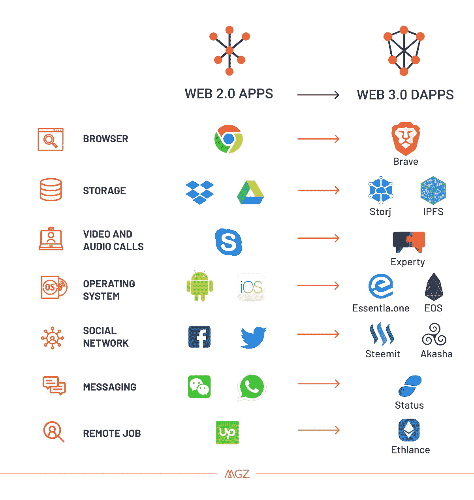

***窥视区块链内部***

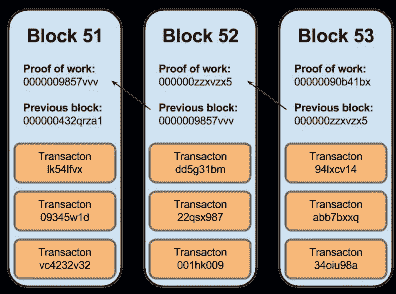

***区块链特征***

*   每个块都建立在前一个块的基础上，并使用该块的散列来形成一个链。
*   验证和确认链上的块是由矿工处理的。
*   创建的块通过区块链加密密封，这意味着几乎不可能通过块链删除和修改数据。
*   共识算法确保所有交易都经过验证，并且只在区块链上添加一次。
*   矿工因运行当前奖励中的共识算法而获得奖励，比特币区块链为 12.5 BTC，以太坊区块链为 2ETH。
*   所有添加的块都是按时间顺序和时间标记的。

# **区块链的历史**

***比特币开端-***

*   区块链技术最初是在 1991 年描述的，目的是给数字文档加时间戳以避免篡改。它于 2008 年被中本聪采用，创造了名为比特币的数字加密货币。
*   区块链技术的概念是在十年前提出的。
*   区块链技术的第一个用例是比特币。
*   2008 年，Satoshi 发表了《比特币白皮书》，题为《比特币；对等电子现金系统”。它指出，交易可以在没有任何第三方参与的情况下进行。这导致了区块链技术的引入。
*   几个月后，一项新的协议发布了，用 50 枚硬币开始了创世纪积木的概念。它是一个开源程序，后来成为比特币点对点网络的一部分。

Satoshi Nakamoto

***智能合约的兴起:-***

2013 年左右，比特币代码库的最初贡献者 Vitalik Buterin 对比特币的编程限制感到失望，并着手建立第二个名为以太坊的公共区块链。

*   以太坊可以记录资金、船只、汽车或合同等资产，而不仅仅是货币。
*   以太坊于 2015 年推出，具有智能合约的功能，可以根据区块链建立的一套标准自动执行逻辑运算。

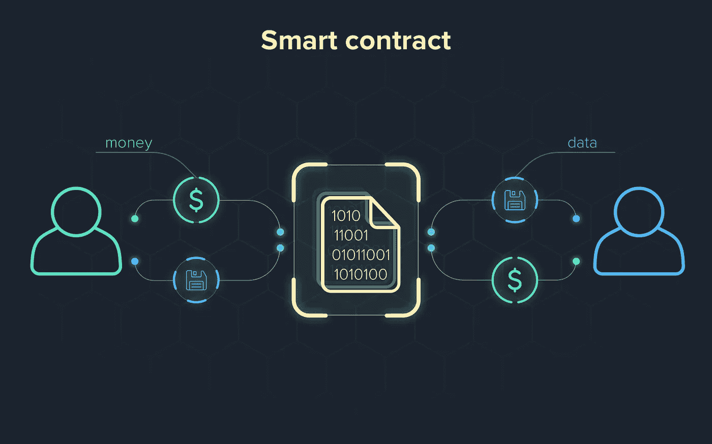

***钱包:-***

*   区块链钱包类似于数字钱包，允许参与者管理他们的加密货币。
*   钱包让用户生成私钥和公共地址。
*   私钥用于发送交易，公共地址用于接收交易。
*   没有关于谁与谁做了什么交易的可见身份记录，在交易中只有钱包的地址是可见的。
*   区块链钱包的类型有:-

1.  纸质钱包:-存储在一张纸上的私人密钥
2.  网络钱包:-存在于互联网上；可以通过 URL 访问。
3.  移动钱包:-移动设备上的应用程序
4.  桌面钱包:-软件应用程序
5.  硬件钱包:-用于存储私钥的硬件设备
6.  实体钱包:-智能卡形式

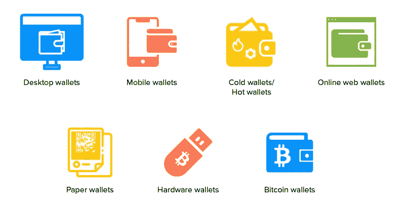

***数字签名:-***

*   类似于真实签名的数字签名是证明某人是他们所说的那个人的一种方式
*   数字签名使用比手写签名更安全的加密技术。
*   私钥用于直接签署消息。
*   接收方可以使用发送方的公钥进行验证。
*   在区块链上执行的每一笔交易都由发送方使用他们的私钥进行数字签名。
*   SSL 是数字签名的一个例子。

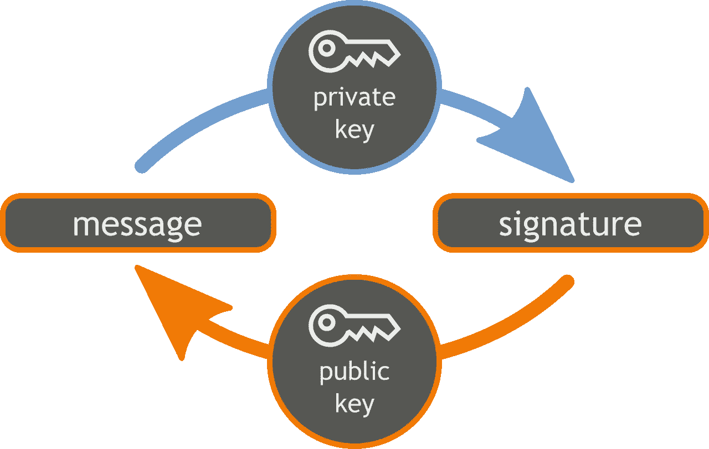

***协议:-***

*   每个区块链都由编入其中的行为规范组成。
*   协议定义了区块链。
*   私钥用于发送交易，公共地址用于接收交易。

***协议示例:-***

→每个哈希值的输入信息必须包括前一个块的哈希值。

→每封完 210000 个区块，成功开采一个区块的奖励减少一半。

→为了将开采一个区块所需的时间保持在大约 10 分钟，每 2016 个区块调整一次开采难度。

# 键及其概念

***私钥:-***

*   私钥用于为区块链上的每笔交易生成签名。
*   生成的签名用于确认交易来自特定用户，并且还防止交易被任何恶意实体篡改。
*   简单来说——“私钥是用来给你发给别人的加密货币签名的”。
*   如果有人获得了你的私钥，他们就可以将你的加密货币发送给自己，这种情况在世界各地的大多数黑客中都发生过。
*   示例:- L34EXrFCuxQCofE66sxQe8…………Tw

***公钥:-***

*   私钥用于从数学上导出公钥。
*   公钥实际上是不可逆的，也就是说，你可以很容易地从私钥推导出公钥，但反之则需要数百万年。
*   公钥可以分发给每个人。
*   例如:-0237 f 49 F4 cf…………8FD

***地址:-***

*   核心中的加密货币地址是公钥的表示。
*   单向加密散列函数用于从公钥中导出地址。
*   例如，在比特币中，用于从公钥生成比特币地址的算法是安全哈希算法 256(SHA-256)和竞争完整性原语评估消息摘要 160 (RIPEMD-160)
*   地址通常出现在双方的交易中，地址表示资金的接收方。
*   示例:- LJPgML………..dPV3a

私钥→随机生成的大数字

公钥→从私钥生成

地址→从公钥生成

***交易:-***

*   交易是按时间顺序的数据记录。
*   事务存储在块内的 Merkle 树中。
*   交易提交后，由区块链网络提取并插入“未确认交易池”。事务池是该网络上尚未确认的所有事务的集合。
*   网络上的矿工从该池中选择事务，并将它们添加到他们的“块”中。
*   交易还包含元数据信息，可用于通过区块链存储数据。

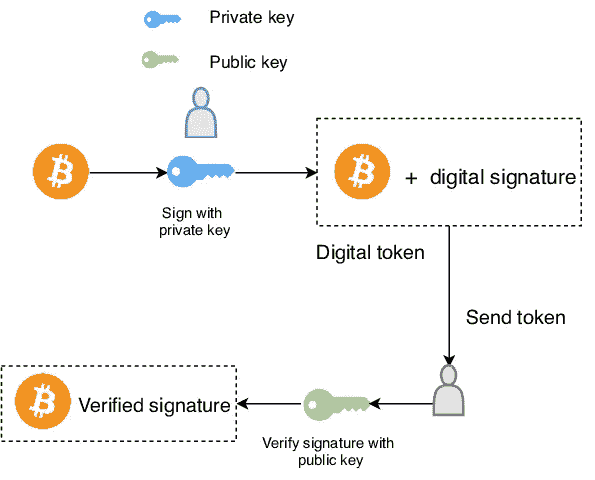

Simplified digitally signed transaction on blockchain

***什么是积木？***

*   块是一个容器数据结构，它包含一组已确认的事务。
*   一个块可以包含不同的信息，并且这些块的链演变成区块链，只要它将一个和另一个链接起来。
*   这些数据块存储在遍布全球的点对点网络中的许多矿工的硬盘上。
*   在比特币算法中，每 10 分钟就会创建一个区块。在 10 分钟间隔内在网络上发生的所有事务都被压缩到块中并添加到链中。

***积木的结构:-***

区块链中的所有区块都由标头、标识符和一长串交易组成。砌块的结构如下

***块头:-***

报头包含关于块的元数据。有 3 组不同的元数据:-

*   前一个块哈希。在 blockhain 中，每个块都继承自上一个块，因为我们使用前一个块的散列来创建新块的散列。
*   网络采矿竞赛。对于要成为区块链一部分的每个块，需要给它一个有效的散列。这包含时间戳、随机数和难度的值。
*   Merkle 自由根。这是一个数据结构，用于总结块内的事务。

***块标识符:-***

*   为了识别一个块，我们需要一个加密散列，一个数字签名。在比特币区块链的情况下，这是通过使用 SHA256 算法散列区块头两次来创建的。你可以为你的区块链使用不同的哈希函数。
*   每个块都是构造其散列的最后一个块的散列。
*   另一种识别特定砌块的方法是砌块高度。这是该区块在区块链的位置。
*   例如，如果我们说区块在 7312 位置。这意味着在这个之前有 7311 个块。

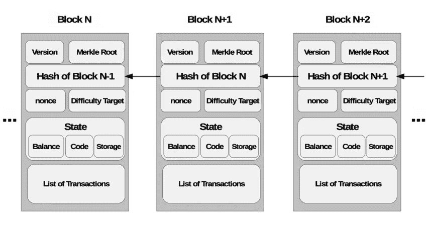

structure of blocks

***默克尔树:-***

*   Merkle 树通过生成整个事务集的数字指纹来汇总一个块中的所有事务。
*   用户可以验证交易是否包含在块中。
*   Merkle 树是通过重复散列成对的节点直到只剩下一个称为根散列的散列来创建的。
*   每个叶节点是事务数据的散列，每个非叶节点是其先前散列的散列。
*   Merkle 树是二进制的，因此需要偶数个叶节点。
*   如果任何事务中的一个细节或事务的顺序发生变化，Merkle root 也会发生变化。

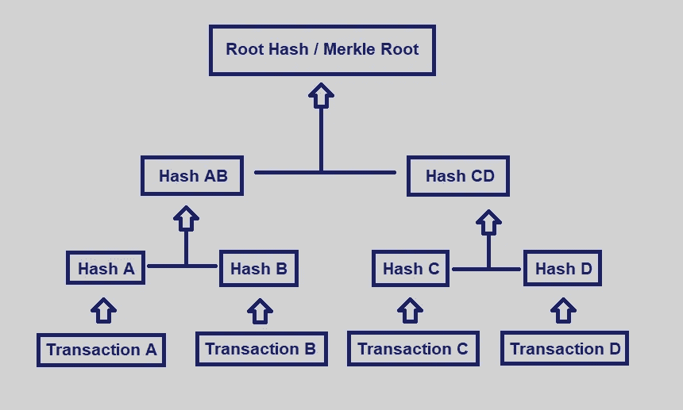

***高清私钥:-***

*   分层确定性是一种确定性加密货币钱包，由已知种子衍生而来，允许从父密钥生成子密钥。
*   子密钥由已知种子生成。子键和父键之间存在一种关系，没有该种子的任何人都看不到这种关系。
*   BIP 32 协议可以从来自其父代确定性生成的种子中生成几乎无限数量的子密钥。
*   只要您有种子，就可以重新创建这些相同的子密钥。
*   子密钥可以独立操作，母密钥可以监视和控制每个子密钥。

***助记符种子:-***

*   助记符种子用于用 12、18 或 24 个字的短语来代替私钥，与十六进制编码格式相比，私钥更容易被人脑记住。
*   助记词阶段与私钥绑定，并支持钱包恢复
*   这为用户提供了额外的安全性以及找回钱包的便利解决方案。
*   BIP39 引入了助记符钱包实现。
*   BIP39 的英语单词表包含 2048 个单词，因此要创建一个 12 个单词的短语，需要在 128 位安全保护下计算出 2048 =2 种可能的组合

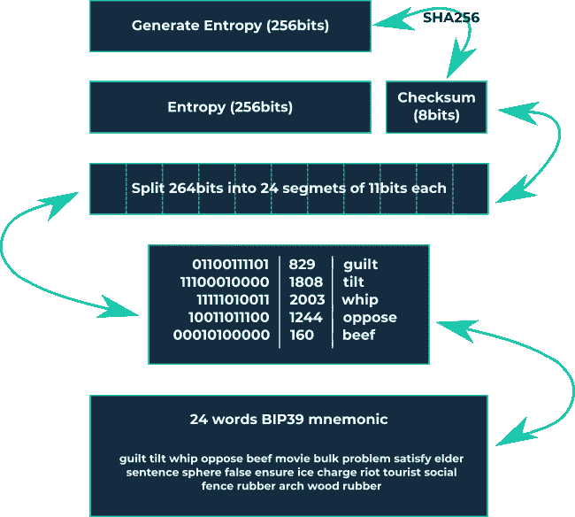

Mnemonic Phrase

***智能合约:-***

*   智能合同是双方签署的数字合同，存储在不变的分类账上。
*   智能合约帮助你以透明、无冲突的方式交换金钱、财产、股票或任何有价值的东西，同时避免了中间人的服务。
*   合同可以在任何区块链上编码，但以太坊是最常用的，因为它提供了无限的处理能力。
*   Hyper ledger 还提供了与智能合约非常相似的链码。

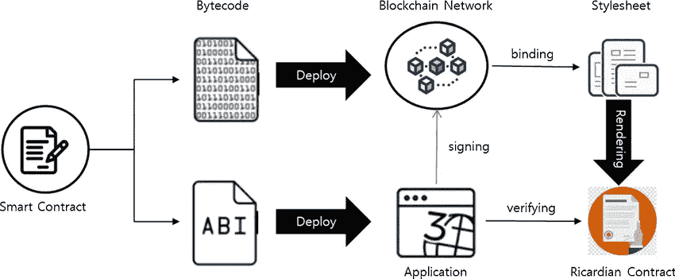

## ***共识机制:-***

区块链是一个分散的系统，由不同的参与者组成，他们的行为取决于他们获得的激励和他们可以获得的信息。当新的交易在网络上广播时，连接到网络的节点可以选择将该交易包括到它们的分类帐副本中，或者忽略它。当组成网络的大多数节点决定单个状态时，就达成了共识。

***五大共识机制:-***

1.  工作证明
2.  利害关系证明
3.  委托股权证明
4.  权威证明
5.  重量证明

***工作证明:-***
工作证明是一种共识算法，在这种算法中，挖掘者基于加密哈希算法竞争解决一个数学难题。这个证明证明了一个矿工花了很多时间和资源去解决问题。当一个冻结被“解决”时，包含的交易被认为是确认的。

*→通过数学问题使用 mean :-*
哈希函数—如何在已知输出的情况下求输入
整数因式分解—如何将一个数表示为其他两个数的乘积。
导游拼图协议——如果服务器怀疑有 DOS 攻击，它需要计算散列函数，以定义的顺序对一些节点进行计算。在这种情况下，这是一个如何找到散列函数值链的问题。矿工们解决了复杂的数学问题后会得到一份奖励。
例如在比特币矿工中，解开谜题可以获得 12.5 个比特币。
矿工除了奖励还可以领取交易费。

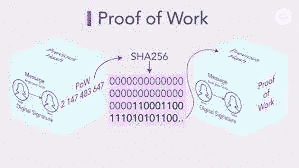

*→举例比特币:-*
在比特币中，每 10 分钟就有一个区块在被开采。难度调整到它永远不会偏离这个极限太多，如果难度保持不变，而计算机能力逐渐增加，挖掘一个块的时间会越来越少。
为了确保这不会发生在区块链，战俘目标是一个动态参数。在比特币区块链中，目标每隔 2016 个区块就会调整一次。计算开采 2016 个区块所需的时间。应该需要 20 到 160 分钟(201⁶ ⁰min=14days).难度根据开采这些区块所花费的时间进行调整。

比特币的难度=区块链的散列率/通过矿工计算得出的目标区块的散列率。

***股权证明:-***
PoS 是一种不同的算法来验证交易并达到分布式共识。
PoW 算法奖励解决复杂数学问题的矿工，最终目标是验证交易并创建新块。另一方面，在 PoS 算法中，新区块的创建者以确定的方式被选择，这取决于其财富/区块链的赌注。所有的数字货币都是在链的起点产生的，它们的数量永远不会改变。矿商只拿交易费。这就是为什么在 PoS 系统中矿工也被称为伪造者。

→stake 的证明，新区块的创建者是以确定性的方式选择的，取决于其财富，也定义为 stake。

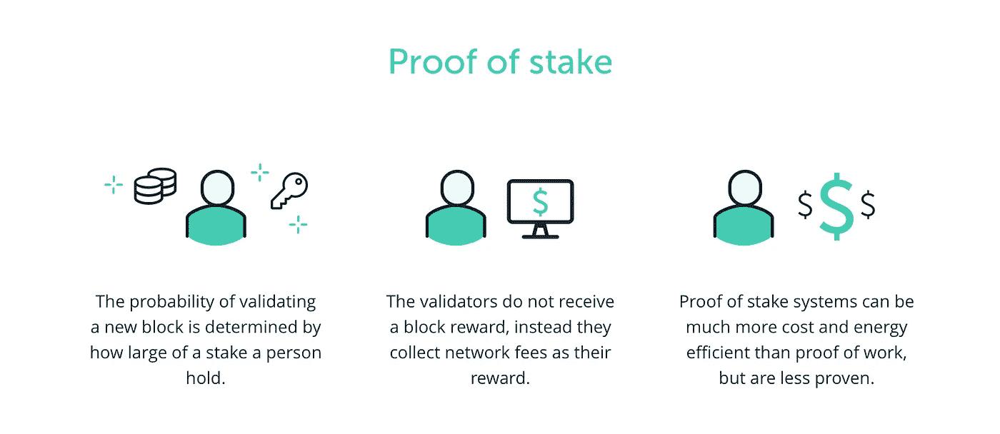

***股权证明示例:-***

*例 NEO:-*
→ NEO 是一个智能合约开发平台，常被称为“中国的以太坊”。该网络旨在成为创意经济的中心，在这里，数字资产可以以很少的开销进行安全的交易。
→ Staking NEO 让你产生平台的内部货币 GAS。你押的尼欧越多，每次付款赚的汽油就越多。NEO 奖励年回报率 4–6%。

***委托股权证明:-***

在一个特定的区块链生态系统中，人们投票选择证人来保护他们的计算机网络。让我们想象一个奖励系统，其中只有前 100 名证人的服务获得报酬，只有前 20 名证人获得固定工资。因为它创造了一个健康的竞争，许多人想成为证人，从而提供了数百名后备证人
一个人的投票力量取决于他拥有多少代币。令牌多的人比令牌少的人对网络的影响更大。如果一个证人开始表现得像个笨蛋，或者停止在保护网络方面做高质量的工作，区块链社区的人可以取消他们的投票，实质上就是解雇这个糟糕的演员。投票一直在进行。代表们被选为见证人。代表成为个人账户上的合作歌手，该个人账户具有提议对网络参数进行某些改变的特权。这个账户被称为创世账户。这些参数包括从交易费到数据块大小、见证支付和数据块间隔的所有内容。

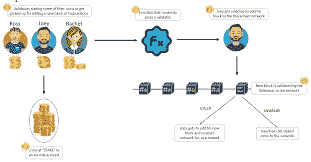

**委托股权证明示例:-**
*示例 lisk :-*
→ Lisk 是一种类似于比特币、以太坊或比特币股票的去中心化网络。Lisk 使用委托 PoS 一致性算法的简化实现。
→ Lisk token 可以为保护网络安全的主链代表投票。最多有 101 个活跃的主链代表，他们在整个网络中获得最多的选票，他们可以获得 block generation 奖励。其他所有代表都在等待被选举，或者得到一个 lisk 侧链。

***【权威证明:-***
【权威证明共识】本质上是利益关系模型的优化证明，其利用身份作为利益关系的形式，而不是利益关系令牌。
为了确保网络的效率和可管理的安全性，验证组通常应该保持相对较小的规模(~25 或更少)。
PoA 下的个人有权成为验证者，这就是为什么没有动机保留他们所拥有的职位。
验证者需要在链上或某些公共域上正式验证身份。
成为验证者的资格很难获得，个人需要通过许多步骤才能成为验证者。

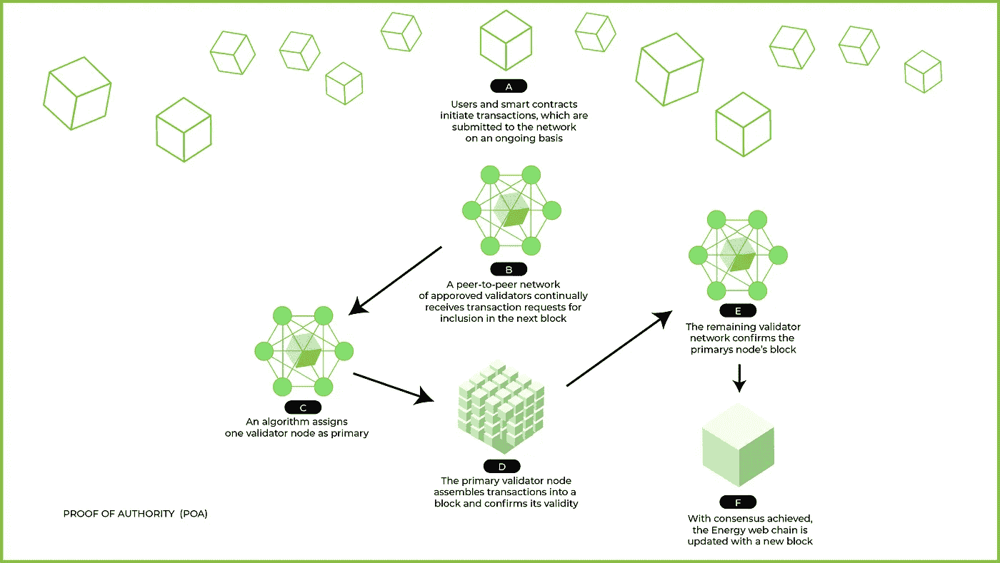

***权威证明示例:-***
*示例 PoA 网络:-*
→ PoA 网络(PoA Network)是一个区块链平台，其核心原则是在他们的区块链实施 PoA 共识。PoA Network 是智能合约的公共平台，作为以太坊侧链存在，其节点由独立的验证器组成。
→为了使获得身份认证的资格变得非常困难，认证者的候选人必须克服通过公证考试的困难。考试不仅证明候选人没有犯罪记录和良好的道德立场，而且还筛选出那些没有犯罪记录的人。

***重量证明:-***
重量证明是基于 algorand 算法的广泛共识分类，该算法进而指定了一种称为拜占庭协议的新协议。拜占庭协议具有高度的可扩展性和安全性。
PoW 共识模型运行一个委员会，参与者不断变化，委员会为网络达成共识。网络上的每个用户都有一个权重，这个权重由他们账户中的金额决定。

***重量证明示例:-***
*示例 filecoin :-*
→ Filecoin 使用时空证明作为您存储多少 IPFS 数据的加权共识。如果诚实用户的总权重分数高于总权重的三分之二，则该权重基于不同的参数，网络将保持安全。这种方法还有助于保护网络免受双重花费攻击。
→它基于 Algorand，虽然有些人可能会看到 Algorand 和 PoS 之间的相似之处，但它们并不相同。在 PoS 环境中，任何给定时间持有的代币数量决定了用户获得的额外奖励金额。PoW 使用完全不同的加权值。

**如果你想改进这篇文章或者有任何建议，你可以通过**与我联系

Instagram:[https://www.instagram.com/nikhil_thatikonda/](https://www.instagram.com/nikhil_thatikonda/)

脸书:[https://www.facebook.com/thatikondanikhil123](https://www.facebook.com/thatikondanikhil123)

推特:[https://twitter.com/thatikonda_19](https://twitter.com/thatikonda_19)

> 交易新手？尝试[加密交易机器人](/coinmonks/crypto-trading-bot-c2ffce8acb2a)或[复制交易](/coinmonks/top-10-crypto-copy-trading-platforms-for-beginners-d0c37c7d698c)