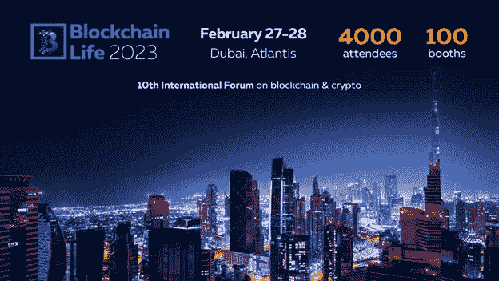

# 区块链生活 2023 将于今年 2 月 27 日至 28 日在迪拜举行

> 原文：<https://medium.com/coinmonks/blockchain-life-2023-goes-to-dubai-this-february-27-28-bd315b80056a?source=collection_archive---------34----------------------->

[***youprstrategist***](https://bitmediabuzz.com/)*是区块链生活 2023 的骄傲媒体合作伙伴，很高兴向我们的社区提供特别的* ***10%折扣*** *。折扣代码:您的 PRstrategist*

区块链生活 2023 于 2 月 27 日至 28 日在迪拜举行，是关于区块链、数字资产和采矿的第 10 届全球论坛。自 2017 年开始，该论坛迅速进入数字资产行业的全球三大活动。参加论坛的有主要行业参与者、政府代表、国际公司负责人、基金、投资者、新兴创业团队和初学者。

**期待什么**

区块链生活是一个支持数字资产行业发展的国际平台。参与者可以与来自世界各地的 4000 名与会者以及公司和项目的核心团队建立联系。展区有 100 个赞助商和合作伙伴的展位，参与者可以找到有前途的初创公司进行投资，并结识新的商业伙伴。数字资产领域的新手可以在行业中迈出第一步，而专业人士可以显著扩大他们的业务联系网络。

会议厅将举行全球行业专家的主题演讲和小组讨论。参与者可以从行业中的佼佼者那里找到并了解从数字资产中获利的所有相关方法。这包括对最新趋势的讨论:metaverses、NFT、DeFi、P2P 交易、数字资产套利等。

为期两天的紧凑活动将以豪华游艇“莲花”号上的一个派对结束。

**何时何地**

2 月 27 日至 28 日，迪拜，棕榈亚特兰蒂斯。

此处提供门票:[https://blockchain-life.com/asia/en/#tickets-row](https://blockchain-life.com/asia/en/#tickets-row)

> 交易新手？试试[加密交易机器人](/coinmonks/crypto-trading-bot-c2ffce8acb2a)或者[复制交易](/coinmonks/top-10-crypto-copy-trading-platforms-for-beginners-d0c37c7d698c)