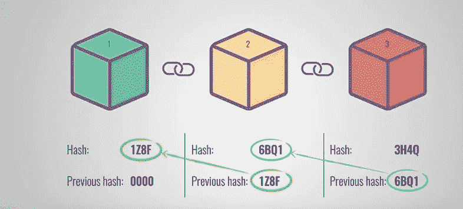
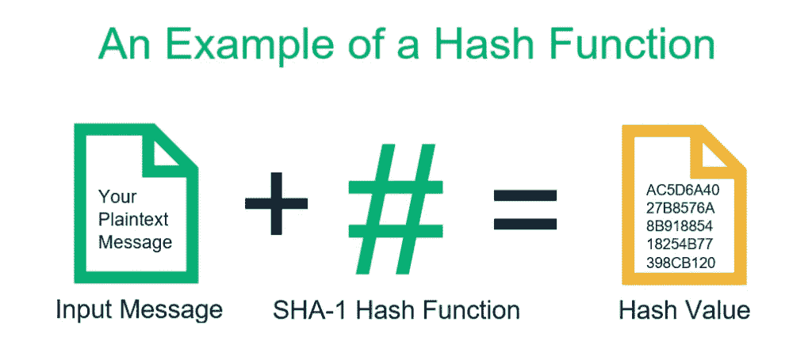
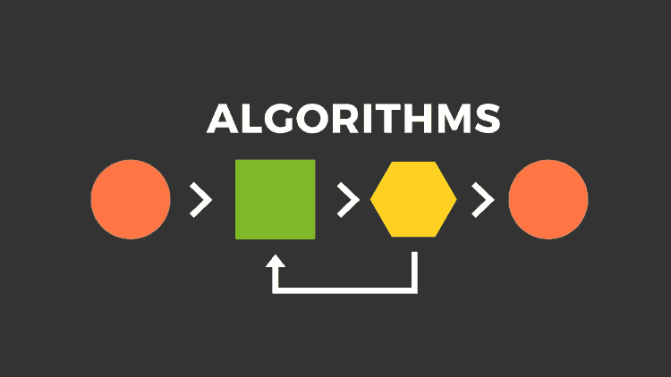
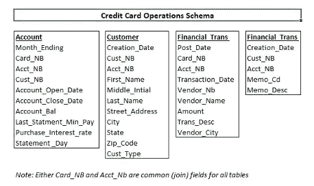
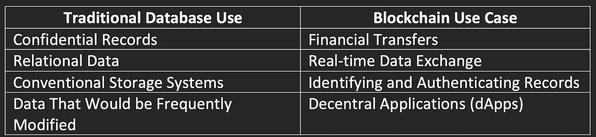
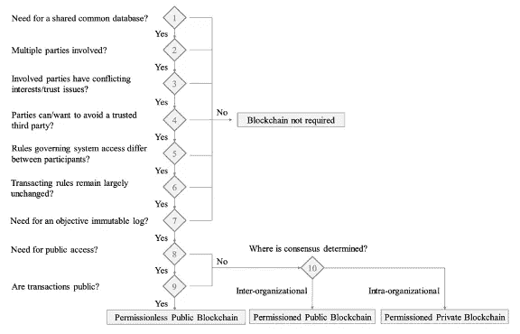

# 理解比特币中的区块链技术

> 原文：<https://medium.com/coinmonks/blockchain-major-technologies-d7a55619c023?source=collection_archive---------33----------------------->

**区块链主要技术**

在比特币的区块链中，交易被添加到公共数字账本中，当新的交易发生时，每个人都会在随机的时间间隔内收到新交易的通知。这些事务被分组到一个块中。区块大小限制为 1 毫克，可包含 10 或最多 3500 笔交易(Blockchain，2022)。这些块被添加到网络中，并通过哈希或哈希指针进行连接。这些数据块相互连接，形成一个防篡改的数据块，因此被称为区块链。这些块由节点或计算机挖掘，这些节点或计算机受到交易和块奖励的激励。通过解决计算难题来验证每个块，并将该块添加到链中。接下来，我将解释如何在区块链中使用散列函数。

**哈希函数**

哈希函数是一种单向数学函数，它可以接受任意大小的输入字符串，并产生固定大小的输出。固定大小的长度因使用的哈希函数而异，但阿沙-256 是一种常见的哈希函数，可产生 256 位输出。当请求块的对等体时，散列既充当 ID，又在我们接收到块后对其进行验证(Narayanan，2016 pg。41).计算哈希是高效的，需要具备 3 个属性才能成为安全的哈希函数(Narayanan，2016 pg。2).我将简要说明这些属性以及它们在区块链中的重要性。

**属性#1:耐碰撞性**

对于给定的输入，每个散列输出都是唯一的，这一点很重要。当两个不同的输入产生相同的输出时，就会发生冲突。例如，如果我使用 SHA-256 哈希算法生成一个哈希，并将以下字符串作为输入，则返回将是一个随机输出:

冲突的一个例子是，如果输入一个完全不同的字符串，它将产生与下面演示的相同的输出。

SHA-256 散列函数是抗冲突的，或者它发生的可能性在静态上是不太可能的。上面提供的例子是为了演示如果发生碰撞会是什么样子。为什么这很重要？哈希函数用于验证数据的完整性，如果哈希函数不能抵抗冲突，则数据不可信。在分散式网络中，块内事务的完整性通过散列来验证。

**属性#2:隐藏**

第二个属性是隐藏。隐藏属性给定了函数 y = H(x)的输出，因此没有可行的方法来计算输入是什么(Narayanan，2016 pg。5).使用高最小熵的哈希算法是至关重要的，这意味着很难预测结果会是什么。随机性是至关重要的，以确保当每个输入中的一个字符发生变化时，它会产生完全不同的输出。

**属性#3:谜题友好度**

第三个属性是谜题友好性，理解起来有点复杂。比特币使用计算谜题来验证交易。比特币如何使用哈希值验证区块？矿工们试图解决名为随机数的数学难题。比特币中的随机数是 256 位哈希的前 64 位。如果一个哈希函数是字谜友好的，那么除了尝试随机值之外，这种类型没有解决策略(Bettati，2018)。解决这个难题需要计算量很大，这促使节点不去破坏这个过程。

**共识算法**

比特币挖矿是一种随机猜测随机数的行为，它可以创建工作证明。工作证明表明一定量的计算工作已经被扩展。共识是在逐块的基础上达成的(Narayanan，2016 pg。31).该块被验证 6 次，并且平均每 10 分钟实现一次工作证明。第一个计算随机数的人会收到交易费。另一种激励叫做整体奖励。区块奖励允许创建区块的用户获得比特币，以换取在区块链上创建区块的服务。

有多少比特币？当新的区块被添加到区块链时，比特币就产生了。固定金额从 50 个比特币开始，每创建 210，000 个区块减半。比特币的数量是固定的，是 2100 万。以每 210，000 块减半的速度，该数量将在 2140 年达到(Narayanan，2016 pg。39).“这就是比特币真理的终极本质:比特币的所有权无非是其他节点同意给定的一方拥有那些比特币”(Narayanan，2016 pg。47).

**传统互联网组件**

在传统的金融网络如信用卡网络中，有一个中央机构如银行。这些信息存储在数据库中的不同表中。数据库可以包含用户名、个人信息、密码(希望是散列密码)和事务的表。关系数据库使用密钥对来存储信息。例如，一个键可以被称为“客户”，它包含我的人口统计数据，如姓名和地址(Mills，2021)。我的所有数据都由中央机构跟踪和维护。如果我用我的 Visa 信用卡购买一台新的笔记本电脑，信用卡公司会知道地点、价格、卖家、时间等。我的购买很容易被追踪。我不是匿名的。有一个中央权力或控制者保管我的数据。右图是信用卡模式的简化版本。这是由金融机构跟踪的信息。

使用分散的而不是集中的系统完全改变了这种情况。交易记录在公共分类账中，随机分配到一个区块，该区块经过验证并添加到区块链中，供网络上的每个人查看。在区块链上共享的数据是不同的，并且根据设计更加匿名。在区块链，我有匿名和一定程度的隐私。

在比特币区块链中，节点(用户)是随机的键值对。第一个密钥是用作地址或名称的公钥。公钥是公开的，每个人都可以看到。第二个密钥是私钥。私钥在数学上与公钥联系在一起。由于密钥的性质，密钥-值对用于验证哪个节点(用户)拥有哪个比特币。你的私钥不能被共享，这一点很重要，因为如果有人获得了你的私钥，他们就可以窃取你的比特币。每一个公众都与一个个人或实体联系在一起。该图像显示了交易的详细信息，如数据、金额、交易费用、哈希以及谁向谁付款。

Figure 4: Bitcoin Transaction: [https://www.blockchain.com/btc/tx/da97c22cf267a12bca6829263bbf501dc304d39313bafeda696e0677905f0c87](https://www.blockchain.com/btc/tx/da97c22cf267a12bca6829263bbf501dc304d39313bafeda696e0677905f0c87)

区块链不同于传统数据库有几个原因，但最大的区别是使用了分散的公共账本，让每个人都可以看到正在发生的交易。数据是匿名的，加密技术用于生成一个键-值对，该键-值对通过存储在块中的哈希指针连接数据。传统的数据库使用密钥对来存储数据，并且是集中控制的。每种技术都有它的使用案例，并不认为一种比另一种更好。下图概述了传统数据库和区块链的一些优势(Bhardwaj，2021)。

使用区块链确实有其缺点。重要的是要考虑区块链在技术细节上的缺点。可以修改区块链的组件，以满足在区块链上运行的数据和流程的需求。加密货币不是区块链的唯一用例，尽管它是最受欢迎的。比特币只是基于类似区块链架构的数千种替代货币中的一种。分布式共识是一个缓慢的过程，高能耗，高效，缺乏互操作性。以太坊和比特币等其他替代硬币的创建是为了改变比特币区块链的某些参数，如 10 分钟分布式共识或验证块所需的时间或块大小本身(Narayanan，2016 pg。243).

**区块链技术的问题方面**

使用区块链并不能解决问题，相反，它是产品服务中用来解决问题的一个组件。通常在商业提案中，当人们不完全理解使用区块链技术的技术含义时，他们会建议使用区块链。人们通常认为他们应该实现区块链，而不是传统的数据库。仅仅因为它适用于比特币，他们就认为它应该适用于商业应用。如前所述，使用区块链技术有好处也有坏处，需要适当考虑。需要考虑的区块链技术解决方案的其他问题方面是可扩展性、维护、欺诈/非法行为、隐私、开发/调试、控制、客户/用户买入以及政策和治理(Iredale，2022)。实施区块链时，业务交互的人的方面仍然存在。当考虑使用区块链技术时，区块链决策树是一个很好的参考。下图概述了决策树以及在评估区块链(Pedersen，2019)时应该问的一些问题。

智能合约等区块链技术的优势很有前途，但尽职调查是必要的，以确保使用正确的技术来满足特定的业务需求。未来可能会受到区块链和其他技术的使用的极大影响，这些技术将受到区块链相关技术的影响。

**参考文献**

贝塔蒂河(2018)。*密码学和加密货币简介——德克萨斯 A & M 大学*。德州一所& M 大学工程系。检索于 2022 年 9 月 16 日，来自[https://people . engr . tamu . edu/betta ti/Courses/489 cryptocurrences/2017 a/Slides/cryptoandcryptocurrencies . pdf](https://people.engr.tamu.edu/bettati/Courses/489CryptoCurrencies/2017A/Slides/CryptoAndCryptoCurrencies.pdf)

Bhardwaj，C. (2021 年 9 月 22 日)。*区块链 vs 传统数据库:创业公司哪个更好？* Appinventiv。检索于 2022 年 9 月 16 日，来自[https://appinventiv . com/blog/traditional-database-vs-区块链/](https://appinventiv.com/blog/traditional-database-vs-blockchain/)

区块链区块链。(2022).*探险家*。Blockchain.com |探险家。于 2022 年 9 月 16 日从[https://www.blockchain.com/explorer](https://www.blockchain.com/explorer)取回

Iredale，G. (2022 年 8 月 15 日)。*区块链技术的顶级劣势*。区块链路 101 号。检索于 2022 年 9 月 16 日，来自[https://101blockchains.com/disadvantages-of-blockchain/](https://101blockchains.com/disadvantages-of-blockchain/)

米尔斯河(2021 年 2 月 22 日)。*构建一个样本客户数据库工具——任何规模的数据库只需点击一下*。Excel 和 VBA 工匠。检索于 2022 年 9 月 16 日，来自[http://excelandvbacraftsman.com/build-a-sample-database/](http://excelandvbacraftsman.com/build-a-sample-database/)

纳拉亚南(2016)。*比特币和加密货币技术:全面介绍*。普林斯顿大学出版社。

彼得森，A. B .，里修斯，m .，&贝克，R. (2019，6 月)。*决定何时使用区块链技术的十步决策路径*。研究门。检索于 2022 年 9 月 16 日，来自[https://www . research gate . net/profile/Marten-risi us/publication/333545589 _ A _ Ten-Step _ Decision _ Path _ to _ Determine _ When _ to _ Use _ block chain _ Technologies/links/5d 38 fc 9 b 4585153 e 591 f 52 CB/A-Ten-Step-Decision-Path-to-Determine-When-to-Use-block chain-Technologies . pdf](https://www.researchgate.net/profile/Marten-Risius/publication/333545589_A_Ten-Step_Decision_Path_to_Determine_When_to_Use_Blockchain_Technologies/links/5d38fc9b4585153e591f52cb/A-Ten-Step-Decision-Path-to-Determine-When-to-Use-Blockchain-Technologies.pdf)

Paralect，P. (2022)。*粒子*。粒子，由平行。于 2022 年 9 月 16 日从 https://blog.paralect.com/检索到

> 交易新手？尝试[加密交易机器人](/coinmonks/crypto-trading-bot-c2ffce8acb2a)或[复制交易](/coinmonks/top-10-crypto-copy-trading-platforms-for-beginners-d0c37c7d698c)