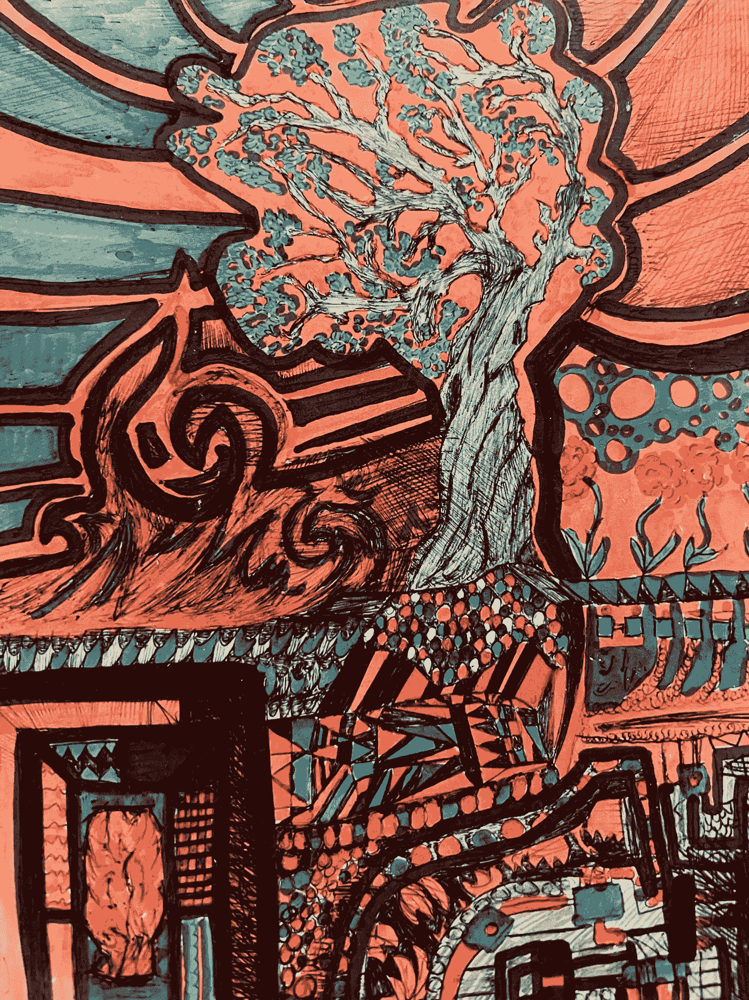

# 区块链神话解码#4:代币正在吞噬世界，为什么 Web3 会存在

> 原文：<https://medium.com/coinmonks/blockchain-myths-decoded-4-tokens-are-eating-the-world-and-why-web3-is-here-to-stay-3383540a70cf?source=collection_archive---------10----------------------->

Gardening the Future — Martin El-Khouri

我们生活在空前不确定的时代。Covid 疫情仍然是一个问题，乌克兰战争持续了四个月，破坏了欧洲的稳定，扭曲了全球力量平衡，导致了全球营养危机。供应链面临压力，自然资源价格飙升，贫富差距扩大，永无止境的全球化梦想似乎即将戛然而止。最近媒体上流传的一个新名词是超区域化。有些人已经预见到了这一点，但大多数人没有。

与此同时，扩张主义的货币政策，尤其是在疫情时期，引发了欧盟和美国通胀率以前所未有的速度上升。全球经济增长疲软，给投资者、政策制定者，当然还有全球市场带来了挑战，与各自的 ATHs 相比，纳斯达克下跌了 25%,整个加密市场下跌了约 70%。对于许多批评者来说，这标志着围绕 Web3.0 愿景的“炒作”的结束

现在是 1995 年

事实上，这一愿景刚刚开始展现。我们正在见证一项新技术的诞生阵痛，它重塑了数字业务的运作方式。赋予这些生态系统力量的资产，我们称之为加密货币，事实上是创新的干细胞。拥有一项加密资产就像在一个不断发展的生态系统中拥有一只股票，在此基础上，项目得以实现，从而创造现实世界的价值，进而创造收入和利润。但随着这些生态系统的展开，当然会有挑战需要克服，信任需要建立。因此，作为资产类别，它们比其他已经存在了几十年的资产类别更不稳定。

Web3 目前的市场情况很特殊，因为崩溃也是由一些相关市场推动者(Terra LUNA、Celsius、Voyager)的系统性失败造成的。从这些发展中产生的误解是 DEFI 已经失败。但是这个结论是完全错误的。失败的是*集中式金融*，像 Celsius 这样的初创银行实体杠杆过高。分散融资协议运行得非常好，并将继续如此。误解和误会是我们所处的创新周期的一部分。行业事件和宏观经济低迷的有害组合给该行业带来了巨大的压力测试。但是，尽管有这些市场条件，在 2022 年 6 月，Web3 生态系统在过去 13 年中出现了前所未有的增长，CAGR 达到了 270%。当前的压力测试将清理市场，成功的项目将比以前更加强大。我对此深信不疑，原因如下:

*1。如果我们假设互联网不会消失，那么我们可以假设它将继续发展——成为 Web 3.0。*

*2。尽管估值呈下降趋势，但基本面没有丝毫改变，Web3 的采用继续遵循早期互联网的模式。*

*3。在几个价值链的几个部分，Web3 商业模式的价值主张是明确的。*

*4。该行业看到了大量人才的流入，他们将行业的挑战视为巨大的机遇。*

在过去的 7 年中，Web3 的采用率与 20 世纪 90 年代的互联网一样。如果这一趋势保持下去，报告预测到 2027 年 Web3 用户将达到 10 亿到 15 亿。这比今天估计的大约 2 亿用户至少增加了 5 倍。如果中期愿景得以实现，预计到 2027 年，全球 10%的 GDP 将存储在公共区块链技术上。这将是一个 13.4 万亿美元的市场。符号化将在实现这一愿景的过程中发挥关键作用。

**代币:释放巨大潜力的新思维**

Web2 使用户生成内容成为可能，但代价是平台把关提供内容的生态系统。集中式平台定义了当前的 Web2.0 时代，这是有充分理由的:像亚马逊、脸书、Ebay 和 Twitter 这样的平台是这个互联网时代企业走向市场的反应。绝大部分的价值都归这些平台所有，而不是用户。他们将许多中介服务结合在一起，这种方式证明了他们的收费是合理的。对他们来说，在销售和市场营销方面进行大量投资，以产生潜在客户并留住客户是非常重要的。正如我们所知，互联网的一个基础挑战是，它正是围绕着营销而构建的。所有权和价值在 Web2 中并不扮演重要的角色。

Web3 有望成为一个无信任、透明的生态系统，尽可能减少中介。并且:它引入了所有权和价值的概念。Web3 旨在成为一个价值互联网，而不仅仅是一个信息和通信互联网。实现这一目标的新数字原语被称为**令牌**。代币改变了数字商业的逻辑。它们可以代表稀缺性，它们可以代表一种测量方法，它们可以代表一种奖励。通过购买代币，客户正在成为生态系统的一部分。

像 OpenSea 和比特币基地这样的平台正是如此。他们本身并不出售代币，他们提供进入生态系统和社区的途径——这是他们的产品。

> 交易新手？尝试[加密交易机器人](/coinmonks/crypto-trading-bot-c2ffce8acb2a)或[复制交易](/coinmonks/top-10-crypto-copy-trading-platforms-for-beginners-d0c37c7d698c)

**即将到来的事情的快照**

由于这项技术刚刚开始展现其潜力，目前只有少数玩家可以验证这一论点。但是我们手头的数字至少可以说是惊人的。在内容行业，事实证明，对创作者来说，Web3 比 Web2 好得多。Web3 使用的工具是令牌。在以前的文章中，我已经详细阐述了内容产业的非功能性网络技术的机制，数字证明了这种逻辑。正如 a16z 最近的 crypto 报告指出的那样，Web3 平台的使用率远远低于当今的互联网巨头。OpenSea 的使用率为 2.5%，相比之下，苹果商店的使用率为 30%，YouTube 为 45%，脸书、Twitter 和 Instagram 几乎为 100%。

> [**“当大型科技公司的盈利率比黑手党还高时，你就知道我们的经济出了严重的问题”**](https://www.bing.com/search?q=%22You+know+something+is+profoundly+wrong+with+our+economy+when+Big+Tech+has+a+higher+take+rate+than+the+mafia%22&cvid=5294eebe573945518f9b2c7105edd32f&aqs=edge..69i57j69i11004.709j0j9&FORM=ANAB01&PC=U531)

如果你看看不同来源创造的收入，NFT 为创作者提供了一种全新的直接从粉丝身上赚钱的方式。2021 年，OpenSea 上每个创作者的平均支出为 174，000 美元，而 Spotify 上每个艺术家的平均支出为 636 美元，YouTube 上每个频道的平均支出为 405 美元，脸书上每个用户的平均支出为 10 美分。请注意，这些数字后面的“k”不见了。这些数字告诉我们什么？Web3 仍然很小，但它非常强大。对于内容行业来说，NFT 是一种新的商业逻辑的一部分，它将出处的概念引入数字世界，并最终奖励创建社区的创作者，并奖励保持自己有趣的社区。

Web3 [的概念从根本上挑战了当前的业务运营方式，甚至走向市场的方式，因为它改变了优先事项。传统的入门方法是投资传统营销来吸引和获得新客户。](https://future.com/go-to-market-in-web3)令牌提供了引导网络的替代方案。核心开发团队可以使用令牌来引入早期用户，而不是在这些传统工具上花费资金。他们加入的原因是地下奖励机制。当网络效应尚未明显或开始时，早期令牌持有者将因其早期贡献而获得奖励——这对开发者来说是如此，但对社区经理、投资者、合作伙伴和其他类型的支持者来说也是如此。代币使早期贡献者成为福音传播者，为网络带来更多的人。这种社区机制使得 web3 中的早期用户比 web2 中的传统业务开发或销售人员更强大。从某种意义上说，它扰乱了当前的风险回报比。因此，代币可以被视为具有治理权力的股份。当你购买代币时，无论是否可替换，你都加入了一个社区。符号化扰乱了未来开展在线业务的策略。

***没有一刀切的***

谈到生态系统和代币，我经常听到以下问题:

> “我如何知道哪个生态系统会胜出？如果我购买了 ADA、ETH 和 AVAX，但使用的将是阿尔格兰德的生态系统，该怎么办？”

生态系统的答案和商业模式的答案是一样的。没有放之四海而皆准的解决方案，但是有可以建立的框架。我们不应该忘记，我们称之为加密货币的东西是孵化自己生态系统的干细胞。因此，它们各自的架构方式可能对某些用例有利，对其他用例不利。

我喜欢 Andreessen Horowitz 的 Maggie Hsu 在一篇关于 Web3 心态、策略和度量的文章中描述的方式:“最大的心态转变是从规划转向更像园艺的东西”。

Web2 公司由自上而下的愿景指导。创始人(在某种程度上也包括投资者)承担着定义愿景、发展团队、规划和执行愿景的全部责任。在 Web3 中，创始人是园丁。他们为创意的培养创造空间，并帮助培育他们认为成功的产品。他们提供最初的治理结构，通常以白皮书的形式，但最终，创始人会针对协议使用和社区质量进行优化。这些生态系统的等级制度要少得多，民主得多，因此，更多的参与者在支持一个给定项目的成功。有大量的项目，大量的 Dao 使分布式所有权的概念成为现实，大量的社区发起人使用 NFTs 来实现社区，当然，还有许多其他实现价值和所有权逻辑的支持令牌的案例。

坚持加德纳的例子，在 Web3 中，它是关于你提供的土壤。虽然可能有很多相似之处，但即使在同一垂直线上，你需要选择的土壤也有很多不同。

让我们以出版业为例。实体书会消失吗？我个人对此表示怀疑。书有神奇的东西。他们用语言创造世界。减轻你的痛苦，给予希望，教育，操纵，激励和抚慰。书籍引发一种冒险感，或平静感。一本书使用的工具是语言。

“语言是第一个元宇宙。当我对你说话时，你在你的后脑勺创造了一个世界。一本书就像一个令牌，提供了进入你在头脑中创造的新现实的途径。”贾米尔·谢赫

这句话不仅是哲学上的，它也有一些相关的商业含义，应该加以考虑。这本书的替代品有必要吗？电子书销量在全球范围内都在下滑，而实体书的市场似乎相当稳固。人们总是会阅读，即使对于像我这样的 Web3.0 爱好者来说，出版的核心业务也完全有可能不会受到 Web3 的负面影响。但是可供选择的、额外的创造力以及随之而来的收入来源的潜力是巨大的。作者通常是思想领袖、同伴、偶像和教练，是值得尊敬和学习的人。所有这些资产就是社区的组成部分。在元宇宙，Web3 可能是一个巨大的营销机会，它可以提供不同的体验，但一个 DAO 也可以决定故事如何继续——而社区决定这一点。

**建立或被吃掉**

未来的商业领袖将面临许多挑战，但他们肯定应该解决的一项任务是理解 Web3 对其利润池的潜在影响，同样重要的是，可能出现的潜在新机会。解决办法应该是关注生态系统。那些为行业提供合适生态系统的公司拥有独特的机会来颠覆自己和竞争对手。

最终，如果今天的市场推动者不想落后或变得依赖，就别无选择。有一点是非常清楚的:仅举几个强大的 Web3 品牌为例，OpenSea 和比特币基地已经将潜力内在化，并且已经涉足内容产业。他们可能有技术栈，但截至今天，竞争优势在于那些拥有社区，了解创作和策展业务的人。代币是开启巨大潜力的钥匙。如果这些玩家根据其创造者的需求来建立他们的生态系统，他们很可能在几年后会比现在过得更好。

代币确实在世界上流行。几乎每一种可以想象的商业模式都有成功的基于标记化的业务。Audius 反映了 Spotify，Sorare 和 TFC 反映了 EA，Livepeer 反映了 youtube，compound 在某种意义上反映了任何大型银行，如摩根大通，以及分散式消息服务，如 KIN 反映了 Whatsapp。创新越来越多。这些业务提供的价值是内在的。它们会一直持续到时间的尽头吗？当然不是。但是就像它们赖以生存的生态系统一样，其中一些也会。而那些持续的将是巨大的，那些早在桌边的将得到最大的一块蛋糕。从这个意义上说:祝你胃口好！

> 加入 Coinmonks [电报频道](https://t.me/coincodecap)和 [Youtube 频道](https://www.youtube.com/c/coinmonks/videos)了解加密交易和投资

# 另外，阅读

*   [比诺莫评论](https://coincodecap.com/binomo-review) | [斯多葛派 vs 3Commas vs TradeSanta](https://coincodecap.com/stoic-vs-3commas-vs-tradesanta)
*   [Capital.com 评论](https://coincodecap.com/capital-com-review) | [香港的加密借贷平台](https://coincodecap.com/crypto-lending-hong-kong)
*   [如何在 Uniswap 上交换加密？](https://coincodecap.com/swap-crypto-on-uniswap) | [A-Ads 审查](https://coincodecap.com/a-ads-review)
*   [WazirX vs coin dcx vs bit bns](/coinmonks/wazirx-vs-coindcx-vs-bitbns-149f4f19a2f1)|[block fi vs coin loan vs Nexo](/coinmonks/blockfi-vs-coinloan-vs-nexo-cb624635230d)
*   [本地比特币审核](/coinmonks/localbitcoins-review-6cc001c6ed56) | [加密货币储蓄账户](https://coincodecap.com/cryptocurrency-savings-accounts)