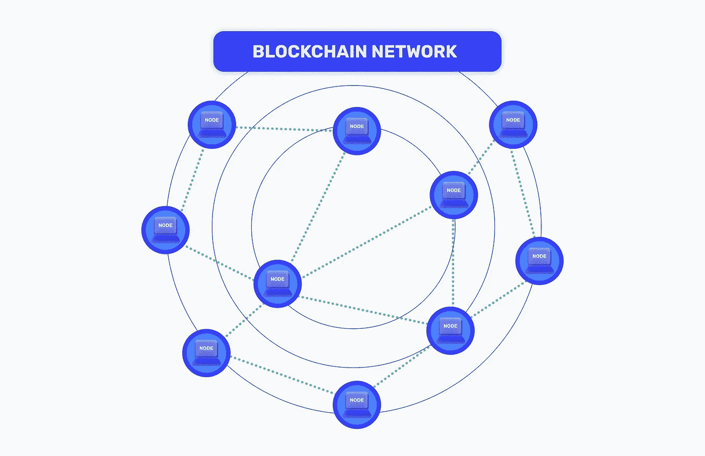

# 区块链节点提供商——朋友还是敌人？

> 原文：<https://medium.com/coinmonks/blockchain-node-provider-a-friend-or-a-foe-32a24681b286?source=collection_archive---------16----------------------->

这个有趣的开场问题的答案就在你的手中(稍后会有更多)。

首先，当你听到使用单词 **node** 时，你会想到什么？

Blockchain node architecture (Image from Alchemy.com)

区块链上下文中的术语**节点(或计算机节点)**通常用于描述允许接收、创建和传输数字消息的**通信端点**。存在不同种类的计算机节点，例如**物理网络节点**和**虚拟节点。**然而，在本文中，我们将重点关注虚拟节点，例如目前几个区块链网络中使用的虚拟节点。

# 什么是区块链网络？

简而言之，区块链可以被称为分布式开放分类账系统或分布式分类账技术(或 DLT)，它包含网络上发生的交易(或交易组)的记录，这些记录实际上是无法修改的。换句话说，我们可以将区块链称为包含交易记录的**电子表格**，该交易记录可供公众查阅，并且不由一个实体单独控制。

普通用户接触区块链网络的第一步通常是通过区块链钱包。通过区块链钱包，用户生成一个**公共地址**，允许他们从区块链网络接收价值(以硬币和代币的形式)。然后，他们可以通过私钥传输和签署数字消息，私钥是用户独有的一长串随机字符。

# 区块链节点和你

每当用户发起交易时，交易的细节通过 **RPC 调用(远程过程调用)**发送到区块链节点，例如要发送的值的数量，以及值的**接收者**，然后由节点记录并传输到整个网络。

值得注意的一点是，当您在钱包上启动交易时对节点进行 RPC 调用时，关于您的某些信息也被发送到节点，例如您的 **IP 地址**和**其他元数据。**

发送到节点的这条看似无关紧要的信息，实际上可能会留下关于你的**痕迹**，集中的实体或恶意行为者可以利用这些痕迹来跟踪你。**我们说跟踪你了吗，怎么？**你可能会问。是的，区块链节点由*【人类实体】*，通常被称为**区块链节点提供商运营。**这些实体以硬件和软件的形式提供成功管理和运行区块链节点所需的必要基础设施。这种设置的缺点是，尽管区块链的最初概念是建立在分散化的基础上的，但是具有单个节点提供者的接口(通过 RPC 调用)将某种程度上的**集中实体**引入到最初打算完全分散化的区块链系统中。

谢天谢地，这种经常不熟悉，但严重的缺点已经被一个创新的解决方案解决了。什么解决方案？解决方案在于你选择的用于与 dApps 互动的 web3 钱包。

有趣的是，像 **Block Wallet** 这样以隐私为中心的钱包，通过在你与区块链互动时隐藏你的 IP &元数据来保护用户隐私。这是通过使用隐私代理来实现的，隐私代理允许用户在与区块链上的分散式应用程序进行交互时保持隐私。

Source: BlockWallet

但这还不是全部，与其他 web3 钱包提供商不同， **BlockWallet 使用 5 个不同的节点提供商**，而其他钱包只使用一个。**为什么这很重要？**回到我们关于与节点提供商交互的缺点的讨论，这提出了单一依赖点的集中化问题。我们是什么意思？

***如果单节点提供商由于技术或法律问题而离线，会发生什么情况？***

***如果恶意行为者获得了对节点提供商基础设施的未授权控制怎么办？***

***或者节点提供商通过转恶意故意耍流氓怎么办？***

简而言之，使用仅使用单一节点提供商的 web3 钱包提供商存在一定的失败风险和隐私顾虑。这篇文章的部分目标是让用户了解这些风险，我们相信你已经接受了良好的教育。

# 结论

区块链节点提供商在区块链网络的运行中扮演着重要的角色(如果不是像*一个朋友*一样非常重要的角色)，例如及时安全地存储区块链的副本，然后确保存储的信息与网络上其他连接的计算机共享。然而，他们可以很容易地成为中央集权的实体(*一个敌人*)

在分散网络上互动的用户。幸运的是，BlockWallet 等以隐私为中心的钱包解决方案让区块链用户在与区块链网络互动时能够保持隐私。**现在，在区块链保持隐私的选择掌握在你的手中，也就是用户的手中。**

文章系列继续。前置运行仍然是当前影响分散财务应用程序用户的另一个问题。你可以在这里学习保护自己和他人免受抢跑[的聪明方法。](/@stanfordb/front-running-the-dark-side-of-using-blockchains-a3987aad0c79)

# 立即加入 BlockWallet 社区

[主页](https://blockwallet.io/) | [媒体](https://blockwallet.medium.com/) | [推特](https://twitter.com/GetBlockWallet) | [电报](https://t.me/blockwallet) [不和](https://discord.gg/69gvNKatdb) | [GitHub](https://github.com/block-wallet) | [电子邮件](http://hello@blockwallet.io/)

**免责声明:**本文提供的信息仅用于教育目的，仅包含作者观点，不构成投资建议。建议读者对这个主题进行自己的研究，并可以自由地不同意作者在这里分享的观点。谢谢你。

> *交易新手？试试* [*加密交易机器人*](/coinmonks/crypto-trading-bot-c2ffce8acb2a) *或* [*复制交易*](/coinmonks/top-10-crypto-copy-trading-platforms-for-beginners-d0c37c7d698c) *上* [*最好的加密交易*](/coinmonks/crypto-exchange-dd2f9d6f3769)

> 加入 Coinmonks [电报频道](https://t.me/coincodecap)和 [Youtube 频道](https://www.youtube.com/c/coinmonks/videos)获取每日[加密新闻](http://coincodecap.com/)

# 另外，阅读

*   [免费加密信号](/coinmonks/free-crypto-signals-48b25e61a8da) | [加密交易机器人](/coinmonks/crypto-trading-bot-c2ffce8acb2a)
*   [杠杆代币的终极指南](/coinmonks/leveraged-token-3f5257808b22)
*   [16 款最佳折叠电动自行车](/coinmonks/top-17-folding-electric-bikes-5e296f0918cb)
*   [28 款最佳电动自行车点评](/coinmonks/the-28-best-electric-bikes-review-and-buying-guide-in-2023-7bb3146cb403)
*   前三名[币安期货交易机器人](/coinmonks/top-3-binance-futures-trading-bots-e6031f84b3f9)