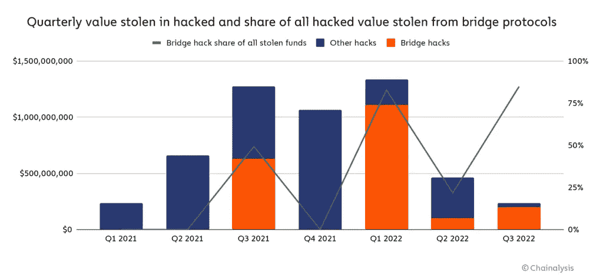

# 区块链平台必须装备自己，以应对桥接协议黑客的挑战

> 原文：<https://medium.com/coinmonks/blockchain-platforms-have-to-equip-themselves-to-deal-with-the-challenges-of-bridge-protocol-hacks-b4457565ed39?source=collection_archive---------42----------------------->

# 今年区块链上的大多数黑客攻击都是针对跨链桥协议的

今年，跨链协议桥黑客占据了主导地位。就在几周前，Nomad 桥被黑客攻击，价值 2 亿美元的价值被盗，在此之前，Axie Infinity 的 Rohan 侧链被黑客攻击，价值 6.22 亿美元的价值被盗。虫洞桥也被黑客攻击，盗窃金额高达 3 . 2 亿美元。

诚然，今年黑客们正集中精力从桥接协议中窃取密码。

[Source](https://blog.chainalysis.com/reports/cross-chain-bridge-hacks-2022/)

# 来自跨链桥的巨大价值黑客给区块链开发者带来了挑战

主流区块链安全服务公司[chain analysis 发表了一份报告](https://blog.chainalysis.com/reports/cross-chain-bridge-hacks-2022/)解释说，今年区块链上的大多数黑客攻击都是在跨链桥协议上，这占了今年迄今为止区块链黑客攻击的 69%。累计大约有价值 20 亿美元的密码被黑客攻击。

显然，跨链桥中如此大量的黑客攻击令人担忧，这对区块链的采用和信心构成了[威胁](https://decrypt.co/106718/cross-chain-crypto-bridge-hacks-hit-2-billion-2022-chainalysis)。

[Source](https://pixahive.com/photo/beware-hackers-everywhere/)

# 黑客很难兑现，因为他们可以被区块链分析公司跟踪

虽然这些天有许多区块链安全公司可以跟踪黑客窃取的资金的流向，并防止他们提现。这是因为区块链是透明的，资金的交易流可以被 Chainalysis、Elliptic 等区块链分析公司跟踪。

如今，被黑客攻击的 Defi 协议的团队成员与黑客谈判归还被盗资金是非常常见的，并且已经有黑客在知道难以兑现的情况下归还被盗资金的实例，并且他们面临被区块链分析公司追踪的风险。这当然是好消息。

# 理解为什么黑客现在瞄准桥接协议作为他们的战利品

让我们来理解为什么桥接协议会吸引黑客的注意。

## 桥是在区块链生态系统中实现互操作性的直接方式

就在一两年前，我们还没有区块链互操作性的解决方案，这意味着密码不能从一个区块链转移到另一个区块链。

然而，需要互操作性来整合区块链生态系统，因为每个区块链都以孤立的方式运行，与其他区块链相隔离。互操作性将为区块链 Dapp 带来更多价值，将另一个链的流动性和用户带到他们的 Dapp。

将资产从一个区块链的 Dapps 转移到另一个区块链的直接解决方案是桥接协议。

## 跨链桥协议的一般工作机制

因此，桥接协议在区块链领域相对较新。有效的桥梁设计尚未发展，随着时间的推移，它应该随着行业标准集的发展而发展，该标准集将包含不易受黑客攻击的桥梁智能合同。在升级桥梁安全方面有许多工作要做，这将及时发生。

在桥接协议中，通常特定区块链的密码被发送到桥接协议，在桥接协议中，密码被锁定到智能合约中。这个锁定的加密作为发行等量并行资产的抵押品，该资产将被发送到它所桥接的区块链。

比如 ETH 可以使用虫洞桥从以太坊区块链移植到 Solana。在这里，用户将他们的 ETH 发送到虫洞，在那里它将被锁定在一个以太坊智能合约中，而等量的虫洞包裹的 ETH 将被虫洞发行和释放到 Solana 区块链中。虫洞包裹的 ETH 是桥接的 ETH，其抵押品被锁定在虫洞的以太坊智能合约中。

# 桥梁智能合约中存储的巨大价值在区块链中可见，并吸引黑客

这些桥接智能合约是区块链中可见的加密资金的中央存储点，因为它们具有如此大的价值，所以它们是黑客的有利可图的目标。

通常，在桥接协议中有一个保存加密的中央智能契约。Dapp 团队认为，智能合约的这种集中化使他们在需要时可以方便地立即修复桥中的任何问题。然而，这也方便了黑客将他们的精力集中在利用可以给他们带来丰厚收益的特定智能合同上。

# 桥接协议为使其平台更加安全而采取的措施

嗯，正如所说，黑客的交易资金流动可以被区块链分析公司跟踪，所以黑客不会发现黑客很容易入侵并带走赃物。同时，Bridge 和 DEFI 协议应该致力于增强其智能合约设计的安全性，随着时间的推移，将会建立一个强大的智能合约框架，该框架将不会有黑客可以轻松利用的基本漏洞。

在此之前，每个 DEFI 和 Bridge 协议都应该对他们的智能合约代码进行定期审计，并提供丰厚的奖励来奖励主机错误。

Bug Bounty 事件让程序员参与 Whitehat 黑客活动，开发者通过检查协议的智能合约代码中可能存在的漏洞来测试协议的安全性。由于发现并报告了可能的漏洞，这些 Whitehat 黑客因其在增强协议安全性方面的贡献而获得奖励。

***希望你们都喜欢我关于跨链桥黑客的帖子。***

***感谢阅读！！***

> 交易新手？尝试[加密交易机器人](/coinmonks/crypto-trading-bot-c2ffce8acb2a)或[复制交易](/coinmonks/top-10-crypto-copy-trading-platforms-for-beginners-d0c37c7d698c)