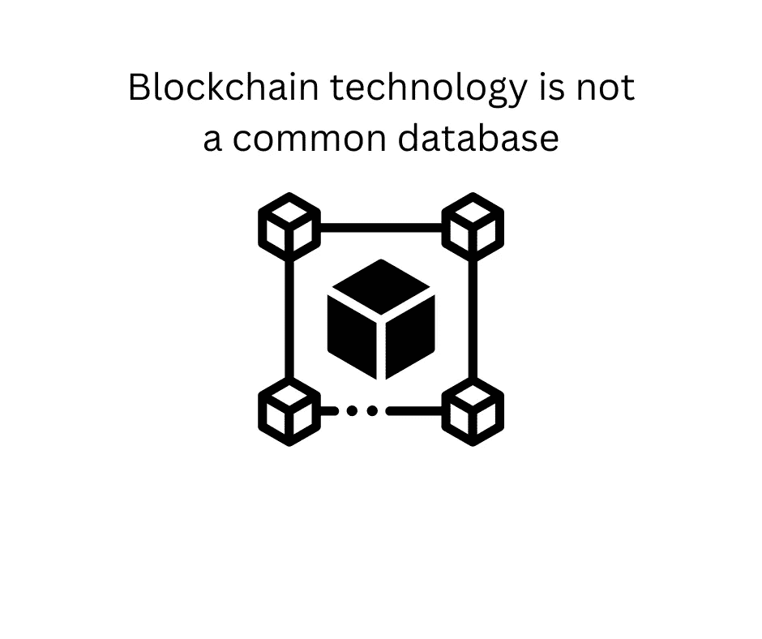

# 区块链技术不是普通的数据库

> 原文：<https://medium.com/coinmonks/blockchain-technology-is-not-a-common-database-45a4907758c4?source=collection_archive---------62----------------------->

区块链技术以去中心化的方式工作。

区块链技术是一种分布式数据库账本，在全网参与者之间共享。像世界上所有的数据库一样，它以电子方式存储信息。

> 从顶级交易者那里复制交易机器人。免费试用。

与普通数据库不同的是，区块链以分散的方式工作，一旦被网络保护就不能改变，并且对每个人都是透明的。

不需要中央服务器来保护网络，节点参与者持有分类账的副本，以这种方式确保网络是安全的，并且没有恶意参与者可以重复花费交易。

区块链技术是互联网对抗旧的中央集权系统和做事方式的一场革命。

技术本身提供了创建分散应用程序、分散系统的机会。世界上每个行业都将很快实现这项技术。为什么？

> 因为它不是一个普通的数据库。

它为人们提供了前所未有的创新，比如在周末以小额费用汇款，或者在钱包中存放多种数字化物品。

区块链技术最重要的一点是，它让人们不再需要任何人来访问他们的数据和资金。

**你的钥匙，你的密码。**

**你的密码，你的数据。**

我想象在几年内，公司将接近人们，给他们访问权，并为他们的数据付费。

区块链的下一个十年将会是区块链技术被更多人采用的大好时光。我确信它可以成功地取代世界上所有的集中式数据库。

如果你喜欢阅读并学到了一些东西——关注更多！

你可以在推特上找到我—[https://twitter.com/pinadefi](https://twitter.com/pinadefi)

子栈—[https://pinadefi.substack.com/](https://pinadefi.substack.com/)

出版 0x—[https://www.publish0x.com/@Pina-DeFi](https://www.publish0x.com/@Pina-DeFi)

> 加入 Coinmonks [电报频道](https://t.me/coincodecap)和 [Youtube 频道](https://www.youtube.com/c/coinmonks/videos)了解加密交易和投资

# 另外，阅读

*   [Capital.com 审查](https://coincodecap.com/capital-com-review) | [港加密借贷平台](https://coincodecap.com/crypto-lending-hong-kong)
*   [如何在 Uniswap 上交换加密？](https://coincodecap.com/swap-crypto-on-uniswap) | [A-Ads 审核](https://coincodecap.com/a-ads-review)
*   [WazirX vs coin dcx vs bit bns](/coinmonks/wazirx-vs-coindcx-vs-bitbns-149f4f19a2f1)|[block fi vs coin loan vs Nexo](/coinmonks/blockfi-vs-coinloan-vs-nexo-cb624635230d)
*   [本地比特币审核](/coinmonks/localbitcoins-review-6cc001c6ed56) | [加密货币储蓄账户](https://coincodecap.com/cryptocurrency-savings-accounts)
*   [什么是保证金交易](https://coincodecap.com/margin-trading) | [美元成本平均法](https://coincodecap.com/dca)