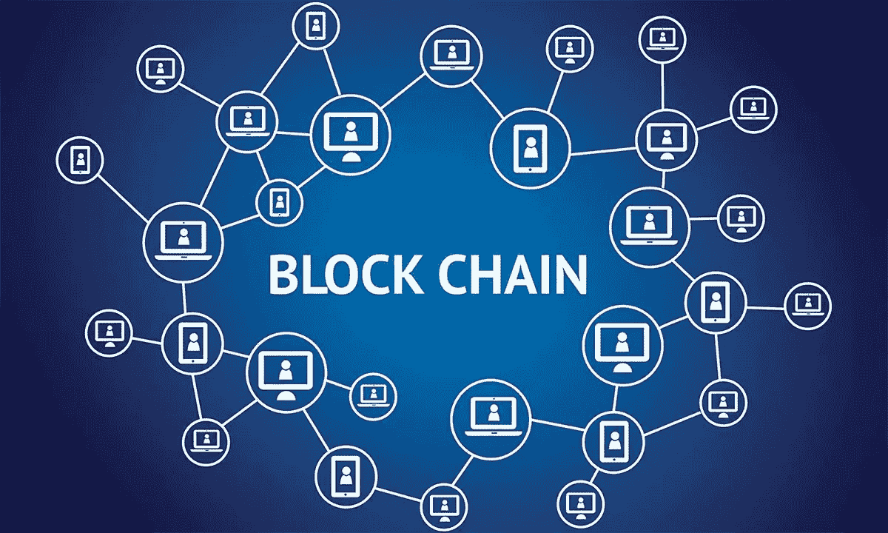
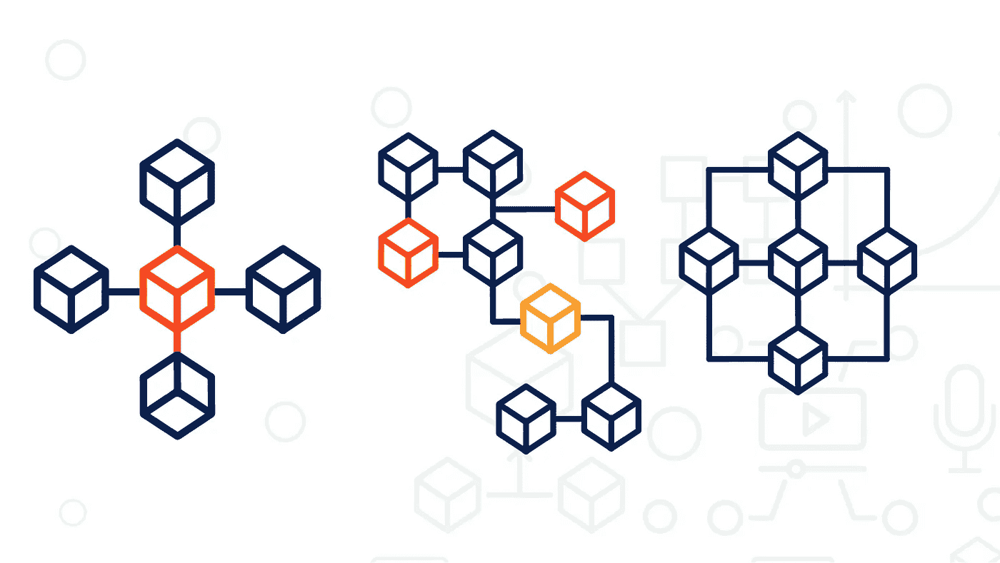
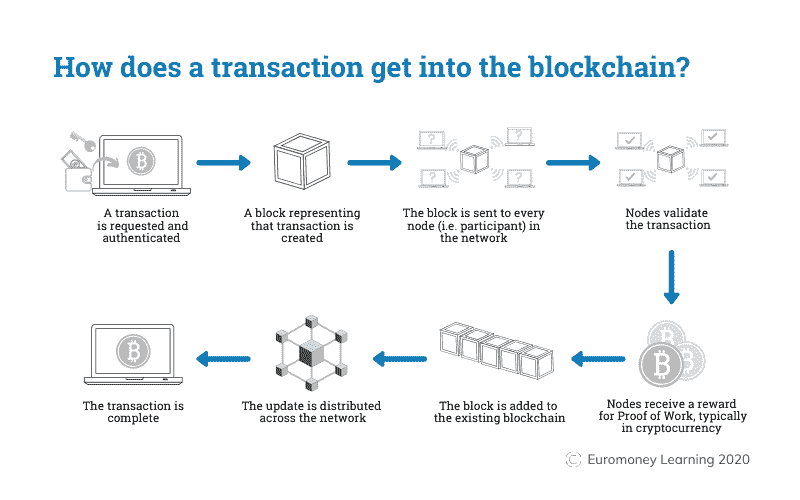

# 加密货币中使用的区块链技术

> 原文：<https://medium.com/coinmonks/blockchain-technology-used-in-cryptocurrencies-130aa0db75de?source=collection_archive---------23----------------------->

## 订阅我的媒介账号:[https://aryanbajaj13.medium.com/subscribe](https://aryanbajaj13.medium.com/subscribe)

## 这是加密货币系列的第三篇文章…保持联系，了解更多信息！

区块链技术是长期以来引入的最具革命性的技术之一。它有可能颠覆或取代现有的产业。区块链本质上是一个公共账本，记录了交易的全部历史和关于谁花了什么的协议。这是一个分布式的、分散的数据库，不是一个人拥有的，而是由参与网络的每个人共享的。

区块链是加密货币的底层技术。它是所有交易的公共账本，或者是谁拥有什么的数字记录，旨在防止篡改。

# 区块链作为一种技术

自 2009 年比特币推出以来，区块链技术已被广泛应用于加密货币。区块链是一个分布式数据库，允许安全、透明和防篡改的交易。这使得它成为处理数字货币的理想选择。

比特币、以太币和莱特币等加密货币使用区块链技术来提供一种安全、分散的交易方式。通过使用区块链，加密货币能够避免传统银行昂贵而耗时的流程。

区块链经常被描述为一种“颠覆性”技术，因为它有可能彻底改变许多行业。在金融领域，区块链有可能消除对银行和支付处理机构等中介的需求。这将导致更低的费用和更快的交易时间。

除了用于加密货币之外，区块链技术还被开发用于各种其他应用。其中包括智能合同、供应链管理、身份管理等等。随着技术的不断发展，我们可以期待在未来几年看到区块链更多的创新用途。

# 区块链的类型

区块链有三种类型:

## 1.公众
2。许可的
3。私人的

**公共区块链**是分散的，对任何想加入网络和参与共识过程的人开放。比特币是公共区块链的一个例子。

许可区块链类似于公共区块链，但是他们要求参与者在加入网络之前获得中央权威机构的许可。

**私有区块链**归一个组织所有，只有授权用户才能访问。

像比特币这样的无权限区块链允许任何人加入网络，参与共识过程。另一方面，专用区块链要求用户在访问网络之前获得中央机构的许可。

加密货币使用的区块链类型取决于其预期的使用情况。例如，比特币使用公共区块链，因为它需要被世界上的任何人访问。私人区块链不会为比特币工作，因为不可能让世界上的每个人都获得单一组织的许可。总之，区块链取决于各方面。

# 加密货币是如何产生的

加密货币是通过一个叫做挖掘的过程创造出来的。采矿是新的比特币和其他加密货币进入流通的方式。这也是区块链交易被核实并添加到区块链分类账的方式。

采矿是一个计算密集型过程，需要强大的计算机来解决复杂的数学问题。第一个解决问题的矿工可以将下一笔交易添加到区块链中，并获得新加密货币形式的奖励。

随着加密货币总供应量的增长，每个区块创造的新加密货币的数量会随着时间的推移而减少。这个系统被设计成模仿从地下开采黄金等贵金属的方式。随着越来越多的黄金被开采，黄金的总供应量随着时间的推移而缓慢增长，而且发现和开采新的黄金变得越来越困难。

同样，随着越来越多的比特币被开采，比特币的总供应量随着时间的推移而缓慢增长，发现和开采新的比特币变得越来越难。新加密货币的创造速度越来越慢，这确保了需求必须增加，价格才能上涨。这一体系旨在制造稀缺，帮助防止通货膨胀。

每开采一个区块就会产生新的比特币，这不仅仅是矿工们的奖励。用户也可以在交易的同时发送交易费，支付给任何决定将他们的交易包括在他们开采的区块中的采矿者。随着时间的推移，随着比特币网络用于越来越多的交易，预计交易费将足以激励足够多的矿工继续开采区块，以保持比特币网络的安全、可靠和稳健。

以太坊区块链应用通常被称为 DApps(分散式应用),因为它们基于分散式以太坊虚拟机。

# 区块链在加密货币交易中的作用

区块链技术用于记录和验证加密货币交易。加密货币是数字或虚拟令牌，使用加密技术来保护其交易并控制新单位的创建。比特币是第一种也是最知名的加密货币，诞生于 2009 年。

加密货币通常在分散的交易所交易，也可以用来购买商品和服务。区块链允许安全、透明和防篡改的交易。这使得它成为加密货币交易的理想平台。

有许多不同类型的区块链，每一种都有自己的优点和缺点。加密货币使用的区块链类型将影响其安全性、速度和可扩展性。

比特币使用无许可区块链，这意味着任何人都可以加入网络，而不需要中央机构的批准。这使得它非常安全，但扩展起来又慢又贵。以太坊使用许可的区块链，规模更快，成本更低，但不太安全，因为它依赖于中央机构。

区块链技术在不断发展，新的应用也一直在开发。加密货币只是区块链如何用于创建安全、透明和防篡改交易的一个例子。

# 结论

总之，区块链技术是一个强大的工具，可以以各种不同的方式使用。在加密货币的背景下，区块链提供了一种安全和分散的方式来存储和传输数据。这使得它成为管理数字货币的理想解决方案。凭借其彻底改变金融业的潜力，区块链是未来几年值得关注的一个令人兴奋的地区。

## 这是加密货币系列的第三篇文章…保持联系，了解更多信息！

# 关于作者

我最近完成了 BBA(商业分析)从基督大学，拉瓦萨，浦那校区。

网站—[acumenfinalysis.com](http://acumenfinalysis.com/)(看看这个)

# 联系人:

如果你对我下一篇文章的内容有任何问题或建议，请写信给 aryanbajaj104@gmail.com。

如果你想了解我最新的文章和项目，[在 Medium](https://aryanbajaj13.medium.com/) 上关注我。

## 订阅我的媒介账号:【https://aryanbajaj13.medium.com/subscribe 

# 通过以下方式与我联系:

[领英](https://www.linkedin.com/in/aryan-bajaj-b62364191)

> 交易新手？尝试[加密交易机器人](/coinmonks/crypto-trading-bot-c2ffce8acb2a)或[复制交易](/coinmonks/top-10-crypto-copy-trading-platforms-for-beginners-d0c37c7d698c)